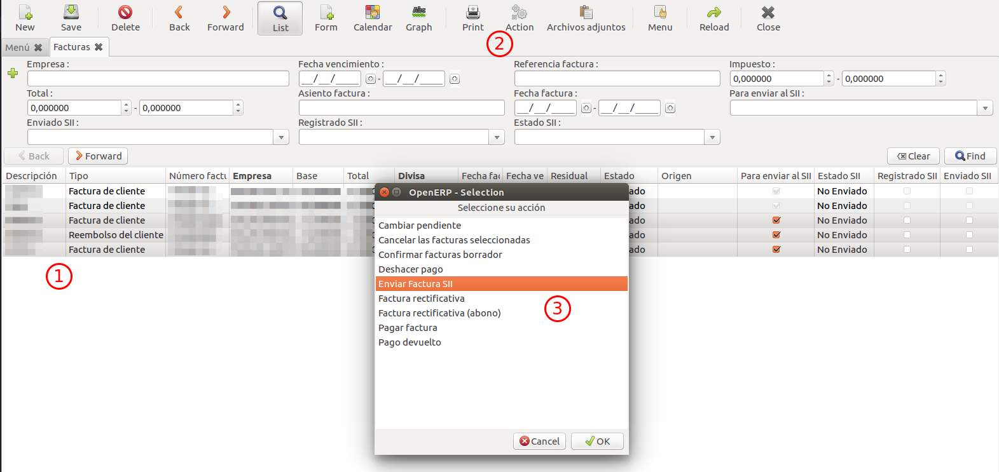

# Subministrament Immediat d'Informació (SII)

## 1. Introducció

El Subministrament Immediat d'Informació (SII) és un sistema de gestió dels llibres
de registre de l'IVA a través de la Seu Electrònica de l'AEAT.

En els següents enllaços es troba la informació referent al SII de la
pàgina oficial de l'AEAT (Agència Estatal d'Administració Tributària):

- [Informació general](http://www.agenciatributaria.es/AEAT.internet/G417/informacion.shtml)
- [Normativa](http://www.agenciatributaria.es/AEAT.internet/Inicio/Ayuda/Modelos__Procedimientos_y_Servicios/Ayuda_P_G417____IVA__Llevanza_de_libros_registro__SII_/Informacion_general/Nuevo_sistema_de_gestion_del_IVA_basado_en_el_Suministro_Inmediato_de_Informacion.shtml) referent
- [Ajuda tècnica](http://www.agenciatributaria.es/AEAT.internet/G417/tecnica.shtml) per a la implantació del sistema
- [Preguntes freqüents](http://www.agenciatributaria.es/AEAT.internet/Inicio/Ayuda/Modelos__Procedimientos_y_Servicios/Ayuda_P_G417____IVA__Llevanza_de_libros_registro__SII_/Informacion_general/Preguntas_frecuentes/Preguntas_frecuentes.shtml)

## 2. Enviaments

Les factures s'envien a l'AEAT des de l'ERP utilitzant un certificat electrònic
(digital) d'empresa. Un cop es rep la resposta de l'AEAT es crea un registre
(veure apartat [registres d'enviament](#25-registres-denviament)) assignat a
aquella factura amb el resultat i les dades de la factura enviada.

### 2.1. Esquema d'enviament

blockdiag {
    orientation = portrait;
    default_shape = roundedbox;
    default_fontsize = 15;
    span_height = 100;
    node_width = 200;
    node_height = 150;

    Factura [label = "Factura", width = 150, height = 50];
    Cola [label = "Cola de \nenvíos", stacked, width = 150, height = 70];
    AEAT [label = "AEAT", shape = cloud];
    ERP [label = "ERP", shape = "flowchart.database", width = 150, height = 50];

    Factura -> Cola [label = "Abrir \nfactura", fontsize = 13];
    Cola -> AEAT [label = "Envío", fontsize = 13];
    AEAT -> ERP [label = "Respuesta", fontsize = 13];
}

### 2.2. Enviaments automàtics

Cada vegada que s'obri una factura es posarà en una cua d'enviaments on hi haurà
totes les factures obertes en el mateix dia. Totes aquestes factures s'enviaran
de forma automàtica a l'AEAT en una hora concreta del dia.

### 2.3. Enviament de forma manual

Per tal d'enviar una factura de forma manual es pot fer a través d'una acció d'un
dels següents menús:

- Des del menú de factures (**"Comptabilitat i finances / Factures"**)
- Des del menú de registre del SII (**"Comptabilitat i finances / SII / Registre SII"**)

Els passos a seguir són:

1. Es seleccionen les factures que es volen enviar
2. Es selecciona el botó "Accions"
3. Es selecciona l'acció "Enviar Factura SII"

### 2.4. Possibles estats dels enviaments

- **Correcte**: la factura s'ha registrat a l'AEAT correctament.
- **Acceptada amb Errors**: la factura s'ha registrat a l'AEAT però té errors que
s'han de corregir.
- **Incorrecte**: la factura s'ha enviat a l'AEAT però no s'ha registrat a causa
d'un error.
- **Validació Incorrecta**: la factura no ha passat una validació prèvia que es realitza
abans d'enviar-la a l'AEAT.
- **Error**: hi ha hagut un error en l'enviament de la factura cap a l'AEAT. Normalment
succeeix perquè la connexió no és estable o perquè l'AEAT rep masses peticions a
la vegada i no pot processar-les totes.

### 2.5. Registres d'enviament

Per accedir al llistat de registres del SII s'ha d'anar al menú
**"Comptabilitat i finances / SII / Registres SII"**.

En el llistat es mostren per defecte els registres actius i es pot filtrar per
els següents camps:

- **Estat del registre**: indica en quin estat es troba la factura respecte al SII.
- **Actiu**: un registre és actiu si és l'últim enviament d'una factura. En cas
    de que una factura estigui registrada a l'AEAT i s'enviï una modificació que
    dóna de resultat incorrecte, aquesta no es registrarà i el registre actiu
    seguirà essent el registrat a l'AEAT.
- **Número factura**
- **Import factura**
- **Diari de la factura**
- **Direcció de la factura**: si la factura és emesa (de client) o rebuda (de
    proveïdor)
- **NIF**: NIF de la persona física/jurídica a la qual fa referència la factura
- **Data de la factura**
- **Data d'enviament**: data d'enviament de la factura (data de creació del registre)
- **Resultat**: resultat de l'enviament. En cas d'error es pot filtrar per codi
    d'error.

### 2.6. Factures pendents d'enviar

Per accedir al llistat de factures pendents d'enviar s'ha d'anar al menú
**"Comptabilitat i finances / SII / Factures pendents d'enviar"**. En aquesta
opció es mostren totes les factures que compleixen les següents condicions:

- Es troben en estat "Obert" o "Realitzat"
- Tenen data posterior a 01/07/2017 i anterior a la data actual
- No estan registrades a l'AEAT

## 3. Camps referents al SII

### 3.1. En una factura

Per veure els camps referents al SII en una factura s'ha d'obrir la pestanya
"Informació SII". Allà es troben els següents camps indicats en la imatge:

1. **Per enviar al SII**: si està activat la factura es podrà enviar al SII. S'ha
    de desactivar en cas de que no es vulgui enviar. Aquest camp s'obté automàticament
    del camp "Enviar Factures Emeses/Rebudes" de la posició fiscal
    (veure [camps del SII en una posició fiscal](#32-en-una-posicio-fiscal))
    en el moment de crear-la segons el tipus de factura.
2. **Enviat SII**: indica si la factura s'ha intentat enviar al SII.
3. **Registrat SII**: indica si la factura està registrada al SII (AEAT).
4. **Estat SII**: indica en quin estat es troba la factura respecte al SII.
5. **Descripció de la operació**: descripció de l'objecte de la factura. Aquest
    camp s'obté automàticament del "Descripció de la operació" del diari financer
    (veure [camps del SII en un diari financer](#33-en-un-diari-financer)) que se
    li assigna a la factura en el moment de crear-la, o bé el nom del diari en cas
    d'estar buida la descripció.
6. **Clau de Règim Especial per Factures Emeses/Rebudes**: clau que identifica
    el tipus de règim de l'IVA o una operació amb trascendència tributària. S'obté
    automàticament de la "Clau de Règim Especial per Factures Emeses/Rebudes" de la
    posició fiscal (veure [camps del SII en una posició fiscal](#32-en-una-posicio-fiscal))
    en el moment de crear-la o bé se li assigna per defecte "Operació de règim general".

Des d'una factura també es pot:

7 . Enviar-la de forma manual    
8 . Veure els registres del SII associats a aquesta factura

### 3.2. En una posició fiscal

Els camps referents al SII en una posició fiscal són:

- **Clau de Règim Especial per Factures Emeses/Rebudes**: clau que identifica
el tipus de règim de l'IVA o una operació amb trascendència tributària. Quan es
crea una factura amb aquesta posició fiscal se li assigna aquesta clau.
- **Enviar Factures Emeses/Rebudes**: aquest camp indica si les factures que es
creïn amb aquesta posició fiscal s'enviaran al SII.

### 3.3. En un diari financer

Per veure els camps referents al SII en una diari financer s'ha d'obrir la pestanya
"Informació SII".
Allà es troba el camp **Descripció de la operació**, que és la descripció de
l'objecte de la factura que se'ls assigna a les factures que es creen amb aquest
diari financer.

### 3.4. En una persona física/jurídica

Per veure els camps referents al SII en una persona física/jurídica s'ha d'obrir
la pestanya "Comptabilitat". Allà es troben els següents camps:

1. **Censat AEAT**: indica si la persona física/jurídica i el seu NIF/CIF estan
censats a l'AEAT. Aquest camp no es pot modificar manualment i s'actualitza
utilitzant la opció de comprovació del punt 3.
2. **Nacionalitat**: indica la nacionalitat de la persona física. En cas de tenir
un NIF estranger, un passaport o un document oficial d'un altre país la Nacionalitat
ha de ser diferent d'Espanya.
3. **Comprovar Censat AEAT**: s'envia el nom de la persona física/jurídica i el
NIF/CIF a l'AEAT per comprovar si està censat i les dades són correctes. Quan es
rep la resposta de l'AEAT s'actualitza el camp "Censat AEAT"

## 4. Possibles configuracions

### Opció 1: Utilitzant proxy

Aquesta opció permet utilitzar un servidor intermediari, el qual guardarà el
certificat digital de l'empresa per l'AEAT. D'aquesta manera es limita
l'accés al certificat a únicament les persones amb accés a aquest servidor i
evitem que l'ERP hi tingui accés directe, afegint així una capa de seguretat extra.

L'ERP farà peticions al servidor utilitzant un certificat local/client i aquest
les reenviarà als serveis de l'AEAT afegint el certificat digital de l'empresa.
L'esquema de connexió serà el següent:

blockdiag {
    span_width = 150;
    node_width = 50;
    A [label = "ERP", color = none];
    B [label = "Proxy", style = dashed, color = none];
    C [label = "AEAT", color = none];
    A <-> B [label = "Certificado local"];
    B <-> C [label = "Certificado empresa"];
}

### Opció 2: Connexió directe

Aquesta opció permet estalviar la necessitat d'utilitzar un servidor intermediari,
però permet que qualsevol usuari amb permisos d'administrador en el servidor de
l'ERP tingui accés directe al certificat oficial de l'empresa per l'AEAT.

blockdiag {
    span_width = 150;
    node_width = 50;
    A [label = "ERP", color = none];
    B [label = "AEAT", color = none];
    A <-> B [label = "Certificado empresa"];
}
