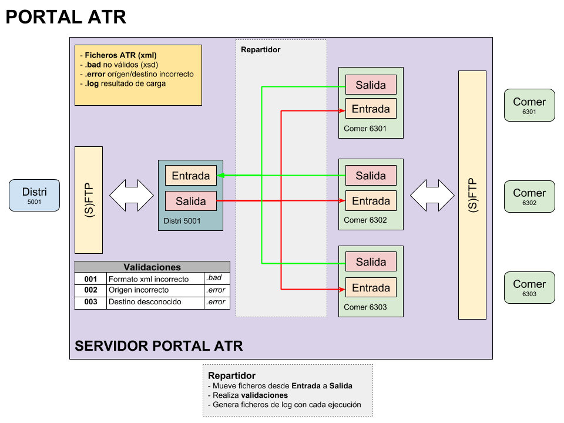
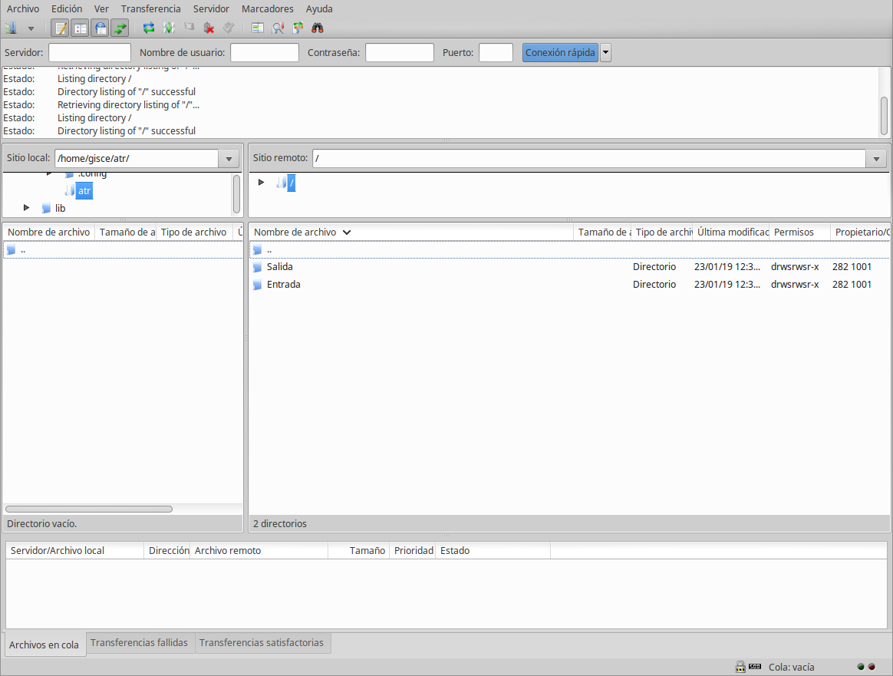
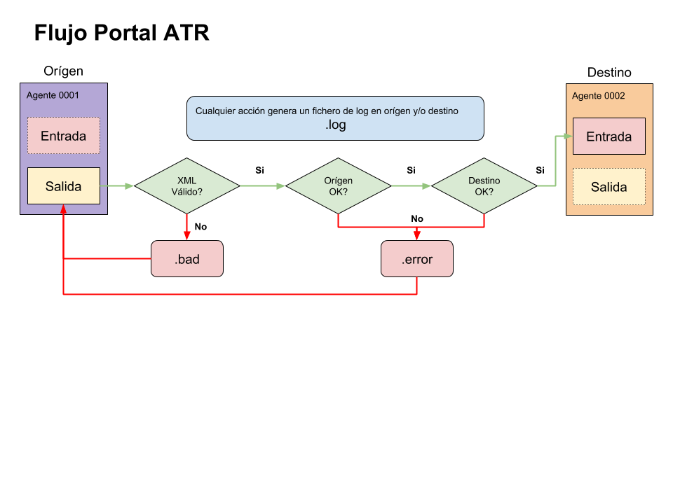

# Portal ATR

## Introducció

El portal ATR permet l'intercanvi de fitxers ATR entre comercialitzadores i
distribuïdores de forma senzilla.

Utilitza el protocol SFTP (SSH) per a la pujada/descàrrega de fitxers i la
gestió de usuaris.

Es defineix una bústia d'**Sortida** i **Entrada** per deixar i recollir
respectivament els fitxers ATR

Es realitzen validacions dels fitxers d'entrada per analitzar si són correctes

També es generen fitxers de **log** que permeten un seguiment del portal
d'intercanvi ATR

## Accés com a comercialitzadora

### Requeriments

Qualsevol client que implementi el protocol SFTP (FTP per SSH) pot accedir al
portal ATR.

Alguns clients d'escriptori:

* [Filezilla](https://filezilla-project.org/)
* [WinSCP](https://winscp.net)

La distribuïdora indicará un usuari i un password a la comercialitzadora per 
poder accedir a les seves bústies.

### Publicació de fitxers per la distribuïdora

1. Quan una comercialitzadora vol enviar un fitxer ATR a la distribuïdora, pujarà
el fitxer XML a la carpeta **Salida** de la seva bústia.

1. Automàticament validarà el fitxer amb el corresponent XSD. Si no
és vàlid el reanomenarà afegint-li l'extensió *.bad*

1. Es comprovarà que el orígen del fitxer XML (`<CodigoREEEmpresaEmisora>`)
correspongui al codi REE de la comercialitzadora que está pujant el fitxer. Si
no és així, el reanomenarà amb la extensió *.error*

1. Es comprovarà que el orígen del fitxer XML (`<CodigoREEEmpresaDestino>`)
correspongui al codi REE de la distribuïdora a la qual es vol enviar el fitxer.
Si no és així, el reanomenarà amb la extensió *.error*

1. Si totes les validacions són correctes, es mourà el fitxer a la carpeta
**Entrada** de la distribuïdora de destí

1. Qualsevol acció es registrarà en un fitxer de registre amb extensió *.log*.
Es crearà un fitxer de registre amb tots els fitxers processats conjuntament
