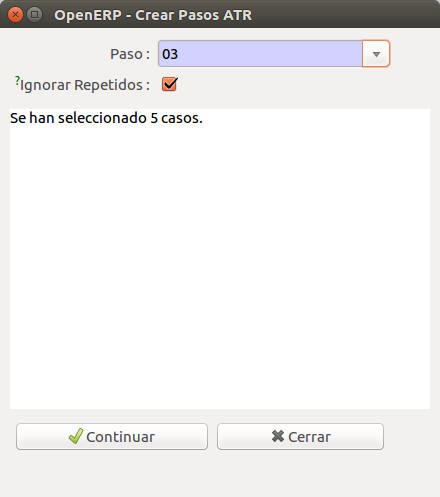
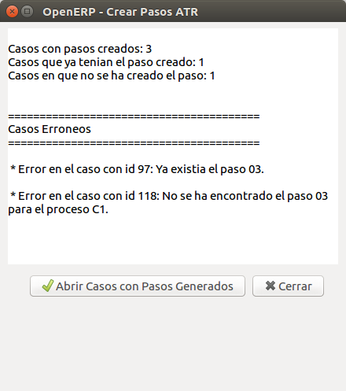

# Automatització

La gestió ATR, a més d'intercanviar informació entre diferents agents, implica
modificacions el l'estat de les pólisses, els clients , etc... en els diferents
agents. Les modificacions a realitzar normalment són sempre les mateixes. Per
facilitar el processat i l'activació d'aquests canvis s'han desenvolupat un
seguit de procediments automàtics per facilitar aquestes tasques i poder-les
automatitzar.

Aquesta automatització consisteix bàsicament en dos processos diferenciats:

1. **Activació de canvis**: L'arribada d'un pas de gestió ATR implica un seguit
   d'accions als diferents elements de l'ERP, p.e. pòlisses. Aquests procediments
   s'agrupen en el botò `Activar contracte o canvi` present a qualsevol procés ATR

2. **Creació de Processos ATR**: La petició d'una modificació o l'enviament
   d'informació a un altre agent implica la generació d'un procés ATR o un nou
   pas en un procés existent. Des d'una pòlissa es poden crear des del botó
   `Generar cas Gestió ATR` ( [wizard genenrar cas ATR](#wizard-generar-cas-atr))

## Activació automàtica de pas (Activar contracte o canvis)

La informació d'un pas de gestió ATR ens permet en alguns casos aplicar els
canvis al l'ERP sense la necessitat de fer els passos mecànics manualment.
S'utilitza l'assistent que apareix en prèmer el Botò d'acció
**Activar contracte o canvi**.

No tots els passos es poden activar automàticament. En el quadre adjunt es
mostren els que es troben desenvolupats en aquests moments. En alguns casos no
accepta tots els possibles valors del pas, p.e per M1 amb canvi de titular.

   Activació d'un cas ATR

En la taula següent es pot veure quan es poden activar els canvis associats
a un cas de gestió ATR

+---------+----------------+------------------------------------+-------------------+
| Procés  | Distribuidora  | Comercialitzadora                  | Observacions      |
+=========+================+========+========+========+=========+===================+
| **Pas** | **01**         | **01** | **05** | **06** | **07**  |                   |
+---------+----------------+--------+--------+--------+---------+-------------------+
| **A3**  | `ad`_          |        | `ac`_  |        |         |                   |
+---------+----------------+--------+--------+--------+---------+-------------------+
| **B1**  |                |        | `bc`_  |        |         |                   |
+---------+----------------+--------+--------+--------+---------+-------------------+
| **C1**  |                |        | `ac`_  |        |         |                   |
+---------+----------------+--------+--------+--------+---------+-------------------+
| **C2**  |                |        | `ac`_  | `bc`_  | `ac`_   |                   |
+---------+----------------+--------+--------+--------+---------+-------------------+
| **D1**  |                | `dc`_  |        |        |         |                   |
+---------+----------------+--------+--------+--------+---------+-------------------+
| **M1**  |                |        |        |        | `mc`_   | No canvi titular  |
+---------+----------------+--------+--------+--------+---------+-------------------+
| **W1**  |                |        |        |        |         |                   |
+---------+----------------+--------+--------+--------+---------+-------------------+

### (ac) Activació de contracte (A3,C1,C2) a Comercialitzadora

!!! TODO
    Explicació

### (bc) Baixa de contracte (B1,C1,C2) a Comercialitzadora

!!! TODO
    Explicació

### (dc) Activació (D1) a Comercialitzadora

!!! TODO
    Explicació

### (mc) Modificació de contracte (M1) a Comercialitzadora

!!! TODO
    Explicació

### Nou contracte (A3) a Distribuidora

!!! TODO
    Explicació

## Creació de Procés automàtic des de pòlissa (Generar cas Gestió ATR)

La creació d'un cas des d'una pòlissa permet generar automàticament el cas amb
el pas normalment **01** des d'una pòlissa agafant la informació que ja conté.

* En alguns casos i **només quan es selecciona només una pólissa** ens apareix
  un formulari que ens permet afegir informació addicional al procés
* La polissa ha d'estar en esborrany o activa en funció del procés.

S'utilitza l'assistent que apareix en prèmer el Botò d'acció
**Generar cas Gestió ATR** ([wizard genenrar cas ATR](#wizard-generar-cas-atr)) que ens permetrà escollir
quin procés volem crear. En funció de l'estat de la pólissa ens permetrà
escollir uns processos i altres no.

##### Wizard Generar Cas ATR

   Asistent generació Casos a partir de pólisses

| Procés | Orígen | Estat Pòlissa | Addicional | Observacions                                               |
|:------:|--------|---------------|------------|------------------------------------------------------------|
| **A3** | comer  | Esborrany     | No         |                                                            |
| **B1** | comer  | Activa        | Si         | Es demana motiu de baixa                                   |
| **C1** | comer  | Esborrany     | No         |                                                            |
| **C2** | comer  | Esborrany     | No         |                                                            |
| **D1** | distri | Activa        | No         |                                                            |
| **M1** | comer  | Activa        | Si         | Es demana tipus de canvi i dades necessàries               |
| **W1** | comer  | Activa        | No         | Només si el comptador té alguna lectura d'aquest tipus     |

Un cop executat retorna un llistat amb una descripció del resultat de cada
pólissa.

   Resultat creació passos

!!! Info "Nota"
    Si el CUPS de la pólissa només té 20 caracters, afegeix el sufix ``1P`` en
    el cas que la distribuidora sigui **Unión Fenosa** o ``0F`` en els altres
    casos.

### Creació Cas A3/C1/C2

Un cas habitual és la entrada automatitzada de peticions de canvi de
comercialitzadora, per exemple via web. També es pot donar el cas que
l'encarregat de la gestió ATR no sigui el mateix que crea els contractes.

Mitjançant l'assistent [wizard genenrar cas ATR](#wizard-generar-cas-atr) es pot crear un cas de canvi
de comercialitzadora o alta a partir d'una o vàries pólisses en esborrany.
El seu funcionament és el següent:

* Es generarà un cas per cada pólissa que compleixi el següent:

  * La pólissa està en esborrany
  * No hi ha cap cas de switching **obert** per aquesta pólissa

* Genera només casos Oberts **C1**, **C2** i **A3** i el pas **01** agafant les
  dades de la pólissa. En alguns casos es pot escullir automàticament el cas
  (veure [generacio de casos segons dades del formulari](#segons-dades-formulari-generacio-casos-c1-c2-i-a3) )
* Valida el format del **CUPS** afegint el sufix ``0F`` o ``1P`` depenent de
  l'empresa distribuidora (veure nota )
* Marca el camp ``Per validar`` del cas en funció de si es poden separar
  correctament els noms i els cognoms automàticament (veure
  [validació nom titular](atr.md#validacio-nom-titular) ) o no. Si no es pot, es marca per validar.
* El **codi REE** del destinatari es calcula a partir del CUPS. Algunes
  distribuidores que han estat absorbides no mantenen el codi de la
  distribuidora original en el CUPS però el **codi REE** del destinari de les
  peticions si que ha de ser diferent. Podem veure'n la traducció que es
  realitza a [apèndix B](atr.md#apendix-b-traduccio-de-codi-ree)

### Creació Cas B1 (Baixa)

!!! TODO
    Explicació pas addicional (tipus canvi)

### Creació Cas D1 (Notificació canvi a TG)

!!! TODO
    Explicació

### Creació Cas M1 (Canvis contracte)

!!! TODO
    Explicació pas addicional (tipus canvi i dades)

### Creació Cas W1 (Autolectures)

!!! TODO
    Explicació

### Validació nom titular

Els casos de Gestió ATR necessiten els noms i cognoms separats. L'ERP
emmagatzema aquesta informació en un sol camp i per tant s'hauran de
separar automàticament o a mà. L'algoritme de separacio automàtica de
noms i cognoms funciona de la següent forma:

* La dreta de la coma és el **nom**
* La paraula abans del primer espai ,el primer cognom i la resta el
  segon cognom

Es marcarà com a per validar si:

* El 2on cognom conté + d'una paraula

Si el client és una empresa, només es comprova el nom i que sigui de menys
de 50 caracters

### Segons dades Formulari: Generació casos C1, C2 i A3

Per automatitzar la creació de C1 , C2 i A3 quan una pòlissa en esborrany es
genera des d'un sistema extern, p.e. Web, es poden utilitzar les observacions
de la pòlissa. Aquest funcionament es pot utilitzar mitjançant el botó
`Segons dades formulari` de l'assitent ([wizard genenrar cas ATR](#wizard-generar-cas-atr)) En funció del que
conté s'actúa de la següent forma:

| Contingut            | Acció                                                          |
|----------------------|----------------------------------------------------------------|
| ``canvi_titular: 1`` | **C2 de canvi de titular** amb tipus  de canvi **Subrogació**  |
| ``proces: C1``       | **C1**                                                         |
| ``proces: C2``       | Un **C2** de la mateixa forma que el cas ``canvi_titular: 1``  |
| ``proces: A3``       | **A3**                                                         |

## Altres automatitzacions

També s'ha automatitzat la creació d'alguns processos i passos a partir
d'altres procediments

### B1 i devolucions

S'ha integrat la generació de casos i processo B1 amb les devolucions i els
talls.

### Assistent de Creació de Passos ATR

Aquest assistent permet la creació de passos dels casos ATR, tant per un cas com
de forma massiva. En ambdues situacions el seu funcionament és el mateix:

* Seleccionar els casos dels quals es vulgui generar un pas i obrir l'assistent
(si s'està dins el formulari d'un cas, obrir l'assitent directament).

* Es mostrarà una finestra amb els següents camps:

    * *Pas*: desplegable amb la llista de passos que es poden crear per els casos seleccionats.

    * *Ignorar repetits*: amb aquesta opció marcada s'evitarà que es creïn passos repetits en els casos.
    Per exemple: si un cas ja té el pas 02 i es selecciona crear passos 02 en el desplegable, no es tornarà a crear el pas.

    * *Info*: quadre de text amb informació útil sobre el procés de creació de pasos.
    En la fase inicial es mostra quants casos s'han seleccionat.

  

* Clicant a "Continuar" s'intentarà crear el pas seleccionat en els casos.
Un cop fet es mostra una pantalla amb un resum en què s'indica:

    * Número de casos en què s'ha creat el pas correctament

    * Número de casos en què no s'ha creat el pas perquè ja existía en el cas.
    Si abans s'ha desmarcat l'opció "Ignorar Repetits", aquest número serà sempre 0.

    * Número de  casos en què hi ha hagut algun error i no s'ha creat el pas.

    * Informació detallada dels casos en què no s'ha creat el pas.

  

* Finalment tenim l'opció de tancar l'assistent o d'obrir els casos en què
s'ha generat correctament el pas.
