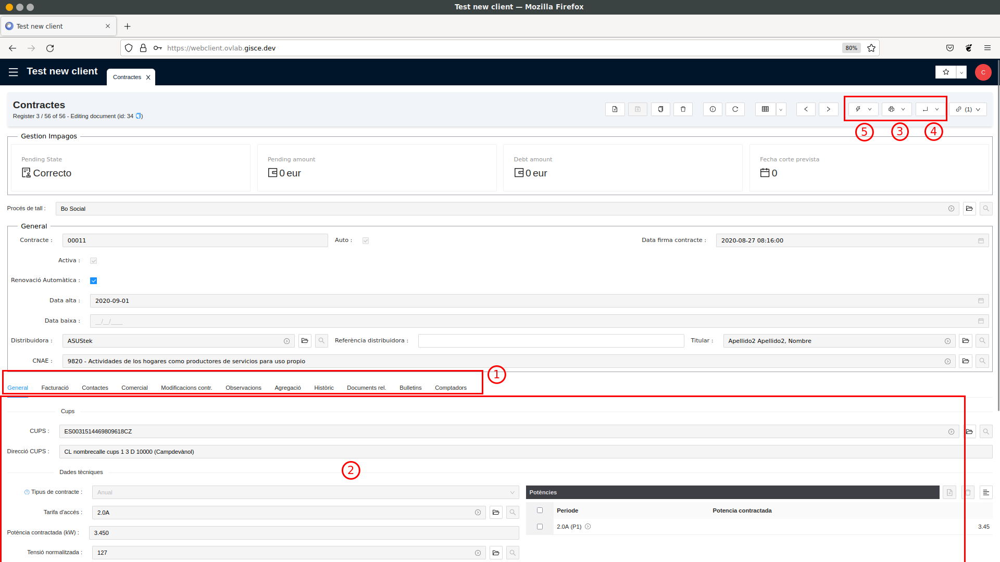
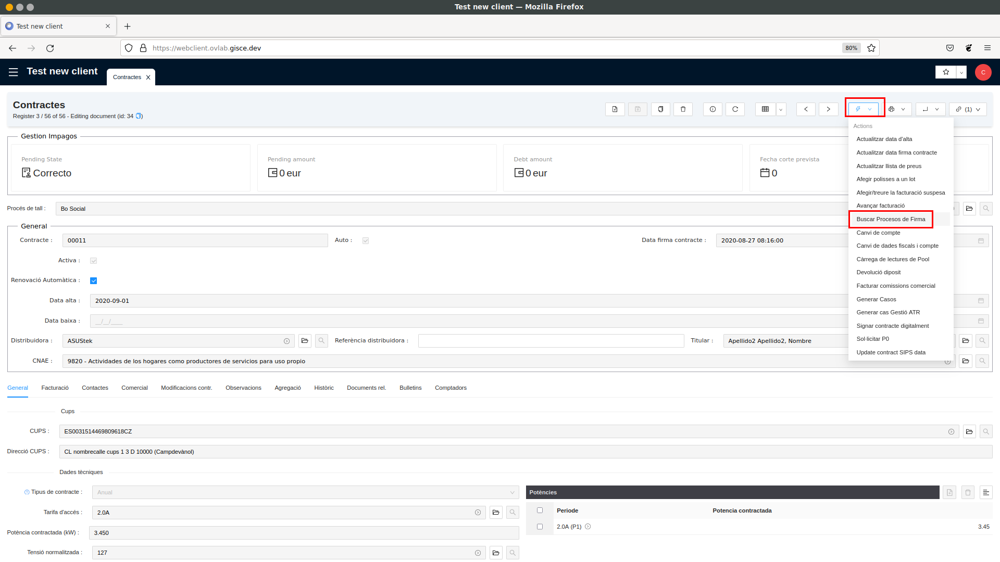
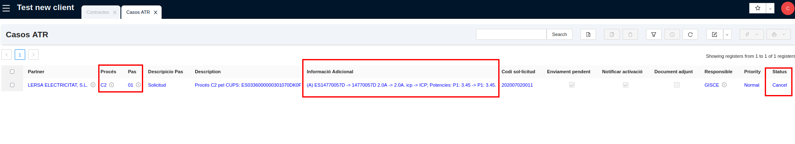

# Guia de Contractació

## Buscar el contracte d'un client

● Anar al llistat de contractes situat a Gestió de Contractes / Factures -> Contractes
(fer doble clic a “Contractes”)

● Al llistat que s'obre, cal utilitzar l'apartat de filtres per cercar el
contracte. Segons la informació que doni el client podem utilitzar un filtre o algun
un altre. Els més comuns són els següents:
1. Titular: cercar els contractes per nom del titular. Es pot cercar només per
una part del nom o pel nom complet.
2. NIF titular: cercar pel NIF/CIF del titular.
3. Adreça CUPS: cercar per adreça del punt de subministrament, és a dir, la
direcció de l'habitatge/local on s'estiga donant llum.
4. Contracte: cercar pel número de contracte que es va donar al client.
5. CUPS: cercar pel nombre de CUPS. Igual que el número de contracte és
un identificador únic.

## Camps d'un contracte

En fer doble clic en un contracte des d'un llistat de contractes se'ns obre una
vista detallada amb tota la informació del contracte:
1. La informació d‟un contracte s‟agrupa en pestanyes. Les més rellevants
són:
a. General: conté la informació referent al mercat elèctric: tarifa
d'accés, potències contractades, tipus de contracte, etc.
b. Facturació: conté la informació sobre el producte que s'hi està
venent al client (Tarifa Comercialitzadora) i les dades de pagament
(IBAN i propietari del compte bancari).
c. Contactes: s'informa l'adreça de notificació (adreça on es
envien les factures) i les dades fiscals per a la factura (raó fiscal i
direcció fiscal).
2. Quan es fa clic a una de les pestanyes, es mostra tota la informació
a la pantalla principal del contracte.
3. La barra superior agrupa una sèrie de botons per fer diferents
accions. El primer grup de botons serveix per generar informes en PDF,
per exemple, per imprimir el contracte
4. El segon grup de botons serveix per iniciar assistents a una finestra
emergent. Els assistents guien l'usuari al llarg d'un procés amb un
objectiu concret.
5. El darrer grup de botons són enllaços. Els enllaços serveixen per obrir-ne una
nova pestanya on es mostren elements ja filtrats normalment
relacionats amb els contractes. Per exemple, l'enllaç "Factures Client"
obre una pestanya amb les factures emeses per aquest contracte.

## Identificar el pagador d´un contracte

● El pagador d'un contracte és el propietari del compte bancari associat al
contracte. Es pot trobar a la pestanya "Facturació" del contracte.

## Identificar dónde se envían las facturas de un contrato

El camp "Enviar factura via" indica si la factura se envia per correu electrònic o s'envia por carta. Si s'envia por correu electrònic el camp "Email dir. Fiscal" mostra el correu on s'envía la factura.

## Imprimir un contrate i veure adjunts

Per imprimir un contrate s'ha d'utilizar el botó de "Contrate" de la pantalla de Reports (1). Es generarà un PDF que es pot guardar a l'ordenador per imprimir.
Adicionalment, es poden veure tots els documents que s'han adjuntat a un contrate (per exemple, durant el procés de contratació s'adjunta una factura, el DNI i/o l'autorizació de domiciliació). Aquests arxius estan a la pestanya "Documents relacionats" (2). Per visualitzar un dels documents adjunts s'ha de fer doble clic a l'elemeno que vulguem i a la finestra emergent utilizant el botó "d'obrir".

## Veure els estats d'un procés de contratació

Sempre que un client demana canviar de comercializadora, realitzar un canvi de potència, canviar el titular... s'inicia primer un procés de firma digital i una vegada finalitzada s'inicia el que es diu "Procés ATR". Aquest procés ATR serveix per gestionar l'intercambi d'informació entre la comercializadora i la distribuïdora del client per realitzar el canvi desitjat. Per tant, quan un client vol saber, per exemple, en quin estat està el seu procés d'alta, hem de revisar dos elements: **la firma digital y el procés ATR**.

## Veure l'estat d'un procés de Firma Digital

El primer pas és trobar el procés de firma digital. Per tant, hem d'anar al contrate del client i utilizar l'asistent "Buscar Procés de Firma" (situat en el menú "d'Accions”).

Aquest asistent ens obrirà una nova pestanya on es llistaran tots els processos de signatura relacionats amb el contracte. Per saber si hi ha algun procés de signatura que encara no estigui finalitzat ens hem de fixar a la columna "Estat". Si no indiqueu que està "Completat" significa que el client encara no ha signat algun dels documents.

Podem saber quin o quins documents no ha signat si entrem a la vista detallada del procés de signatura (fent doble clic al procés de signatura que vulguem revisar).
A la vista detallada es mostren tots els documents que s'han enviat per signar i el seu estat.
En cas que el client no trobi el correu per signar, podem tornar-lo a fer arribar el correu amb el botó “Reenviar el correu”.

## Veure l'estat d'un procés ATR

Si ja hem revisat el procés de signatura digital i està complet, vol dir que ja s'ha iniciat el procés ATR per demanar a la distribuïdora que faci els canvis desitjats. Per revisar l'estat en què es troba aquesta sol·licitud ATR, hem d'anar al contracte i utilitzar l'enllaç "Casos ATR" (situat a la menu de enllaços).
S'obrirà un llistat on es mostraran totes les sol·licituds ATR que s'han sol·licitat per aquest contracte.

Per saber si alguna sol·licitud encara no està finalitzada hem de fixar-nos al camp "Estat". Si la sol·licitud està en estat "Obert" significa que encara no hi és finalitzada.
Quan sabem que la sol·licitud no està finalitzada, hem d'identificar en quin punt es troba. Aquesta informació ens la donarà els camps "Pas" i "Descripció Pas". Els valors més comuns són: 
- Pas = 01 (“a1” en un ATR de gas): s'han demanat els canvis a la distribuïdora però encara no ens ha respost res.
- Pas = 02 (“a2” en un ATR de gas): la distribuïdora ja ens ha dit si accepta o no accepta fer els canvis demanats.
- Pas = 05 (“a3” en un ATR de gas): la distribuïdora ens indica que ja ha realitzat els canvis sol·licitats.

## Entrar a l'Oficina Virtual d'un Client

L'ERP permet "suplantar" la identitat d'un client i entrar a l'oficina virtual com si entréssim amb el seu usuari. D'aquesta manera podem veure exactament què veuria ell i donar-li suport amb la gestió des de l'Oficina Virtual.

Per "suplantar" la identitat d'un client hem d'anar a la fitxa d'empresa. Per això, anem al contracte i utilitzem la carpeta al camp “Titular”.

Un cop hem trobat el client, fem doble clic per obrir la vista
detallada del client i anem a la pestanya "Oficina Virtual". En aquesta pestanya es mostra lusuari doficina virtual associat al client.

Fem doble clic a l'usuari d'oficina virtual. S'obrirà una finestra
emergent. Finalment en aquesta finestra emergent hem de fer clic al camp "URL" perquè se'ns obri un navegador web amb la pantalla de l'oficina virtual del client.

