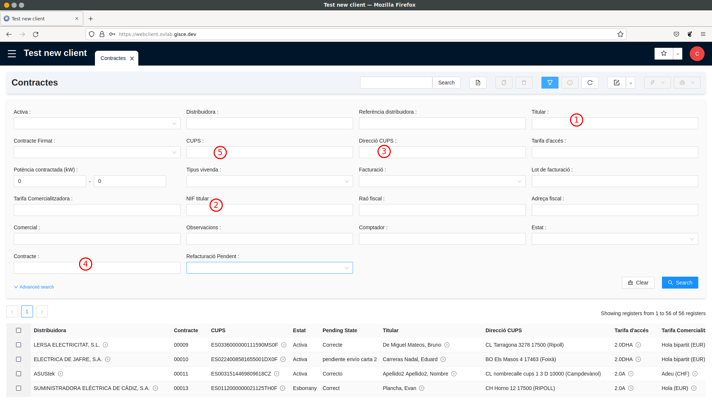
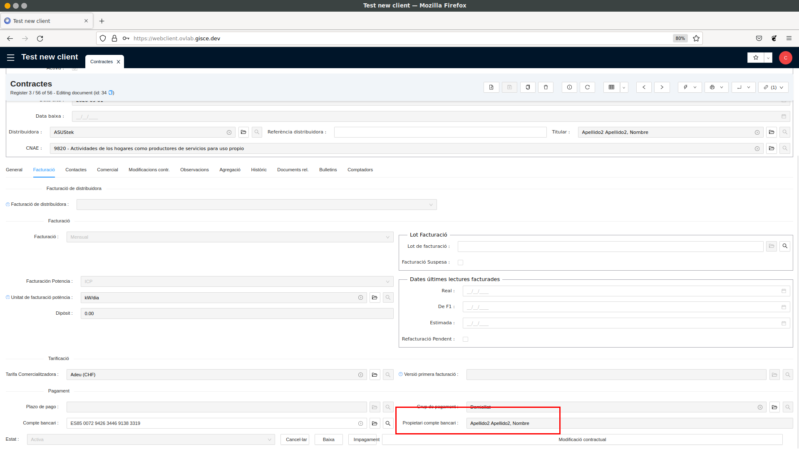

# Guia de Contractació

## Buscar el contracte d'un client

● Anar al llistat de contractes situat a Gestió de Contractes / Factures -> Contractes
(fer doble clic a “Contractes”)

● Al llistat que s'obre, cal utilitzar l'apartat de filtres per cercar el
contracte. Segons la informació que doni el client podem utilitzar un filtre o algun
un altre. Els més comuns són els següents:
1. Titular: cercar els contractes per nom del titular. Es pot cercar només per
una part del nom o pel nom complet.
2. NIF titular: cercar pel NIF/CIF del titular.
3. Adreça CUPS: cercar per adreça del punt de subministrament, és a dir, la
direcció de l'habitatge/local on s'estiga donant llum.
4. Contracte: cercar pel número de contracte que es va donar al client.
5. CUPS: cercar pel nombre de CUPS. Igual que el número de contracte és
un identificador únic.

## Camps d'un contracte

En fer doble clic en un contracte des d'un llistat de contractes se'ns obre una
vista detallada amb tota la informació del contracte:
1. La informació d‟un contracte s‟agrupa en pestanyes. Les més rellevants
són:
a. General: conté la informació referent al mercat elèctric: tarifa
d'accés, potències contractades, tipus de contracte, etc.
b. Facturació: conté la informació sobre el producte que s'hi està
venent al client (Tarifa Comercialitzadora) i les dades de pagament
(IBAN i propietari del compte bancari).
c. Contactes: s'informa l'adreça de notificació (adreça on es
envien les factures) i les dades fiscals per a la factura (raó fiscal i
direcció fiscal).
2. Quan es fa clic a una de les pestanyes, es mostra tota la informació
a la pantalla principal del contracte.
3. La barra superior agrupa una sèrie de botons per fer diferents
accions. El primer grup de botons serveix per generar informes en PDF,
per exemple, per imprimir el contracte
4. El segon grup de botons serveix per iniciar assistents a una finestra
emergent. Els assistents guien l'usuari al llarg d'un procés amb un
objectiu concret.
5. El darrer grup de botons són enllaços. Els enllaços serveixen per obrir-ne una
nova pestanya on es mostren elements ja filtrats normalment
relacionats amb els contractes. Per exemple, l'enllaç "Factures Client"
obre una pestanya amb les factures emeses per aquest contracte.

## Identificar el pagador d´un contracte

● El pagador d'un contracte és el propietari del compte bancari associat al
contracte. Es pot trobar a la pestanya "Facturació" del contracte.

