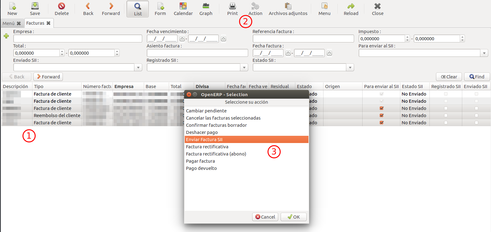

# Subministrament Immediat d'Informació (SII)

## Índex

1. [Introducció](#1-introduccio)
2. [Enviaments](#2-enviaments)    
    2.1. [Esquema d'enviament](#21-esquema-denviament)    
    2.2. [Enviaments automàtics](#22-enviaments-automatics)    
    2.3. [Enviament de forma manual](#23-enviament-de-forma-manual)    
    2.4. [Possibles estats dels enviaments](#24-possibles-estats-dels-enviaments)    
3. [Camps referents al SII](#3-camps-referents-al-sii)    
    3.1. [En una factura](#31-en-una-factura)    
    3.2. [En una posició fiscal](#32-en-una-posicio-fiscal)    
    3.3. [En un diari financer](#33-en-un-diari-financer)    
    3.4. [En una persona física/jurídica](#34-en-una-persona-fisicajuridica)    
4. [Possibles configuracions](#4-possibles-configuracions)
5. [Preguntes freqüents](#5-preguntes-frequents)

## 1. Introducció

El Subministrament Immediat d'Informació (SII) és un sistema de gestió dels llibres
de registre de l'IVA a través de la Seu Electrònica de l'AEAT.

En els següents enllaços es troba la informació referent al SII de la
pàgina oficial de l'AEAT (Agència Estatal d'Administració Tributària):

- [Informació general](http://www.agenciatributaria.es/AEAT.internet/G417/informacion.shtml)
- [Normativa](http://www.agenciatributaria.es/AEAT.internet/Inicio/Ayuda/Modelos__Procedimientos_y_Servicios/Ayuda_P_G417____IVA__Llevanza_de_libros_registro__SII_/Informacion_general/Nuevo_sistema_de_gestion_del_IVA_basado_en_el_Suministro_Inmediato_de_Informacion.shtml) referent
- [Ajuda tècnica](http://www.agenciatributaria.es/AEAT.internet/G417/tecnica.shtml) per a la implantació del sistema

## 2. Enviaments

### 2.1. Esquema d'enviament

blockdiag {
    orientation = portrait;
    default_shape = roundedbox;
    default_fontsize = 15;
    span_height = 100;
    node_width = 200;
    node_height = 150;
    A [label = "Factura", width = 150, height = 50];
    B [label = "Cola de \nenvíos", stacked, width = 150, height = 70];
    C [label = "AEAT", shape = cloud];
    D [label = "ERP", shape = "flowchart.database", width = 150, height = 50];
    A -> B [label = "Abrir \nfactura", fontsize = 13];
    B -> C [label = "Envío", fontsize = 13];
    C -> D [label = "Respuesta", fontsize = 13];
}

### 2.2. Enviaments automàtics

Cada vegada que s'obri una factura es posarà en una cua d'enviaments on hi haurà
totes les factures obertes en el mateix dia. Totes aquestes factures s'enviaran
de forma automàtica a l'AEAT en una hora concreta del dia. Un cop s'enviï es crearà
un registre amb l'estat de l'enviament.

### 2.3. Enviament de forma manual

Per tal d'enviar una factura de forma manual es pot fer a través d'una acció d'un
dels següents menús:

- Des del menú de factures (**"Comptabilitat i finances / Factures"**)
- Des del menú de registre del SII (**"Comptabilitat i finances / SII / Registre SII"**)

1. Es seleccionen les factures que es volen enviar
2. Es selecciona el botó "Accions"
3. Es selecciona l'acció "Enviar Factura SII"

### 2.4. Possibles estats dels enviaments

- Correcte: la factura s'ha registrat a l'AEAT correctament
- Acceptada amb Errors: la factura s'ha registrat a l'AEAT però té errors que
s'han de corregir
- Incorrecte: la factura s'ha enviat a l'AEAT però no s'ha registrat a causa
d'un error
- Validació Incorrecta: la factura no ha passat una validació prèvia que es realitza
abans d'enviar-la a l'AEAT
- Error: hi ha hagut un error en l'enviament de la factura cap a l'AEAT. Normalment
succeeix perquè la connexió no és estable o perquè l'AEAT rep masses peticions a
la vegada i no pot processar-les totes

## 3. Camps referents al SII

### 3.1. En una factura
### 3.2. En una posició fiscal
### 3.3. En un diari financer
### 3.4. En una persona física/jurídica

## 4. Possibles configuracions

### Opció 1: Utilitzant proxy

Aquesta opció permet utilitzar un servidor intermediari, el qual guardarà el
certificat digital de l'empresa per l'AEAT. D'aquesta manera es limita
l'accés al certificat a únicament les persones amb accés a aquest servidor i
evitem que l'ERP hi tingui accés directe, afegint així una capa de seguretat extra.

L'ERP farà peticions al servidor utilitzant un certificat local/client i aquest
les reenviarà als serveis de l'AEAT afegint el certificat digital de l'empresa.
L'esquema de connexió serà el següent:

blockdiag {
    span_width = 150;
    node_width = 50;
    A [label = "ERP", color = none];
    B [label = "Proxy", style = dashed, color = none];
    C [label = "AEAT", color = none];
    A <-> B [label = "Certificado local"];
    B <-> C [label = "Certificado empresa"];
}

### Opció 2: Connexió directe

Aquesta opció permet estalviar la necessitat d'utilitzar un servidor intermediari,
però permet que qualsevol usuari amb permisos d'administrador en el servidor de
l'ERP tingui accés directe al certificat oficial de l'empresa per l'AEAT.

blockdiag {
    span_width = 150;
    node_width = 50;
    A [label = "ERP", color = none];
    B [label = "AEAT", color = none];
    A <-> B [label = "Certificado empresa"];
}
