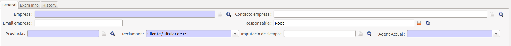
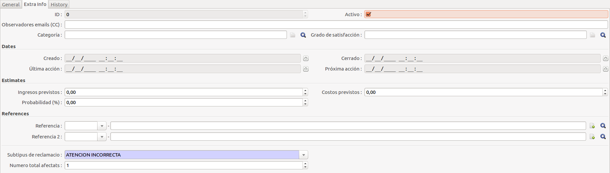
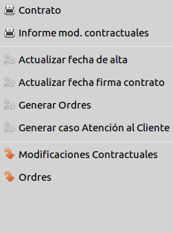
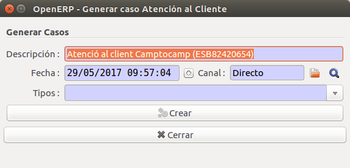
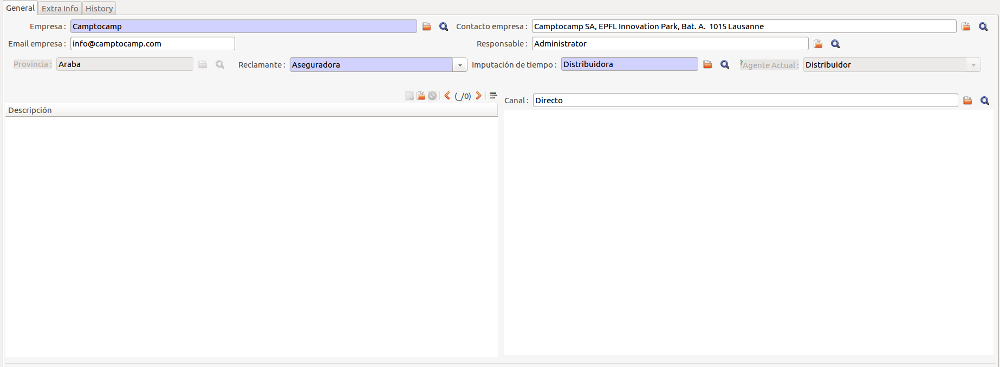
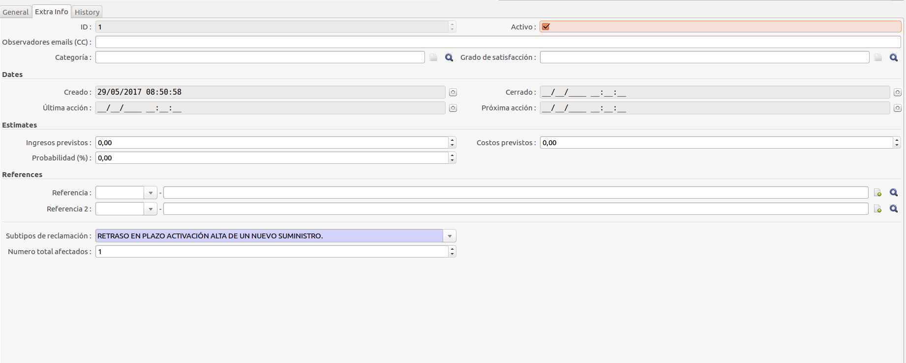
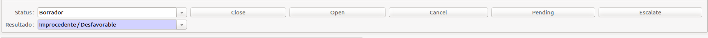

# Módul d'Atenció al Client

## Introducció

El mòdul de atenció al client (ATC) permet a GISCE-ERP la gestió de les
reclamacions dels consumidors a través de casos i la generació dels fitxers amb
tota la informació referent a ells, complint així amb el que ve definit en la
circular [2/2016](http://www.boe.es/diario_boe/txt.php?id=BOE-A-2016-7979)
de la CNMC sobre petició de informació sobre reclamacions de
consumidors de energia elèctrica i gas natural als comercialitzadors i
distribuidors.

El format i les dades d'aquests fitxers venen definits per la CNMC.

## Casos

GISCE-ERP modelitza una reclamació en concret com un cas de CRM del propi ERP.
Mitjançant el cas podem accedir a tota la informació referent a la reclamació.

Aquest mòdul extén els casos CRM del ERP, per tant, el seu funcionament és el
mateix.
Tot i aixó, s'afageixen nous camps per tal de obtenir tota la informació
requerida per la CNMC:

* A la pestanya **General**:

    * **Imputació de Temps**: Agent al que se l'hi imputarà el temps gastat en
        l'estat actual. Hi ha 4 agents definits per la CNMC: Comercilitzador,
        Distribuidor, Client i Altres.

    * **Agent Actual**: Agent que te accions pendents. Coincideix amb l'agent al
        que se l'hi imputa el temps peró en el cas que aquest sigui 'Altres'
        s'ha de indicar especificament quin és.

    * **Reclamant**: Agent que planteja la reclamació.

    * **Resultat**: Resultat final de la reclamació.

* A la pestanya **Extra Info**:
    * **Número total afectats**: Numero total de cups afectades en la reclamació.

    * **Subtipus**: Subtipus de la reclamació. Si n'hi ha varis s'indica el
        princpal.

## Guia d'Atenció al Client

El funcionament del procés d'atenció al client és el mateix tant per les
distribuïdores com per les comercialitzadores. L'única diferència entre elles
és que una distribuïdora gestionarà les reclamacions rebudes de les
comercialitzadores a través del procés de ATR R1 en comptes de fer-ho en el
present módul.

Per veure un procés complet d'atenció al client, a continuació s'exposa un
exemple en el qual un client va a fer una reclamació a la comercialitzadora.
En aquest supòsit, el procés d'atenció al client, des que s'obre fins que es
tanca el cas, és el següent:

 * Arriba una reclamació per algun canal: un client truca per telèfon, envia un
 mail, ve a l'oficina, etc.

 * Es busca la pòlissa del client en qüestió i s'utilitza l'assistent per obrir
 un cas de ATC: pitjar el botó "Generar cas Atenció al Client"

 

 * Automàticament s'omple la descripció (que es pot canviar), la data (serà la
 del dia en què es generi) i el canal.

 * Per defecte el canal és "Directe", és a dir, que el client ha anat a l'oficina.
 S'ha d'escollir el canal correcte d'entre totes les opcions (telèfon, mail, web, etc.).

 * Omplir el subtipus al qual pertany la reclamació d'entre tots els definits segons la
 circular 2/2016. S'ha de determinar segons la informació proporcionada pel
 client a quin pertany. Si en aquell moment se n'escull un que acaba sent
 incorrecte, sempre es pot canviar més endavant (a la pestanya "Extra Info").
 Pitjant el botó "Crear" es generarà un cas de ATC amb la informació introduïda.

 

 * El següent pas és emplenar la resta d'informació del cas:
     * A la pestanya "General":
         * Reclamant: en l'exemple actual seria el client, però podrien ser
         altres com una asseguradora, una persona no titular del CUPS, etc.
         * Imputació de temps: es tracte de l'agent que tingui accions pendents
         i que per tant se l'hi imputarà el temps. En el supòsit actual seria
         la comercialitzadora.
             * Aquest camp és un dels més importants, ja que mesura al llarg
             del procés quant de temps ha trigat cada agent a realitzar les
             seves accions, informació que s'inclourà en la generació d'informes
              de la circular 2/2016.
             * S'ha d'anar canviant al llarg del procés perquè el temps s'imputi
             correctament: quan es canvia l'estat d'un cas, es guarda a
             l'historial l'agent que hi hagués en el moment del canvi. Tot el
             temps gastat en aquest estat nou s'imputarà a aquest agent guardat
            en l'historial.
         * Descripció: en aquest camp s'escriu una breu descripció sobre la
         reclamació. És un camp totalment informatiu en què es va explicant
         l'estat en què es troba la reclamació.

     

     * A la pestanya "Extra Info":
         * Numero total afectats: número total de punts de suministre afectats.
         Per defecte és 1.

     

 * Un cop emplenada tota la informació, ja es pot obrir el cas. És molt
 important que el camp "Imputació de temps" sigui correcte abans d'obrir el
 cas perquè quedarà historitzat. Cada cop que es canvia d'estat en un cas
 (de "Borrador" a "Obert", "Pendent", "Tancat", ...) es guardarà al històric
 a quin agent se l'hi imputarà el temps gastat en aquell estat. En la situació
 actual, tot el temps que el cas estigui en estat "Obert" fins que es passi a
 un estat diferent s'imputaria a la comercialitzadora.

 

 * En aquest punt poden ocórrer diferents situacions depenguen de com es
 resolgui la reclamació. Alguns exemples:

     * La comercialitzadora pot resoldre la reclamació sense necessitar accions
     de cap altre agent. Es selecciona el resultat de la reclamació que
     pertoqui ("Procedent", "Improcedent", "No Gestionable") i es passa a estat
     tancat.

     * La comercialitzadora necessita que un altre agent realitzi accions.
     Per exemple:
         * Necessita més informació del client i se l'hi envia un mail
           demanant-la. En aquest cas es seleccionaria com a "Imputació de Temps"
           el "Client" i es passaria a estat "Pendent" fins que el client
           proporcioni la informació demanada. Un cop arribés la informació es
           canviaria la "Imputació de Temps" un altre cop a "Comercialitzadora"
           i es passaria a estat "Obert" per continuar amb la reclamació.
         * Es requereixen accions per part de la distribuïdora. Això implicaria
           l'inici d'un cas de gestió ATR R1. El procediment seria el mateix:
           passar "Imputació de Temps" a "Distribuïdora" i deixar l'estat
           a "Pendent". En paral·lel es gestionaria el R1 i un cop es tanqués es
           passaria "Imputació de Temps" a "Comercialitzadora" i es tornaria a obrir
           el cas per continuar. És recomanable a cada pas anar escrivint al camp
           "Descripció" l'estat de la reclamació per poder fer un seguiment més fàcil.

 * L'últim pas sempre és passar el cas a "Tancat". Abans de fer això s'ha
 d'emplenar correctament el camp "Resultat" que indica com ha acabat la
 reclamació. També és important que el camp "subtipus" sigui el correcte,
 ja que un cop tancat el cas no es podrà tornar a canviar.

## Generació de Informes

La principal funcionalitat d'aquest mòdul és la de poder generar de forma
automatitzada fitxers amb la informació sobre les reclamacions demanats per la
CNMC. El format i la informació d'aquests fitxers segueixen les directrius
definides en la circular 2/2016 mencionada anteriorment.

El procediment complet per generar aquests informes es detalla en els apartats:

 * Distribuidora -> Administració Pública -> CNMC -> Generació de Informes sobre Reclamacions de Consumidors

 * Comercialitzadora -> Administració Pública -> CNMC -> Generació de Informes sobre Reclamacions de Consumidors
