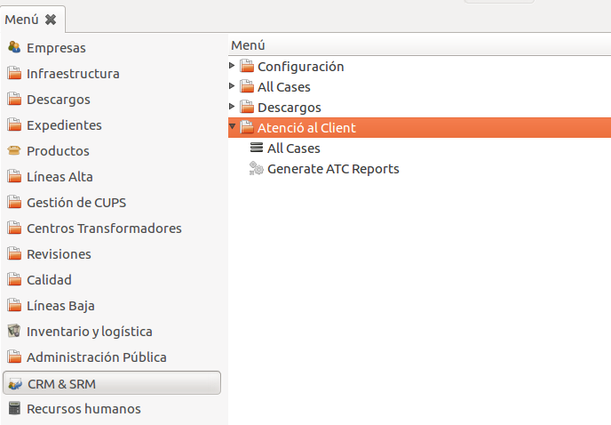
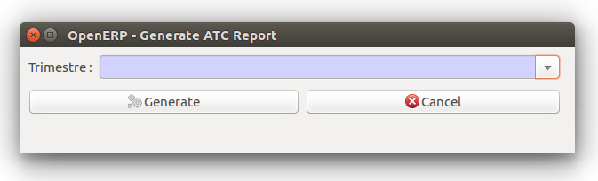
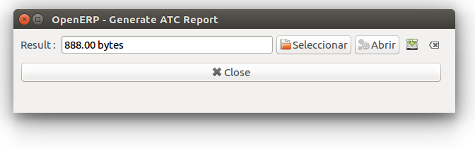

# Módul d'Atenció al Client

## Introducció

El mòdul de atenció al client (ATC) permet a GISCE-ERP la gestió de les
reclamacions dels consumidors a través de casos i la generació dels fitxers amb
tota la informació referent a ells, complint així amb el que ve definit en la
circular [2/2016](http://www.boe.es/diario_boe/txt.php?id=BOE-A-2016-7979)
de la CNMC sobre petició de informació sobre reclamacions de
consumidors de energia elèctrica i gas natural als comercialitzadors i
distribuidors.

El format i les dades d'aquests fitxers venen definits per la CNMC.

## Casos

GISCE-ERP modelitza una reclamació en concret com un cas de CRM del propi ERP.
Mitjançant el cas podem accedir a tota la informació referent a la reclamació.

Aquest mòdul extén els casos CRM del ERP, per tant, el seu funcionament és el
mateix.
Tot i aixó, s'afageixen nous camps per tal de obtenir tota la informació
requerida per la CNMC:

* A la pestanya **General**:

    * **Imputació de Temps**: Agent al que se l'hi imputarà el temps gastat en
        l'estat actual. Hi ha 4 agents definits per la CNMC: Comercilitzador,
        Distribuidor, Client i Altres.

    * **Agent Actual**: Agent que te accions pendents. Coincideix amb l'agent al
        que se l'hi imputa el temps peró en el cas que aquest sigui 'Altres'
        s'ha de indicar especificament quin és.

    * **Reclamant**: Agent que planteja la reclamació.

* A la pestanya **Extra Info**:
    * **Número total afectats**: Numero total de cups afectades en la reclamació.

    * **Resultat**: Resultat final de la reclamació.

    * **Subtipus**: Subtipus de la reclamació. Si n'hi ha varis s'indica el
        princpal.

## Generació de Informes

La principal funcionalitat d'aquest mòdul és la de poder generar de forma
automatitzada fitxers amb la informació sobre les reclamacions demanats per la
CNMC. El format i la informació d'aquests fitxers segueixen les directrius
definides en la circular 2/2016 mencionada anteriorment.

Mitjançant la opció "Generate ATC Reports" s'obrirà un assitent per generar
l'informe:

Aquest assistent funciona de la següent manera:

* Es selecciona el trimestre les reclamacions del qual seran incloses en
    l'informe i es clica "Generar".

* Automàticament es generarà un fitxer '.csv' amb tota la informació sobre les
    reclamacions. Aquest fitxer es pot obrir o guardar.

* Al guardar el fitxer s'assignarà un nom amb el següent format:

        "AAAA-MM-DD_electricidad_reclamaciones.csv"

     on AAAA-MM-DD és la data en que s'ha generat l'informe. Aquest nom no s'ha
     de modificar ja que és el demanat per la CNMC.

Les reclamacions que son incloses en aquest informe son totes aquelles que no
estiguin en estat 'esborrany' i que pertanyin al trimestre seleccionat.
A més, l'any en que s'han obert aquestes reclamacions ha de ser l'any actual en
cas de trimestres 1 i 2, i l'any anterior al actual en el cas de trimestre 3 i 4.    
Es fa així per complir amb el requeriment de la CNMC de generar els informes
del trimestre N en la primera quinzena trimestre N+2.
