# Documentació del mòdul de Canvis d'ATR (Switching)

## Introducció

El mòdul de canvis d'ATR o switching  ``giscedata_switching`` permet a
GISCE-ERP la gestió de l'intercanvi de fitxers entre distribuidores i
comercialitzadores que es generen per la mobilitat dels consumidors i la
intermediació de les comercialitzadores entre les distribuidores i els abonats.
Aquests fitxers venen definits per **CNMC** (abans **OCSUM**).

Actualment, aquest mòdul és capaç de llegir i generar:

* **C1**: Una pólissa canvia de comercialitzadora. Intervenen la
  comercialitzadora entrant, la comercialitzadora sortint i la distribuïdora

* **C2**: Una pólissa canvia de comercialitzadora amb modificació de dades. És
  el mateix cas que un C1 però es modifiquen característiques com la potència
  contractada, el titular o la tarifa

* **M1**: Modificació de dades. La pólissa modifica alguna de les seves
  característiques com la potència contractada, titular o la tarifa. Intervenen
  la comercialitzadora actual i la distribuidora actual. Actualment es poden
  fer canvis de titular, modificacions de potència i canvis de tarifa d'accés.

* **B1**: Baixa per finalització d'activitat. Intervenen la
  comercialitzadora sortint i la distribuidora.

* **D1**: Notificació de modificació de característiques ATR per part de la
  distribuidora.

* **A3**: Alta directa a mercat. En el procés intervé la comercialitzadora
  entrant i la distribuidora.
 
* **R1**: Reclamacions a distribuïdora. En el procés intervé la comercialitzadora 
  actual.
 
* **W1**: Notificació de autolectures a la distribuïdora des de la comercialitzadora.
 
Per facilitar el processat massiu de casos, s'han afegit diverses eines i
assistents per realitzar accions en múltiples casos.

Els fitxers d'intercanvi de lectures i factures entre distribuidores i
comercialitzadores s'implementen en els mòduls
``giscedata_facturacio_switching`` i ``giscedata_lectures_switching`` per
processar els fitxers **F1** i **Q1** respectivament i no es tracten en aquest
document.

## Conceptes

Per entrendre el funcionament del mòdul de switching, cal tenir clar alguns
conceptes.

### Agent

Qualsevol de les empreses que intervenen en un procés de switching és un agent.
Qui comença un procés sempre és una comercialitzadora. Com a mínim intervenen
sempre una distribuidora i una comercialitzadora. En el cas d'un canvi de
comercialitzadora (p.e. ``C1``) podem parlar de *comercialitzadora entrant*
(qui demana el canvi), *comercialitzadora sortint* (qui té la pólissa
actualment) i *distribuídora* a la qual pertany el CUPS.

Els fitxers s'intercanvien sempre entre dos agents, un dels qual es
l'origen i l'altre el destinatari.

### Processos

Un procés defineix el flux de passos i actuacions que realitzaràn tots els
agents implicats.

Un procés comença amb una sol·licitud des d'un agent que genera un fitxer amb
el format addient. L'iniciador, generarà un fitxer de **pas 1** del
procediment. Cada procediment té el seu fluxe específic amb diferents passos.

Un procés defineix quin són els agents implicats i els possibles passos
(obligatoris o no)

P.e.: **C1** és un procés que pot tenir fins a 10 passos

### Passos

Un pas és qualsevol transició entre els estats en el qual es pugui trobar un
procés. A cada pas, li correspon un format de fitxer. Per tant tenim un fitxer
de *pas n* del proces *P*.

Alguns dels passos són obligatoris i d'altres opcionals. Un exemple de pas
opcional pot ser un pas de ``Rebuig``.

Tots els passos d'un procés tenen definit l'origen i el destí.

### Casos

GISCE-ERP modelitza un procés en concret com un cas de CRM del propi ERP.
Concretament es crea una secció Switching en l'arbre de casos. Mitjançant el
cas podem accedir a l'historial de missatges generats i visualitzar l'estat
actual del proces concret, p.e. "Pendent de reposta després de pas 2". Tot el
seguiment del fluxe es pot fer mitjançant el cas.

La generació dels fitxers XML on l'origen siguem nosaltres, utilitzarà la
informació ja disponible dels diferents passos emmagatzemats en el cas.

## Configuració

Alguns dels paràmetres que han d'estar correctament configurats són:

* **Power Email**: Es necessita activar el Power Email si es volen enviar els
  mails directament des de l'ERP. Caldrà configurar els comptes que es vulguin
  i assegurar-se que funcionen
* **Código REE**: La empresa associada a la companyia ha de tenir el codi de
  **REE** correctament emplenat al camp ``Codi``. També hauran de tenir-ho
  correctament configurat les companyies susceptibles de ésser agents implicats
  en un procés de switching

## Funcionament General

La funció actual del mòdul de switching és la gestió i enviament dels fitxers
XML dels processos de switching. Per fer aquest seguiment s'emmagatzema tota la
informació d'un procés de switching en un cas del CRM de GISCE-ERP.

Un procés de switching, s'associarà a un cas on es podrá anar generant els
passos necessaris del procés i els fitxers XML associats.

És responsabilitat de l'usuari saber en cada moment quin és el pas següent i
les accions que s'han de realitzar per portar-lo a terme.

## Menú Switching

A GISCE-ERP hi ha definit el Menú **Switching** que dóna accés als casos
implicats en processos de switching i a la importació de fitxers XML.

##### Opcions del menú Switching
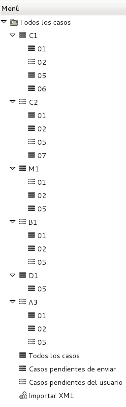

* **Tots els casos**: Llistat de qualsevol dels casos de la secció Switching.
  Inclou una estructura d'arbre amb una entrada de menú per accedir directament
  als casos de cada procés i als passos més interessant de cada un.
* **Llistat de passos**: Els llistats de passos permeten accedir ràpidament als
  passos actuals d'un procés concret. Un cop obert un pas, es pot accedir
  directament al cas amb l'assistent **Processar Pas Gestió ATR** accessible
  des del botó acció d'un llistat de passos i des de la fitxa d'un cas en
  concret.
* **Casos pendents d'enviar**: Llistat de tots els casos que estan a l'espera
  d'enviar l'XML al destinatari i que ja no necessiten cap mes actuació per part
  nostre. Es llistaran els casos que tenen algún pas amb la marca
  ``Per enviar``
* **Casos pendents de l'usuari**: Llistat de tots els casos oberts on calgui
  actuació per part nostre per poder generar el següent pas (inactiu).
* **Importar XML**: Permet carregar un fitxer XML o un fitxer ZIP amb múltiples
  fitxers XML i generar el cas o afegir el pas al cas que correspongui.

##### Assitent per accedir al cas des d'un pas

## Formulari del Cas

Quan entrem en un cas, tenim la informació principal i diferents pestanyes:

### Informació principal

* **Descripció**: Aquest text sortirà al llistat de Casos i ens ha de permetre
  trobar el cas
* **Secció**: Secció del cas en l'arbre de seccions del CRM de GISCE-ERP.
  Normalment Switching
* **Data Límit**: Es calcula automàticament segons la data d'inici i la durada
* **Companyia**: S'omple automàticament amb la nostra companyia
* **Data**: Data en la que s'inicia el cas. És important pel càlcul dels
  terminis
* **Prioritat**: Prioritat del cas dins el CRM. S'assigna la prioritat
  ``Normal``

### Pestanya General (CRM)

Aquesta pestanya és la genèrica de qualsevol cas del CRM de GISCE-ERP. Podem
afegir comentaris, enviar mails al destinatari, etc...

Mitjançant els botons, podem gestionar els diferents estats del cas:

* **Esborrany**: Encara no ha començat el procés però te algunes de les dades
  preparades per a ser utilitzades.
* **Obert**: Aquest cas està en procés. Conté els passos que s'han generat fins
  el moment.
* **Tancat**: Aquest cas ja ha acabat el seu procés fins a l'últim pas.
* **Cancel·lat**: Un cas que s'ha obert, però no s'ha arribat a enviar cap
  missatge, es pot passar a cancel·lat si vols mantenir-lo a històric.

!!! warning
    Un cas que ja ha tingut missatgeria amb un altre agent, **no** pot passar a
    estat ``cancel·lat``. S'ha de generar un pas d'anul·lació o rebuig.

!!! note:
    Existeix un estat **Pendent** en el CRM. Pel que fa a canvis d'ATR, no és un
    estat que tingui gaire sentit.

### Pestanya Contactes

En aquesta pestanya tenim les dades dels agents implicats en un procés.
Depenent de l'agent i del procés es mostraran mes o menys camps.

#### Destinatari

Empresa amb la qual es mantindrà la comunicació. En el cas de les
comercialitzadores és la distribuidora del CUPS afectat pel procés i en el cas
de les distribuïdores serà la comercialitzadora iniciadora del procés o
sol·licitant

* **Empresa**: Empresa destinatària
* **Contacte Empresa**: Informació de contacte de l'empresa destinatària
* **Email Empresa**: Adreça de mail que s'utilitzarà en les comunicacions amb
  el destinatari

Amb el botó **Send Reminder** podem enviar un mail al destinatari per
validar-ne el funcionament

#### Comercialitzadora Sortint

En alguns casos, és necessari intercanviar informació amb altres Agents com la
comercialitzadora sortint. En el cas de la distribuidora, caldrà seleccionar la
empresa comercialitzadora de la pólissa subjecte del procés.

# Pestanya Etapes

Aquesta pestanya és merament informativa i ens dóna informació de quin o quins
 serien els possibles següents passos en el procés.

### Pestanya Switching

Aquesta pestanya ens permet gestionar la informació del procés i els diferents
passos que es van generant.

### Dades generals

* **Procés**: (Obligatori) Procés afectat per aquest cas, pe. C1, C2 o M1
* **Pas**: Pas en el qual es troba el procés des del nostre punt de vista.
  S'omple autoàticament
* **Versió**: Versió dels fitxers OCSUM del procés
* **Acció pendent**: S'hi hi ha accions pendents a realitzar per aquest pas
* **Codi sol·licitud**: Codi assignat a tot el procés. Es genera automàticament
* **Seqüencial de sol·licitud**: Codi de seqüència. Es genera automàticament
* **CUPS**: (Obligatori) CUPS afectat pel procés. S'assigna automàticament al
  seleccionar la pólissa. Cal que existeixi a la base de dades de CUPS
* **Polissa**: (Obligatori) Pólissa afectada pel procés. S'assigna
  automàticament al seleccionar el CUPS. Cal que la pólissa existeixi encara
  que estigui en esborrany
* **Ref. Contracte**: (Obligatori) Referència del contracte de la
  **distribuidora**  al que afecta aquest cas. S'omple automàticament al
  seleccionar la pólissa/CUPS. Si som una comercialitzadora, cal que estigui
  omplert el camp ``Referència Distribuïdora`` de la pólissa. Si no es sap,
  s'ha de posar el valor *999999*. Si som una distribuïdora, serà el mateix
  valor que el camp ``Pólissa``.

### Detall de passos

Llistat amb tots els passos que s'han generat. Es poden crear, esborrar i
obrir. Per generar qualsevol pas, el cas ha d'estar obert.

Quan obres o crees un Pas, accedeixes al formulari del Pas.

##### Formulari de nou pas
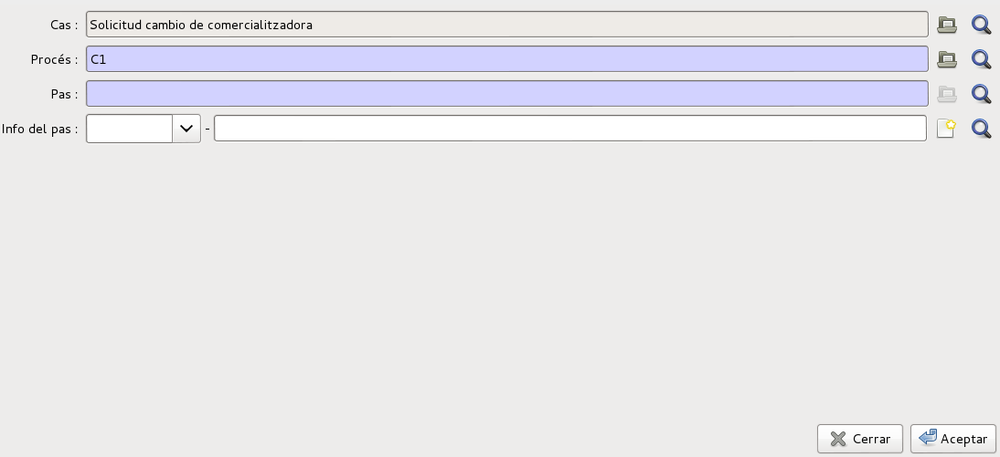

* **Cas**: S'omple automàticament amb les dades la descripció del Procés
* **Procés**: Procés al que està associat el Pas. S'omple automàticament amb el
  del Procés
* **Pas**: Número de Pas.
* **Info del Pas**: Escollim la informació que associarem al Pas. Haurà de ser
  la del mateix procés/pas que hem escollit anteriorment. Amb la icona de la
  carpeta, podrem accedir al formulari de la informació del Pas que serà
  diferent en funció del Procés i Pas seleccionat en el desplegable. Totes les
  dades del pas es generaran automàticament segons les dades de CUPS i pólissa
  introduïts anteriorment.

!!! tip
    Amb el botó **Acceptar** creem el pas, però no es tanca el formulari. Fins
    que no es guardi el cas, aquest pas no estarà emmagatzemat. Caldrà tancar el
    formulari amb el botó **Tancar** i guardar el Cas

##### Exemple de dades d'un pas. (C1) 01
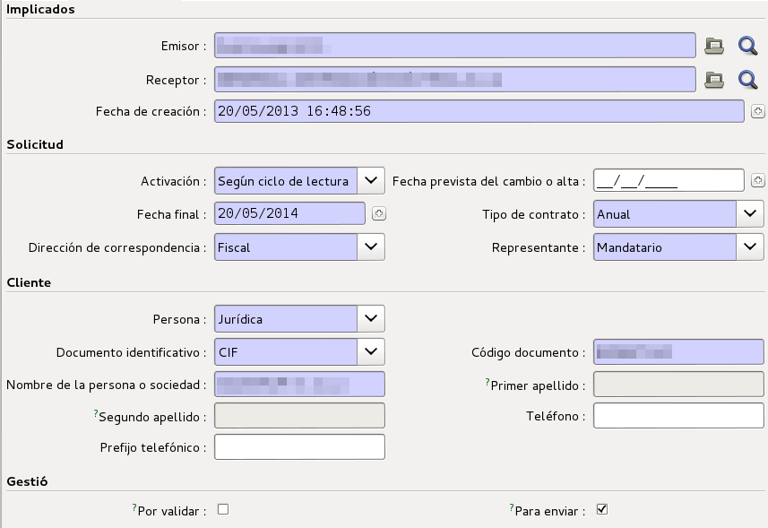

Cada parell Procés/Pas té el seu formulari de dades específic en funció de les
dades que s'han d'omplir en el XML corresponent.

##### Exemple de dades d'un pas. (M1) 01
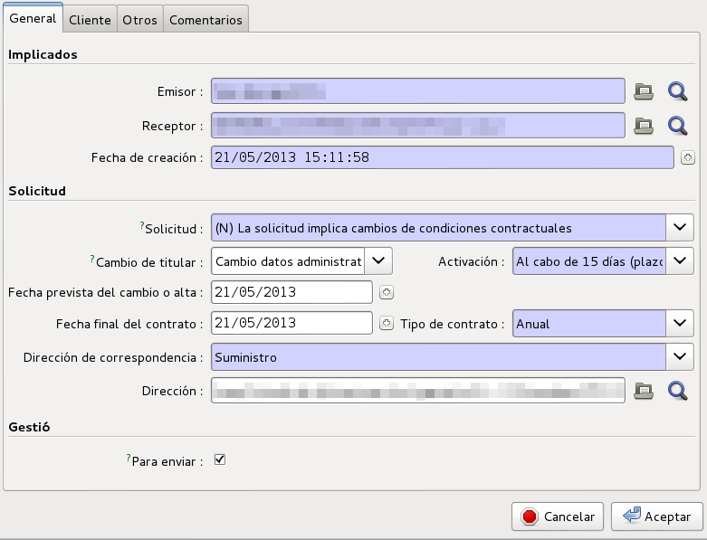

No obstant això, hi ha algunes característiques comunes en tots els passos de
qualsevol procés.

* **Per enviar**: Significa que encara no s'ha enviat el XML del pas al
  destinatari.Quan es crea un pas, es marca per enviar si l'emissor del pas és
  la nostra empresa. Es modifica automàticament quan s'envia l'XML per mail
  mitjançant l'assitent [enviar xml](#formulari-power-email-dun-fitxer-xml-enviar-des-del-cas-corresponent)
  o quan s'exporta el fitxer ZIP i es marca la casella corresponent a
  l'assistent [exportar xml](#formulari-per-exportar-un-fitxer-xml). Els pasos
  que estan per enviar i els casos que tenen algun dels seus pasos per enviar,
  es llisten de color **blau**.

* **Per validar**: En alguns passos generats automàticament cal validar que les
  dades són correctes. En aquests casos, quan es detecta que hi ha alguna
  incongruència que necessita la intervenció d'un operador, marca el pas per
  validar. Mitjançant aquest camp es pot desmarcar un cop arreglades les dades.
  Es pot veure en detall a l'apartat [automatització](#automatitzacio). Els pasos que estan
  pendents de validar, es llisten de color **vermell**.

## Pestanya History

Llistat amb totes les accions que s'han realitzat, com Obrir, Tancar,
Historitzar, etc...

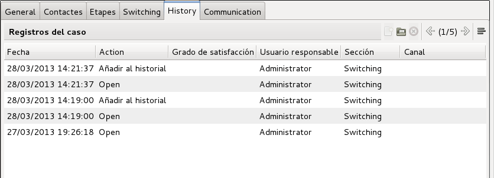

## Pestanya Communication

Llistat amb tots els mails enviats des del cas mitjançant el botó **Enviar XML**

Seleccionant una de les línies del llistat, pots accedir a les dades del
missatge enviat com destinatari, compte utilitzat, text, adjunts, etc... Fins i
tot, es pot tornar a enviar el correu mitjançant el botó **Enviar Correu**

##### Formulari Power Email d'un fitxer XML enviar des del cas corresponent

## Generació i enviament de XML's

### Generació del fitxer

El fitxers XML es generen a partir de la informació del pas actual, es a dir,
el pas en el qual està el cas.
Alguns agents, reclamen els XML's en format **ISO-8859-1** en comptes de UTF-8.
GISCE-ERP permet configurar-les per a utilitzar aquesta codificació mitjançant
el camp **Encoding XML switching** de la pestanya **Ventas y Compras** de la
fitxa de l'empresa corresponent.

##### Camp per modificar la codificació XML a la fitxa d'empresa
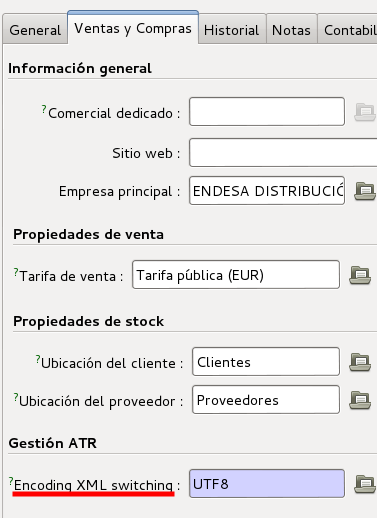

Per intercanviar XML's tenim dues opcions:

* **Exportar XML**: Crea un ZIP amb tots els XML's seleccionats o un sol XML si
  només és un cas
* **Enviar XML**: En via el XML per mail al destinatari

### Exportar XML

Es genera el fitxer XML d'un pas per poder-lo emmagatzemar en l'ordinador de
l'usuari i enviar-lo al receptor per altres vies. Si s'utilitza aquesta opció,
no es podrà fer un seguiment de l'intercanvi de informació amb el destinatari
automàticament si no s'utilitzen les utilitats d'historització del CRM
(``Pestanya General``)

##### Formulari per exportar un fitxer XML
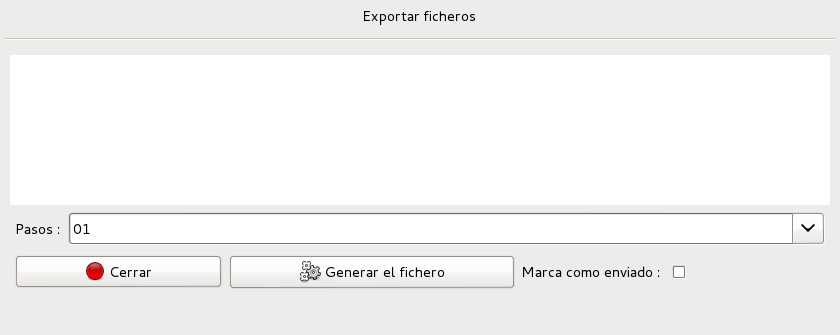

* **Passos**: Podrem escollir el pas del qual volem generar l'XML
* **Marca com enviat**: Es marcaran com a enviats tots els passos que es
  generin. D'aquesta forma ja no sortiran en el llistat de casos **pendents
  d'enviar**.

Prement al botó **Generar Fitxer** ens mostrarà un formulari per
descarregar-nos el fitxer.
El nom del fitxer generat tindrà el format
``PP_SS_OOOO_DDDD_YYYYMM_NNNNNNNNNNNNNNN_CCCCCCCCCCCCCCCCCCCCCC`` on:

* *[PP]*: Procés (C1,C2,M1)
* *[SS]*: Pas (01,02,...)
* *[OOOO]*: Codi REE de l'agent origen
* *[DDDD]*: Codi REE de l'agent destinatari o nom comercial
* *[YYYYMM]*: Any i mes de inici del procés
* *[NNNNNNNNNNNNNNN]*: Codi de sol·licitud
* *[CCCCCCCCCCCCCCCCCCCCCC]*: CUPS

!!! tip
    Si es vol que el camp destinitari *[DDDD]* contingui un nom d'empresa per
    facilitar la seva gestió, es pot configurar el nom comercial de la fitxa
    d'empresa segons es veu a la imatge següent

##### Camp *Nom comercial* a fitxa de l'empresa

Es pot exportar més d'un cas al mateix temps i es generarà un fitxer ZIP amb
tots els fitxers XML a l'interior. Això ens permet carregar un sol fitxer en
els portals dels agents que ho permeten.

Si es seleccionen casos de diferents destinataris, es generarà un zip per cada
empresa destinatària amb els seus XML's corresponents dins el mateix fitxer.
D'aquesta forma tindrem un fitxer comprimit que contindrà un fitxer ZIP per
cada agent destinatari diferent.

El nom dels fitxers ZIP de cada empresa seguirà el format
``OOOO_DDDD_YYYYMMDDHHMMSS`` on:

* *[OOOO]*: Nom de la base de dades de l'ERP, normalment nom empresa origen
* *[DDDD]*: Codi REE de l'agent destinatari o nom comercial
* *[YYYYMMMDDHHMMSS]*: Any, mes, dia, hora, minut i segon en el qual s'ha
  començat a generar el fitxer ZIP contenidor.

### Enviar XML

##### Formulari per enviar el XML del pas per mail des del Cas
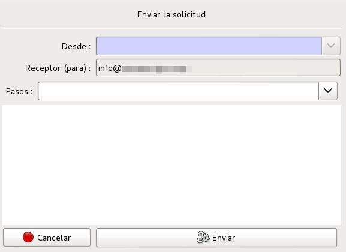

Es pot utilitzar el PowerEmail per enviar els XML's i historitzar tot
l'intercanvi de informació generat.

* **Des de**: Compte de correu que es vol utilitzar per enviar el mail
* **Receptor (Per a)**: S'omple automàticament amb l'adreça de la pestanya
  Contactes
* **Passos**: Pas del qual es vol adjuntar l'XML
* Podrem escriure el contingut del mail que creguem necessari a l'àrea de text
  que hi ha a sota

El mail es veurà a la pestanya ``Communication`` per referències posteriors.

# Operació

## Creació d'un cas com a originador

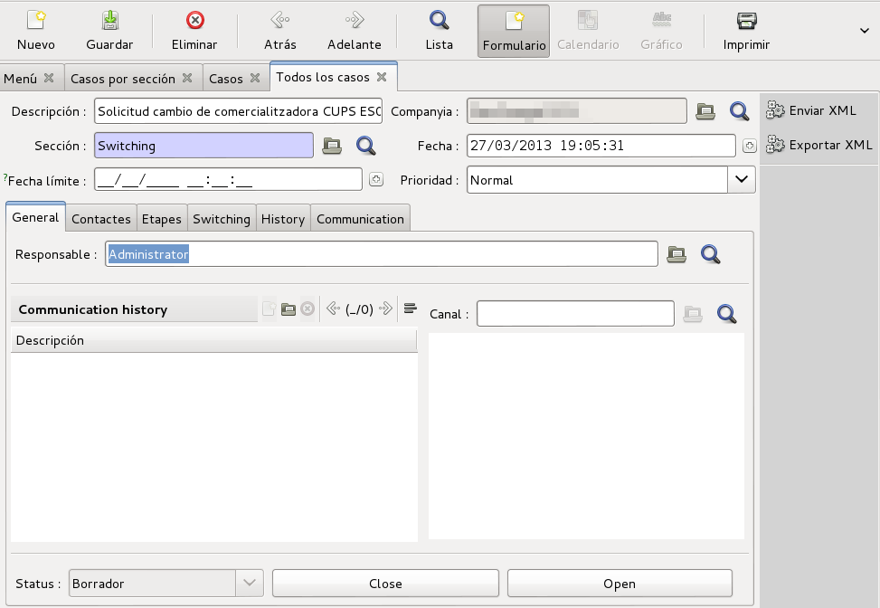

Nosaltres som l'inici del procés. A partir d'una sol·licitut del Client omplim
les dades necessàries del cas i generem el **Pas 1** del procés. En aquest
procés, nosaltres serem l'``Agent Sol·licitant``

En alguns casos haurem de partir d'una pólissa ja existent. Per exemple, en el
cas d'un C1, necessitem que el contracte ja estigui en esborrany.

### Creació del cas

Des del llistat de tots els casos, premem sobre el botó **Nou** i se'ns obrirà
el formulari del cas. Haurem d'anar omplint les dades de les diferents
pestanyes.

* **Descripció**: Descripció del cas per poder-lo trobar. Si es deixa buida,
  s'omplirà automàticament.

A la pestanya ``Contactes``:

* **Empresa**: Seleccionar l'empresa elèctrica destinatària del procés i el seu
  contacte
* **email**: Podem canviar-lo per el que ens interessi

A la pestanya ``Switching``:

* **Procés**: Escollir el procés que generem (C1, C2 o M1)
* **CUPS**: Podem seleccionar un CUPS dels donats d'alta. Per tant haurà
  d'existir a la base de dades de CUPS. S'omple automàticament si seleccionem
  la pólissa
* **Pólissa**: Podem seleccionar el contracte afectat pel procés. Cal que
  existeixi , encara que estigui en esborrany.
* **Ref. Contracte**: La referència al contracte a la distribuidora. És
  obligatori i s'omplirà amb el valor que tingui a la Pólissa seleccionada

!!! tip
    Els camps ``CUPS``, ``Pòlissa`` i ``Ref. Contracte`` s'ompliran
    automàticament un cop s'ha escollit el cups o la pólissa.

Guardem el cas amb el botó **Guardar** i ens quedarà en estat ``Esborrany``

### Obrir Cas
Per poder treballar amb el cas cal primer que l'obrim. per fer-ho podem prèmer
al botó **Obrir** de la pestanya ``General``

Per crear el Pas 1 del procés haurem d'anar a la pestanya switching i crear un
nou pas amb el botó **Nou** del llistat de passos. Se'ns obrirà el formulari de
nou Pas

* **Procés**: Haurem d'escollir de quin procés es tracta
* **Pas**: En el nostre cas escollirem el pas 1, ja que som el sol·licitant

La resta de camps no caldrà que els modifiquem, ja que s'omplen automàticament
quan guardem el cas

Tanquem el formulari i Guardem el cas amb el botó **Guardar**

### Informació del cas

Tota la informació relativa a la sol·licitud es podrà editar a la informació
del Pas.

Per exemple és *obligatori* separar correctament el noms i els cognoms. Com que
aquest procés no es pot fer automàticament, l'haurem de fer nosaltres a mà.

Així doncs revisem les dades del pas obrint el pas 1 del llistat de passos de
la pestanya de ``Switching`` i obrim la carpeta al costat del camp **Info del
Pas**. Se'ns obrirà el formulari amb les dades del Pas.

Podrem editar els cognoms i el nom, afegir la informació que creiem convenient,
modificar els paràmetres del pas, etc... Aquesta informació serà la que
s'inclourà dins de l'XML.

### Generació Pas 1

Per generar l'XML podem utilitzar el formulari d'exportació amb el botó
**Exportar XML**. Podrem descarregar el fitxer XML al nostre ordinador per
poder-lo enviar al destinatari.

També podrem enviar un mail directament des de l'ERP amb el XML adjuntat
prement al botó **Enviar Mail** del cas. Si tenim correctament configurat el
mòdul ``Power Email`` ens demanarà:

* **Des de**: Quin dels comptes configurats volem utilitzar
* **Receptor (Per a)**: utilitzarà el mail definit a la pestanya Contactes
* **Passos**: Sol·licitarà l'XML de quin pas volem adjuntar al mail
* Podrem escriure el contingut del mail que creguem necessari a l'àrea de text
  que hi ha a sota

# Creació d'un cas a partir d'un XML entrant

Rebem una petició a partir d'un XML enviat per un altre agent en un procés on
nosaltres hi som implicats.

### Creació del cas

Premem sobre la opció ``Importar XML`` del menú de Switching i carreguem el
fitxer. Si tot és correcte ens apareixerà un diàleg explicatiu amb el que ha
passat i podrem anar al llistat de casos directament.

En el llistat de casos veurem que s'ha creat el nou Cas en estat ``Obert``.
GISCE-ERP crea el cas en funció del fitxer XML rebut o afegeix el pas al procés
corresponent.

# Notificacions a client Final

Durant un procés de switching es dónen diverses situacions on és recomanable
una notificació al client final per part de la Comercialitzadora entrant.
GISCE-ERP permet estandaritzar aquestes notificacions mitjançant plantilles
**PowerEmail** per facilitar aquestes notificacions via email i incloure-les
dins el propi cas.

S'han definit dues notificacions:

 * [Acceptació del procés](#acceptacio-de-proces).
 * [Activació del procés](#activacio-del-proces-de-canvi-de-comercialitzadora).

## Acceptació de procés

Quan la comercialitzadora entrant rep un XML d'acceptació (C1-02, C2-02 o
M1-02) es pot notificar al client que ja s'ha acceptat la seva petició de canvi
o modificació de dades i properament serà activada. Per fer-ho podem anar a
l'acció **Switching: Notificació acceptació procés Mail Form** i omplir el
compte de correu des del qual es vol enviar el correu a la fitxa PowerEmail.

##### Formulari notificació acceptació canvi
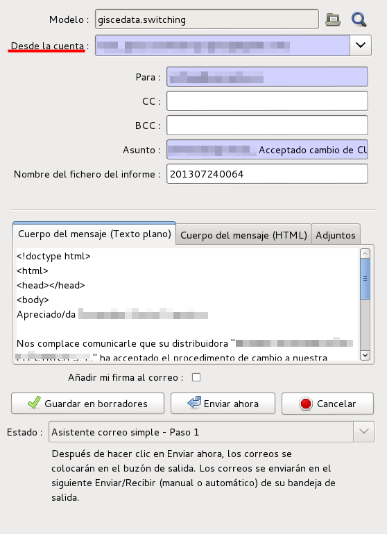

## Activació del procés de canvi de comercialitzadora

Quan la comercialitzadora rep un XML d'activació de canvi de comercialitzadora
(C1-05, C2-05 o C2-07) es pot notificar al client que el procés de canvi s'ha
acabat i que per tan ja és client de la nova comercialitzadora. Per fer-ho
podem anar a l'acció **Switching: Notifiació activacio Polissa (Canvi
Comercialitzador)** i omplir el compte de correu des del qual es vol enviar el
correu a la fitxa PowerEmail.

##### Formulari notificació activació canvi de comercialitzadora
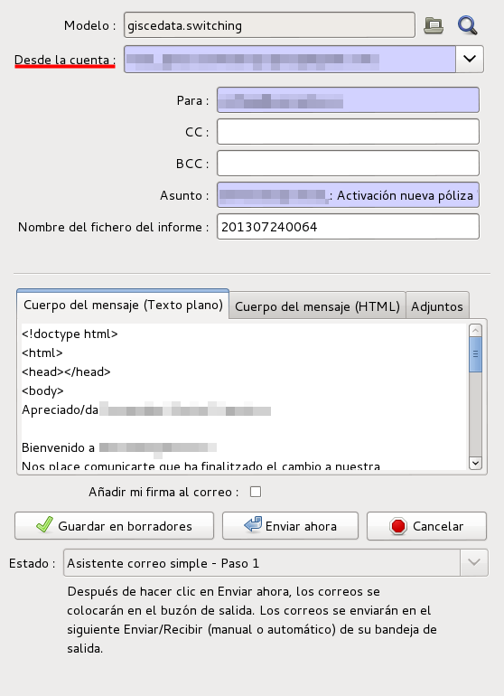

# Automatització

La gestió ATR, a més d'intercanviar informació entre diferents agents, implica
modificacions el l'estat de les pólisses, els clients , etc... en els diferents
agents. Les modificacions a realitzar normalment són sempre les mateixes. Per
facilitar el processat i l'activació d'aquests canvis s'han desenvolupat un
seguit de procediments automàtics per facilitar aquestes tasques i poder-les
automatitzar.

Aquesta automatització consisteix bàsicament en dos processos diferenciats:

1. **Activació de canvis**: L'arribada d'un pas de gestió ATR implica un seguit
   d'accions als diferents elements de l'ERP, p.e. pòlisses. Aquests procediments
   s'agrupen en el botò `Activar contracte o canvi` present a qualsevol procés ATR

2. **Creació de Processos ATR**: La petició d'una modificació o l'enviament
   d'informació a un altre agent implica la generació d'un procés ATR o un nou
   pas en un procés existent. Des d'una pòlissa es poden crear des del botó
   `Generar cas Gestió ATR` ( [wizard genenrar cas ATR](#wizard-generar-cas-atr))

# Activació automàtica de pas (Activar contracte o canvis)

La informació d'un pas de gestió ATR ens permet en alguns casos aplicar els
canvis al l'ERP sense la necessitat de fer els passos mecànics manualment.
S'utilitza l'assistent que apareix en prèmer el Botò d'acció
**Activar contracte o canvi**.

No tots els passos es poden activar automàticament. En el quadre adjunt es
mostren els que es troben desenvolupats en aquests moments. En alguns casos no
accepta tots els possibles valors del pas, p.e per M1 amb canvi de titular.

   Activació d'un cas ATR

En la taula següent es pot veure quan es poden activar els canvis associats
a un cas de gestió ATR

+---------+----------------+------------------------------------+-------------------+
| Procés  | Distribuidora  | Comercialitzadora                  | Observacions      |
+=========+================+========+========+========+=========+===================+
| **Pas** | **01**         | **01** | **05** | **06** | **07**  |                   |
+---------+----------------+--------+--------+--------+---------+-------------------+
| **A3**  | `ad`_          |        | `ac`_  |        |         |                   |
+---------+----------------+--------+--------+--------+---------+-------------------+
| **B1**  |                |        | `bc`_  |        |         |                   |
+---------+----------------+--------+--------+--------+---------+-------------------+
| **C1**  |                |        | `ac`_  |        |         |                   |
+---------+----------------+--------+--------+--------+---------+-------------------+
| **C2**  |                |        | `ac`_  | `bc`_  | `ac`_   |                   |
+---------+----------------+--------+--------+--------+---------+-------------------+
| **D1**  |                | `dc`_  |        |        |         |                   |
+---------+----------------+--------+--------+--------+---------+-------------------+
| **M1**  |                |        |        |        | `mc`_   | No canvi titular  |
+---------+----------------+--------+--------+--------+---------+-------------------+
| **W1**  |                |        |        |        |         |                   |
+---------+----------------+--------+--------+--------+---------+-------------------+

### (ac) Activació de contracte (A3,C1,C2) a Comercialitzadora

!!! TODO
    Explicació

### (bc) Baixa de contracte (B1,C1,C2) a Comercialitzadora

!!! TODO
    Explicació

### (dc) Activació (D1) a Comercialitzadora

!!! TODO
    Explicació

### (mc) Modificació de contracte (M1) a Comercialitzadora

!!! TODO
    Explicació

### Nou contracte (A3) a Distribuidora

!!! TODO
    Explicació

# Creació de Procés automàtic des de pòlissa (Generar cas Gestió ATR)

La creació d'un cas des d'una pòlissa permet generar automàticament el cas amb
el pas normalment **01** des d'una pòlissa agafant la informació que ja conté.

* En alguns casos i **només quan es selecciona només una pólissa** ens apareix
  un formulari que ens permet afegir informació addicional al procés
* La polissa ha d'estar en esborrany o activa en funció del procés.

S'utilitza l'assistent que apareix en prèmer el Botò d'acció
**Generar cas Gestió ATR** ([wizard genenrar cas ATR](#wizard-generar-cas-atr)) que ens permetrà escollir
quin procés volem crear. En funció de l'estat de la pólissa ens permetrà
escollir uns processos i altres no.

###### Wizard Generar Cas ATR
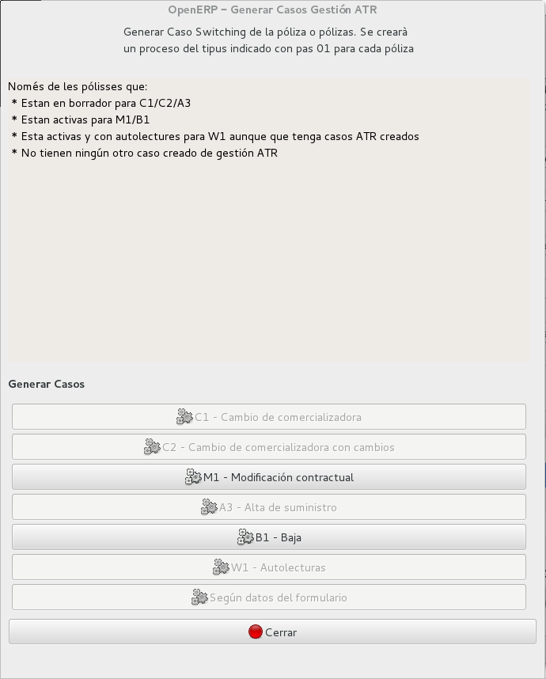

   Asistent generació Casos a partir de pólisses

| Procés | Orígen | Estat Pòlissa | Addicional | Observacions                                               |
|:------:|--------|---------------|------------|------------------------------------------------------------|
| **A3** | comer  | Esborrany     | No         |                                                            |
| **B1** | comer  | Activa        | Si         | Es demana motiu de baixa                                   |
| **C1** | comer  | Esborrany     | No         |                                                            |
| **C2** | comer  | Esborrany     | No         |                                                            |
| **D1** | distri | Activa        | No         |                                                            |
| **M1** | comer  | Activa        | Si         | Es demana tipus de canvi i dades necessàries               |
| **W1** | comer  | Activa        | No         | Només si el comptador té alguna lectura d'aquest tipus     |

Un cop executat retorna un llistat amb una descripció del resultat de cada
pólissa.

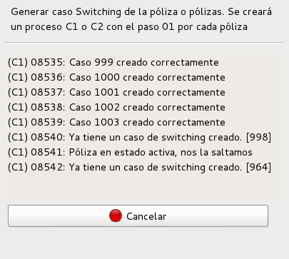

   Resultat creació passos

!!! note
    Si el CUPS de la pólissa només té 20 caracters, afegeix el sufix ``1P`` en
    el cas que la distribuidora sigui **Unión Fenosa** o ``0F`` en els altres
    casos.

### Creació Cas A3/C1/C2

Un cas habitual és la entrada automatitzada de peticions de canvi de
comercialitzadora, per exemple via web. També es pot donar el cas que
l'encarregat de la gestió ATR no sigui el mateix que crea els contractes.

Mitjançant l'assistent [wizard genenrar cas ATR](#wizard-generar-cas-atr) es pot crear un cas de canvi
de comercialitzadora o alta a partir d'una o vàries pólisses en esborrany.
El seu funcionament és el següent:

* Es generarà un cas per cada pólissa que compleixi el següent:

  * La pólissa està en esborrany
  * No hi ha cap cas de switching **obert** per aquesta pólissa

* Genera només casos Oberts **C1**, **C2** i **A3** i el pas **01** agafant les
  dades de la pólissa. En alguns casos es pot escullir automàticament el cas
  (veure [generacio de casos segons dades del formulari](#segons-dades-formulari-generacio-casos-c1-c2-i-a3) )
* Valida el format del **CUPS** afegint el sufix ``0F`` o ``1P`` depenent de
  l'empresa distribuidora (veure nota )
* Marca el camp ``Per validar`` del cas en funció de si es poden separar
  correctament els noms i els cognoms automàticament (veure
  [validació nom titular](atr.md#validacio-nom-titular) ) o no. Si no es pot, es marca per validar.
* El **codi REE** del destinatari es calcula a partir del CUPS. Algunes
  distribuidores que han estat absorbides no mantenen el codi de la
  distribuidora original en el CUPS però el **codi REE** del destinari de les
  peticions si que ha de ser diferent. Podem veure'n la traducció que es
  realitza a [apèndix B](atr.md#apendix-b-traduccio-de-codi-ree)

### Creació Cas B1 (Baixa)

!!! TODO
    Explicació pas addicional (tipus canvi)

### Creació Cas D1 (Notificació canvi a TG)

!!! TODO
    Explicació

### Creació Cas M1 (Canvis contracte)

!!! TODO
    Explicació pas addicional (tipus canvi i dades)

### Creació Cas W1 (Autolectures)

!!! TODO
    Explicació

### Validació nom titular

Els casos de Gestió ATR necessiten els noms i cognoms separats. L'ERP
emmagatzema aquesta informació en un sol camp i per tant s'hauran de
separar automàticament o a mà. L'algoritme de separacio automàtica de
noms i cognoms funciona de la següent forma:

* La dreta de la coma és el **nom**
* La paraula abans del primer espai ,el primer cognom i la resta el
  segon cognom

Es marcarà com a per validar si:

* El 2on cognom conté + d'una paraula

Si el client és una empresa, només es comprova el nom i que sigui de menys
de 50 caracters

### Segons dades Formulari: Generació casos C1, C2 i A3

Per automatitzar la creació de C1 , C2 i A3 quan una pòlissa en esborrany es
genera des d'un sistema extern, p.e. Web, es poden utilitzar les observacions
de la pòlissa. Aquest funcionament es pot utilitzar mitjançant el botó
`Segons dades formulari` de l'assitent ([wizard genenrar cas ATR](#wizard-generar-cas-atr)) En funció del que
conté s'actúa de la següent forma:

| Contingut            | Acció                                                          |
|----------------------|----------------------------------------------------------------|
| ``canvi_titular: 1`` | **C2 de canvi de titular** amb tipus  de canvi **Subrogació**  |
| ``proces: C1``       | **C1**                                                         |
| ``proces: C2``       | Un **C2** de la mateixa forma que el cas ``canvi_titular: 1``  |
| ``proces: A3``       | **A3**                                                         |

# Altres automatitzacions

També s'ha automatitzat la creació d'alguns processos i passos a partir
d'altres procediments

### B1 i devolucions

S'ha integrat la generació de casos i processo B1 amb les devolucions i els
talls.

# Apendix A: Exemple de procés C1

# Apendix B: Traducció de codi REE

El càlcul del codi REE de la distribuidora té algunes particularitats en el cas
que el CUPS pertanyi a les distribuidores **ENDESA** (0031) o **FENOSA** (0390)

S'utilitza la part del CUPS que correspon al codi de la distribuidora i algún
caràcter més.

Aquestes distribuidores demanen que els casos generats portin en el codi REE de
destinatari el de la distribuidora original.

!!! warning
    És molt important que les distribuidores estiguin creades i tinguin com a
    **Empresa principal** la empresa segons el CUPS. Si no és així, no es
    validaran correctament els XML's de resposta

   Empresa principal per distribuidores absorbides

L'algoritme que es segueix és el següent i en aquest ordre:

# ENDESA 0031

* Si el CUPS comença per **00314** s'utilitza la **província** a la que pertany per
  escollir la distribuidora

  * Osca, Terol, Saragossa:  **0029** (``FECSA Aragó``)
  * Altres:

    * **0396** (``Hidroelèctrica de l'Empordà``) si comença per **003144**
    * **0024** (``FECSA Catalunya``) tots els altres

* Si el CUPS comença per **003130**: **0029** (``FECSA Aragó``)
* La resta, es fa seguint aquesta taula:

| CUPS  | Distribuidora                        |
|:-----:|:-------------------------------------|
| 00311 | 0023 (Cia sevillana)                 |
| 00313 | 0120 (Aragonesa Act.)                |
| 00315 | 0288 (Balears Gas y E.)              |
| 00316 | 0363 (Unión Eléctrica Canarias SUP)  |

# FENOSA 0039

* Si el CUPS comença per **03900**: **0022** (``Jallas``)

# Documentació específica

[Gestió ATR Comercialitzadores](../comer/atr.md)

