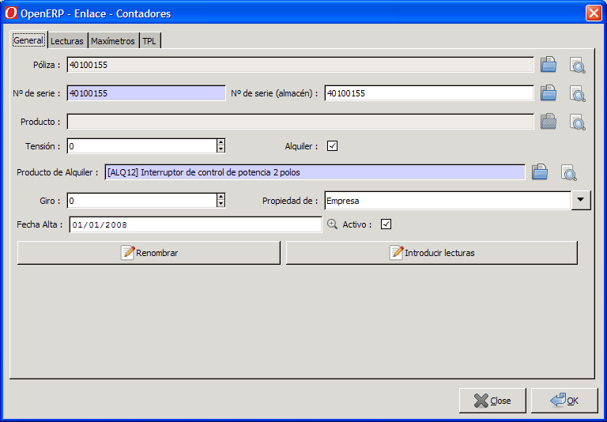

# Gestió de comptadors

## Llistat de comptadors

A la fitxa de un comptador s'hi pot accedir per dos llocs diferents:

* **Menú / infraestructura / comptadors**
* **Pólissa**, pestanya ``comptadors`` on apareix el llistat de tots els comptadors
  actius i no actius que ha tingut aquesta pólissa

   Pestanya General Fitxa Comptadors

## Formulari de comptadors

* **Nº de serie**: És el número que identifica el comptador i al que
  s'associen les lectures, és el que veu el lector quan va a camp
* **Nº de serie (magatzem)**: Es pot associar un número de sèrie de un producte
  del magatzem. Aquest número de serie anirà associat a un producte. Per més
  informació, mireu el mòdul de productes i magatzem
* **Producte**: Aquest camp de només lectura mostra el producte al qual està
  associat el ``Nº de sèrie (magatzem)``, en el cas que existeixi. Si no, es
  mostra en blanc.
* **Tensió**: Valor numèric que indica la tensio de l'equip de mesura.
* **Lloguer**: Quan s'activa aquesta casella, indiquem que al comptador se li
  ha de cobrar lloguer, ja sigui d'ICP, comptador, ambdos, etc. Si està
  activada aquesta casella apareix a sota el camp ``Producte de lloguer``, si
  no, no
* **Producte de lloguer**: En aquest camp se li indica el producte de lloguer
  que se li cobrarà mensualment. (Veure el mòdul de productes). Es poden fer
  escandalls amb varis productes (comptador+ICP), etc .
* **Gir**: Aquest camp indica el valor màxim al qual arriba el comptador i
  torna a reiniciar-se a 0.
* **Propietat de**: En aquest quadre de selecció s'ha d'escollir si el
  comptador es de la empresa distribuïdora o del client
* **Data alta**: S'ha d'indicar la data de alta del comptador (Veure `Nota 1`_)
* **Actiu**: Aquest camp indica si el comptador està actiu a la pólissa a la
  qual està associada. Quant es desitja donar de baixa un comptador, es
  desmarca aquesta casella i apareix a sota el camp ``Data de baixa``
* **Data de baixa**: En aquest camp s'indicarà a quina data es dona de baixa el
  comptador en aquesta pólissa. Hi haurà d'haver una lectura a la data de baixa
  del comptador
* **Reanomenar**: Aquest botó permet canviar el ``Nº de sèrie`` del comptador
  en el cas que s'hagi produit un error al crear-lo. Les lectures també
  quedaran associades al nou número de sèrie del comptador
* **Introduïr lectures**: Aquest botó permet entrar les lectures de forma
  manual des de la fitxa del comptador

!!! note
    La **data de primera lectura** ha de conincidir amb la data de alta del
    comptador
