# Integració i funcionament del sistema de Correos a l'ERP

## Descripció general del funcionamient del sistema de remeses

## Composició d'una remesa

## Crear una remesa
Desde **Menú&rarr;Correos&rarr;Remeses de correos** s'accedeix al menú de
remeses.

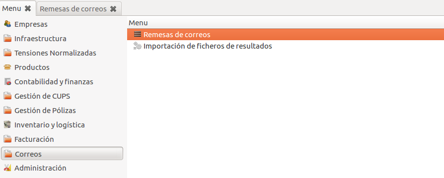

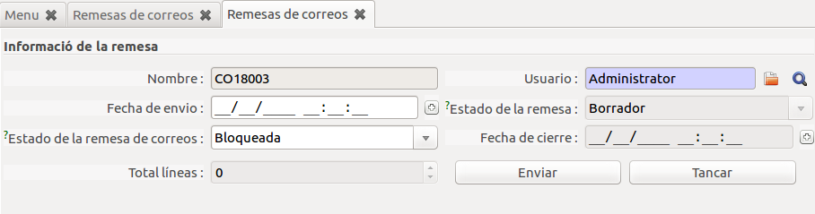

### Camps d'una remesa

- ***Nom***: Codi identificatiu de la remesa.
- ***Usuari***: Usuari que ha creat la remesa.
- ***Data d'enviament***: Data en la que s'ha enviat la remesa per ser processada.
- ***Estat de la remesa***: Estat actual de la remesa dins l'ERP (esborrany, enviament, tancada)
- ***Estat de la remesa de correus***: Estat de la remesa segons correus (bloquejada, oberta, tancada), aquest estat s'anira actualitzant segons l'estat relatiu a Correos.
- ***Data de tancament***: Data en la que s'ha tancat la remesa.
- ***Total línies***: Número de línies que componen la remesa.

## Afegir factures a una remesa
Per afegir factures a una remesa es pot fer desde el botó d'accions del llistat
de factures (***Facturacio&rarr;Factures...***) o desde el menú de comptabilitat (***Comptabilitat i finances&rarr;Factures...***)

**Pas 1: (Accions&rarr;Afegir a remesa de correus)**

Per afegir les factures a una remesa concreta s'han de seleccionar les que es vulguin afegir i desde el menú d'accions seleccionar l'assistent.

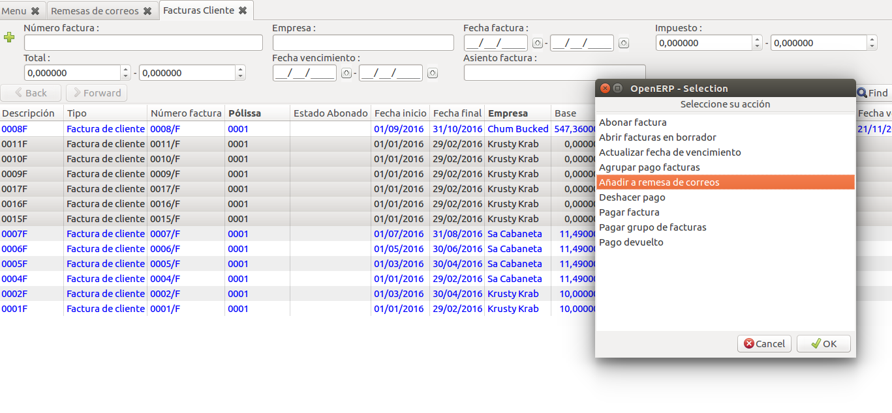

**Pas 2: Selecció de la remesa**

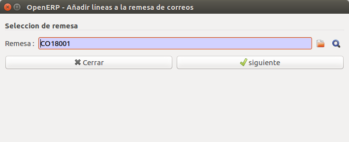

**Pas 3: Informació relativa a les factures que s'afegiran**
Si s'esta d'acord en afegir les factures a la remesa s'ha de clicar el boto
***Crear Línies***

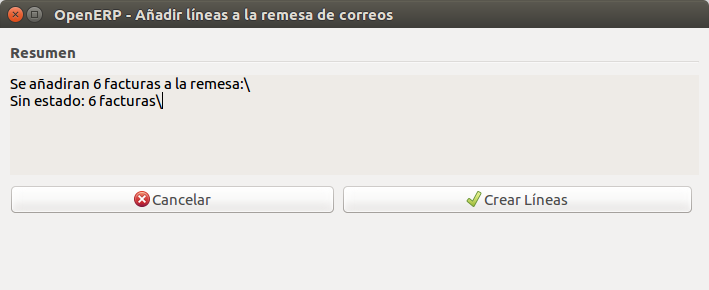

**Pas 4: Informació resultant de la importació**

En aquest pas es mostra la informació relativa al resultat de la importació a la remesa, si alguna cosa no ha anat correctament indicarà per a quines factures ha fallat.

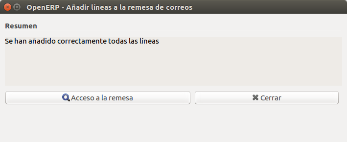

## Línies importades
Un cop importades les factures s'hauran generat un seguit de línies a la remesa
corresponents a les factures.

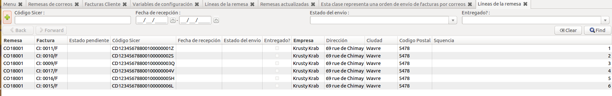

### Camps d'una línia
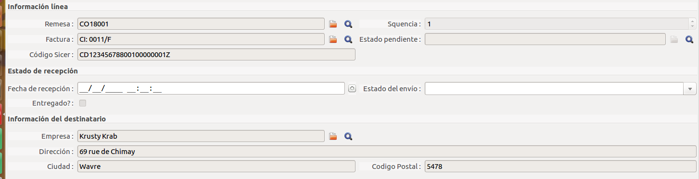

**Informació de la línia**
(Informació relativa a la línia i control de seguiment)
- ***Remesa***: Codi identificatiu de la remesa.
- ***Seqüencia***: Número de la línia (requerit per la generació del codi SICER).
- ***Factura***: Número de la factura d'origen de la línia .
- ***Estat pendent***: Estat pendent de la factura original (
  referent al bono social).
- ***Codi SICER***: Codi únic identificatiu per el seguiment.

**Estat de recepció**
(Informació relativa a l'estat de recepció de la carta)
- ***Data de recepció***: Data d'entrega al client.
- ***Estats de l'enviament***: Detall de l'enviament.
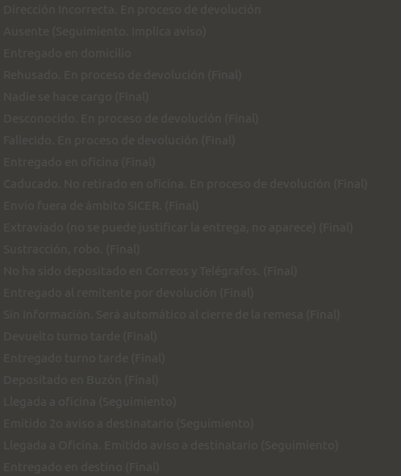

- ***Enregat?***: Aquest camp esterà marcat si s'ha pogut entregar correctament
la carta al client.

**Informació del destinatari**
(Informació relativa al client)
- ***Empresa***: Empresa/client destí
- ***Direcció***: Direcció de destí.
- ***Ciutat***: Ciutat del destinetari.
- ***Codi postal***: Codi postal de la ciutat del destinetari

## Assistent per a la importació de fitxers de resultats
Aquest assisten ens permét importar els fitxers resultats dels enviaments de les remeses emesos per **Correos**

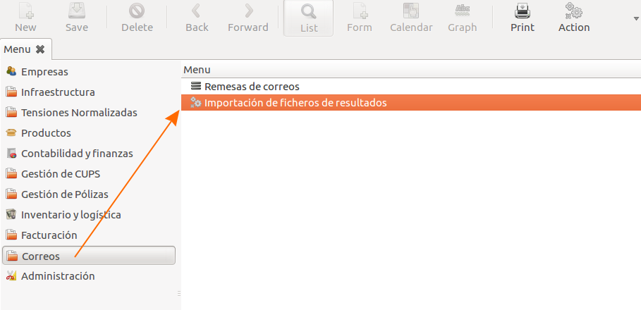

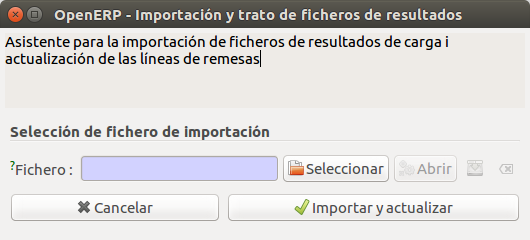
