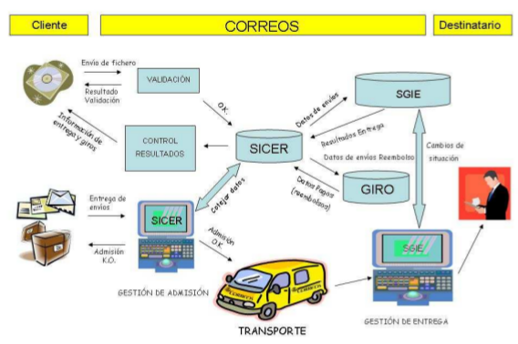

# Documentació del mòdul de Correos (Espanya)
[//]: <> ()

## Introducció
El mòdul de correos permet a GISCE-ERP la gestió de l'enviament de remeses (**conjunt de factures**) i intercanvi de fitxers entre els clients i Correos a través dels seus formats i codis **SICER**.
Aquests fitxers venen definits per **CORREOS ESPAÑA**.

## Conceptes i funcionament

### SICER

**SICER** (**S**istema d'**I**nformació i **C**ontrol dels **E**nviaments **R**egistrats)

  

#### Pas 1 (Client&rarr;Correos)

**CLIENT > SICER > GESTIÓ DE L'ENTREGA > GESTIÓ DELS ENVIAMENTS AMB
REEMBORSAMENT**

***SICER*** posa a la disposició d'altres sistemes de **Correos** la informació
la informació relativa als seus enviaments que proporcionen els seus clients.

Aquesta informació dona suport als diferents processos operatius de distribució
i entrega, així com la gestió de reemborsaments.

#### Pas 2 (Correos&rarr;Client)

**RESULTATS DE L'ENTREGA > PAGAMENTS REALITZATS (REEMBORSAMENT) > SICER > CLIENT**

En el sentit contrari, ***SICER*** recull els resultats de l'entrega i els pagaments realitzats d'enviaments amb la modelitat de reemborsament, remetent periòdicament aquesta informació al client.

### Remesa

Una remesa identifica la agrupació d'enviaments que diposita un client de forma conjunta per a la seva distribució.

El client determina el número d'enviaments que formen una remesa. Amb aquests
enviaments, agrupats en una o varies remeses, generara un fitxer segons l'estructura especificada a la secció ($$$$$TODO$$$$)

Una remesa s'inicia en el moment que es rep el fitxer de dades ($$$$$TODO$$$$) abans del diposit fisic dels enviaments i es tenca quan es determina que ha finalitzat el proces de distribució i es te constancia dels events d'entrega d'aquests.

Durant tot el proces descrit una remesa passa per els següents estats:

- **Bloquejada**: Informació rebuda i carregada en el sistema **SICER** a la espera de que es faci el dipósit fisic dels enviaments.


- **Oberta**: Periode d'actualitzacións dels enviaments que conformen la remesa.


- **Tancada**: Fi del periode d'actualitzacions del enviaments de les remeses.

Durant el process de remesar la remesa també pasa per els seguents estats a l'ERP:

- **Esborrany**: Estat inicial de la remesa.

- **Enviament**: Indica que la remesa es troba en estat d'enviament.

- **Finalitzada**: Indica que l'enviament de la remesa ha finalitzat.

- **Tancada**: Dona la remesa per finalitzada.

**Possibles canvis d'estat (Workflow):**

|                 | Esborrany | Enviament | Finalitzada | Tancada |
|-----------------|:---------:|:---------:|:-----------:|:-------:|
| **Esborrany**   |           |     x     |             |    x    |
| **Enviament**   |           |           |      x      |    x    |
| **Finalitzada** |           |           |      x      |         |
| **Tancada**     |           |           |             |         ||
