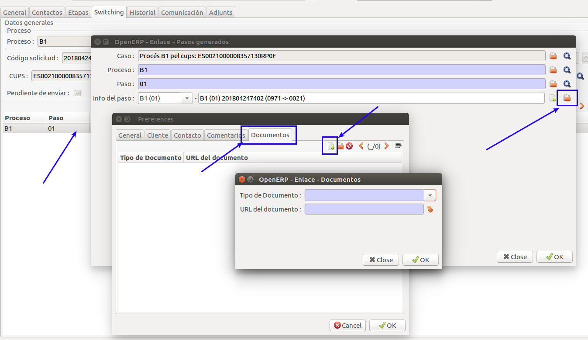

# Funcionament General

La funció actual del mòdul de switching és la gestió i enviament dels fitxers
XML dels processos de switching. Per fer aquest seguiment s'emmagatzema tota la
informació d'un procés de switching en un cas del CRM de GISCE-ERP.

Un procés de switching, s'associarà a un cas on es podrá anar generant els
passos necessaris del procés i els fitxers XML associats.

És responsabilitat de l'usuari saber en cada moment quin és el pas següent i
les accions que s'han de realitzar per portar-lo a terme.

## Menú Switching

A GISCE-ERP hi ha definit el Menú **Switching** que dóna accés als casos
implicats en processos de switching i a la importació de fitxers XML.

##### Opcions del menú Switching

* **Tots els casos**: Llistat de qualsevol dels casos de la secció Switching.
  Inclou una estructura d'arbre amb una entrada de menú per accedir directament
  als casos de cada procés i als passos més interessant de cada un.
* **Llistat de passos**: Els llistats de passos permeten accedir ràpidament als
  passos actuals d'un procés concret. Un cop obert un pas, es pot accedir
  directament al cas amb l'assistent **Processar Pas Gestió ATR** accessible
  des del botó acció d'un llistat de passos i des de la fitxa d'un cas en
  concret.
* **Casos pendents d'enviar**: Llistat de tots els casos que estan a l'espera
  d'enviar l'XML al destinatari i que ja no necessiten cap mes actuació per part
  nostre. Es llistaran els casos que tenen algún pas amb la marca
  ``Per enviar``
* **Casos pendents de l'usuari**: Llistat de tots els casos oberts on calgui
  actuació per part nostre per poder generar el següent pas (inactiu).
* **Importar XML**: Permet carregar un fitxer XML o un fitxer ZIP amb múltiples
  fitxers XML i generar el cas o afegir el pas al cas que correspongui.

##### Assitent per accedir al cas des d'un pas

## Formulari del Cas

Quan entrem en un cas, tenim la informació principal i diferents pestanyes:

### Informació principal

* **Descripció**: Aquest text sortirà al llistat de Casos i ens ha de permetre
  trobar el cas
* **Secció**: Secció del cas en l'arbre de seccions del CRM de GISCE-ERP.
  Normalment Switching
* **Data Límit**: Es calcula automàticament segons la data d'inici i la durada
* **Companyia**: S'omple automàticament amb la nostra companyia
* **Data**: Data en la que s'inicia el cas. És important pel càlcul dels
  terminis
* **Prioritat**: Prioritat del cas dins el CRM. S'assigna la prioritat
  ``Normal``

### Pestanya General (CRM)

Aquesta pestanya és la genèrica de qualsevol cas del CRM de GISCE-ERP. Podem
afegir comentaris, enviar mails al destinatari, etc...

Mitjançant els botons, podem gestionar els diferents estats del cas:

* **Esborrany**: Encara no ha començat el procés però te algunes de les dades
  preparades per a ser utilitzades.
* **Obert**: Aquest cas està en procés. Conté els passos que s'han generat fins
  el moment.
* **Tancat**: Aquest cas ja ha acabat el seu procés fins a l'últim pas.
* **Cancel·lat**: Un cas que s'ha obert, però no s'ha arribat a enviar cap
  missatge, es pot passar a cancel·lat si vols mantenir-lo a històric.

!!! Warning "Atenció"
    Un cas que ja ha tingut missatgeria amb un altre agent, **no** pot passar a
    estat ``cancel·lat``. S'ha de generar un pas d'anul·lació o rebuig.

!!! Info "Nota"
    Existeix un estat **Pendent** en el CRM. Pel que fa a canvis d'ATR, no és un
    estat que tingui gaire sentit.

### Pestanya Contactes

En aquesta pestanya tenim les dades dels agents implicats en un procés.
Depenent de l'agent i del procés es mostraran mes o menys camps.

#### Destinatari

Empresa amb la qual es mantindrà la comunicació. En el cas de les
comercialitzadores és la distribuidora del CUPS afectat pel procés i en el cas
de les distribuïdores serà la comercialitzadora iniciadora del procés o
sol·licitant

* **Empresa**: Empresa destinatària
* **Contacte Empresa**: Informació de contacte de l'empresa destinatària
* **Email Empresa**: Adreça de mail que s'utilitzarà en les comunicacions amb
  el destinatari

Amb el botó **Send Reminder** podem enviar un mail al destinatari per
validar-ne el funcionament

#### Comercialitzadora Sortint

En alguns casos, és necessari intercanviar informació amb altres Agents com la
comercialitzadora sortint. En el cas de la distribuidora, caldrà seleccionar la
empresa comercialitzadora de la pólissa subjecte del procés.

### Pestanya Etapes

Aquesta pestanya és merament informativa i ens dóna informació de quin o quins
 serien els possibles següents passos en el procés.

### Pestanya Switching

Aquesta pestanya ens permet gestionar la informació del procés i els diferents
passos que es van generant.

#### Dades generals

* **Procés**: (Obligatori) Procés afectat per aquest cas, pe. C1, C2 o M1
* **Pas**: Pas en el qual es troba el procés des del nostre punt de vista.
  S'omple autoàticament
* **Versió**: Versió dels fitxers OCSUM del procés
* **Acció pendent**: S'hi hi ha accions pendents a realitzar per aquest pas
* **Codi sol·licitud**: Codi assignat a tot el procés. Es genera automàticament
* **Seqüencial de sol·licitud**: Codi de seqüència. Es genera automàticament
* **CUPS**: (Obligatori) CUPS afectat pel procés. S'assigna automàticament al
  seleccionar la pólissa. Cal que existeixi a la base de dades de CUPS
* **Polissa**: (Obligatori) Pólissa afectada pel procés. S'assigna
  automàticament al seleccionar el CUPS. Cal que la pólissa existeixi encara
  que estigui en esborrany
* **Ref. Contracte**: (Obligatori) Referència del contracte de la
  **distribuidora**  al que afecta aquest cas. S'omple automàticament al
  seleccionar la pólissa/CUPS. Si som una comercialitzadora, cal que estigui
  omplert el camp ``Referència Distribuïdora`` de la pólissa. Si no es sap,
  s'ha de posar el valor *999999*. Si som una distribuïdora, serà el mateix
  valor que el camp ``Pólissa``.

#### Detall de passos

Llistat amb tots els passos que s'han generat. Es poden crear, esborrar i
obrir. Per generar qualsevol pas, el cas ha d'estar obert.

Quan obres o crees un Pas, accedeixes al formulari del Pas.

##### Formulari de nou pas

* **Cas**: S'omple automàticament amb les dades la descripció del Procés
* **Procés**: Procés al que està associat el Pas. S'omple automàticament amb el
  del Procés
* **Pas**: Número de Pas.
* **Informació del Pas**: Escollim la informació que associarem al Pas.
  Haurà de ser la del mateix procés/pas que hem escollit anteriorment.
  Amb la icona de la carpeta, podrem accedir al formulari de la informació
  del Pas que serà diferent en funció del Procés i Pas seleccionat en el
  desplegable.
  Totes les dades del pas es generaran automàticament segons les dades de
  CUPS i pólissa introduïts anteriorment.

!!! Tip "Consell"
    Amb el botó **Acceptar** creem el pas, però no es tanca el formulari. Fins
    que no es guardi el cas, aquest pas no estarà emmagatzemat. Caldrà tancar el
    formulari amb el botó **Tancar** i guardar el Cas

!!! Tip "Consell"
    Per crear un pas d'una manera més fàcil i ràpida es pot utilitzar
    l'[Assistent de Creació de Passos ATR](#assistent-de-creacio-de-passos-atr).

##### Pestanya Documents

Si es disposa d'una URL amb documentació a adjuntar a un cas es
pot afegir al pas actual accedint a l'informació del cas
(_doble click sobre el pas > click sobre la carpeta de l'informació del pas_).
Allà trobarem la pestanya Documents.

En aquesta pestanya podem trobar un llistat amb els diferents documents
relacionats amb el pas.

Els documents relacionats amb un cas tenen dos camps:

- Tipus de document (Segons `TABLA 61` de la CNMC)
- URL del document (camp de text amb la URL per accedir al document)

Si el XML importat disposa de documents, ens mostrarà els documents aquí
amb aquestes dades.

Si volem afegir-hi documentació, senzillament fem click sobre "Nou" i
es complimenten els camps que ens mostra OpenERP.

##### Exemple de dades d'un pas. (C1) 01

Cada parell Procés/Pas té el seu formulari de dades específic en funció de les
dades que s'han d'omplir en el XML corresponent.

##### Exemple de dades d'un pas. (M1) 01

No obstant això, hi ha algunes característiques comunes en tots els passos de
qualsevol procés.

* **Per enviar**: Significa que encara no s'ha enviat el XML del pas al
  destinatari.Quan es crea un pas, es marca per enviar si l'emissor del pas és
  la nostra empresa. Es modifica automàticament quan s'envia l'XML per mail
  mitjançant l'assitent [enviar xml](#formulari-power-email-dun-fitxer-xml-enviar-des-del-cas-corresponent)
  o quan s'exporta el fitxer ZIP i es marca la casella corresponent a
  l'assistent [exportar xml](#formulari-per-exportar-un-fitxer-xml). Els pasos
  que estan per enviar i els casos que tenen algun dels seus passos per enviar,
  es llisten de color **blau**.

* **Per validar**: En alguns passos generats automàticament cal validar que les
  dades són correctes. En aquests casos, quan es detecta que hi ha alguna
  incongruència que necessita la intervenció d'un operador, marca el pas per
  validar. Mitjançant aquest camp es pot desmarcar un cop arreglades les dades.
  Es pot veure en detall a l'apartat [automatització](#automatitzacio). Els passos que estan
  pendents de validar, es llisten de color **vermell**.

### Pestanya History

Llistat amb totes les accions que s'han realitzat, com Obrir, Tancar,
Historitzar, etc...

### Pestanya Communication

Llistat amb tots els mails enviats des del cas mitjançant el botó **Enviar XML**

Seleccionant una de les línies del llistat, pots accedir a les dades del
missatge enviat com destinatari, compte utilitzat, text, adjunts, etc... Fins i
tot, es pot tornar a enviar el correu mitjançant el botó **Enviar Correu**

##### Formulari Power Email d'un fitxer XML enviar des del cas corresponent

