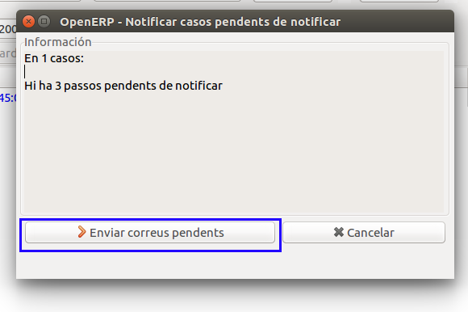

# Notificacions a client Final

Durant un procés de switching es dónen diverses situacions on és recomanable
una notificació al client final per part de la Comercialitzadora entrant.
GISCE-ERP permet estandaritzar aquestes notificacions mitjançant plantilles
**PowerEmail** per facilitar aquestes notificacions via email i incloure-les
dins el propi cas.

S'han definit tres notificacions:

 * [Acceptació del procés](#acceptacio-de-proces).
 * [Activació del procés](#activacio-del-proces-de-canvi-de-comercialitzadora).
 * [Notificació de cas ATR](#notificacions-a-clients-de-casos-atr)

## Acceptació de procés

Quan la comercialitzadora entrant rep un XML d'acceptació (C1-02, C2-02 o
M1-02) es pot notificar al client que ja s'ha acceptat la seva petició de canvi
o modificació de dades i properament serà activada. Per fer-ho podem anar a
l'acció **Switching: Notificació acceptació procés Mail Form** i omplir el
compte de correu des del qual es vol enviar el correu a la fitxa PowerEmail.

##### Formulari notificació acceptació canvi

## Activació del procés de canvi de comercialitzadora

Quan la comercialitzadora rep un XML d'activació de canvi de comercialitzadora
(C1-05, C2-05 o C2-07) es pot notificar al client que el procés de canvi s'ha
acabat i que per tant ja és client de la nova comercialitzadora. Per fer-ho
podem anar a l'acció **Switching: Notifiació activacio Polissa (Canvi
Comercialitzador)** i omplir el compte de correu des del qual es vol enviar el
correu a la fitxa PowerEmail.

##### Formulari notificació activació canvi de comercialitzadora

## Notificacions a clients de casos ATR

Hem desenvolupat un sistema que permet notificar als clients dels casos ATR
de forma massiva.

Aquest sistema es basa en [plantilles PowerEmail](../poweremail.md#gestio-de-plantilles-poweremail)
i un assistent per enviar les notificacions als casos corresponents.

Per defecte s'utilitzen la variable `sw_mail_user_notification_on_activation` per
saber si els nous passos creats s'han de notificar.

Els passos per notificar es poden notificar manualment, o bé
amb [l'assistent per notificar casos ATR](#assistent-per-notificar-casos-atr)

!!! Warning "Atenció"
    Els casos "pendents de notificar" només es marcaran com a notificats si
    s'utilitza l'assistent o si s'utilitza la funció "notifica_a_client".
    Aquesta funció es crida quan s'utilitza el botó "aplicar canvis".

### Configuració

Per a que funcioni correctament l'assistent, cal configurar les següents
variables de configuració en "**Menú OpenERP > Administració > Configuració >
Propietats**":

* `sw_mail_user_notification_on_activation`:
    Adreça del compte des del que enviar els correus amb l'assistent.
    Cal tenir un compte PowerEmail actiu amb aquest valor.

* `sw_email_address_user_notification`:
    Passos ATR a notificar al activar-se.
    Es poden marcar tots o bé alguns amb un format de llista.

|               Nom de la Variable        |           Exemple              |
|:---------------------------------------:|:------------------------------:|
| sw_mail_user_notification_on_activation |  `all` // `['A3-01', 'A3-02']` |
| sw_email_address_user_notification      |  `atr@company.com`             |

### Plantilles PowerEmail

Aquestes notificacions utilitzen plantilles PowerEmail inicialitzades en el
mòdul de Gestió ATR. Aquestes plantilles són bastant simples però es poden
editar a través del mòdul de PowerEmail.

Es poden trobar filtrant amb el nom de plantilla "_ATR {nom_del_cas}{nom_del_pas}:_".
Per exemple: `ATR A301:`.

S'ha de tenir en compte que el `object` que s'utilitza és el cas ATR.

!!! Warning "Atenció"
    Canviar el nom d'aquestes plantilles no afectarà al funcionament de les
    notificacions, tot i que no recomanem canviar-lo.

!!! Note "Nota"
    En el cas dels rebuigs, les plantilles per defecte contenen el text:
    `${notificacio_text}`, aquest es substituïrà per el text configurat en el
    menú de Notificacions ATR.

#### Plantilles de Rebuig

Per tal de processar correctament tots els rebuigs de forma diferent, s'ha
afegit el menú de Notificacions de Rebuig: **"_Menú OpenERP > Gestió ATR >
Configuració > Notificacions rebuigs ATR_"**.

En aquest menú es pot configurar un text personalitzat per cada rebuig o
grup de rebuigs.

Els camps d'aquests registres són molt senzills:

- Procés ATR al que està relacionat
- Pas del Procés al que està relacionat
- Si aquesta notificació està activa
- Text adicional de la notificació
- Rebuigs pels quals respon aquesta notificació

Per afegir rebuigs relacionats amb aquesta notificació, senzillament premem el
botó `Afegir` i sel·leccionem els rebuigs que ens interessa.

Si volem deixar d'utilitzar una d'aquestes notificacions, senzillament desmarquem
la casella `Notificació Activa`. Per tornar-la a utilitzar cal que estigui marcada.

El text de la plantilla correspon al format [MAKO](http://www.makotemplates.org/),
es a dir, Python + HTML. Adicionalment, es disposa dels següents objectes Python
per a facilitar la informació a la plantilla:

- `cas`: Cas ATR solicitat per notificar
- `pas`: Pas del cas ATR solicitat per notificar

!!! Hint "Consell"
    Es poden utilitzar funcions com: `${pas.name}` per mostrar el nom del pas.
    Tant el `pas` com el `cas` poden utilitzar camps i funcions encadenades.

### Assistent per notificar casos ATR

Aquest assistent ens permet notificar de forma agrupada diversos passos i casos
ATR. Podem fer-ho des de la vista de casos ATR "**Menú OpenERP > Gestió ATR >
Casos ATR**", prement sobre accions i escollint "_Enviar correu als casos
ATR pendents de notificar_".

Seguidament l'assistent ens informarà sobre els passos marcats com "_pendent de
notificar_" dels casos seleccionats.

Si ens sembla correcte (podem repassar els passos de cada cas seleccionat),
podem procedir amb l'enviament. Prement el botó "_enviar correus pendents_":

Aquest procés pot tardar una estona segons la quantitat de casos seleccionats.

Una vegada finalitzat el procés, l'assistent s'actualitzarà i mostrarà els casos
notificats i si ha trobat algun error en el procés que ha impedit la notificació.
El resultat de la tasca es quedarà registrat en la finestra de peticions, que
es troba en la cantonada d'abaix a la dreta de la finestra del ERP.

---
