# Guia de Contractació

## Buscar el contracte d'un client

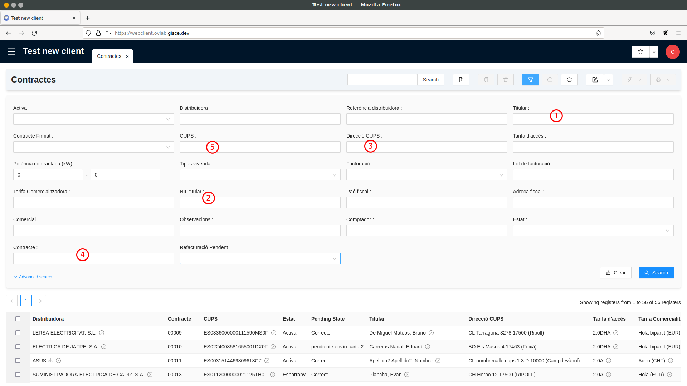

Anar al llistat de contractes situat a Gestió de "Pòlisses / Pòlisses" (fer doble clic a “Pòlisses”).

Al llistat que s'obre, cal utilitzar l'apartat de filtres per cercar el contracte.
Segons la informació que doni el client, podem utilitzar un filtre o un un altre. Els més comuns són els següents:

1. Titular: Cercar els contractes per nom del seu titular. Es pot cercar només per una part del nom o pel nom complet.
2. NIF titular: Cercar els contractes pel NIF/CIF del seu titular.
3. Adreça CUPS: Cercar els contractes per adreça del punt de subministrament, és a dir, la direcció on es subministra llum.
4. Contracte: Cercar els contractes pel número de contracte que es va assignar al client en el moment de la seva alta.
5. CUPS: Cercar els contractes pel nombre de CUPS. Igual que el número de contracte, és un identificador únic ja que no
hi hauria d'haver més d'un contracte actiu assignat a un mateix CUPS.

## Camps d'un contracte

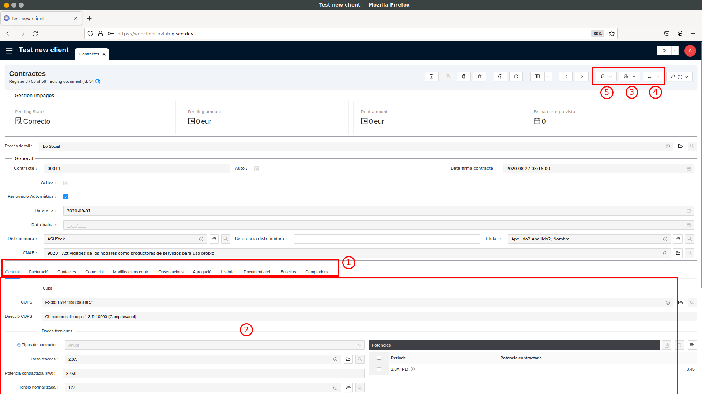

En fer doble clic en un contracte des d'un llistat de contractes, se'ns obre una vista detallada amb tota la informació
del contracte:

La informació d‟un contracte s‟agrupa en pestanyes. Les més rellevants són:

* General: Conté la informació referent al mercat elèctric. Per exemple, la tarifa d'accés, les potències contractades,
el tipus de contracte, etc.
* Facturació: Conté la informació sobre el producte ofertat al client (Tarifa Comercialitzadora) i les dades de pagament
(IBAN i propietari del compte bancari).
* Contactes: Informa de l'adreça de notificació (adreça on es envien les factures) i les dades fiscals per a la factura
(raó fiscal i adreça fiscal).
 
Quan es fa clic a una de les pestanyes, es mostra tota la informació a la pantalla principal del contracte.

La barra superior agrupa una sèrie de botons per fer diferents accions. El primer grup de botons serveix per generar
informes en PDF. Per exemple, permeten imprimir el contracte.

El segon grup de botons serveix per executar assistents en una finestra emergent. Els assistents guien l'usuari al
llarg d'un procés amb un objectiu concret. Un exemple seria l'assistent per a actualitzar la data d'alta d'un contracte.

El darrer grup de botons són enllaços. Els enllaços serveixen per obrir una nova pestanya on es mostren elements
relacionats amb els contractes. Per exemple, l'enllaç **Factures Client** obre una pestanya amb les factures emeses per
a aquest contracte. Normalment, aquests enllaços mostren llistats amb un filtre aplicat, per a mostrar només informació
rellevant pel contracte actual.

### Identificar el pagador d´un contracte

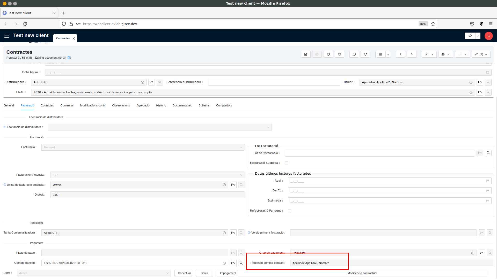

El pagador d'un contracte és el propietari del compte bancari associat al contracte. Es pot trobar a la pestanya
**Facturació** del contracte.

### Identificar a on s'envien les factures d'un contracte

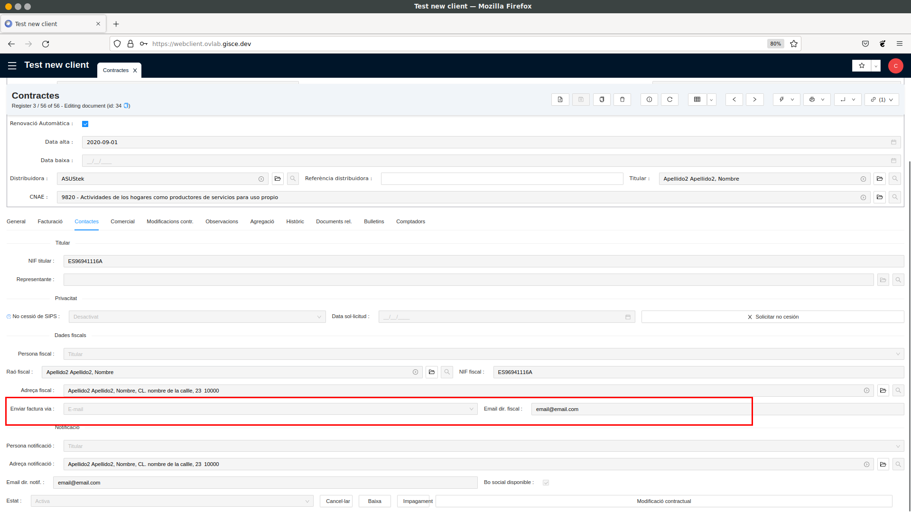

El camp **Enviar factura via** indica si la factura s'envia per correu electrònic o s'envia por carta postal.
Si s'envia por correu electrònic, el camp **Email dir. Fiscal** indica l'adreça on s'envía la factura.

Si el notificador no és el mateix individu que la raó fiscal, serà el camp **Email dir. notif** el que indicarà
a quina adreça d'e-mail s'enviarà la factura.

!!! Info "Nota"
    En un contracte, el titular, la raó fiscal i el notificat poden ser tots el mateix individu o poden ser tots diferents.

## Imprimir un contrate i consultar adjunts

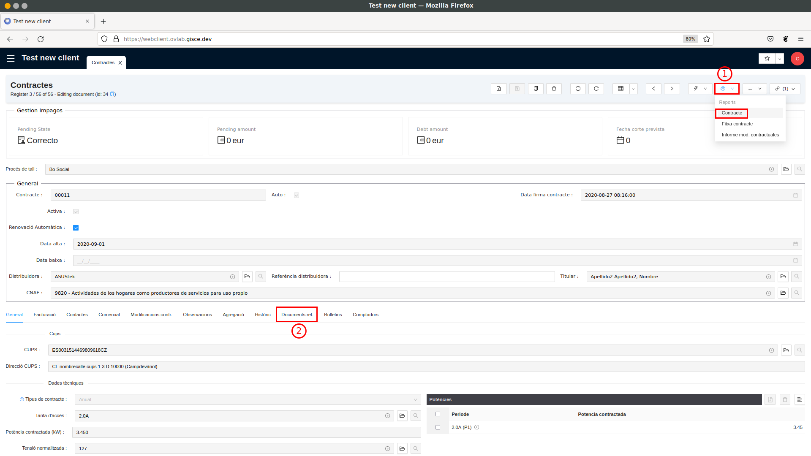

Per a imprimir un contrate s'ha d'utilizar desplegant la secció **Reports** i prement el botó **Contracte** (1).
Això generarà un PDF que es pot desar per a imprimir-lo.

Addicionalment, es poden veure tots els documents que s'han adjuntat a un contrate.
Alguns d'aquests documents poden ser per exemple el DNI i/o l'autorizació de domiciliació pel moment de fer el contracte.
Aquests fitxers es troben a la pestanya **Documents rel.** (Documents relacionats) (2). Per a visualitzar un dels documents
adjunts s'ha de fer doble clic a l'element que es vulgui i, a la finestra emergent, utilizar el botó **Obrir**.

## Veure els estats d'un procés de contratació

Sempre que un client demana canviar de comercializadora, realitzar un canvi de potència, canviar el titular, etc. s'inicia
primer un procés de firma digital i, una vegada finalitzat aquest, s'inicia el que es s'anomena "Procés ATR".
Aquest procés ATR serveix per a gestionar l'intercambi d'informació entre la comercializadora i la distribuïdora del
client per a realitzar el canvi desitjat. Per tant, quan un client vol saber, per exemple, en quin estat està el seu
procés d'alta, hem de revisar dos elements: **la firma digital** y **el procés ATR**.

### Comprovar l'estat d'un procés de Firma Digital

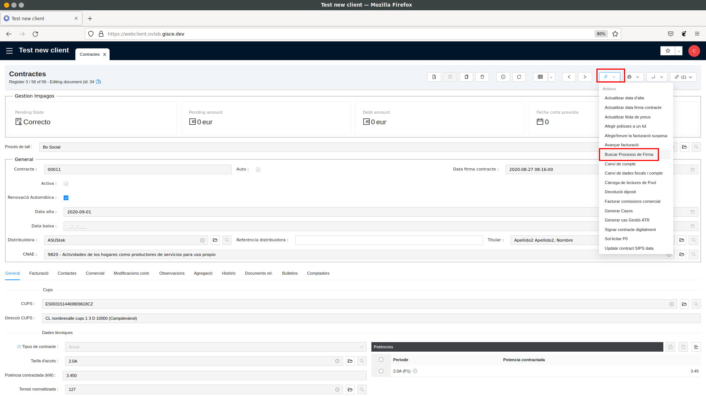

El primer pas és trobar el procés de firma digital. Per tant, hem d'anar al contrate del client i utilizar l'asistent
**Buscar Processos de Firma** (situat en el menú **Accions**).

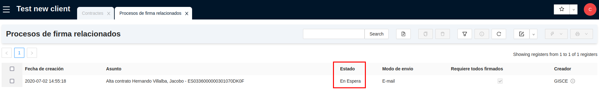

Aquest asistent ens obrirà una nova pestanya on es llistaran tots els processos de signatura relacionats amb el contracte.
Per saber si hi ha algun procés de signatura que encara no estigui finalitzat, ens hem de fixar a la columna **Estat**.
Si no indica que està `Completat`, significa que al client encara té pendent signar algun dels documents.

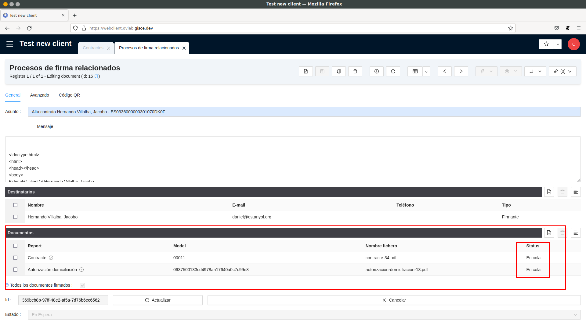

Podem saber quin o quins documents no ha signat si entrem a la vista detallada del procés de signatura (fent doble clic
al procés de signatura que vulguem revisar). A la vista detallada es mostren tots els documents que s'han enviat per a
signar i el seu estat. En cas de que el client no trobi el correu per signar, li podem tornar a fer arribar al seu correu
electrònic amb el botó **Reenviar el correu**.

### Comprovar l'estat d'un procés ATR

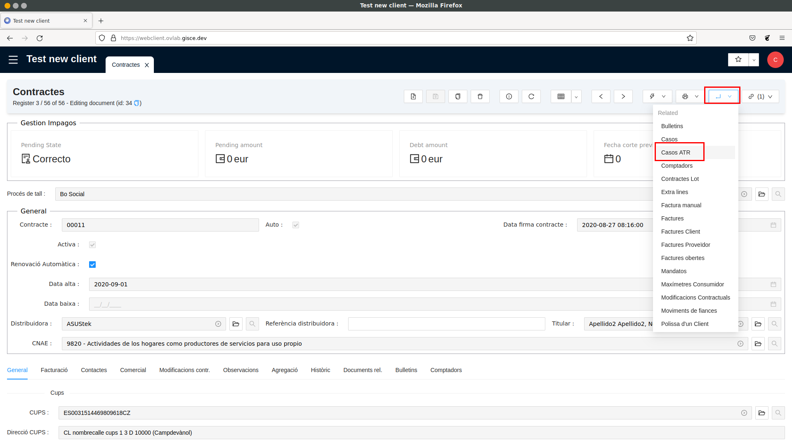

Si ja hem revisat els processos de signatura digital i estan complets, vol dir que ja s'ha iniciat el procés ATR
per a demanar a la distribuïdora que faci els canvis desitjats. Per revisar l'estat en què es troba aquesta sol·licitud
ATR, hem d'anar al contracte i utilitzar l'enllaç **Casos ATR** (situat al menú d'enllaços).
S'obrirà un llistat on es mostraran totes les sol·licituts ATR que s'han demanat per a aquest contracte.

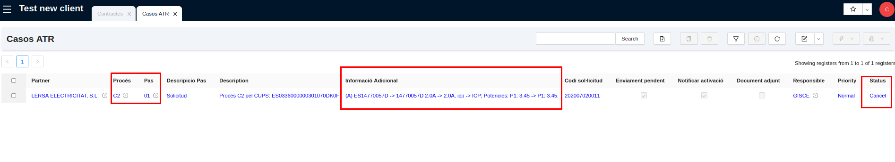

Per saber si alguna sol·licitud encara no està finalitzada, hem de fixar-nos al camp **Estat**. Si la sol·licitud està
en estat `Obert`, significa que encara no s'ha finalitzat.
Quan sabem que la sol·licitud no està finalitzada, hem d'identificar en quin punt es troba. Aquesta informació ens la
donaran els camps **Pas** i **Descripció Pas**. Els valors més comuns són:
- Pas = `01` (`a1` en un ATR de gas): S'han demanat els canvis a la distribuïdora, però encara no ens ha donat resposta.
- Pas = `02` (`a2` en un ATR de gas): La distribuïdora ja ens ha dit si accepta o no accepta fer els canvis demanats.
- Pas = `05` (`a3` en un ATR de gas): La distribuïdora ens ha indicat que ja ha realitzat els canvis sol·licitats.

## Accedir a l'Oficina Virtual d'un Client

L'ERP permet "suplantar" la identitat d'un client i entrar a l'oficina virtual com si entréssim amb el seu usuari.
D'aquesta manera podem veure exactament el que veuria ell i donar-li suport amb la gestió des de l'Oficina Virtual.

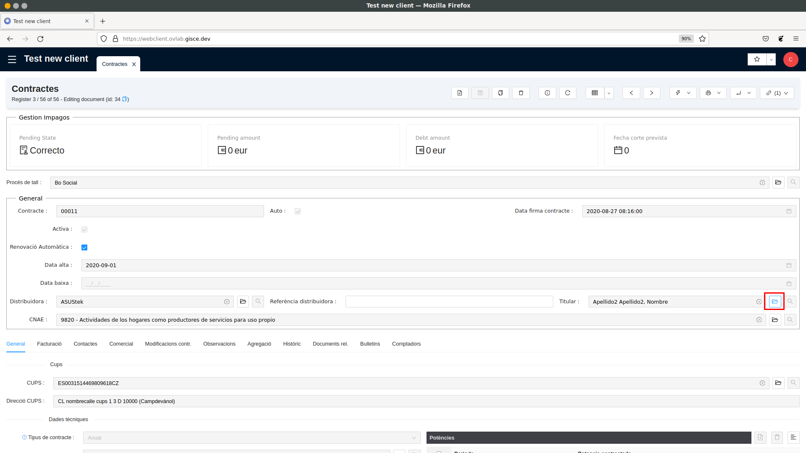

Per a "suplantar" la identitat d'un client hem d'anar a la seva "fitxa d'empresa". Per això, anem al contracte i utilitzem
la carpeta al camp **Titular**.

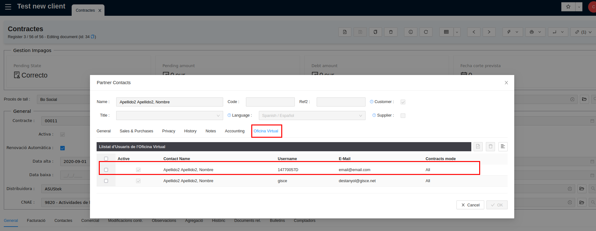

Un cop hem trobat el client, fem doble clic per obrir la vista detallada del client i anem a la pestanya **Oficina Virtual**.
En aquesta pestanya es mostra l'usuari doficina virtual associat al client.

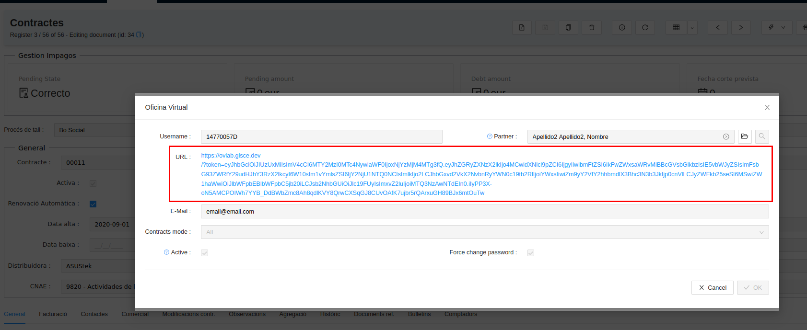

Fem doble clic a l'usuari d'oficina virtual. Això obrirà una finestra emergent i en aquesta hem de fer clic al camp
**URL** per a què se'ns obri un navegador web amb la pantalla de l'Oficina Virtual del client.
