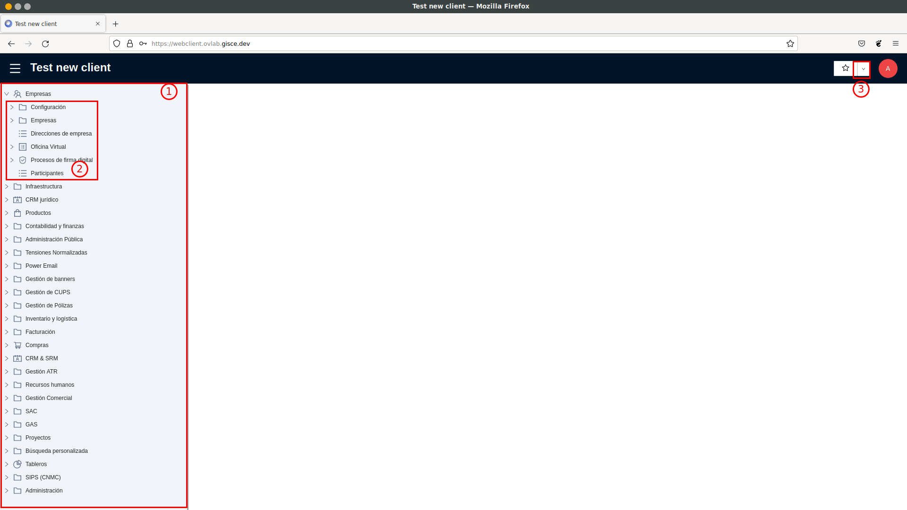
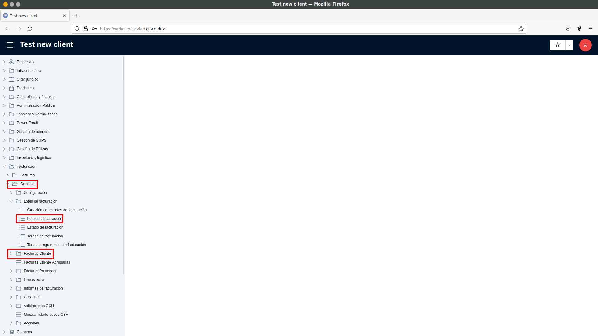
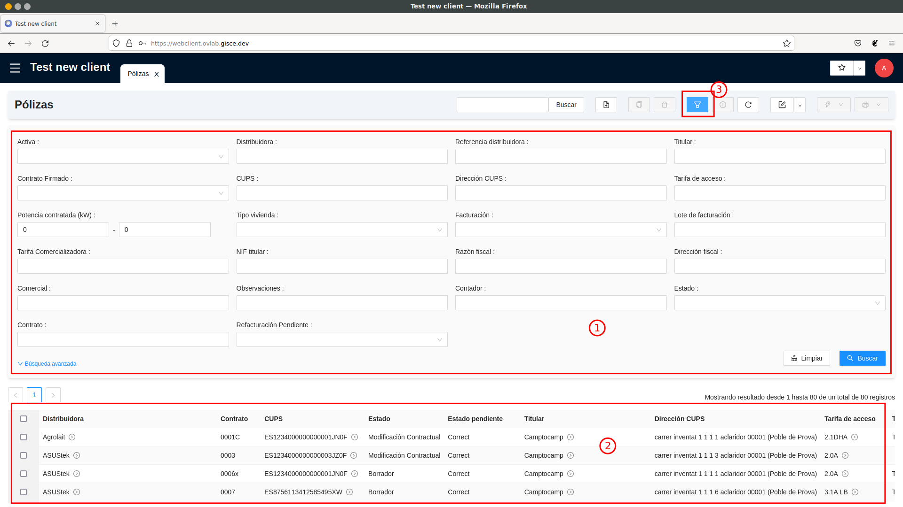

# Menús i llistats de l'ERP

**Nota:** Aquesta guia és vàlida tant per electricitat com per gas. La única diferència del gas
respecte a l'electricitat és que a totes les rutes de menús cal afegir `GAS/`
davant. Per exemple, si el llistat de contractes d'electricitat està situat a **Gestió de
Pòlisses/Pòlisses**, el llistat de contractes de gas estarà situat a **GAS/Gestió de
Pòlisses/Pòlisses**.

1. **Barra lateral**: Agrupa els diferents menús de l'ERP. En seleccionar un menú de la barra lateral,
se'ns mostra a la pantalla principal els submenus que agrupa (2).
2. **Submenús**: Mostra tots els submenús del menú seleccionat a la barra lateral.
3. **Dreceres**: Mostra els dreceres de l'usuari. Es poden crear noves dreceres prement la icona de l'estrella un cop dins
del menú que es vol desar com a drecera. També es pot editar el llistat de dreceres per a reordenar-lo o eliminar-ne.

## Elements de la pantalla principal

1. **Carpetes**: Una carpeta agrupa submenús a dins. En fer un clic en una carpeta es mostren els seus submenús.
2. **Llistats Desplegables**: Actua com una carpeta (en fer un clic es mostren submenús) i al mateix temps com un
llistat: en fer doble clic s'obre una pestanya nova mostrant els elements del llistat. En aquest exemple, un llistat
en què es mostrarien les factures del client.
3. **Llistats**: En fer doble clic, s'obre una pestanya nova mostrant els elements del llistat.

## Llistats i filtres

1. **Filtres**: Un llistat de l'ERP es composa de dues parts. A la part superior, una sèrie de camps per a poder filtrar
i cercar elements. En aquest exemple, per a cercar contractes. Si poséssim al camp `Titular` el nom d'una persona,
trobaríem tots els contractes en què el nom del titular contingui el text introduït. Per a mostrar els filtres actius,
cal prémer el botó indicat amb la captura amb el número 3.
2. **Llistats**: La segona part de la pantalla mostra els resultats de la cerca. Per defecte, mostra un màxim de 80
elements al llistat. Si feu clic a la capçalera d'una de les columnes els registres s'ordenaran per aquest camp. És
possible ampliar la cerca ajustant el paràmetre `límit` a la barra de filtre, dins les opcions avançades de cerca.
