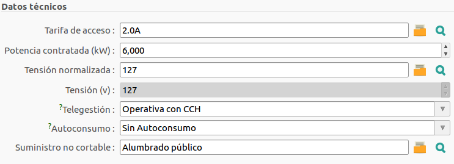
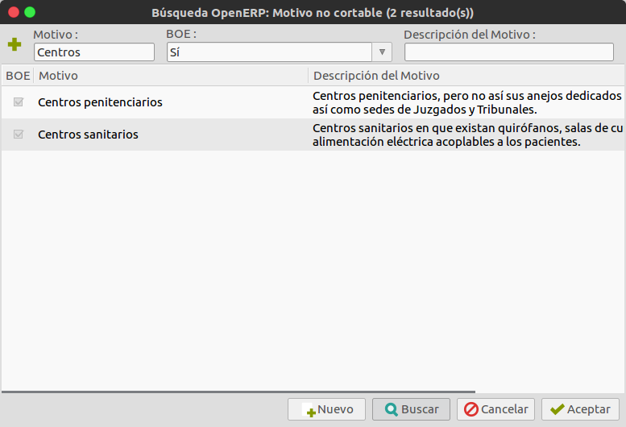

# Gestió de pòlisses/contractes

## Tarifes d'accés

Les tarifes d'accés que venen definides amb l'ERP són les que marca la legislació
vigent.

- 2.0A (0 - 10 kW)
- 2.1A (10 - 15 kW)
- 2.0DHA (0 - 10 kW) amb discriminació horària
- 2.1DHA (10 - 15 kW) amb discriminació horària
- 2.0DHS (0 - 10 kW) amb discriminació horària "supervalle"
- 2.1DHS (10 - 15 kW) amb discriminació horària "supervalle"
- 3.0A (més de 15 kW)
- 3.1A
- 3.1A LB
- 6.1A
- 6.1B
- 6.2
- 6.3
- 6.4
- 6.5

## Pòlisses/contractes

## Formulari d'una pòlissa/contracte

### Secció general

* **Pòlissa**
* **Auto**
* **Data firma contracte**
* **Activa**
* **Renovació automàtica**
* **Distribuidora**
* **Referència distribuidora**
* **Titular**
* **CNAE**
* **Data alta**
* **Data baixa**

### Pestanya general

* **CUPS**
* **Direcció CUPS**
* **Tarifa d'accés**
* **Potència contractada**
* **Tensió**
* **Potències contractades per període**
* **Tipus de vivenda**

### Contactes

* **NIF Titular**

### Modificacions contractuals

* **Modificació contractual actual**
* **Llistat de modificacions contractuals**

### Observacions

* **Observacions**

## Subministrament no tallable

Podem marcar una pòlissa com a **subministrament no tallable**. Existeixen
dos tipus de motius per fer-ho: els que vénen definits en el BOE
([24/2013 Article 52 punt 4](https://www.boe.es/diario_boe/txt.php?id=BOE-A-2013-13645)),
o els que anem creant nosaltres mateixos

!!! note
    En el cas de les distribuidores un subministrament no tallable, hauria
    de venir definit pel BOE (que ja venen pre-carregats)
    En el cas de les comercialitzadores un subministrament no tallable pot ser
    també per motiu comercial.

### Marcar una pòlissa com a no tallable

Des d'una pòlissa, podem seleccionar un dels motius no
tallables. Si tenim la pòlissa marcada com a activa ho haurem de fer mitjançant
una modificació contractual.

Aquí podem seleccionar el motiu, i també podem filtrar: per nom del motiu,
per si és un motiu definit al BOE o no, i per descripció.

### Crear nous motius

També podem definir motius de no tallable des del mateix formulari que acabem
de veure o des del menú de Gestió de Pòlisses - Configuració - Motius no
tallables.
En el dos casos farem clic sobre el botó nou. En el cas del formulari el
trobarem a la barra d'eines inferior (veure imatge anterior). I en el cas
d'estar a l'apartat de configuració de pòlisses el trobarem a la barra d'eines
del menú superior, tal com veiem a la següent imatge

Per definir el motiu emplenem els camps de nom i descripció i BOE si és el cas.
Guardem els canvis i es crea el motiu i s'afegeix a motius de subministrament
no tallable.

### Llistar les pòlisses no tallables

Per llistar totes les pòlisses no tallables accedirem al menù: Configuració de
Pòlisses - Pòlisses - Pòlisses no tallables

I ens llistarà totes les pòlisses que tenen assignat un motiu de
subministrament no tallable

### Permisos

Aquesta funcionalitat està reservada pels usuaris que siguin del grup
**GISCEDATA Pòlissa /CutOff**, per tant que tinguin permisos específics per
interactuar amb els motius de subministrament no tallable.
La resta d'usuaris podran llistar totes les pòlisses que tenen un motiu de
subministrament no tallable, i veure el motiu de no tall. Però no podran crear
ni assignar motius.

## Canvi data firma contracte

En un contracte podem actualitzar la data de firma de contracte sense la
necessitat de fer una modificació contractual mitjançant un assistent creat
expresament

Des de una pólissa o des del botó acció del llistat de pólisses podem prèmer
sobre el botó **Actualitzar data firma contracte**. Ens apareixerà el formulari
següent, on podrem veure la pólissa seleccionada i la data de firma
de contracte actual (si en té). Prement en el botó continuar, actualitzarà la
data de firma de contracte de la **pólissa** i la **modificació contractual
activa**.

!!! warning
    No es farà cap tipus de validació sobre la data introduïda. Si és una data
    vàlida es modificarà la data actual sense tenir en compte cap altra
    consideració com la data d'alta i de baixa de la pòlissa o la data actual

## Modificacions contractuals
