# Gestió de pòlisses/contractes

## Tarifes d'accés

Les tarifes d'accés que venen definides amb l'ERP són les que marca la legislació
vigent.

- 2.0A (0 - 10 kW)
- 2.1A (10 - 15 kW)
- 2.0DHA (0 - 10 kW) amb discriminació horària
- 2.1DHA (10 - 15 kW) amb discriminació horària
- 2.0DHS (0 - 10 kW) amb discriminació horària "supervalle"
- 2.1DHS (10 - 15 kW) amb discriminació horària "supervalle"
- 3.0A (més de 15 kW)
- 3.1A
- 3.1A LB
- 6.1A
- 6.1B
- 6.2
- 6.3
- 6.4
- 6.5

## Pòlisses/contractes

En el model de la pòlissa es troben els camps que indiquen a quin client pertany,
quina tarifa té actualment, comercialitzadora, poténcia contractada, tipus de
facturació, data de la próxima facturació, históric de comptadors i les seves
lectures, ...

En el menú principal podem trobar el llistat de pólisses a "_Menú → Gestió de
Pólisses_"

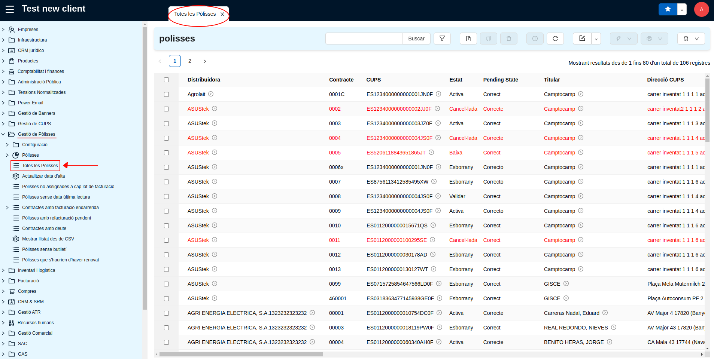

### Donar d'Alta una pòlissa

Per donar d'alta una pòlissa s'ha d'emplenar una sèrie de camps amb el fi que la
facturació funcioni correctament.

Es selecciona el botó "_Nou_" de la barra de botons i es procedeix a completar
les dades de les diferents pestanyes.

#### Pestanya General

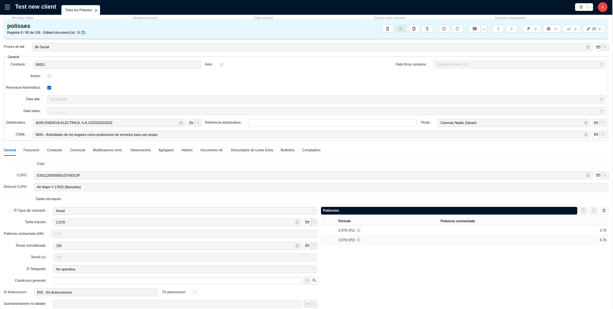

* Client: Nom del client.    
  Es pot buscar un client ja existent i si no existeix es [dona d'alta un nou
  client](partners.md#donar-dalta-un-clientempresa).
* Comercialitzadora: Nom de la Comercialitzadora.
    * La Comercialitzadora es sel·leccionarà de la llista d'empreses amb el botó
      _lupa_. Si no existeix la comercialitzadora s'haurà de [donar d'alta una nova
      empresa](partners.md#donar-dalta-un-clientempresa).
    * Requeriments imprescindibles per que la comercialitzadora estigui correctament
      entrada: (destacat visualment en les imatges següents)
        * A la pestanya _General_: Nom de l'empresa, ID de l'empresa i Direcció de
          contacte amb "Tipus Direcció: Factura".
        * A la pestanya _Informació Extra_: Actiu sí, NIF.
        * A la pestanya _Propietats_: Tot introduït correctament
        * Tipo de Pago introduït.

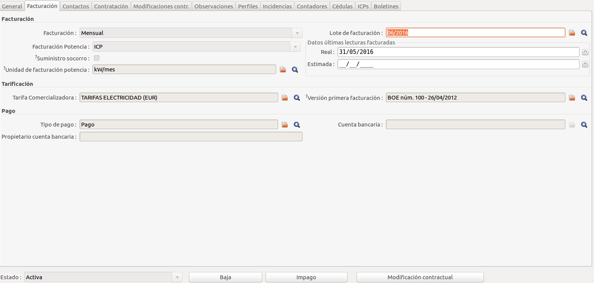

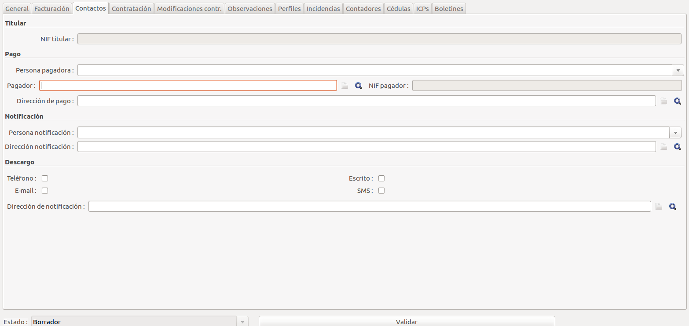

!!! Note
    En l'apartat _Tipo de pago_ es pot introduïr uns valors com els que es mostren
    en l'última imatge de la sèrie.

!!! Warning
    A la fitxa de la comercialitzadora, recorda que el camp _Empresa ID_ es el
    **codi de comercialitzadora de REE**.

* Pòlissa: Codi de la nova pòlissa
* CNAE: S'ha d'escollir un codi de CNAE de la taula existent que conté tots els
  codis CNAE actualitzats en el INE
* CUPS: S'ha d'assignar un CUPS existent o crear un de nou. Si el CUPS es
  existent, es pot buscar amb la _lupa_, amb l'ajuda de filtres per municipi,
  població, carrer i número. La direcció del CUPS s'ha de connectar a la pòlissa
  que s'està creant.   

    * Si l'escomesa es nova, s'haurà de [crear un nou CUPS].

    !!! Warning
        Abans de crear un nou CUPS comproba que realment no existeix un en la
        direcció que busques. Comproba també que no estigui desactivat.

* Data d'alta: S'ha de sel·leccionar la data d'alta de la pòlissa amb el
  calendari que hi ha a la dreta del camp.
* Activa: La pòlissa per defecte està activa i només es desactivarà quan s'hagi
  donat de baixa i s'hagi realitzat la última facturació.

    !!! Note
        No es pot desactivar una pòlissa fins que s'hagi realitzat la última
        facturació. Veure l'apartat [Donar de baixa una pòlissa].

* Data de Baixa: S'indicarà a nivell informatiu la data de baixa de la pòlissa,
  que hauria de coincidir amb la data de baixa del últim comptador associat.
* Baixa: Es marcarà la casella baixa en el moment de posar la data de baixa.
  I es mantindrà la casella activa marcada fins que s'hagi realitzat l'última
  factura d'aquesta pòlissa.
* Estat: Camp informatiu per indicar si la pòlissa està en tràmit, pendent de
  documentació...
* Tarifa: S'ha de sel·leccionar, utilitzant el botó _lupa_, una de les tarifes
  vigents en el moment de fer l'alta.

    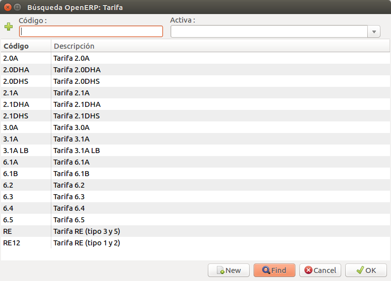

    !!! Note
        Una vegada sel·leccionada la tarifa, i **després de guardar el registre**,
        en la part inferior aparaixeràn els periodes de la tarifa, que s'haurà
        d'emplenar amb la potenca contractada en cadascún d'ells.

    !!! Warning
        Al sel·leccionar una tarifa 3.1, s'ha d'observar que la tarifa amb la
        descripció **"Tarifa 3.1A LB"** indica que la lectura es realitza en baixa
        tensió.

* Facturació: S'ha de sel·leccionar en el camp combinat un dels dos tipus de
  facturació: "mensual" o "bimestral"
* Pròxima facturació: Amb el calendari de la part dreta del camp, s'ha de
  sel·leccionar la data de la pròxima facturació perquè entri al cicle de
  facturació de forma correcte.
* Tensió: S'indicarà la tensió del subministre (230, 400)
* Potencia: En aquest camp s'indicarà la potència màxima contractada dels
  diferents periodes. El camp de _Potencia_ en els filtres de sel·lecció de les
  pòlisses fa referencia a aquest camp.
* Facturació Potencia: En aquest camp s'indicarà el tipus de facturació de la
  pòlissa sel·leccionant si es fa per ICP o per la regla del maxímetre.
* ICP: S'indicarà la intensitat del ICP instal·lat i/o marca del mateix.
* Consum anual: No s'hi ha d'indicar cap valor.
* Trafo kVA: Aquest camp només s'ha de cumplimentar amb la potència del
  transformador en el cas d'un subministre en AT amb mesura en baixa
  (_Tarifa 3.1A con medida BT_).   
  El valor d'aquest camp s'utilitzarà per al càlcul de la facturació de les
  tarifes: _3.1A con medida BT_
* Pot máx instalador: Es la potència màxima autoritzada en el boletí del
  instal·lador.
* Potencia Acta: Es la potència del acta del instal·lador (camp informatiu)

#### Pestanya de Comptadors

En la pestanya de Comptadors es troba l'històric dels comptadors que han estat
relacionats amb la pòlissa. Apareixen tots els que han passat per la pòlissa que
es troben en estat _"No Actiu"_ i únicament el que es troba actualment
instal·lat està _"Actiu"_.

!!! Note
    Recorda que el campo _N. comptador_ ha de contenir el mateix **número de
    serie** del comptador actiu de la llista de la part inferior del formulari.   
    Les cerques a les pòlisses del número de comptador, són les del camp _N.
    comptador_

En cas de necessitar donar d'alta un comptador, cal seguir el [procediment per
donar d'alta un comptador](../distri/contadores.md#donar-dalta-un-comptador)

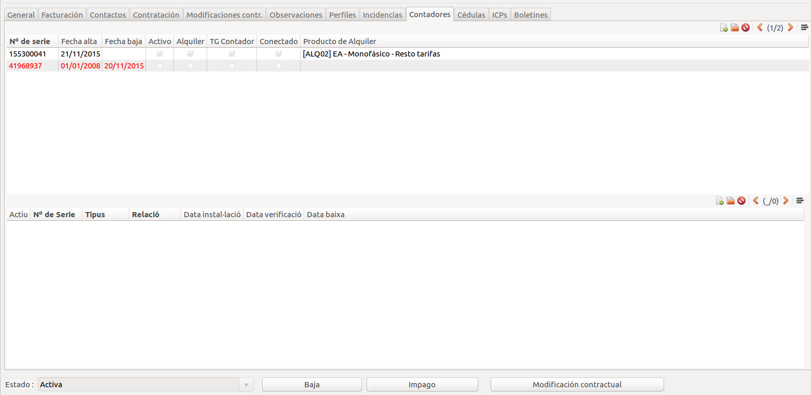

### Donar de Baixa una pòlissa

Per donar de baixa una pòlissa en una data determinada s'han de tenir en compte
els següents punts.

**A la pestanya General:**

* El camp _Data de Baixa_: S'hi indicarà la data en que es farà efectiva la
  data de baixa de la pòlissa i ha de coincidir amb la data de baixa de
  comptador associat.
* La casella _Baixa_: Es marcarà la casella _Baixa_ en el moment de posar la
  _data de baixa_.   
  Es mantindrà la casella _Activa_ fins que s'hagi realitzat l'última factura
  d'aquesta pòlissa.
* La casella _Activa_: Es desactivarà quan s'hagi realitzar l'última factura
  d'aquesta pòlissa.   
  Dependrà de si es "mensual" o "bimestral".

!!! Warning
    No es pot desactivar la pòlissa fins haver realitzat l'última facturació.

**A la pestanya Comptadors:**

Al comptador actiu s'han de completar els següents camps:

* El camp _Data Baixa_: S'hi indicarà la data en la que es retira el comptador.   
  Coincidirà amb la _Data Baixa_ de la pòlissa.   
  Aquesta data s'utilitzarà per facturar el terme de potencia de la última
  factura i només tindrà en compte els dies des de l'última facturació fins la
  data.
* La casella _Activa_: Es desactivarà quan s'hagi realitzat l'última facturació
  de la pòlissa.   
  Dependrà de si es "mensual" o "bimestral".

!!! Warning
    No es pot desactivar la pòlissa fins haver realitzat l'última facturació.

### Realitzar canvi de titularitat

Un canvi de titularitat d'una pòlissa suposa [donar de baixa una
pòlissa](#donar-de-baixa-una-polissa) i [donar d'alta una
pòlissa](#donar-dalta-una-polissa) nova amb les dades del nou titular.

### Canvi de la potencia contractada

Per realitzar el canvi de potencia contractada ha de realitzar-se al inici del
periode de facturació de la pòlissa.   
Si s'ha de realitzar el canvi enmig d'un periode de facturació s'haurà de fer
[una baixa de la pòlissa](#donar-de-baixa-una-polissa) i [donar d'alta una
pòlissa](#donar-dalta-una-polissa) perquè es poguin facturar correctament els
termes de potència de cada un dels contractes.

### Canvi de la tarifa

Si el canvi de potencia, que es faci a l'inici d'un periode de facturació,
suposi un canvi de tarifa de peatge, s'haurà de fer un canvi de comptador. Per
realitzar-ho cal [donar de baixa el comptador] i [donar d'alta un nou comptador]
inicialitzat amb les lectures dels diferents periodes de la nova tarifa.

!!! Note
    Sempre s'ha d'inicialitzar un nou comptador amb les lectures dels periodes
    de la nova tarifa.   
    Recorda que cada peruide d'una tarifa es un producte diferent. (p.e. P1(2.0)
    es un producte i P1(2.1) es un altre producte)

## Formulari d'una pòlissa/contracte

### Secció general

* **Pòlissa**
* **Auto**
* **Data firma contracte**
* **Activa**
* **Renovació automàtica**
* **Distribuidora**
* **Referència distribuidora**
* **Titular**
* **CNAE**
* **Data alta**
* **Data baixa**

### Pestanya general

* **CUPS**
* **Direcció CUPS**
* **Tarifa d'accés**
* **Potència contractada**
* **Tensió**
* **Potències contractades per període**
* **Tipus de vivenda**

### Contactes

* **NIF Titular**

### Modificacions contractuals

* **Modificació contractual actual**
* **Llistat de modificacions contractuals**

### Observacions

* **Observacions**

## Visualització deute d'una pòlissa/contracte

Podem visualitzar el deute d'una pòlissa/contracte a través del seu formulari,
tenim els camps **Estat pendent**, **Quantitat pendent** i **Quantitat deute**.

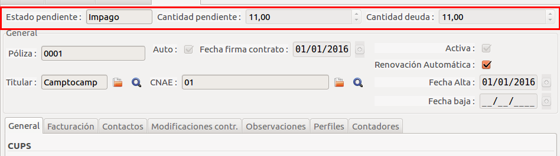

* **Quantitat pendent**: Indica els euros que aquesta pòlissa està pendent de
  pagar. Ja sigui perquè és d'una devolució o perquè encara no s'ha remesat.

* **Quantitat deute**: Indica els euros que deu aquesta pòlissa que són d'impagament.
  Agafa la quantitat residual de totes les factures que el seu estat pendent no
  sigui **Correcte**.

* **Estat pendent**: Mostra el *pitjor* estat de totes les pòlisses que no estiguin
  en estat correcte.

També podem llistar **totes** les pòlisses/contractes que tinguin algun deute a
través del menú: **Gestió de pòlisses > Pòlisses amb deute** on es pot veure en
cada contracte quin estat i deute tenen i un sumatori de tot deute del llistat.

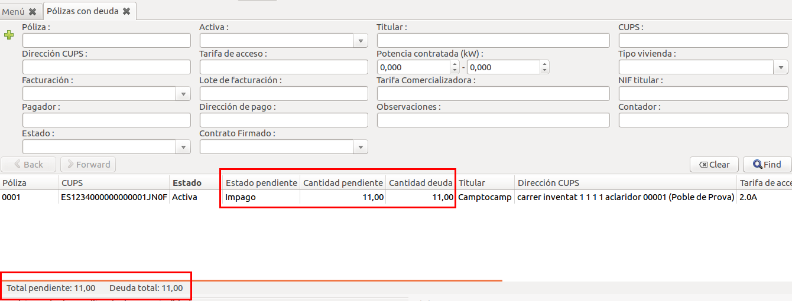

Per més informació es pot llegir la seccció de [gestió d'impagats](/comer/gestion_impago.md) en comercialització.

## Subministrament no tallable

Podem marcar una pòlissa com a **subministrament no tallable**. Existeixen
dos tipus de motius per fer-ho: els que vénen definits en el BOE
([24/2013 Article 52 punt 4](https://www.boe.es/diario_boe/txt.php?id=BOE-A-2013-13645)),
o els que anem creant nosaltres mateixos

!!! note
    En el cas de les distribuidores un subministrament no tallable, hauria
    de venir definit pel BOE (que ja venen pre-carregats)
    En el cas de les comercialitzadores un subministrament no tallable pot ser
    també per motiu comercial.

### Marcar una pòlissa com a no tallable

Des d'una pòlissa, podem seleccionar un dels motius no
tallables. Si tenim la pòlissa marcada com a activa ho haurem de fer mitjançant
una modificació contractual.

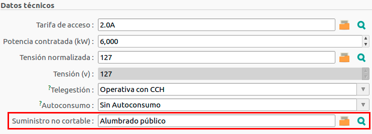

Aquí podem seleccionar el motiu, i també podem filtrar: per nom del motiu,
per si és un motiu definit al BOE o no, i per descripció.

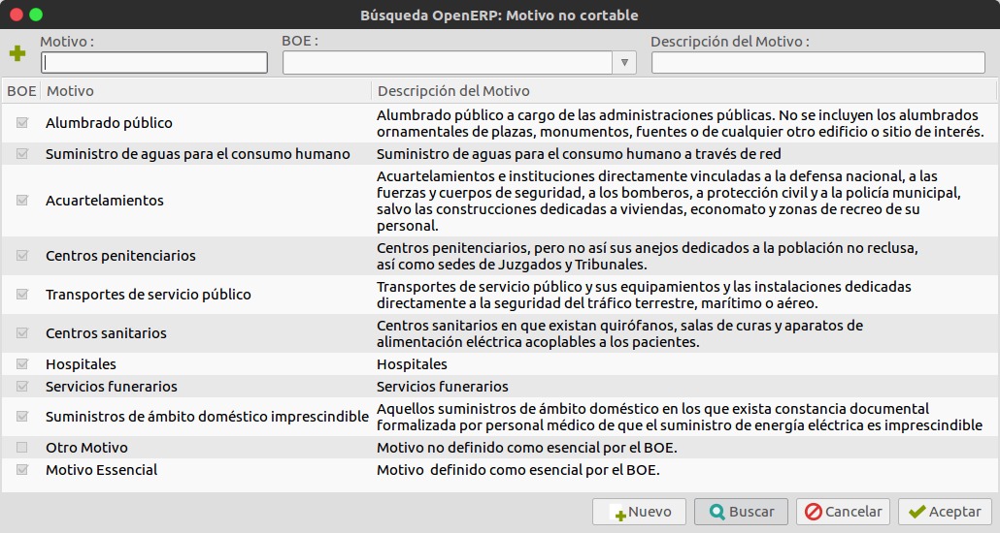

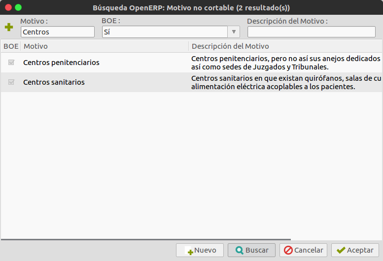

### Crear nous motius

També podem definir motius de no tallable des del mateix formulari que acabem
de veure, o des del menú de **Gestió de Pòlisses > Configuració > Motius no
tallables**.
En el dos casos farem clic sobre el botó nou. En el cas del formulari, el
trobarem a la barra d'eines inferior (veure imatge anterior). I en el cas
d'estar a l'apartat de configuració de pòlisses, el trobarem a la barra d'eines
del menú superior, tal com veiem a la següent imatge

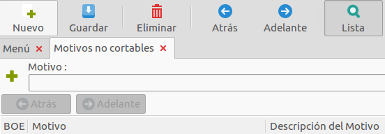

Per definir el motiu emplenem els camps de nom, descripció i BOE si és el cas.
Guardem els canvis, i es crea el motiu, i s'afegeix a motius de subministrament
no tallable.

### Llistar les pòlisses no tallables

Per llistar totes les pòlisses no tallables, accedirem al menù: **Configuració
de Pòlisses > Pòlisses > Pòlisses no tallables**

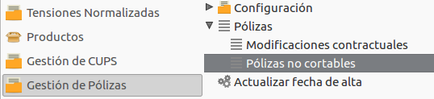

I ens llistarà totes les pòlisses que tenen assignat un motiu de
subministrament no tallable

### Permisos

Aquesta funcionalitat està reservada pels usuaris que siguin del grup
**GISCEDATA Pòlissa /CutOff**, per tant que tinguin permisos específics per
interactuar amb els motius de subministrament no tallable.
La resta d'usuaris podran llistar totes les pòlisses que tenen un motiu de
subministrament no tallable, i veure el motiu de no tall. Però no podran crear
ni assignar motius.

## Canvi data firma contracte

En un contracte podem actualitzar la data de firma de contracte sense la
necessitat de fer una modificació contractual mitjançant un assistent creat
expresament

Des de una pólissa o des del botó acció del llistat de pólisses podem prèmer
sobre el botó **Actualitzar data firma contracte**. Ens apareixerà el formulari
següent, on podrem veure la pólissa seleccionada i la data de firma
de contracte actual (si en té). Prement en el botó continuar, actualitzarà la
data de firma de contracte de la **pólissa** i la **modificació contractual
activa**.

!!! warning
    No es farà cap tipus de validació sobre la data introduïda. Si és una data
    vàlida es modificarà la data actual sense tenir en compte cap altra
    consideració com la data d'alta i de baixa de la pòlissa o la data actual

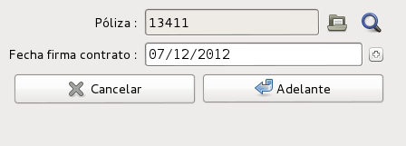

## Modificacions contractuals

### Desfer una modificació contractual

Per desfer una modificació contractual, cal seleccionar d'entre la llista de
modificacions contractuals la que està **activa**.

Un cop seleccionada es pot veure com apareix un botó per desfer la modificació
contractual:

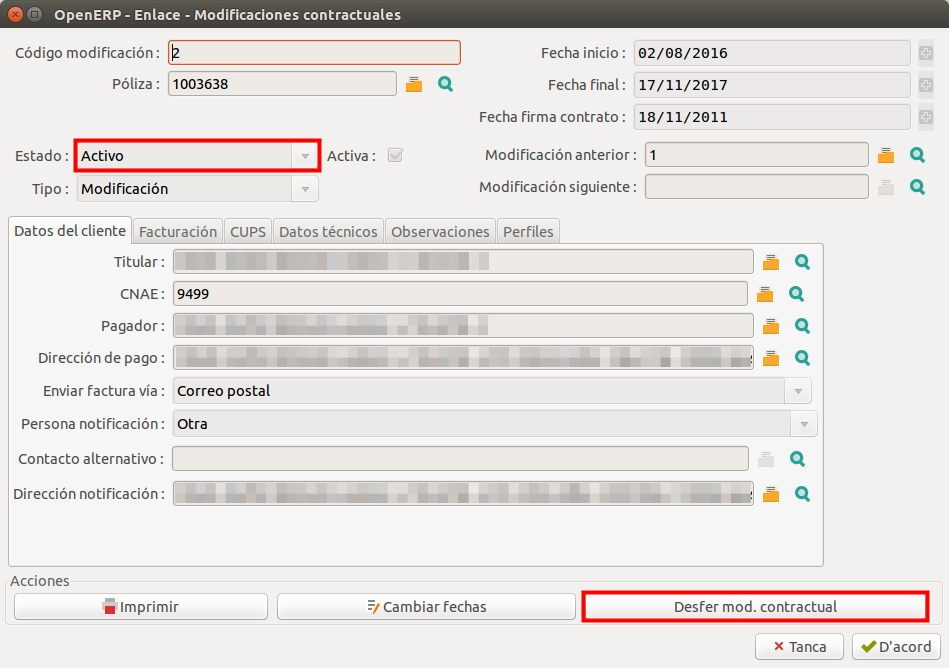

Al fer click al botó apareixerà un avís per pantalla el qual informa que l'acció
no es pot desfer.

Si es confirma, la modificació contractual activa serà eliminada i la
modificació contractual anterior es reactivarà. Altrament, la modificació
contractual es mantindrà sense canvis.

!!! note
    No es podrà desfer cap modificació contractual si la pòlissa no es troba
    en estat **actiu**

## CNAE

El CNAE (Clasificación Nacional de Actividades Económicas) és un codi de 4
xifres amb una estructura en forma d'arbre.

Per exemple, el codi 61 pertany a _"Telecomunicaciones"_ mentre que el 061
pertany a _"Extracción de crudo de petróleo"_. Conforme es van afegint dígits
es va concretant de forma més exacte l'activitat de l'abonat.

Per això és necessari concretar un CNAE de **4 dígits** que descrigui
**l'activitat concreta de l'abonat**.

Per fer-ho cal fer click al botó de la lupa a l'apartat **CNAE** al **crear **
**una nova pòlissa**:

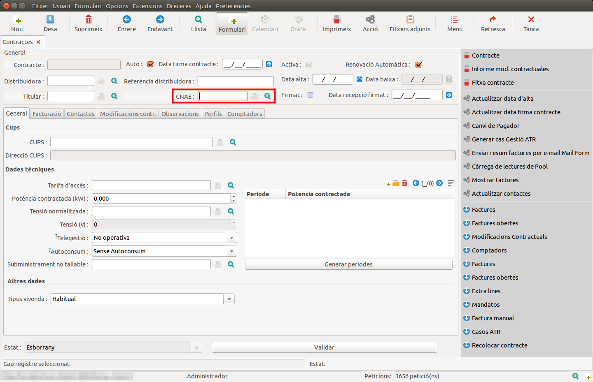

Llavors apareix la llista de CNAEs a escollir:

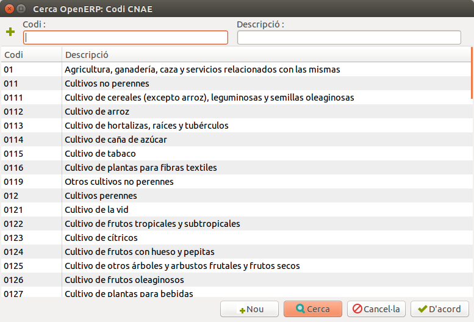
