# Documentació del mòdul de PowerEmail

Aquest mòdul no està integrat en el codi del ERP, però està disponible a
[GitHub/gisce/PowerEmail](https://github.com/gisce/poweremail).

## Instal·lació

Aquest mòdul no està integrat en el codi de GISCE-ERP, pel que cal descarregar-lo
com un repositori apart. Des de GISCE-TI tenim un FORK a GitHub on mantenim la
branca `v5_backport`, ja que aquest mòdul està pensat per Odoo i nosaltres
utilitzem la versió 5 de OpenERP.

Com tots els mòduls externs, cal realitzar els links adients a la carpeta
d'OpenERP `server/bin/addons`.

Com que s'ha canviat el codi, caldrà reiniciar el servidor (o iniciar-lo en un
altre port) i procedir a la instal·lació com qualsevol mòdul de OpenERP.

Una vegada instal·lat el mòdul, ja disposarem de diferents vistes noves en un
nou menú:

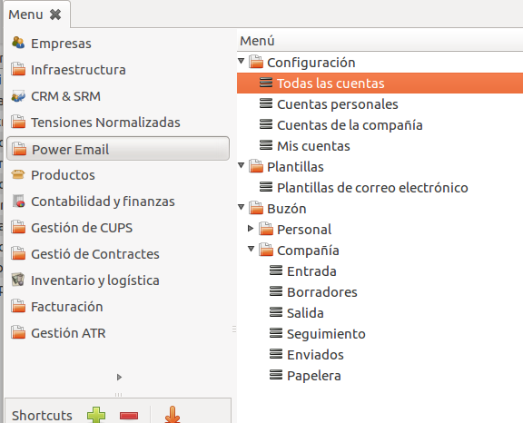

## Configuració de Comptes PowerEmail

### Creació d'un compte PowerEmail

PowerEmail funciona amb comptes _smtp_. Tant si volem enviar com si volem rebre
correus, és necessari afegir un compte PowerEmail.

En un mateix compte s'hi pot configurar l'entrada o sortida de correu.

Per afegir un compte, cal accedir al menú "**Menú OpenERP → PowerEmail →
Configuració → Tots els comptes**" i fer _click_ al botó `NEW`.

Independentment del tipus de compte a crear, sempre cal inicialitzar el `nom
del compte`. Aquest ha de ser únic entre els comptes PowerEmail.

#### Compte per l'enviament de correu electrònic

Quan creem (o editem) un nou compte de PowerEmail, ens mostrarà un formulari
amb els camps necessaris per la connexió amb un servidor _smtp_.

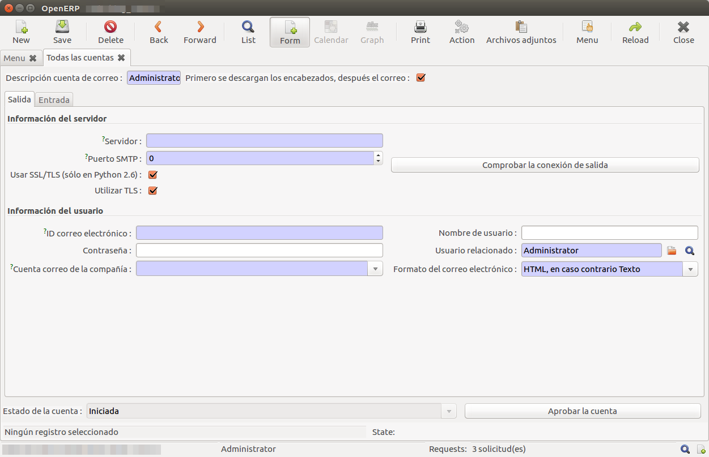

Es disposa dels camps:

|          Nom del Camp            |                                  Descripció                                |
|:--------------------------------:|:---------------------------------------------------------------------------|
| Servidor                         | Nom del servidor de correu                                                 |
| Port SMTP                        | Port SMTP utilitzat per el servidor de correu                              |
| Utilitzar TLS                    | Si es desitja utilitzar transmissió segura mitjançant claus                |
| ID correu electrònic             | Nom del correu electrònic a utilitzar en el servidor                       |
| Nom d'usuari                     | Nom d'usuari a utilitzar en el servidor (Per defecte el correu electrònic) |
| Contrasenya                      | Contrasenya a utilitzar en el servidor                                     |
| Usuari Relacionat                | Usuari del OpenERP relacionat amb aquest compte de PowerEmail              |
| Compte de correu de la companyia | Si es desitja configurar com a compte de la companyia                      |
| Format del correu electrònic     | Format a utilitzar per construir el "body" del correu                      |

Una vegada entrats els valors, es pot comprobar la connexió amb el servidor
_smtp_ amb el botó `comprobar connexió de sortida`.

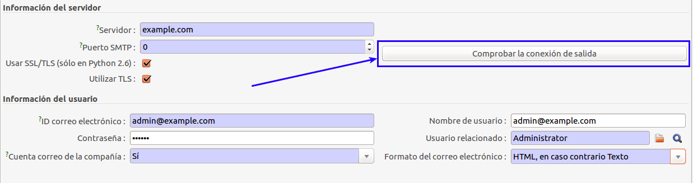

##### Compte per l'enviament de correu de la companyia

Creant un compte normal per a l'enviament de correu electrònic, caldrà
seleccionar el camp `Compte de correu de la companyia` amb el valor `Si`.

Això farà que ens aparegui una pestanya `seguretat` en la vista del compte.

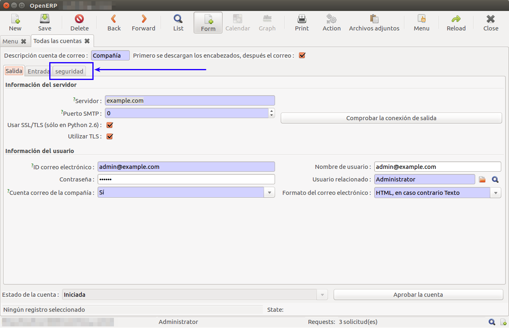

Per tal d'utilitzar un compte de companyia és necessari assignar un grup
d'usuaris al compte. En la pestanya `seguretat` es pot seleccionar quins
grups poden utilitzar aquest compte que estem creant.

!!! Note "Exemple"
    Podem fer un compte genèric afegint el grup `Employee`.

    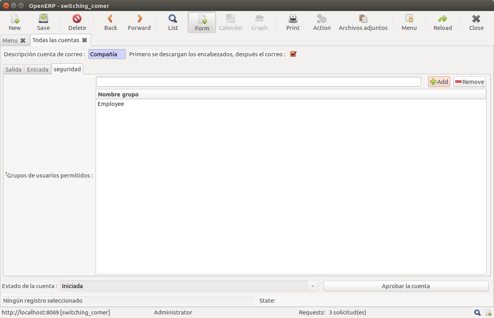

#### Compte per la recepció de correu electrònic

Aquest tipus de comptes extenen els comptes d'enviament de correu electrònic.
Per aquest motiu, cal realitzar prèviament les
[configuracions per comptes d'enviament](#compte-per-lenviament-de-correu-electronic).

Accedint a la pestanya `entrada` podem configurar la recepció de correu
mitjançant PowerEmail. En aquesta pestanya es mostren els camps necessaris per
la connexió i obtenció de correus per un compte.

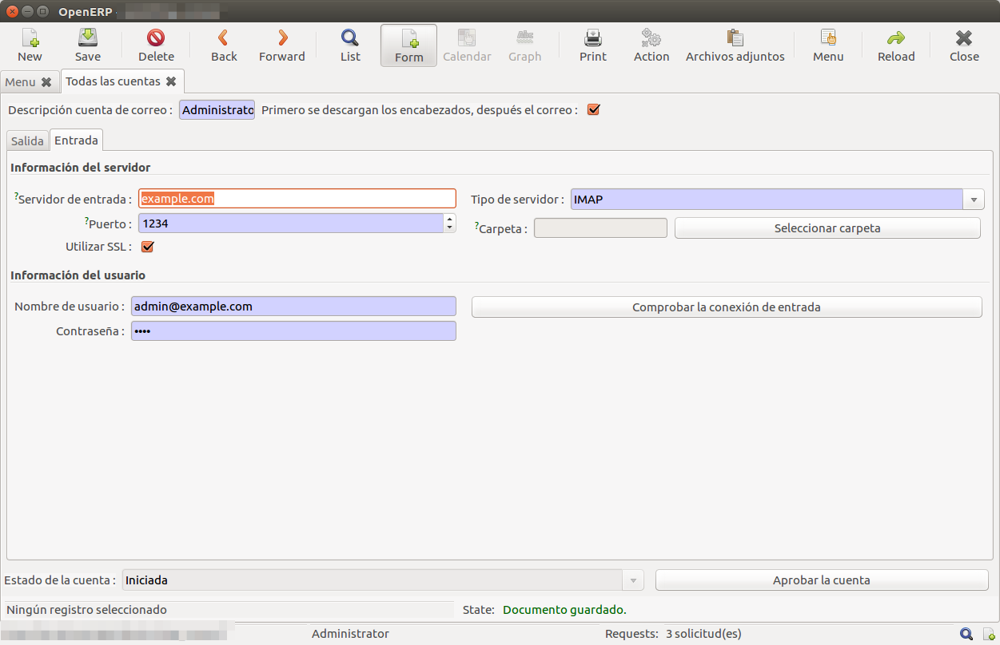

!!! Note "Nota"
    Si el camp `servidor d'entrada` està buit, no es configura com a compte de
    recepció i per tant la resta de camps no són obligatoris.

!!! Nota "Nota"
    Per la recepció de correus per la companyia, cal inicialitzar el compte
    com un [compte per enviament de la companyia](#compte-per-lenviament-de-correu-de-la-companyia).

De la mateixa manera que amb la configuració de comtpes de sortida. Una vegada
introduïdes les dades necessaries, es pot comprobar la connexió mitjançant el
botó `Comprobar la connexió d'entrada`.

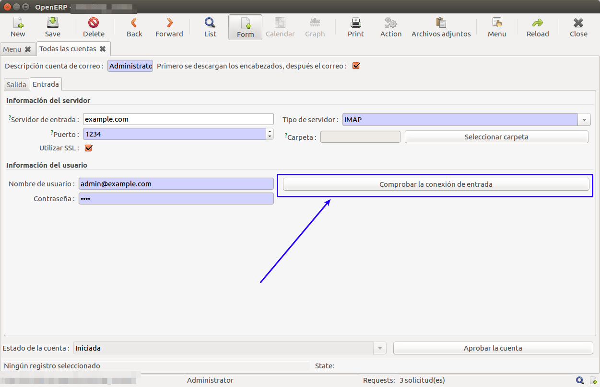

### Aprobar un compte PowerEmail

Després de la
[creació d'un compte PowerEmail](#creacio-dun-compte-poweremail)
o de
la reactivació d'un compte PowerEmail ,
es pot aprobar un compte PowerEmail.

Si tots els camps estan plens, es pot aprobar el compte utilitzant el botó
`Aprobar el compte`.

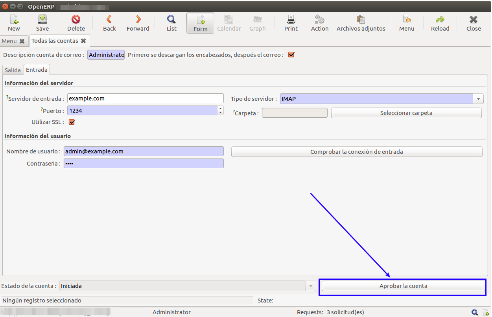

Quan un compte està aprobat es pot utilitzar la funcionalitat `enviar/rebre`
per enviar i rebre tots els correus pendents en el compte.

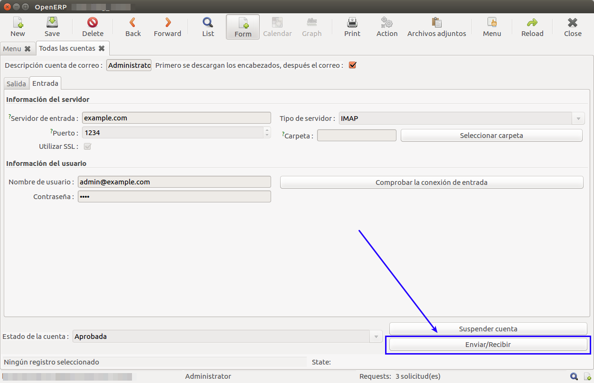

Alternativament es pot utilitzar la funcionalitat `enviar aquest correu` des
d'un `poweremail_mailbox`.

### Suspensió d'un compte de PowerEmail

Si es desitja deixar d'enviar o rebre correus per un
[compte PowerEmail aprobat](#aprobar-un-compte-poweremail), podem suspendre el
compte per a que quedi en estat `suspesa`.

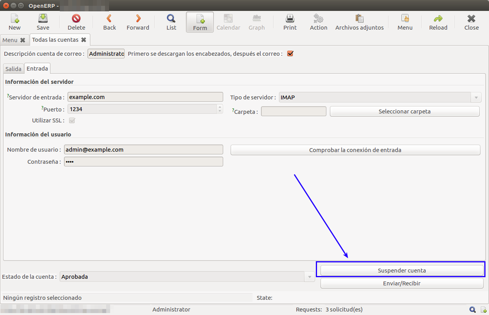

### Reactivació d'un compte PowerEmail

Quan un compte està suspés, és pot reactivar mitjançant el botó `solicitar
reactivació` fent que passi al estat `esborrany` tornant a habilitar el botó
`Abrobar el compte`.

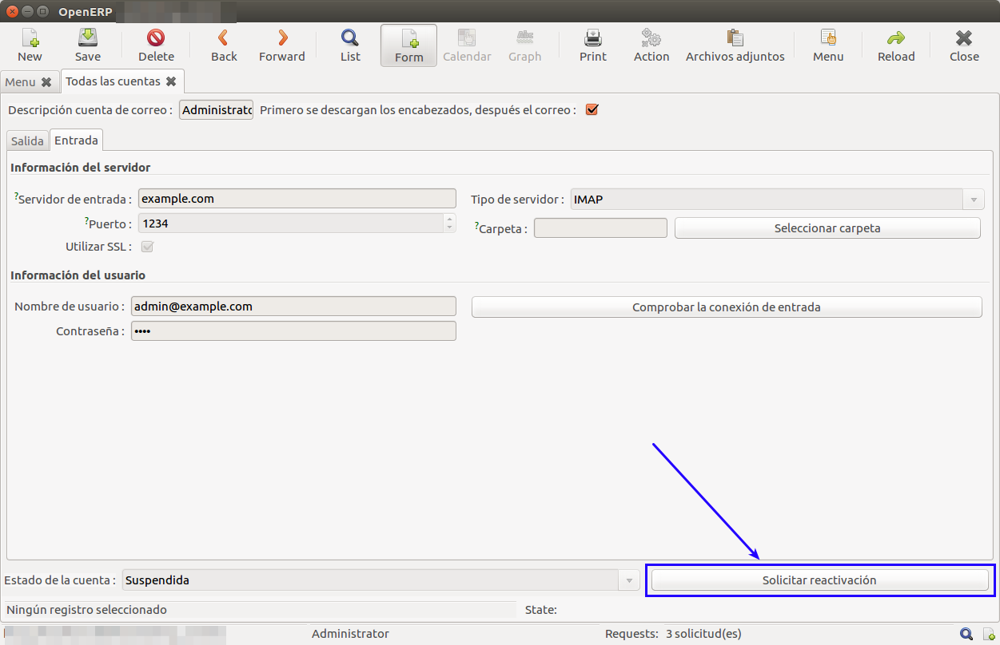

## Gestió de Bústies de correu

Segons la configuració utilitzada en la [creació d'un compte PowerEmail](#creacio-dun-compte-poweremail),
Els correus enviats o rebuts es trobaran en el menú de bústies "`Personal`", quan
el compte està assignat al nostre usuari, o "`Companyia`", quan el nostre usuari
està assignat a la mateixa companyia que el compte de correu (per l'usuari
que té assignat) i el compte és un "`Compte de la companyia`".

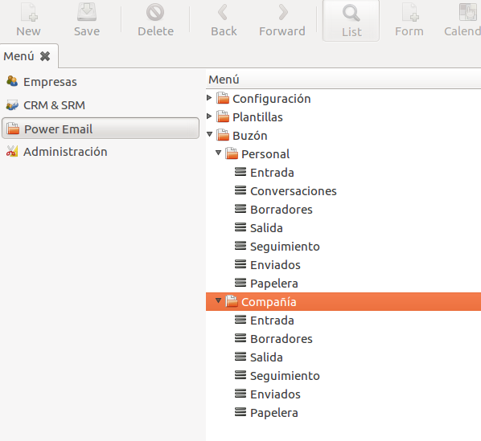

Les bústies funcionen de forma intuïtiva:

| Tipus de Bústia | Descripció                                                   |
|:---------------:|:-------------------------------------------------------------|
| Converses       | (Només personal) Conté els correus relacionats pel assumpte  |
| Entrada         | Correus rebuts                                               |
| Esborrany       | Correus que escriu un usuari, però no es volen enviar encara |
| Enviats         | Correus ja enviats                                           |
| Seguiment       | Correus on estem com a observadors                           |
| Sortida         | Correus pendents d'enviar                                    |
| Papelera        | Correus esborrats                                            |

!!! Note "Nota"
    Les bústies no distingeixen entre els diversos comptes configurats per
    l'usuari i companyia del usuari.

## Gestió de Plantilles PowerEmail
