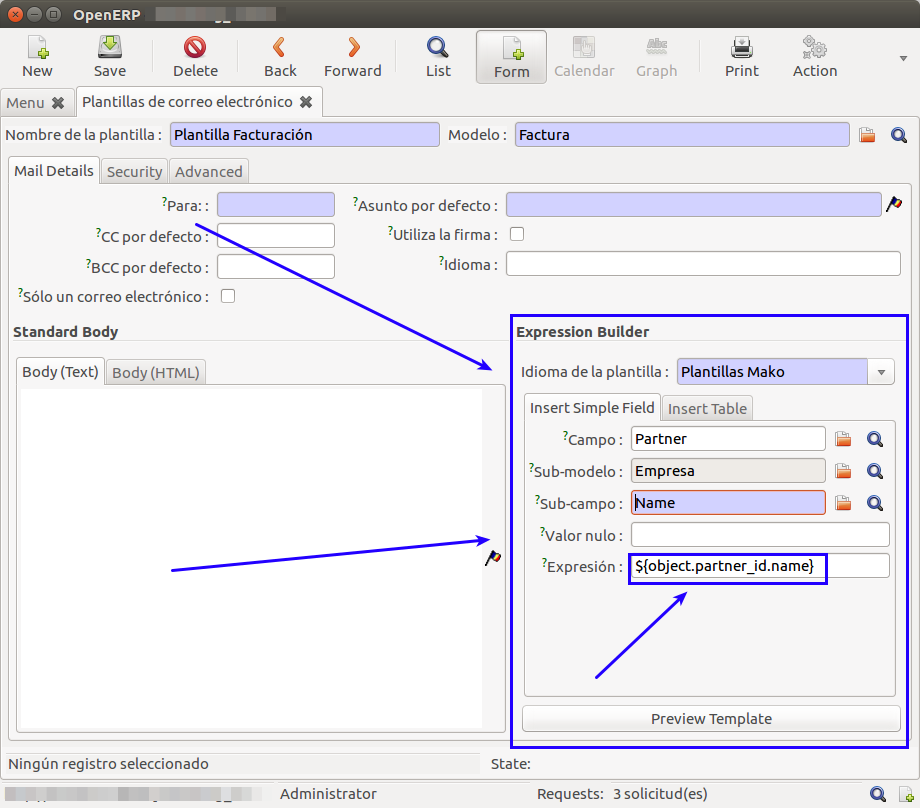
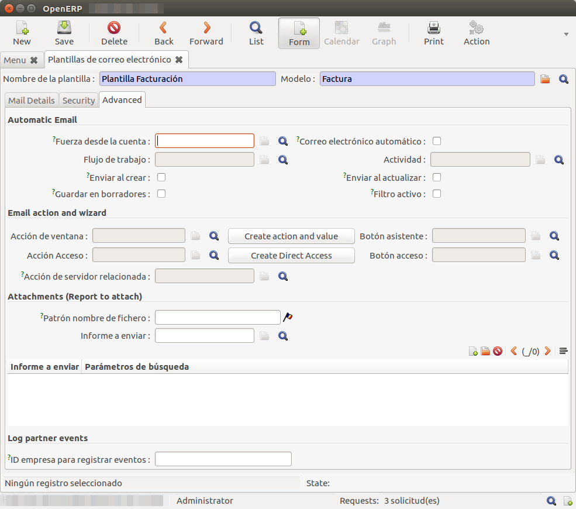

# Documentació del mòdul de PowerEmail

Aquest mòdul no està integrat en el codi de l'ERP, però està disponible a
[GitHub/gisce/PowerEmail](https://github.com/gisce/poweremail).

## Instal·lació

Aquest mòdul no està integrat en el codi de GISCE-ERP, pel que cal descarregar-lo
com un repositori apart. Des de GISCE-TI tenim un FORK a GitHub on mantenim la
branca `v5_backport`, ja que aquest mòdul està pensat per Odoo i nosaltres
utilitzem la versió 5 d'OpenERP.

Com tots els mòduls externs, cal realitzar els links adients a la carpeta
d'OpenERP `server/bin/addons`.

Com que s'ha canviat el codi, caldrà reiniciar el servidor (o iniciar-lo en un
altre port) i procedir a la instal·lació com qualsevol mòdul d'OpenERP.

Una vegada instal·lat el mòdul, ja disposarem de diferents vistes noves en un
nou menú:

## Configuració de Comptes PowerEmail

### Creació d'un compte PowerEmail

PowerEmail funciona amb comptes _smtp_. Tant si volem enviar com si volem rebre
correus, és necessari afegir un compte PowerEmail.

En un mateix compte s'hi pot configurar l'entrada o sortida de correu.

Per afegir un compte, cal accedir al menú "**Menú OpenERP → PowerEmail →
Configuració → Tots els comptes**" i fer _click_ al botó `NEW`.

Independentment del tipus de compte a crear, sempre cal inicialitzar el `nom
del compte`. Aquest ha de ser únic entre els comptes PowerEmail.

#### Compte per l'enviament de correu electrònic

Quan creem (o editem) un nou compte de PowerEmail, ens mostrarà un formulari
amb els camps necessaris per la connexió amb un servidor _smtp_.

Es disposa dels camps:

|          Nom del Camp            |                                  Descripció                                |
|:--------------------------------:|:---------------------------------------------------------------------------|
| Servidor                         | Nom del servidor de correu                                                 |
| Port SMTP                        | Port SMTP utilitzat per el servidor de correu                              |
| Utilitzar TLS                    | Si es desitja utilitzar transmissió segura mitjançant claus                |
| ID correu electrònic             | Nom del correu electrònic a utilitzar en el servidor                       |
| Nom d'usuari                     | Nom d'usuari a utilitzar en el servidor (Per defecte el correu electrònic) |
| Contrasenya                      | Contrasenya a utilitzar en el servidor                                     |
| Usuari Relacionat                | Usuari del OpenERP relacionat amb aquest compte de PowerEmail              |
| Compte de correu de la companyia | Si es desitja configurar com a compte de la companyia                      |
| Format del correu electrònic     | Format a utilitzar per construir el "body" del correu                      |

Una vegada entrats els valors, es pot comprovar la connexió amb el servidor
_smtp_ amb el botó `comprovar connexió de sortida`.

##### Compte per l'enviament de correu de la companyia

Creant un compte normal per a l'enviament de correu electrònic, caldrà
seleccionar el camp `Compte de correu de la companyia` amb el valor `Si`.

Això farà que ens aparegui una pestanya `seguretat` en la vista del compte.

Per tal d'utilitzar un compte de companyia és necessari assignar un grup
d'usuaris al compte. En la pestanya `seguretat` es pot seleccionar quins
grups poden utilitzar aquest compte que estem creant.

!!! Note "Exemple"
    Podem fer un compte genèric afegint el grup `Employee`.

    

#### Compte per la recepció de correu electrònic

Aquest tipus de comptes extenen els comptes d'enviament de correu electrònic.
Per aquest motiu, cal realitzar prèviament les
[configuracions per comptes d'enviament](#compte-per-lenviament-de-correu-electronic).

Accedint a la pestanya `entrada` podem configurar la recepció de correu
mitjançant PowerEmail. En aquesta pestanya es mostren els camps necessaris per
la connexió i obtenció de correus per un compte.

!!! Note "Nota"
    Si el camp `servidor d'entrada` està buit, no es configura com a compte de
    recepció i per tant la resta de camps no són obligatoris.

!!! Nota "Nota"
    Per la recepció de correus per la companyia, cal inicialitzar el compte
    com un [compte per enviament de la companyia](#compte-per-lenviament-de-correu-de-la-companyia).

De la mateixa manera que amb la configuració de comptes de sortida, una vegada
introduïdes les dades necessaries, es pot comprovar la connexió mitjançant el
botó `comprovar la connexió d'entrada`.

### Aprovar un compte PowerEmail

Després de la [creació d'un compte PowerEmail](#creacio-dun-compte-poweremail)
o de
[la reactivació d'un compte PowerEmail](#reactivacio-dun-compte-poweremail),
es pot aprovar un compte PowerEmail.

Si tots els camps estan plens, es pot aprovar el compte utilitzant el botó
`Aprovar el compte`.

Quan un compte està aprobat es pot utilitzar la funcionalitat `enviar/rebre`
per enviar i rebre tots els correus pendents en el compte.

Alternativament es pot utilitzar la funcionalitat `enviar aquest correu` des
d'un `poweremail_mailbox`.

### Suspensió d'un compte de PowerEmail

Si es desitja deixar d'enviar o rebre correus per un
[compte PowerEmail aprobat](#aprovar-un-compte-poweremail), podem suspendre el
compte per a que quedi en estat `suspesa`.

### Reactivació d'un compte PowerEmail

Quan un compte està suspès, es pot reactivar mitjançant el botó `solicitar
reactivació` fent que passi a l'estat `esborrany` tornant a habilitar el botó
`Aprovar el compte`.

## Gestió de Bústies de correu

Segons la configuració utilitzada en la [creació d'un compte PowerEmail](#creacio-dun-compte-poweremail),
els correus enviats o rebuts es trobaran en el menú de bústies "`Personal`", quan
el compte està assignat al nostre usuari, o "`Companyia`", quan el nostre usuari
està assignat a la mateixa companyia que el compte de correu (per l'usuari
que té assignat) i el compte és un "`Compte de la companyia`".

Les bústies funcionen de forma intuïtiva:

| Tipus de Bústia | Descripció                                                   |
|:---------------:|:-------------------------------------------------------------|
| Converses       | (Només personal) Conté els correus relacionats per l'assumpte|
| Entrada         | Correus rebuts                                               |
| Esborrany       | Correus que escriu un usuari, però no es volen enviar encara |
| Enviats         | Correus ja enviats                                           |
| Seguiment       | Correus on estem com a observadors                           |
| Sortida         | Correus pendents d'enviar                                    |
| Papelera        | Correus esborrats                                            |

!!! Note "Nota"
    Les bústies no distingeixen entre els diversos comptes configurats per
    l'usuari i companyia de l'usuari.

### Correus PowerEmail

En obrir un correu d'una bústia o creant un nou correu dins d'una bústia, ens
trobem amb diversos camps.

Com podem veure, el ERP ens desglossa tots els camps típics del correu electrònic.

En aquesta pàgina únicament cal destacar els següents camps:

|            Camp            |  Descripció                                                        |
|:--------------------------:|:-------------------------------------------------------------------|
| Data de recepció/Enviament | Data en què s'ha rebut o enviat el correu en el servidor de correu |
|          Rebut el          | Data en què el ERP va importar el correu electrònic                |
|         Prioritat          | Paràmetre utilitzat a l'ERP per a filtres en les bústies            |

També cal destacar el botó `Enviar Correu` que permet el reenviament del correu.

En la pestanya _Adjunts_ es poden trobar els diferents fitxers adjunts que s'han
enviat o rebut en el correu electrònic.

En la pestanya _Raw Content_ es troba tot el correu electrònic en format de text pla.

En la pestanya _Avançat_ s'hi troben les configuracions relacionades amb el compte
de PowerEmail i amb les tasques realitzades amb aquest correu en l'historial
(vegades enviat, rebut o mogut de bústia).

!!! Note "Nota"
    Aquesta pestanya conté dades relacionades amb el tipus de missatge a enviar,
    el compte a utilitzar i referències del servidor de correu.
    Per aquest motiu, tot i que es puguin editar els camps, no és aconsellable
    canviar-los.

### Converses PowerEmail

El mòdul poweremail permet mantenir converses de correu electrònic, és a dir,
detecta quan un correu és una resposta a un dels correus enviats o si un correu
enviat és la resposta d'un rebut.

Aquests correus es troben en una bústia especial en la carpeta "**Personal**".

Símplement es mostra una llista de les converses que s'ha tingut, amb quin usuari
i quants correus hi ha a la conversa.

Si entrem en una conversa únicament es mostra una llista de correus que són els
que estan relacionats amb la conversa.

## Gestió de Plantilles PowerEmail

Podem trobar totes les plantilles en el menú "**Menú OpenERP → PowerEmail →
Plantilles de PowerEmail**".

Totes les plantilles tenen les mateixes configuracions essencials, excloent
les típiques configuracions d'un correu:

+------------------------+------------------------------------------------------------+
|      Nom del camp      | Descripció                                                 |
+========================+============================================================+
|   Nom de la plantilla  | Referència a utilitzar per aquesta plantilla.              |
+------------------------+------------------------------------------------------------+
|           Model        | Model relacionat amb aquesta plantilla.                    |
|                        | Permet l'ús de camps d'aquest model.                       |
+------------------------+------------------------------------------------------------+
| Idioma de la plantilla | Llenguatge utilitzat en la generació del correu des de les |
|                        | dades de la plantilla                                      |
+------------------------+------------------------------------------------------------+

Cal emplenar aquests camps per utilitzar les plantilles, juntament amb els camps
referents al correu a enviar, com per a qui seria el correu, l'assumpte o el cos
del missatge.

!!! Tip "Consell"
    Es pot utilitzar l'assistent d'expressions per generar el codi per obtenir
    el valor d'un camp del model de la plantilla.

    

Tots els camps referents a la generació del correu (adreces i cos del missatge)
són analitzats per si són del llenguatge de la plantilla, és a dir, s'hi poden
utilitzar les expressions generades en l'assistent.

La pestanya de seguretat, permet definir quins usuaris poden utilitzar aquesta
plantilla per enviar correus.

Per altra banda, a la pestanya `Avançat` hi podem trobar diverses utilitats.

En la primera secció, podem configurar automatismes de cares a l'enviament del
correu:

+------------------------+------------------------------------------------------------+
|      Nom del camp      | Descripció                                                 |
+========================+============================================================+
| Forçar des del compte  | Utilitzar sempre un compte de PowerEmail quan es generi    |
|                        | un correu electrònic des de l'actual plantilla.            |
+------------------------+------------------------------------------------------------+
|                        | Cada vegada que s'actualitza un registre del model         |
|                        | mitjançant un `Flux de treball`, generarà un correu        |
| Correu electrònic      | electrònic utilitzant aquesta plantilla.                   |
| automàtic.             | (requereix `Forçar des del compte`, `Flux de treball` i    |
|                        | `Activitat`)                                               |
+------------------------+------------------------------------------------------------+
| Flux de treball        | Quan el Correu automàtic està activat, cal assignar un flux|
+------------------------+------------------------------------------------------------+
| Activitat              | Estat del Flux de Treball on s'activarà el correu automàtic|
+------------------------+------------------------------------------------------------+
| Enviar al crear        | Permet l'enviament automàtic dels correus generats per la  |
|                        | plantilla.                                                 |
+------------------------+------------------------------------------------------------+
| Guardar en borradors   | Guarda els correus generats en la carpeta `esborranys`     |
|                        | enlloc de en la carpeta `sortida`.                         |
+------------------------+------------------------------------------------------------+
| Enviar al actualitzar  | Cada vegada que es modifica un registre del model es       |
|                        | genera un nou correu mitjançant aquesta plantilla.         |
+------------------------+------------------------------------------------------------+
| Filtre actiu           | Permet utilitzar un filtre amb python per evitar la creació|
|                        | de correus mitjançant la plantilla.                        |
+------------------------+------------------------------------------------------------+

En la segona secció, podem configurar la creació d'accions o assistents per
l'enviament de correus electrònics utilitzant aquesta plantilla.

Com es pot observar els camps de referència en aquesta secció són únicament
de lectura. Això és per tal de generar una acció o assistent mitjançant únicament
els botons que es proporcionen:

- `Create action and value`: Afegeix un assistent mitjançant acció en el model assignat.
- `Crear accés directe`: Afegeix un accés directe als correus/plantilles
  que utilitzen el model seleccionat.

Finalment existeix una secció per afegir informes generats per una acció de l'ERP.
En aquesta secció es poden forçar aquests informes com a fitxers adjunts.

Per un costat es pot afegir un únic informe relacionat amb el model de la plantilla
i canviar-li o assignar-li un nom per defecte.
Per altra banda es pot utilitzar la taula inferior per afegir tots els informes
desitjats amb el nom per defecte que es vulgui i afegir-hi paràmetres de cerca.
