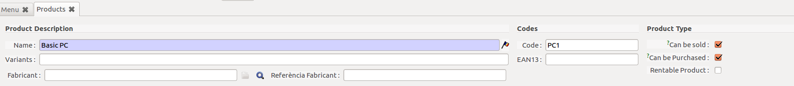

# Gestió de Productes

## Productes

Es pot trobar els productes en la ruta "**_OpenERP Menú > Productes > Productes_**"

### Fitxa del Producte

La Fitxa del producte representa un Model de Producte utilitzat en qualsevol dels processos del ERP.
En la fitxa del producte podem trobar els camps bàsics d'un producte:

| Camp              | Descripció                                                                 |
|-------------------|----------------------------------------------------------------------------|
| Nom del producte  | Text amb el nom del producte, utilitzarem el format <Descripció> - <model> |
| Variants          | Noms alternatius del produte o model                                       |
| Code              | Codi del model/produte                                                     |
| EAN13             | Codi utilitzat per la generació de codis de barra EAN13                    |
| Tipus de Producte | Defineix si es pot vendre, comprar o llogar el producte                    |

!!! Tip "Extensió"
    Com a extensió es poden afegir els camps de Fabricant:

    | Camp                 | Descripció                                             |
    |----------------------|--------------------------------------------------------|
    | Fabricant            | Contacte (Empresa del Fabricant al ERP |
    | Referència Fabricant | Codi intern utilitzat per la referència d'un Fabricant |

En aquesta mateixa fitxa podem trobar diferents seccions (pestanyes) on trobariem
configuracions més específiques.

#### Informació

#### Abastecimiento y localizaciones

#### Preus i Proveïdors

#### Descripcions

#### Característiques

En aquesta pestanya podem configurar característiques específiques d'un
 producte. Aquestes característiques no són genériques sino que apliquen a un
 producte o tipus de producte en concret.

!!! Tip "Extensió"
    Aquesta pestanya és una extensió i cal especificar que es requerida

#### Empaquetament

