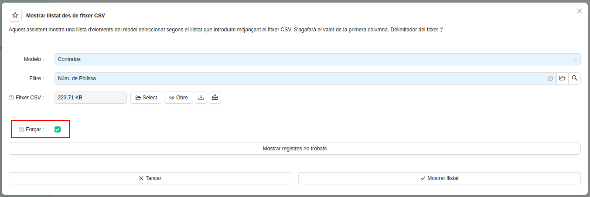

#Pujar un CSV a l’ERP

L'ERP disposa de l’opció de carregar un CSV amb un llistat concret (de pòlisses, de números de factures, etc.) i que 
aquest es mostri a una pestanya concreta de l’ERP.

Aquesta eina la podem trobar a: **Menú > Facturació > Mostrar llistat des de CSV** o a
**Menú > Gestió de Pòlisses > Mostrar llistat des de CSV**, per exemple.

L'acció obrirà un assistent en una finestra emergent:

El Model és el llistat on volem que aparegui el llistat que pugem el CSV, tenim diverses opcions, com són per exemple:
    • Pòlisses
    • Factures (de clients)
    • Fitxers F1 importats
    • Pòlisses en un lot de facturació

Cada un dels models té unes opcions concretes de llistats de CSV, com són el camp `Filtre` (Informació que ha de contenir
el fitxer csv).

--------------------------
| **Model** | **Filtre**                                                                                     |
| ----------- |------------------------------------------------------------------------------------------------|
| Pòlisses | Núm. de Pòlissa, Id. de Pòlissa, CUPS                                                          |
| Factures (Client) | Núm. de Factura (client), Id. de Factura, Núm. de pòlissa, CUPS                                |
| Fitxers F1ns importats | Nom del fitxer (dubte de quin nom és exactament), Núm. factura origen, Id. del fitxer F1, CUPS |
| Pòlisses Lot (és el mateix que pòlisses amb incidència)| CUPS, Núm. de pòlissa                                                                          |

Els CSV han de contenir un llistat amb la informació que hem posat al camp `Filtre`, sense cap altra informació. 
Podeu consultar el protocol que explica com crear un CSV a partir d’un llistat de l’ERP.

En el cas que el CSV contingui altra informació que no sigui exclusivament la demanada per l’assistent, ens apareixerà 
el següent missatge:

Hi ha dues opcions:

1. Revisar el CSV a partir d’un programa tipus Excel o un editor de text compatible per treure manualment les dades que 
fan que no s’importi el llistat en CSV al no complir el format esperat.
2. Forçar la importació amb la casella `Forçar` que apareix a l’assistent.

