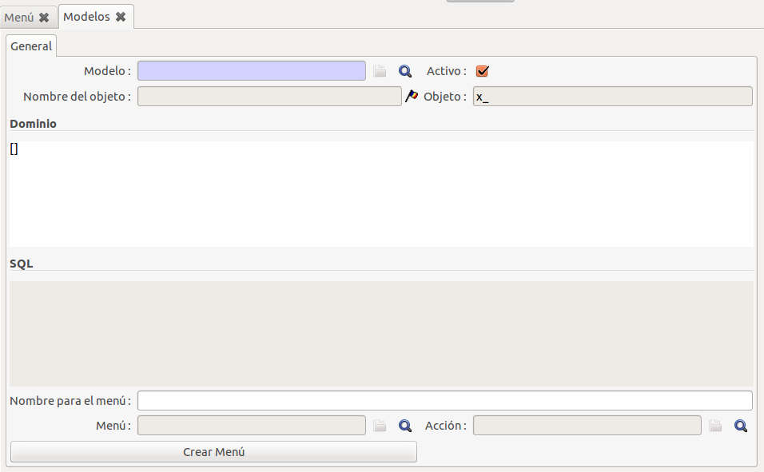
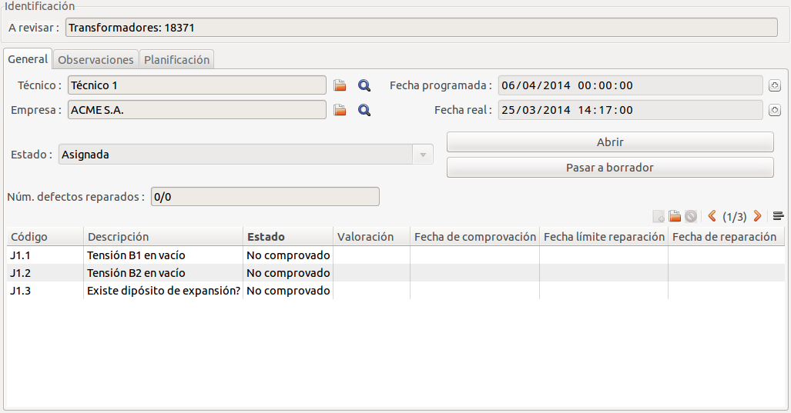

# Documentació del mòdul de Revisions Internes


## Introducció


El mòdul de revisions internes ens permetrà portar un control de ítems a revisar
per tots els models que volguem que estiguin dins l'ERP.
És un sistema semblant als reconeixements de la normativa 328/2001 però en aquest
cas les revisions no són només per línies d'alta tensió i centres transformadors
sino que podrem fer revisions a qualsevol model.

S'han de definir quins models volem revisar i configurar les normatives per tal
que a cada model ens apliqui els ítems que volem revisar.


## Conceptes


Per entrendre el funcionament del mòdul de revisions internes, cal tenir clar
alguns conceptes.


#### Normatives

Les normatives ens permetran configurar quins ítems volem revisar. Les normatives
permeten definir a quin model i dins d'aquest model afegir una restricció per
alguns que compleixin unes característiques específiques. Aquestes restriccions
es defineixen amb un llenguatge propi de l'ERP anomenats _dominis_ que en parlarem
més endavant.


#### Valoracions

Ens permet definir quin nivell de gravetat és l'item que s'està revisant en cas
que no estigui complint. Les valoracions estan formades per un text descriptiu
de la valoració i una configuració del temps límit de reparació dels ítems que
tinguin assignada aquesta valoració.


#### Models

Els models són els objectes de l'ERP que volem revisar, per exemple Línies
d'Alta, Pòlisses, CUPS, Transformadors, Centres Transformadors, Comptadors,
Números de sèrie, Productes, etc.


#### Revisions

Les revisions són els models concrets que s'han de revisar.


## Configuració


### Configuració d'un model

Primer de tot s'ha de configurar quin model volem revisar, introduïnt un model
després serem capaços de configurar una normativa per a aquest model i fer-li
una revisió.

Això ho podrem fer a través del _"Menú principal > Revisions Internes >
Configuració > Models"_


Per crear un nou model simplement cliquem a **Nou** com fem amb la resta de
formularis de l'ERP.





En el formulari tenim els següents camps:

* **Model**: A través d'aquest camp seleccionarem quin model és el que volem
  configurar.
* **Actiu**: Ens servirà per marcar si un model està actiu o no per fer-li
  revisions. És útil quan es dóna el cas que hem configurat un model i a
  partir d'un determinat moment no volem continuar tenint-lo, el podem
  desactivar i així no apereixarà més en el llistat. **Sempre s'ha de
  desectivar i mai eliminar**.
* **Nom de l'objecte**: És el nom descriptiu per aquest model dins de l'ERP.
* **Objecte**: És el nom intern d'aquest objecte.
* **Domini**: És una expressió que ens permetrà aplicar un filtre als registres
  que formen part d'aquest model.
* **SQL**: És un camp que ens mostrarà el domini transformat en SQL per si ens
  interessa provar si els resultats són else esperats.
* **Nom pel menú**: S'utilitzarà aquest valor per escriure el nom al menú, en
  cas que estigui en blanc, s'utilitzarà el nom de l'objecte.
* **Menú**: El menú que es crearà per tal d'accedir a les revisions d'aquest
  model.
* **Acció**: L'acció que executarà el menú per visualitzar les revisions
  d'aquest model.

També hi ha el botó:

* **Crear Menú**: Ens servirà per crear el menú per tal de poder accedir
  exclusivament a les revisions d'aquest model i per crear revisions d'aquest
  model.
  Per defecte crea el menú a _"Menú > Revisions Internes > Revisions >
  Revisions de XXXXXX_" on **XXXXXX** és el text del camp **Nom del menú** i en
  cas que aquest estigui en blanc utilitzarà el valor de **Nom de l'objecte**.
  Si quan apretem el menú el menú ja existeix, l'elimina i el torna a crear, això
  vol dir que si hem mogut el menú, ens el tornarà a deixar en el menú per
  defecte.

Per definir el model primer de tot hem d'escollir quin model de l'ERP volem,
això ho podrem fer amb el camp **Model** a través de la lupa de la dreta. Un
cop es fa la cerca podem boscar per diferents camps, com per exemple amb el nom
del model com es veu a la captura següent:


O també pel nom intern si el sabem a través del camp **Objecte** com es veu a
la següent captura:


Un cop l'haguem escollit ja podem **guardar** el registre i automáticament se'ns
emplenarant la resta de camps a excepció del Menú i de l'Acció. Seguidament
podem apretar el botó de **Crear Menú** i ja ens haurà creat el menú per aquest
model.


Refrescant el menú principal, podrem veure com ens ha creat el submenú per les
revisions del model que hem configurat.


### Configuració d'una Normativa

Un cop tinguem el model configurat, passem a configurar normatives per a aquest
model.

Podrem configurar i veure les normatives a través de _"Menú > Revisions
Internes > Configuració > Normatives"_


Per tal de crear una normativa nova, hem d'apretar el botó de **Nou** igual que
la resta de formularis de l'ERP.

En el formulari tenim diferents camps que s'expliquen a continuació:

**Pestanya General**


* **Normativa**: Nom i descripció de la normativa.
* **Model**: Indica a quin model dels que hem configurat fa referència. Sempre s'ha de
  tenir configurat el model abans de configurar una normativa.
* **Activa**: Informa de si la normativa està activa o no. Sempre s'ha de desactivar i mai
  eliminar, ja que sino podem perdre històric de dades.
* **Data inici**: Data en la que es pot aplicar aquesta normativa.
* **Data final**: Data en la que s'acaba la vigència d'aqueta normativa.
* **Domini del model**: És l'expressió base que hem definit en el model.
  La normativa sempre utilitzarà la suma del domini del model més el seu domini
  propi.
* **Domini**: És una expressió que ens permetrà aplicar aquesta normativa a un
  conjunt específic de registres del model que compleixin les carecterístiques
  que definirem en el domini.
* **SQL**: És un camp que ens mostrarà el domini transformat en SQL per si ens
  interessa provar si els resultats són els esperats.

!!! note
    Les dates s'utilitzen a l'hora d'assignar els ítems a revisar i es fa
    segons la data de la revisió.

Les normatives estan pensades per tal que siguin reaprofitables i es poden
crear normatives **concretes** i normatives més **generals**.

En el següent exemple només aplicarem la normativa als transformadors que la
marca sigui _JARA_, per això hem d'estabilir el domini.

```
    [       
        ('id_marca.name', '=', 'JARA')
    ]
```

Després quan guardem podem veure l'SQL que ens genera, que pot ser diferent
per a cada base de dades.

```
   SELECT giscedata_transformador_trafo.*
   FROM giscedata_transformador_trafo
   WHERE (giscedata_transformador_trafo.id_marca in (5))
```


!!! note
    Abans de crear ítems a revisar s'ha d'haver guardat la normativa.

**Pestanya Ítems a revisar**


En aquesta pestanya hi trobarem el llistat de tots els ítems que s'han de
revisar per aquesta normativa.

Per tal d'afegir un ítem a revisar, hem d'apretar el botó de nou que es troba
en el llistat d'ítems.


En el formulari per la creació d'ítems hi tenim els següents camps:

* **Codi**: Un codi que identificarà aquest ítem dins d'una revisió.
* **Tipus de camp**: En el cas que aquest ítem no sigui vàlid dins d'una revisió,
  quina entrada de dades haurà de fer la persona que la estigui fent.
>  * **Boleà**: Només identificarà si és incorrecte
>  * **Numèric**: Quan l'ítem sigui incorrecte haurà d'introduïr un valor numèric.
>  * **Text**: Quan l'ítem sigui incorrecte haurà d'introduïr un text.
* **Normativa**: La normativa a la qual pertany aquest ítem.
* **Actiu**: Si l'ítem està actiu o no. Si el desmarquem d'actiu a les següents
  revisions no s'assignarà aquest ítem a la revisió.
* **Ordre**: Ordre d'aquest ítem dins la revisió, serveix per organitzar els
  ítems dins d'una revisió si els volem revisar en un cert ordre.
* **Descripció**: Text informatiu de l'ítem.


I en la següent imatge podem veure el llistat de tots els ítems a revisar


###Configuració de les valoracions

Les valoracions les podem trobar a través de _"Menú > Revisions Internes >
Configuració > Valoracions"_


Per tal de crear una valoració nova, hem d'apretar el botó de **Nou** igual que
la resta de formularis de l'ERP.

En el formulari tenim diferents camps que s'expliquen a continuació:


* **Valoració**: Text informtiu de la valoració
* **Actiu**: Aquesta valoració està activa o no.
* **Temps**: Quantitat de temps que pot passar, dependrà del valor que
  definim en el camp **Unitat**.
* **Unitat**: Tipus d'interval de temps que hi haurà per reparar l'ítem de la
  revisió que estigui marcat com a incorrecte i tingui aquesta valoració.
> * **Dia**
> * **Mes**
> * **Any**


També disposem del llistat de totes les valoracions que tenim configurades.


## Creació d'una revisió per un model ja configurat


Per tal de crear una revisió per un model configurat ho podem fer a través de
_"Menú > Revisions Internes > Revisions > Revisions de XXXXXX"_ on **XXXXXX** és
el nom del model que volem revisar.


!!! note
    El menú _"Menú > Revisions Internes > Revisions"_ mostra **totes** les
    revisions definides sense filtrar el model.

Per tal de crear una revisió nova, hem d'apretar el botó de **Nou** igual que
la resta de formularis de l'ERP.


En el formulari d'una revisió es poden diferenciar diferents parts.





Una part general per tal d'identificar la revisió on hi ha els camps:

* **A revisar**: Ens permet seleccionar per a quin registre volem crear la
  revisió. Si venim del menú específic només ens deixarà triar aquest tipus de
  model, però si venim del menú general de **Revisions** en aquesta llista podrem
  seleccionar tots els models que tenim configurats.
  Primer de tot s'ha de seleccionar el model (part esquerra) i després
  seleccionar el registre a través de la lupa (part dreta)

**Pestanya General**

* **Tècnic**: Persona pròpia de l'empresa que farà la revisió.
* **Empresa**: Empresa que durà a terme la revisió, pot ser la pròpia o una
  externa (p.ex. subcontractació)
* **Data programada**: Data i hora en que està previst realitzar aquesta revisió.
  Aquest s'utilitza més endavant per planificar les futures revisions.
* **Data real**: Data i hora real en que es realitza la revisió. Només es pot
  escriure en aquest camp quan la revisió està en estat **Oberta**
* **Estat**: Estat de la revisió. Serveix per diferenciar unes revisions de les
  altres i saber en quin estat es troben.
>  * **Esborrany**: S'està preparant la revisió, però encara no hi ha cap valor
    que sigui permanent i és poden produïr canvis.
>  * **Assignada**: Quan es passa en aquest estat es comproven les normatives que
    afecten a aquest registre i se li assignen els ítems a revisar. En aquests
    moments la revisió es dona per preparada i queda pendent que el tècnic i/o
    empresa encarregats de la revisió la comencin.
>  * **Oberta**: La persona que fa la revisió ha començat a revisar i hi està
    treballant. En aquests moments els ítems a revisar es poden modificar per
    tal de dir si un ítem és incorrecte o no i quina valoració té.
>  * **Tancada**: La revisió es dona per finalitzada.

* **Núm. defectes reparats**: Un indicador del tipus _X/Y_ on es mostra de tots
  els ítems que hi ha marcats com a incorrectes (_Y_), quants n'hi ha de reparats
  (_X_).

**Pestanya Observacions**


* **Observacions**: Camp de text per escriure observacions de la revisió.

**Pestanya Planificació**


* **Periodicitat quantitat**: Número en temps que depèn del camp **Periodicitat
  tipus**.
* **Periodicitat tipus**: Tipus de temps a aplicar per planificar la següent
  revisió.

!!! note
    El camp **Núm. defectes reparats** només mostra informació vàlida quan
    l'estat de la revisió és **Tancada**.

Les revisions s'han de deixar en estat **Assignat**.


### Diagrama de fluxe d'una revisió

blockdiag {
    Borrador <-> Asignada <-> Abierta <-> Cerrada;
}


+-----------+----------------+----------------------------------------------------------+
| Estat     | Persona        | Tasca                                                    |
+===========+================+==========================================================+
| Esborrany | Administrador  |  S'està preparant la revisió, configurant el model, la   |
|           |                |  data planificació, tècnic i empresa que realitzarà la   |
|           |                |  revisió                                                 |
+-----------+----------------+----------------------------------------------------------+
| Assignada | Administrador  | Ja s'ha preparat la revisió. En el moment de passar-la   |
|           |                |  a assignada s'assignaran tots els ítems de les          |
|           |                |  normatives vinculades a aquest model i que el registre  |
|           |                |  complexi amb el domini de les normatives.               |
|           |                |  En aquest moment, la revisió ja està a punt perquè la   |
|           |                |  persona que la de duu a terme ho faci.                  |
+-----------+----------------+----------------------------------------------------------+
| Oberta    | Tècnic/Empresa | La persona responsable de fer la revisió comença.        |
|           |                |                                                          |
| Tancada   | Tècnic/Empresa | La persona que ha fet la revisió ha finalitzat la feina. |
+-----------+----------------+----------------------------------------------------------+

#### Comprovació d'ítems

1. Passar l'estat de la revisió a **Oberta**.
2. Assignar la **Data real** en què es duu a terme la revisió.
3. Comprovar tots els ítems que tenim per revisar, anant un a un fent doble clic
   a l'ítem i modificant els valors del formulari
4. Passar l'estat de la revisió a **Tancada**.


### Modificació dels ítems a revisar


En el formulari d'un ítem a revisar trobem els següents camps:

* **Codi**: És el mateix codi que s'ha configurat per la normativa.
* **Normativa**: Normativa a la qual pertany aquest ítem a revisar.
* **Descripció**: Descripció de l'ítem a revisar que s'ha configurat a la
  normativa.
* **Estat**: En quin estat es troba aquest ítem.

>  * **No comprovat**: Encara no s'ha comprovat aquest ítem de la revisió.
>  * **Correcte**: L'ítem està correcte. S'haurà d'introduïr la **data de
    comprovació** i segons el tipus d'entrada que s'hagi configurat per aquest ítem
    en la normativa, haurem d'introduïr un **valor** en forma de text o númeric.
>  * **Incorrecte**: L'ítem està incorrecte. S'haurà d'introduïr la **data de
    comprovació**, una **valoració** i segons el tipus d'entrada que s'hagi
    configurat per aquest ítem en la normativa, haurem d'introduïr un **valor**
    en forma de text o númeric.
>  * **No aplicable**: Aquest defecte no aplica. Només s'haurà d'entrar la
    **data de comprovació**

* **Observacions**: Text opcional amb informació extra.
* **Data de comprovació**: Data en que es realiza la comprovació.
* **Valoració**: En cas que l'ítem estigui marcat com a **Incorrecte** s'haurà
  d'assingar una valoració de les que s'han configurat. Aquesta valoració tindrà
  efecte a la data límit de reparació d'aquest ítem.
* **Valor**: En el cas que l'ítem estigui configurat com a que s'ha d'entrar un
  valor numèric ens apereixarà aquest camp.
* **Dades**: En el cas que l'ítem estigui configurat com a que s'ha d'entrar un
  text ens apereixerà aquest camp.
* **Data límit reparació**: Camp calculat segons la valoració que s'hagi
  introduït i la data de comprovació de l'ítem. En el moment de guardar la revisió
  s'actualitza aquest camp.
* **Reparat**: Un camp per indicar si aquest ítem ha estat reparat.
* **Data de reparació**: En el cas que hagi estat reparat, en quina data s'ha
  reparat.
* **Observacions reparació**: Text amb dades extra de la reparació.


## Planificació de revisions futures


Per tal de crear revisions futures pel mateix registre es pot fer de forma
**massiva** (mode llista) o d'un **registre en concret** (mode formulari)


### Massiva

Ens posem en el llistat de revisions que volem actuar, pot ser en el de revisions
general o l'específic per un model i apliquem els filtres que es creguin oportuns
per llistar quines revisions volem planificar a futur.


!!! note
    Si tenim més de **80** registres, s'ha d'amliar el límit per tal de poder
    actuar amb tot el llistat a través de l'icona  i després
    canviar el límit al valor necessari .

Fem click al botó **Acció** de la barra superior.


Ens mostrarà l'assistent per planificar les noves revisions, mostrant la següent
pantalla.


Al apretar al botó **Continuar** el que farà l'assistent, és per totes les revisions
que teníem en el llistat, si tenen configurada la planficació sumarà a la data
planificada la quantitat configurada a la pestanya de **Planificació** i crearà
una revisió nova planificada per aquesta data.

Al finalitzar, obrirà una pestanya amb totes les noves planificacions creades.

Cal tenir en compte que, per defecte, no hi ha periodicitat, de manera que no es
generarà cap revisió planificada.

En cas d'existir una revisió planificada, tampoc es crearà una de nova.


### Concreta

A la vista del formulari d'una revisió, al marge dret podem executar l'assistent
de planificacions futures.


!!! note
    Si no ens crea la planificació és perquè ja hi ha una revisió planificada amb
    data posterior a la que volem planificar.


## Configuració de dominis


Els dominis es creen a partir d'una llista de tuples de tres elements. On el
primer element és el camp del model, el segon element és l'operador i el tercer
element és el valor amb el que volem comparar.

Per exemple volem buscar els transformadors que no tenen número de sèrie:

```
    [('numero_fabricacio', '=', False)]
```

Els operadors que tenim són els següents:

* `=`: igual al tercer element.
* `!=`: diferent al tercer element.
* `in`: dins de la llista del tercer element.
* `not in`: no està a dins la llista del tercer element.
* `like`: Té alguna coincidència amb el tercer element (tenint en compte les
majúscules) el caràcter comodí és el `%`. Ex `%jo%` coincidiria amb joan,
josep, ajornar, major, ...
* `ilike`: El mateix que l'anterior però sense tenir en compte les majúscules.
* `not like`: Cap coincidència.
* `>`: Més gran que el tercer element.
* `>=`: Més gran o igual.
* `<`: Més petit.
* `<=`: Més petit o igual.

Es pot fer servir més d'una condició alhora

```

   [('numero_fabricacio', '=', False), ('pes_total', '>', 200)]

```

Aquest domini retorna els que _numero_fabricacio_ és NULL i el _pes_total_ més gran
que 200.
Per defecte quan es posa més d'una tuple s'han de cumplir totes les condicions,
si no és així hi ha altres operadors:

* `& (AND)`: Operador per defecte, fa que es compleixin les condicions entre
  dos ANDs.
* `| (OR)`: Una condició o una altra.
* `! (NOT)`: Nega tota una condició.

Es fa servir _notació polonesa <http://ca.wikipedia.org/wiki/Notaci%C3%B3_polonesa>_

Un exemple amb **OR** si volguèssim els que pessen 100 o 200 seria:

```

   ['|', ('pes_total', '=', 100), ('pes_total', '=', 200)]

```
