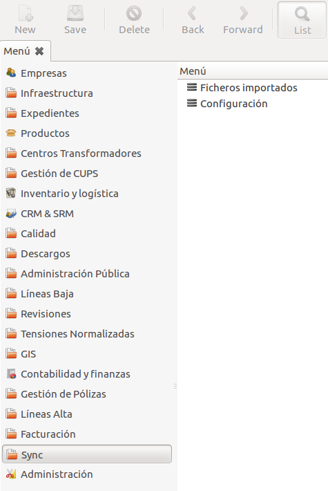
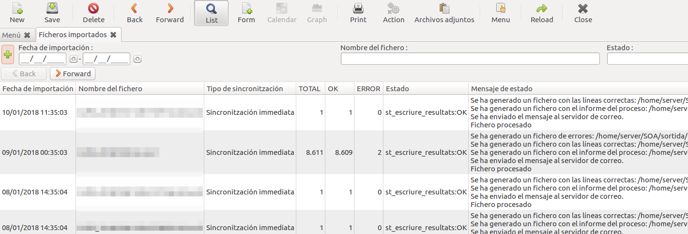
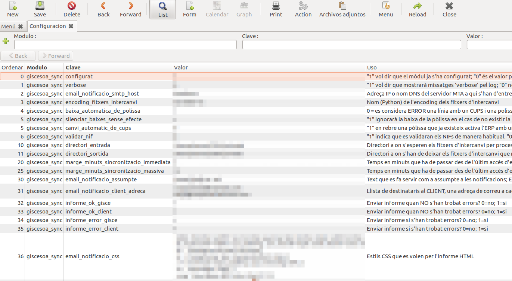

# Configuracions sincronització SOA

Documentació general del mòdul de sincronització mitjançant fitxers SOA.

## Menús

El mòdul de sincronització proveeix dos llistats ubicats a "**_OpenERP Menu >
Sync_**":

- [Fitxers Importats](#fitxers-importats)
- [Configuració](#configuracio)

### Fitxers Importats

En aquest menú es mostra un llistat dels fitxers de sincronització (SOA) importats.
Des del llistat podem veure:

- Data de la importació
- Nom del fitxer importat
- Tipus de sincrontizació:
    - Sincronització massiva: Importació de moltes actualitzacions
    - Sincronització immediata: Importació d'una sola actualització
- Total de línies importades
- Total de línies correctes
- Total de línies amb error
- Estat de la importació
- Missatge descriptiu amb l'estat de la importació

!!! Note "Nota"
    Si accedim a un d'aquests registres, podrem trobar com a adjunt el fitxer
    de sincronització importat.

### Configuració

En aquest menú es mostren les configuracions per a la importació dels fitxers de
sincrontizació (SOA) i de la notificació dels resultats d'aquesta importació.

Podem trobar les següents columnes:

- Ordre en que es mostren al llistat
- Mòdul al que pertany la configuració,
  únicament hauria d'haver "giscesoa_sync" en aquest llistat.
- Clau utilitzada per l'ERP
- Valor a utilitzar per l'ERP per una clau concreta
- Descripció de com ha de ser el valor per una clau concreta

#### Configuracions SOA

En el fitxer de configuracions hi ha les següents opcions:

| Clau | Descripció |
|-|-|
| `configurat` | "1" vol dir que el mòdul ja s'ha configurat; "0" és el valor per defecte per assegurar que el mòdul no només s'ha instal·lat sinó que a més a més s'ha configurat. |
| `sufix_massiva` | Extensió que s'espera pels fitxers d'intercanvi per sincronització massiva. |
| `sufix_immediata` | Extensió que s'espera pels fitxers d'intercanvi per sincronització immediata. |
| `sufix_fitxer_duplicat` | Sufix que s'afegirà quan es trobi al directori d'entrada un fitxer amb un nom que ja s'havia processat. |
| `sufix_correctes` | Extensió dels fitxers que han de contenir les linies que s'han processat correctament. |
| `sufix_errors` | Extensió dels fitxers que han de contenir les línies que s'han intentat processar sense èxit. |
| `sufix_informes` | Extensió dels fitxers que han de contenir els informes amb els errors trobats durant el procés. |
| `directori_entrada` | Directori a on s'esperen els fitxers d'intercanvi per processar. |
| `directori_sortida` | Directori a on s'han de deixar els fitxers d'intercanvi que resulten del procés. |
| `marge_minuts_sincronitzacio_immediata` | Temps en minuts que ha de passar des de l'últim accés d'escriptura a un fitxer per a que es consideri candidat a ser processat. Aquest temps ha de ser una garantia de que el procés que ha creat el fitxer ja ha acabat. |
| `marge_minuts_sincronitzacio_massiva` | Temps en minuts que ha de passar des de l'últim accés d'escriptura a un fitxer per a que es consideri candidat a ser processat. Aquest temps ha de ser una garantia de que el procés que ha creat el fitxer ja ha acabat. |
| `email_notificacio_gisce_adreca` | Llista de destinataris a GISCE, una adreça de correu a cada línia, opcionalment amb format `"Nom <test@example.com>"` |
| `email_notificacio_assumpte` | Text que es fa servir com a assumpte a les notificacions; Es poden afegir: "`%f`" nom de fitxer tractat; "`%r`" resultat; "`%d`" base de dades. |
| `email_notificacio_client_adreca` | Llista de destinataris al CLIENT, una adreça de correu a cada línia, opcionalment amb format `"Nom <test@example.com>"` |
| `email_notificacio_client_explicacio` | Text que es fa servir al correu de notificació; Es poden afegir: "`%f`" nom de fitxer tractat; "`%r`" resultat; "`%d`" base de dades. |
| `informe_linies_frequencia_capcalera` | Freqüència amb què s'afegeix la capçalera a l'informe de línies amb problemes. Per exemple el valor 2 vol dir que es repetirà la capçalera cada dues línies. |
| `informe_ok_gisce` | Enviar informe quan NO s'han trobat errors? 0=no; 1=si |
| `informe_ok_client` | Enviar informe quan NO s'han trobat errors? 0=no; 1=si |
| `informe_error_gisce` | Enviar informe si s'han trobat errors? 0=no; 1=si |
| `informe_error_client` | Enviar informe si s'han trobat errors? 0=no; 1=si |
| `email_notificacio_remitent` | Adreça d'origen per correus de notificació. |
| `email_notificacio_smtp_host` | Adreça IP o nom DNS del servidor MTA a qui s'han d'entregar els correus. |
| `email_notificacio_css` | Estils CSS que es volen per l'informe HTML |
| `encoding_fitxers_intercanvi` | Nom (Python) de l'encoding dels fitxers d'intercanvi |
| `baixa_automatica_de_polissa` | 0 = es considera ERROR una línia amb un CUPS i una pòlissa associada si aquest CUPS ja tenia una pòlissa activa a l'ERP, perquè s'espera que abans ens enviïn una línia amb una baixa; 1 = Es donarà automàticament de baixa la pòlissa activa abans de continuar el procés de la línia. |
| `verbose` | "1" vol dir que mostrarà missatges 'verbose' pel log; "0" no. |
| `silenciar_baixes_sense_efecte` | "1" ignorarà la baixa de la pòlissa en el cas de no existir la pòlissa o estar de baixa. "0" pel contrari. |
| `canvi_automatic_de_cups` | "1" en rebre una pòlissa que ja existeix en l'ERP i estigui activa amb un CUPS diferent, es donarà de baixa el CUPS actual i hi vincularà el nou CUPS. "0" notificarà l'error i no farà cap modificació. |
| `validar_nif` | "1" indica que es validaran els NIFs de manera habitual. "0" no validarà. |
