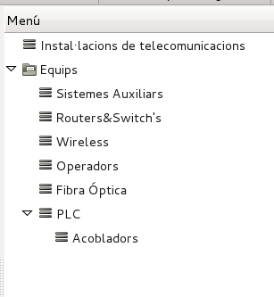
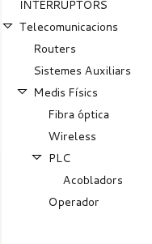
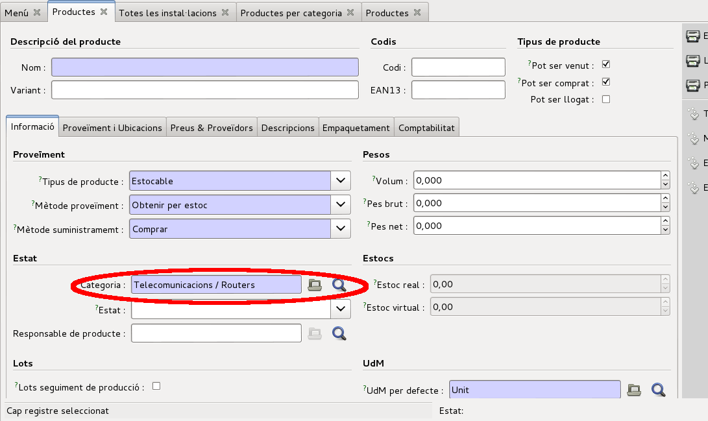
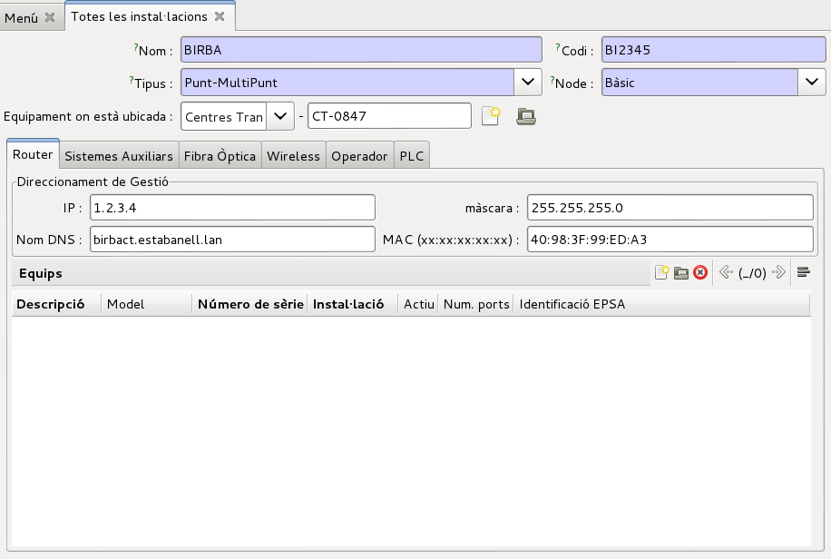

# Documentació del mòdul gestió d'equips de telecomunicacions

## Equips de telecomunicacions

El mòdul de gestió d'equips de telecomunicacions permet inventariar els equips
de telecomunicacion de l'empresa i la seva rel·lació amb les diferents
instal·lacions.

Permetrà fer un seguiment de fabricant, producte i número de sèrie de cada
equip. Per això s'utilitzaran les eines pròpies de **Openerp** per a la compra
i recepció de productes utilitzant albarans i lots de producció.

Podem inventariar Sistemes auxiliars, Routers i switchs, sistemes WIFI,
operadors de telecomunicacions, sistemes de fibra óptica i equips i elements
PLC.

Cadascun d'aquests equips poden tenir ports de comunicacions associats a un
servei de comunicacions.

Qualsevol equip es pot associar amb una **instal·lació** de tipus centre
transformador o subestació. D'aquesta forma podem relacionar la xarxa elèctrica
amb la xarxa de telecomunicacions

Tota la gestió dels equips de telecomunicacions es fa des del menú específic de
Telecomunicacions (`menutelecom`).

**_Menu de telecomunicacions_**

##Productes i números de sèrie

Pel funcionament del mòdul, cal gestionar els productes, les categories de
productes i els números de sèrie correctament.

El funcionament és idèntic al que s'explica al document _Compra i magatzem de
comptadors_ amb algunes particularitats.

### Categories de producte

Per facilitar la gestió dels productes dins el mòdul de telecomunicacions, s'han
creat categories de productes directament relacionades amb els diferents equips
i elements que es gestionen en el mòdul de telecomunicacions. Així, p.e. s'ha
creat la categoria de producte `Routers` on s'inclouran tots els equips routers.
Les fitxes del mòdul de telecomunicacions només permetran seleccionar els
productes de la categoria corresponent per facilitar la tasca de l'usuari.
Podem accedir als productes pe categoria mitjançant el menú
`Productes > Productes per categoria`

**_Categories de productes de telecomunicacions_**

### Producte

Els productes es poden crear des del llistat de categories de producte de forma
que ja s'associaran a la categoria corresponent al obrir la fitxa. També es pot
canviar manualment tal i com es veu en la captura següent:

**_Categoria a la fitxa de producte_**

##Instal·lacions

Qualsevol equip o elements es pot associar a una instal·lació de la empresa.
Aquesta instal·lació pot ser tan un **Centre Transformador** com una
**Subestació**

**_Fitxa d'instal·lació de telecomunicacions_**

Com es pot veure a la captura anterior, les dades que es poden introduïr en una
instal·lació són:

 * _Nom_: Nom descriptiu de la instal·lació de telecomunicacions
 * _Codi_: Codi de referència de la instal·lació de telecomunicacions
 * _Tipus_: Tipus de instal·lació
 * _Node_: Funcionalitat de la instal·lació de telecomunicacions com a node
   dins la xarxa
 * _Equipament on està ubicada_: Equipament de la xarxa de distribució
   elèctrica on està ubicada la instal·lació de telecomunicacions. Pot ser un
   **Centre Transformador** o una **Subestació**

Des de la fitxa de la instal·lació es poden llistar tots els tipus d'elements i
equips que formen la instal·lació, permentent obrir la fitxa corresponent.

## Equips de telecomunicacions

S'han organitzat tots els equips i elements de sistemes de telecomunicacions en
diferents models de forma que es puguin gestionar les dades específiques de cada
tipus de d'element. No obstant, algunes característiques són comunes a totes
els equips. Concretament:

!!! TODO

## Sistemes Auxiliars

Els sistemes auxiliars inclouen els sistemes d'alimentació i bateries.
