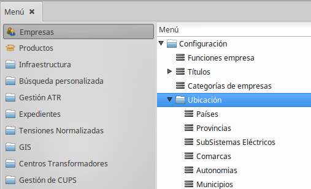
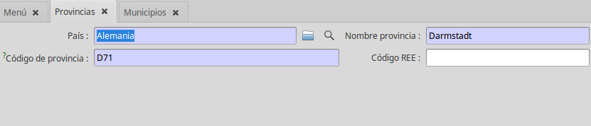
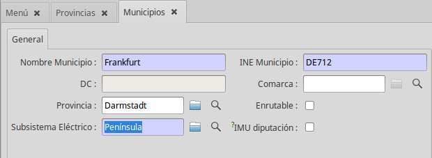

# Gestió de Ubicacions

## Divisions administratives

El ERP defineix diferents divisions administratives a utilitzar en qualsevol
adreça. Són accessibles al menú *Empreses -> Configuració -> Ubicació*

### Divisions administratives bàsiques

* **Estats**: S'identifiquen pel seu codi acrònim internacional de 2 lletres.
Inclosos per defecte
* **Comunitats autónomes**: Les comunitats autónomes d'Espanya s'identifiquen
estan incloses per defecte. Per altres països es pot utilitzar per agrupacions
de provínicies.
* **Províncies**: Les províncies d'Espanya s'identifiquen per el seu codi INE i
estan incloses per defecte. Per la resta de països s'han de crear manualment.
* **Municipis**: Els municipis d'Espanya s'identifiquen per el seu codi INE i
estan incloses per defecte. Per la resta de països s'han de crear manualment.
* **Poblacions**: Subdivisions municipals (nuclis, agregats, disseminats).
S'han de gestionar manualment

### Divisions administratives opcionals

* **Comarca**: Agrupació de municipis. En algunes comunitats autònomes tenen
caràcter administratiu. Són opcionals. Existeixen mòdules específics per:

* **Catalunya**: Comarques de Catalunya. Existeix un mòdul específic que les
crea
* **Illes Balears**:  Illes. Es crea una comarca per illa. Existeix un mòdul
específic que les crea
* **Canàries**:  Illes. Es crea una comarca per illa assimilable als Cabildos.
  Existeix un mòdul específic que les crea.

## Creació de municipis

Per crear un municipi, es necessita com a mínim tres entitats administratives:

* **País**: Creat per defecte
* **Província**: Equivalent administratiu a les províncies d'Espanya. Depèn de
cada país
* **Municipi**: Municipi que es vols crear. És molt recomanable assignar-li el
codi equivalen a l'INE

!!! Note "Entitats administratives"
    Cada país s'organitza en entitats administratives diferents. Així a
    Alemanya hi ha lands i regions, a Andorra hi ha parròquies, a França
    departaments i regions, etc... S'hauria de seguir un criteri homogeni per
    cada país. També és recomanable utilitzar les codis oficials equivalents a
    l'INE. Tota aquesta informació es pot aconseguir a la [Wikipedia](https://ca.wikipedia.org/)

### 1. Creació de la província

!!! Warning "Atenció"
    No s'han de crear mai provínicies de l'estat espanyol.

Si la província no existeix, haurem de crear-la. Des del llistat de províncies,
premem el botó nou i omplim el formulari

* **País**: Seleccionar el país al qual pertany.
* **Nom província**: Nom de la província
* **Codi de la província**: Si és possible, utilitzar el codi propi de l'estat
amb el prefix internacional del pais, p.e. *DE71*
* **Codi REE**: Codi de Red Eléctrica de España. Com que no es tracta d'una
província d'Espanya el deixem buit.

### 2. Creació del municipi

!!! Warning "Atenció"
    No s'han de crear mai municipis de l'estat espanyol.

Si el municipi no existeix, haurem de crear-lo. Des del llistat de municipis,
premem el botó nou i omplim el formulari

* **Nom Municipi**: Nom del municipi
* **INE Municipi**: Codi del municipi. Si és possible, utilitzar el codi propi
de l'estat amb el prefix internacional del pais, p.e. *DE712*
* **DC**: Dígit de control de l'INE
* **Comarca**: Omplir només si es necessita i estan creades
* **Provincia**: Seleccionar la província a la qual pertany
* **Subsistema Elèctric**: Seleccionar sempre *Península*
