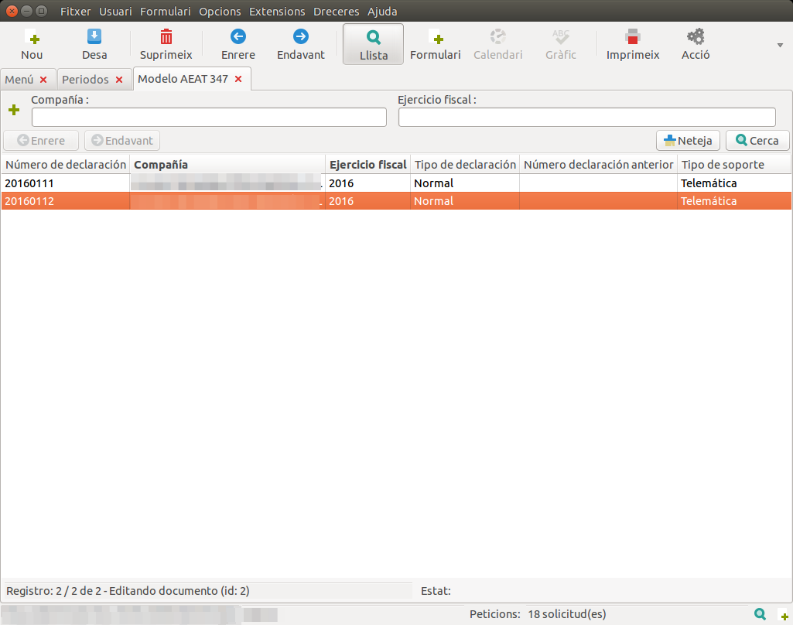
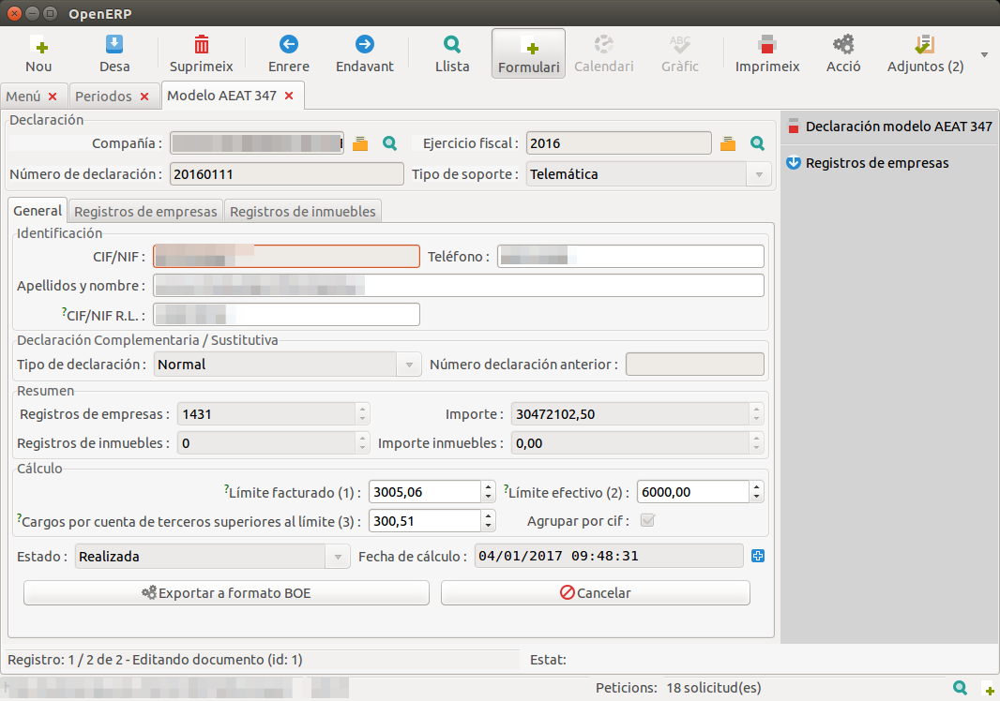
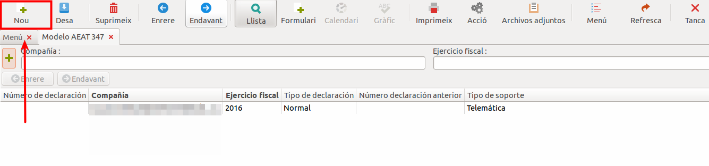
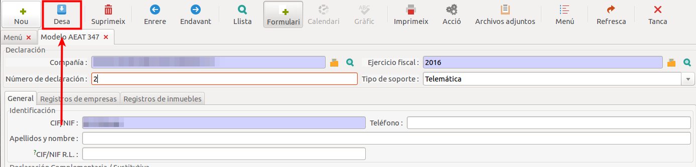
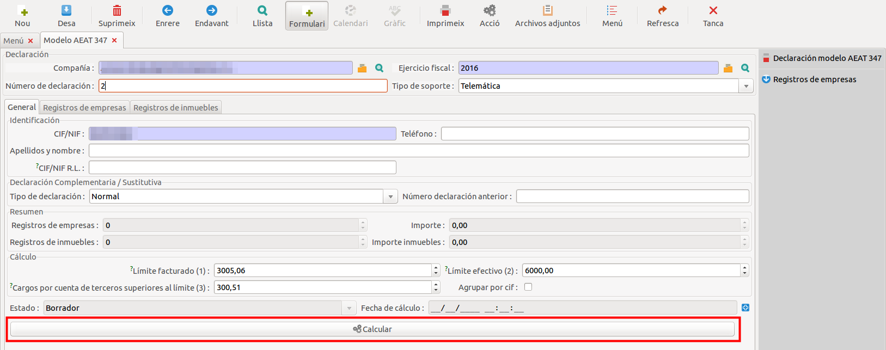
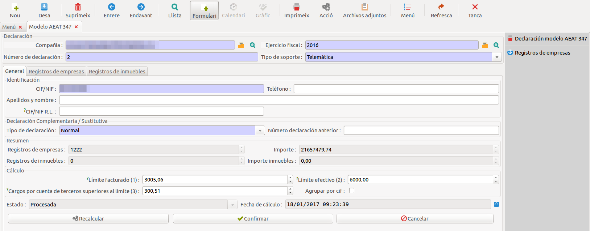

# Declaracions AEAT

## Model AEAT 347

Per generar el model AEAT 347 cal anar al menú **Contabilidad y fianzas** >
**Declaraciones oficiales** > **Declaraciones AEAT** > **Modelo AEAT 347**.

Al fer click s'obre una finestra on apareixen els models que s'han generat
anteriorment.

### Consultar models 347 existents

Per consultar un model 347 existent cal seleccionar-lo a la pantalla:

Un cop seleccionat, apareix la informació del model 347 generat:

### Generar un nou model 347

!!! note
    Per tal de poder generar el model 347 **cal haver entrat prèviament els**
    **trimestres** per els **períodes fiscals**.

Per generar un nou model 347 cal fer click al botó **nou** de la barra superior
de navegació:

Un cop fet click el botó apareix la finestra inicial del model 347, a la qual
s'han d'entrar una sèrie de valors. D'entre els valors obligatoris, els camps
**companyia** i **DNI/CIF** s'emplenen de forma automàtica, mentre que
l'**exercici fiscal** ha de ser entrat manualment. A continuació, cal fer click
al botó **desa**.

A continuació el model està en estat **esborrany**. Per efectuar els càlculs,
cal fer click al botó **calcular**:

Al fer click al botó calcular s'actualitzen els valors de l'apartat **Resum**,
i l'estat de l'informa passa d'estar en **esborrany** a **processat**. apareixen
també nous botons amb els quals es poden efectuar les següents operacions:

* **Recalcular:** torna a efectuar els càlculs per tal d'actualitzar els valors
de l'apartat **resum**.
* **Confirmar:**
* **Cancel·lar:** el model passa a estat **cancel·lat**, i apareix un únic botó
que permet passar el model a estat **esborrany**.

Si el model està en estat **cancel·lat** i es fa click al botó **Esborrany**,
llavors tornarà a l'estat inicial.
