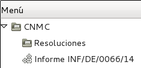

# Documentació dels mòduls de dins de CNMC

Continguts:

* [INF/DE/0066/44](#modul-per-generar-el-fixer-csv-segons-cnmc-infde006644-per-comercialitzadora)
* [Circular [2/2016]](#generacio-de-informes-sobre-reclamacions-de-consumidors)

## Mòdul per generar el fixer CSV segons CNMC INF/DE/0066/44 per comercialitzadora

### Introducció

Per poder fer una auditoria de canvis de comercialitzadora, la CNMC demana un
CSV amb el format definit a INF/DE/0066/14

### Generació

Per generar el fitxer, hem d'executar l'assistent que trobarem a
**Administració pública > CNMC > Informe INF/DE/0066/14**

Només caldrà introduïr l'any del qual es vol fer l'informe, que per defecte ja
és 2013 i prèmer el botó **Exportar**.

Des de **Fitxer** es podrà obrie el CSV i descarregar-lo a disc

### Dades utilitzades

Per omplir el fitxer es tenen en compte totes les pólisses creades dins l'any
escollit que tinguin la corresponent modificació contractual de tipus `alta`.

Així doncs, el fitxer generat serà correcte si les altes a la comercialitzadora
es registren com a modificació contractual de la pòlissa de tipus `alta`
correctament.

| Nom del camp               | Valor del camp                                 |
|----------------------------|------------------------------------------------|
| **CODIGO_INFORMANTE**      | Camp `Codi R2` de la companyia                 |
| **CODIGO_CUPS**            | CUPS                                           |
| **FECHA_ACTIVACION**       | Data inici de la modificació contractual nova  |

## Generació de Informes sobre Reclamacions de Consumidors

La principal funcionalitat del modul d'Atenció al Client és la de poder generar de forma
automatitzada fitxers amb la informació sobre les reclamacions demanats per la
CNMC. Es tracta de un fitxer .csv el format i la informació del qual segueixen les directrius
definides en la circular [2/2016](http://www.boe.es/diario_boe/txt.php?id=BOE-A-2016-7979).

Mitjançant la opció "**Generate ATC Reports**" situada a  "**CRM -> Atenció al Client**"  s'obrirà un assitent per generar
l'informe:

Aquest assistent funciona de la següent manera:

* Es selecciona un trimestre i un any (per defecte seran el trimestre i l'any actuals)  i es clica "**Generar**".

* Automàticament es generarà un fitxer '.csv' amb tota la informació sobre les
    reclamacions. Aquest fitxer es pot obrir o guardar.

* Al guardar el fitxer s'assignarà un nom amb el següent format:

        "AAAA-MM-DD_electricidad_reclamaciones.csv"

     on AAAA-MM-DD és la data en que s'ha generat l'informe. Aquest nom no s'ha
     de modificar ja que és el demanat per la CNMC.

Les reclamacions que son incloses en aquest informe son totes aquelles corresponents als casos d'atenció al client que no
estiguin en estat 'esborrany' i que pertanyin al trimestre i any seleccionats.
