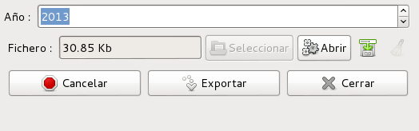

# Documentació dels mòduls de dins de CNMC

Continguts:

* [INF/DE/0066/44](#modul-per-generar-el-fixer-csv-segons-cnmc-infde006644-per-comercialitzadora)

## Mòdul per generar el fixer CSV segons CNMC INF/DE/0066/44 per comercialitzadora

### Introducció

Per poder fer una auditoria de canvis de comercialitzadora, la CNMC demana un
CSV amb el format definit a INF/DE/0066/14

### Generació

Per generar el fitxer, hem d'executar l'assistent que trobarem a
**Administració pública > CNMC > Informe INF/DE/0066/14**

Només caldrà introduïr l'any del qual es vol fer l'informe, que per defecte ja
és 2013 i prèmer el botó **Exportar**.

Des de **Fitxer** es podrà obrie el CSV i descarregar-lo a disc

### Dades utilitzades

Per omplir el fitxer es tenen en compte totes les pólisses creades dins l'any
escollit que tinguin la corresponent modificació contractual de tipus `alta`.

Així doncs, el fitxer generat serà correcte si les altes a la comercialitzadora
es registren com a modificació contractual de la pòlissa de tipus `alta`
correctament.

| Nom del camp               | Valor del camp                                 |
|----------------------------|------------------------------------------------|
| **CODIGO_INFORMANTE**      | Camp `Codi R2` de la companyia                 |
| **CODIGO_CUPS**            | CUPS                                           |
| **FECHA_ACTIVACION**       | Data inici de la modificació contractual nova  |
