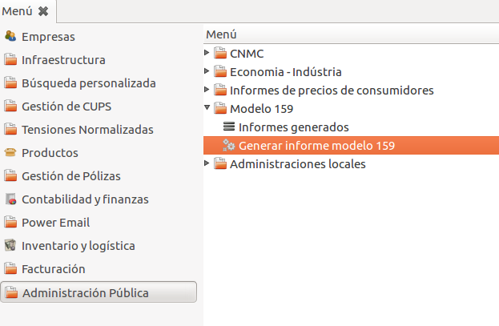

# Documentació dels informes per distribuidores

## Resum per tarifes

Resum de facturació per tarifes amb el desglosament dels consums segons els
periodes i energia. L'informe inclou el resum en kWh, potència total, euros
facturats i nombre de clients afectats

## Resum per distribuïdora i tarifa

Resum de facturació per distribuïdora i tarifa amb el desglosament dels consums
segons els periodes i energia. L'informe inclou el resum en kWh, potència total,
euros facturats i nombre de clients afectats

## Resum per grup cobratori

Resum per grup de cobrament. Inclou el nombre de factures i el total facturat

## Resum per municipi i tarifa

Resum de facturació per municipi i tarifa. Inclou el desglosament dels consums
segons els periodes i energia. L'informe inclou el resum en kWh, potència total,
euros facturats i nombre de clients afectats

## Detall per període i tarifa de peatge

Resum de facturació per tarifes que inclou el detall de l'energia facturada,
potència facturada i potència contractada per periode

## Resum per impostos i distribuïdora

Resum de facturació per distribuïdora. Detalla base, impostos i total en
euros facturats.

## Detall d'altres conceptes

Resum de facturació per distribuïdora que inclou únicament els productes de
tipus 'Altres'. El resum mostra els totals facturats.

## Resum Factures (CSV)

Resum de les factures en CSV.

## Resum factures Excel

Resum de les factures en Excel.

## ESCILA

Informe ESCILA

## Model 606

En la ubicació que es mostra en la següent imatge es troba el menú per a la
realizació de l'informe de preus de consumidors, model 606 que es detalla
en el BOE n. 69  Sec. I. Pàg. 30271.

El wizard de realització de l'informe es mostra en la següent imatge:

Tal i com s'especifica en l'annex I del BOE esmentat anteriorment
l'informe, que s'entregarà dos cops l'any,  ha de recollir la informació
dels darrers 6 mesos. El període en qüestió s'especificarà en els apartats
'Data d'inici' i 'Data final'. La opció 'Extrapolar el consum anual', es
sel·leccionarà únicament en el cas de no existir històric d'un any (12 mesos
faturats complets), cas en que caldrà especificar el factor de correcció
a aplicar al resultat. Per exemple, en el cas de tenir històric dels darrers
6 mesos, s'indicarà a l'ERP que extrapoli el conum i en el factor de correcció
es sel·leccionarà 2. Si diposéssim de 12 mesos facturats únicament caldria
[Exemples de configuració](#exemples-de-configuracio)

En finalitzar l'informe, es mostrarà el següent missatge:

En acceptar-se ens llistarà l'informe.

Únicament cal prémer fent doble-click al damunt de l'informe per veure'n
el resultat. La següent imatge mostra el resultat d'un informe.

Finalment podem mostrar tots els informes generats anant al sub-menú
que s'indica a continuació

Que resulta en el llistat de la següent imatge:

Únicament caldria fer doble-click al damunt de l'informe escollit
per veure'n la seva informació.

### Exemples de configuració

Cas 1: Hem facturat des de 01/01/2012 a 30/06/2012 (6 mesos)

 * Extrapolar consum: Sí
 * Factor de correcció: 2 (**2** x 6 mesos = 12 mesos)

Cas 2: Tenim factures de 01/04/2012 a 30/06/2012 (3 mesos)

 * Extrapolar el consum: Sí
 * Factor de correcció: 4 (**4** x 3 mesos = 12 mesos)

Cas 3: Tenim 12 mesos d'històric de facturació:

 * Extrapolar el consum: No
 * Factor de correcció: 1

### Obtenció de les factures

Per obtenir les factures s'efectuen les següents operacions:

 * S'obtenen totes les factures on la _data_factura_ <= _data_inici_ entrada
 al wizard.
 * Un cop obtingudes, d'entre totes les factures es filtren les **anul·ladores**
 **(A)** i **rectificadores amb substituent (B)**, i amb el diari d'energia.
 * Per últim es tornen a buscar d'entre totes les factures, les normals i
 rectificadores que siguin **diferents** de les anteriors, doncs si una factura
 ja ha estat abonada no cal rectificar-la.

### Detecció del tipus de consumidor

* El tipus de consumidor es detecta mitjançant el CIF o NIF del client de la factura:
    * **NIF**: es considerarà un consumidor **domèstic**.
    * **CIF**: es considerarà un consumidor **industrial**.

### Càlcul de dades

 * Les dades es calculen independentment del tipus de consumidor.
 * Per cada **factura** obtinguda al apartat 1, recorre
 **cada línia de factura**.
 * Si el tipus d'energia és altres, la línia és ignorada.

Les dades a calcular són les següents:

 * **_Energía mercado libre (Mwh)[A]_**
     * Es fa un sumatori de les línies del tipus "energia".
     * Es suma la quantitat
 * **_Potencia facturada (MW)_**
     * Σ línies tipus «potència» / núm. línies.
 * **_Facturación tarifa de acceso sin impuestos [B]_**
     * Per cada línia de factura es calcula el seu subtotal.
     * Es fa un sumatori de tots els subtotals de **totes les línies** de
     **totes les factures**.
     * El subtotal de cada línia es calcula de la següent forma:
         * **Quantitat * Extra per operacions * preu**
     * _Preu: calculat segons el Cos(fi) i la llista de preus_
 * **_Facturación 	tarifa acceso sin IVA ni otros impuestos recuperables [C]_**
     * Es calcula de la mateixa manera 	que **[B]** però sumant també l'IESE
     per cada línia.
 * **_Facturación 	tarifa de acceso con todos los impuestos e IVA [D]_**
     * Es calcula de la mateixa manera que **[C]** però sumant també l'IVA per
     cada línia.
 * **_Facturación 	energía a mercado libre sin impuestos [E]_**
     * Val zero (0). S'inicialitza a zero però mai s'actualitza.
 * **_Facturación 	energía a mercado libre sin IVA ni otros recuperables [F]_**
     * Val zero (0). S'inicialitza a zero però mai s'actualitza.
 * **_Facturación 	energía a mercado libre con todos los impuestos e IVA [G]_**
     * Val zero (0). S'inicialitza a zero però mai s'actualitza.
 * **_Facturación 	total sin IVA ni otros impuestos recuperables [C]+[F]_**
     * Sumatori de (amount_untaxed + tax_amount) de cada factura.
 * **_Facturación 	alquiler de equipos de medida y control [Lloguer]_**
     * Sumatori del «price_subtotal» per les línies del tipus «lloguer».
 * **_Tensión máxima [v_max]_**
     * Obté la tensió més alta d'entre totes les tensions de totes les
     factures llistades.
 * **_Tensión mínima [v_min]_**
     * Obté la tensió més baixa d'entre totes les tensions de totes les
     factures llistades.

## Model 159

En la ubicació que es mostra en la següent imatge:

Es troba el menú per a la generació de l'informe del model 159,
tal i com es detalla en el BOE n. 182 Sec. I. Pàg. 64838.

La següent imatge mostra el wizard de generació de l'informe:

Es generarà un nou informe amb la data final indicada en prémer 'Generar informe'.

En finalitzar el procés de realització de l'informe es mostren els errors trobats:

Prement 'Veure Informe' es llista l'informe generat:

Finalment, fent doble click en l'informe generat, veurem les línies de l'informe:

I tindrem la possibilitat d'exportar-lo prement 'Exportar document'.

En exportar el document, es sol·licita informació relativa a la
persona de contacte, informació relativa al suport que s'utilitzarà
per la transmissió del document i el número d'informe que es correspon. El
número d'informe és un número seqüencial relatiu a cada informe entregat.

### Valors per defecte

Per tal que el resultat de la validació sigui correcte, hi ha una sèrie de
camps als quals se'ls assigna un valor per defecte en cas de no tenir valor
a l'ERP. La següent taula en detalla el nom del camp, la posició
en la línia del registre de tipus 2 i el valor assignat per defecte.

 Camp               |  Posició   |  Valor
:-------------------|:----------:|:------------------------------------------------------------------------------------------------
 NIF del titular    |  18        | 12345678Z
 Tipus de via       |  76        | CL
 Tipus de numeració |  131       | NUM o S/N (en funció de si hi ha número)
 Codi postal        |  264       | 12321
 Data d'alta        |  367       | 01/07/2009 (data d'inici del règim de lliure competència) en el cas de ser anterior a l'any 1930

### Errors de validació

El programa de validació del model 159, en la versió [v1.0 de 2011](http://www.agenciatributaria.es/static_files/AEAT/Contenidos_Comunes/La_Agencia_Tributaria/Descarga_Programas/Descarga/prevalid/2011/CobolWindows/Prevalidacion_159_2011_v10.exe)
, genera una sèrie d'errors pels quals no hi ha sol·lució. Es llisten a continuació:

  Codi d'error  |  Camp                                                 | Motiu
:--------------:|:------------------------------------------------------|:------------------------------------------------------------
   2 0801       |  Tipus de via (Direcció del subministre)              | Certs tipus de via proporcionats pel catastre.
   2 0701       |  Cognoms i nom, raó social o denominació del titular  | Noms que contenen nombres. També noms amb una única paraula.

##### Figura 13: Wizard per exportar l'informe.

##### Figura 14: Llistat de tots els informes generats.

