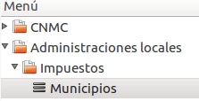
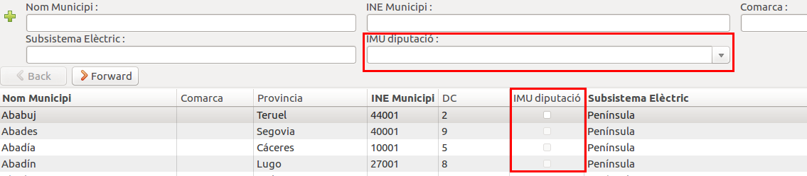
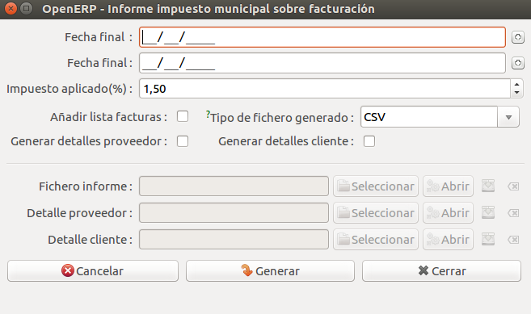
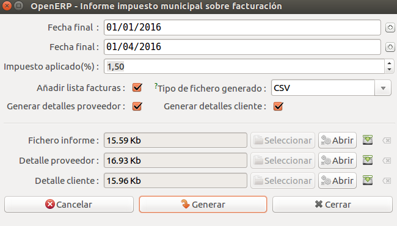

# Documentació del modul per crear informes de taxes municipals

## Introducció

Alguns municipis demanen certa informació respecte als impostos sobre la
circulació d'electricitat pel seu municipi. Aquest mòdul permet crear un fitxer
amb aquesta informació de forma fàcil i ràpida.

## Generació

Per generar el fitxer només hem de seleccionar el municipi o municipis dels
quals volem crear l'informe en la llista de municipis que trobarem a
*Administració Pública > Administracions locals > Impostos > Municipis*.

#### Generació conjunta per municipis a través de la diputació provincial

Podem seleccionar els municipis en els que l'impost municipal està gestionat a
través de la diputació provincial filtrant pel camp _IMU diputació_

Un cop haguem seleccionat tots els municipis que desitgem podrem prémer el botó
d'*Accions*, que obrirà una finestra com la següent:

Aquí haurem d'entrar les següents dades:

* **Data d'inici**. Data d'inici del període pel qual volem fer l'informe (inclosa).
* **Data de fi**. Data de fi del període pel qual volem fer l'informe (exclosa).
* **Afegir llista factures**. Si marquem aquest camp s'afegiran dos llistats de
totes les factures realitzades entre les dates seleccionades, separades entre
les factures de proveïdors i les factures a clients.
* **Tipus de fitxer generat**. Ens permet seleccionar el tipus de fitxer que volem
que es generi. Si seleccionem CSV tota la informació es guardarà en una sola pàgina,
donant el resum del total i, si s'ha marcat **Afegir llista factures**, les factures
de proveïdors i les factures a clients. Aquestes dades les tindrem per cada poble
que hàgem seleccionat, ordenats alfabèticament. Altrament, si seleccionem que volem
un Excel els llistats de factures (en cas de demanar-los) es guardaran per separat
en dues altres pestanyes, una per factures de proveïdors i l'altre per factures a
clients. Aquestes dades també estaran ordenades alfabèticament pel nom del municipi.
* **Generar detalls proveidor**. Si marquem aquest camp crearem el fitxer de detalls
proveidor, que conté tota la informació de les factures seleccionades.
* **Generar detalls client**. Si marquem aquest camp crearem el fitxer de detalls
client, que conté tota la inforamció de les factures seleccionades.

Un cop entrades totes les dades, podem prémer el botó de generar. Això farà les
consultes necessàries per generar els fitxers demanats i els generarà, permetent
obrir-los directament o guardar-los a l'ordinador.

## Dades utilitzades

Per tal de generar el fitxer de l'informe es tenen en compte totes les factures
amb una data de factura entre les dates seleccionades. També es tenen en compte
cada una de les línies de factura i els seus account_invoice associats. A més, s'utilitza
la pòlissa associada a les factures per trobar la CUPS, que finalment ens permet
trobar a quin municipi pertany cada factura.

D'altra banda, per tal de generar la part del llistat de factures (si s'ha
seleccionat) s'utilitzen les taules de res_partner per trobar la informació de
la distribuïdora i del client i les tarifes per mirar quina tarifa té cada client.

Per tal de generar els fitxers de detalls (tant el de proveidor com el de clients)
s'utilitza, a més, les taules d'account_invoice_line_tax i account_tax per tal de
trobar els impostos a pagar. També s'utilitza el payment_type per trobar el tipus
de pagament que ha estat utilitzat.