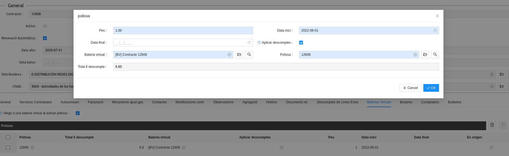

# Bateria virtual
## Introducció

La bateria virtual és un mòdul lligat a la modalitat contractual d'autoconsum, que permet acumular aquells euros de descompte que no s'han pogut aplicar en una factura, perquè el descompte era major al cost de l’energia consumida. 

Com indica l’article 14 del Real Decret 244/2019 pel qual es regula l’autoconsum d’energia elèctrica: *“En ningún caso, el valor económico de la energía horaria excedentaria podrá ser superior al valor económico de la energía horaria consumida de la red en el periodo de facturación, el cual no podrá ser superior a un mes.”* Això vol dir que no pot haver-hi una factura en què degut als excedents a descomptar sigui en negatiu (a favor del titular). En aquests casos el cost de l’energia consumida queda a 0, i la resta de descompte es “perd”. Per evitar-ho, hem desenvolupat la bateria virtual, que funciona a tall de “guardiola”, on aquest excedent pendent de compensar es guarda per poder aplicar-se en futures factures, on el cost del consum sigui superior. 

La bateria virtual està formada per quatre models de dades relacionades entre si. És a dir, quatre tipus de fitxes que es poden veure en llistat:

### Fitxa Bateria Virtual

Es tracta de la fitxa principal. Mostra la quantitat total d'euros acumulats que hi ha per descomptar així com un quadre de text amb tota la informació dels processos executats, i l’acció d’activar contractes.

### Contractes/pòlisses de la bateria virtual

Dins de la bateria virtual, si anem a llistats relacionats, podem veure els contractes vinculats a la bateria. Això vol dir que més d’un contracte pot ser beneficiari dels descomptes generats (receptors) pel contracte generador (origen). 

Mostra la següent informació: 
Euros totals que es pot descomptar
Si es vol aplicar el descompte
Pes que té dins de la bateria virtual. Com més pes més quantitat de descompte se li aplicarà a aquest contracte.

Què és el concepte pes? El pes és el sistema de repartiment del descompte entre els diferents contractes que poden ser receptors. Seria com el percentatge que volem que tingui cada contracte. El càlcul és el següent: hem de sumar el pes de tots els contractes receptors i dividir entre el pes de cada contracte. Així sabrem el percentatge de repartiment de descompte per cadascú.  

Però perquè ho fem en números absoluts i no en percentatges directament? Perquè si traiem un contracte receptor de la bateria virtual, el percentatge de repartiment canvia directament als altres contractes sense necessitat de modificar-ho manualment.

### Origen de la bateria virtual

Tal com indica el nom, **és la font dels descomptes de la bateria virtual**. Normalment, un contracte amb autoconsum és tant l'origen d'una bateria virtual com de receptor de descomptes d'una bateria virtual. Però un contracte podria ser origen de descomptes sense rebre descomptes i viceversa.

Els imports que s'afegeixen a la bateria virtual es calculen a partir de les línies de saldo “excedents autoconsum” de les factures client del contracte.

### Descomptes de la bateria virtual

Representa tots els descomptes que té la bateria virtual. Mostra l'import, la font del descompte o el dia que s'ha calculat, entre altres coses.

El llistat de descomptes tindrà línies positives, representant descomptes afegits a la bateria virtual, i tindrà línies negatives, representant descomptes ja aplicats a factures. La quantitat d'euros acumulada d'una bateria serà la suma de totes les línies de descompte.

## Accions de la bateria virtual

Per facilitar la feina, es poden veure i crear fitxes, i fer accions de bateria virtual des de la mateixa fitxa contracte/pòlissa. 

Si volem crear la nova bateria, podem fer-ho des d'aquí mateix.

Si la bateria ja està creada i voleu afegir-hi un contracte, busqueu-la i assigneu-la. En aquest moment és quan podem dir si la pòlissa serà l'origen i/o receptora, i el pes que ha de tenir.

.jpeg)

.jpeg)

.jpeg)

Un cop tenim la pòlissa assignada a una bateria, al anar a la subpestanya de Bateries Virtuals del contracte, veurem la informació

## Com es generen les línies de descompte

Quan hi ha més excedent per compensar que consum a facturar, l'import de consum és 0, i es genera una línia de descompte pendent a descomptar, que s'afegeix a la bateria virtual de la qual n'és orígen aquell contracte.

En el llistat de descomptes de la bateria virtual es poden veure els descomptes generats, i quan s'apliquen. 

