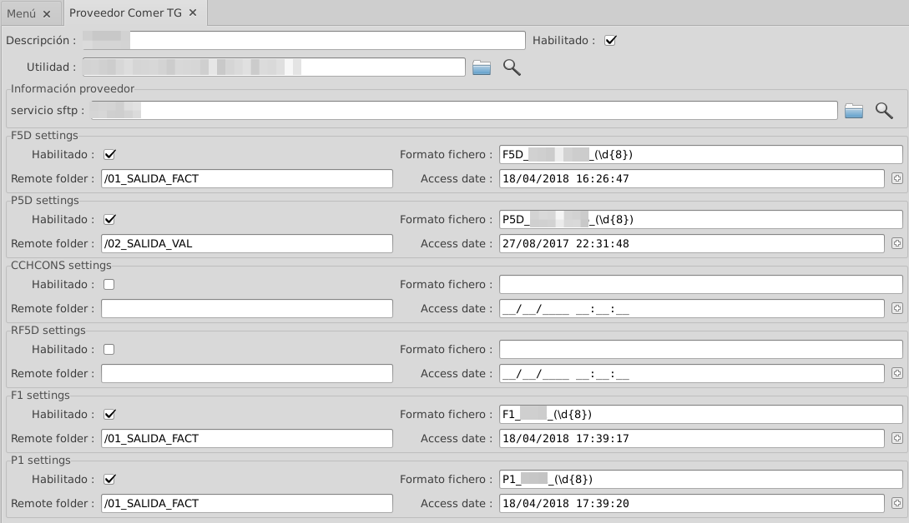

# Càrrega de corbes horàries

En aquest apartat es documentarà el procediment necessari a seguir per
tal de tenir configurat l'ERP perquè carregui periòdicament tots els
documents amb les corbes horàries.

## Funcionament
Aquesta funcionalitat ens permet descarregar dels portals de les distribuïdores
les corbes CCH generades per els contractes integrats en el sistema de
telegestió i dels integrats en el sistema de telemesura. Aquest servei s'ha
d'oferir a través del protocol SFTP (FTP per SSH). Es poden descarregar els
diferents tipus de corbes definits per la CNMC:

* **CCH_FACT**: Corba utilitzada per facturar. Es distribueix en el format
    **F5D** i no pot tenir forats. El format **RF5D** és idèntic al format F5D
    i s'utilitza per les corbes de les factures rectificades
* **CCH_VAL**: Corba validada. Només inclou aquells registres horaris que
    el comptador ha donat per vàlid i es distribueix en el format **P5D**. Pot
    no estar completa i per tant no és utilitzable per facturar mitjançant corba
* **CCH_CONS**: Corba facturada (CCH_FACT) en format CCH_CONS preparada
     per distribuïr-la al consumidor
* **TG_F1**: Corba utilitzada per facturar. Es distribueix en el format **F1**
    i no pot tenir forats.
* **TG_P1**: Corba validada. Només inclou aquells registres horaris que el
    comptador ha donat per vàlid i es distribueix en el format **P1**. És
    possible que no estigui completa per tant, no és utilitzable per facturar
    mitjançant corba.

Les corbes s'emmagatzemen en el servidor *mongodb*, cadascuna en una
col·lecció diferent, i són accessibles des del ERP a través del comptador.

El sistema es configura de la següent forma:

* **Servidors SFTP**: Servidor SFTP definits per les distribuïdores. En
alguns casos, les distribuïdores s'agrupen i utilitzen un sol servidor
compartit
* **Proveïdors**: Cada proveïdor referencia un servei SFTP concret i
defineix quins fitxers dels disponibles es vol descarregar. Es registra la
data del darrer fitxer descarregat per poder portar-ne el control.

## Configurar el client ERP

### Instal·lar el mòdul

Ens cal el mòdul anomenat "giscedata_telegestio_comer" per portar a terme
aquesta tasca. Per tal de comprovar si el mòdul està instal·lat o instalar-lo
ens hem de dirigir a **_Administració > Administració de mòduls > Mòduls_**.
Aquí buscarem el mòdul i l'instal·larem si és necessari.

### Configurar connexions sftp

Per tal de que l'ERP sàpiga on anar a buscar els arxius de corbes hem de crear
registres que l'hi indiquin. Anant a **_Infraestructura > Telegestió comer >
Config > SFTP Connections_** podrem crear entrades per cada sftp de cada
distribuïdora que ens interessi.
Haurem d'indicar:

* **Descripció**: Nom descriptiu del servidor
* **Servidor**: Direcció del servidor sftp
* **Port**: Port en el qual està escoltant el servidor
* **Usuari**: Usuari d'accés subministrat per la Distrïbuidora
* **Password**: Paraula clau d'accés al servidor

En alguns casos, es pot fer necessari utilitzar claus privades per accedir
als servidor tal com permet el protocol SSH i per extensió SFTP.

* **Binari de la clau Privada**: Clau privada utilitzada per a l'intercanvi
de claus
* **Password de la clau privada**: Si és el cas, password de la clau privada

Els camps directori arrel i el directori de lectura no s'utilitzen de moment

### Configurar proveïdors

En aquest pas hem de crear registres nous per totes les empreses distibuïdores
de les quals rebem corbes horàries. Per fer-ho anem a **_Infraestructura >
Telegestió comer > Config > TG Comer Provider_** i creem els nous registres

La configuració es realitza de la següent forma:

* **Description**: Descripció del proveïdor
* **Enabled**: Especifica si aquest proveïdor està habilitat. Només es
descarreguen els seus fitxers si el proveïdor està habilitat
* **Utility**: Distribuïdor del qual es descarreguen els fitxers.
* **Utility sftp service**: Configuració SFTP utilitzada de les configurades en
el punt anterior

Per cada tipus de fitxer a descarregar s'han de definir diversos paràmetres. Els
més delicats són el nom dels fitxers i la data d'accés.

Per cada apartat:

* **Enabled**: Habilita aquest tipus de fitxer
* **File syntax**: Format del fitxer (veure [Format del nom de fitxer](#nom-dels-fitxers-de-corbes) )
* **Remote Folder**: Fitxer on començar la cerca recursiva. per defecte l'arrel del servidor FTP (*/*)
* **Acces date**: Data del fitxer descarregat més recent

Es defineixen 6 apartats:

* **F5D Settings**: Fitxers CCH_FACT en format F5D.
* **P5D Settings**: Fitxers CCH_VAL en format P5D.
* **CCHCONS Settings**: Fitxers CCH_CONS en format CCH_CONS.
* **RF5D Settings**: Sobreescriuen les corbes CCH_FACT
* **F1 Settings**: Fitxers TG_F1 en format F1
* **P1 Settings**: Fitxers TG_P1 en format P1

La descàrrega s'automatitzarà mitjançant un cron o tasca programada del
servidor, normalment un cop al dia. Cada cop es descarregaran els fitxers dels
apartats "habilitats" de tots els proveïdors "habilitats" que tinguin el format
definit.

Els fitxers s'emmagatzemaran localment en el servidor per al seu posterior
procés en l'adreça definida per la variable de configuració _tg_comer_cch_dir_
tal com es comenta a [aquí](#creacio-de-nova-variable-de-configuracio)

#### Nom dels fitxers de Corbes

Els fitxers de corbes tenen un nom definit per la CNMC. El sistema de
descàrrega de corbes utilitza expressions regulars per decidir quins fitxers es
descarrega i a quina col·lecció els emmagatzema.

El format definit pot variar segons els fitxers.

* **Fitxers F5D, P5D i RF5D**: El format és `Z5D_YYYY_XXXX_aaaammdd.v`.
La `Z` s'ha de substituir per el tipus de fitxer **F**, **P** o **RF**.
Les `YYYY` s'han de substituir per el codi de distribuïdora (codi REE).
Les `XXXX` s'han de substituir per el codi de comercialitzadora (codi REE).
La `aaaammdd` s'ha de substituir per la data de generació del fitxer.
la `v` s'ha de substituir per la versió del fitxer.

* **Fitxers F1 i P1**: El format és `Z1_YYYY_AAAAMMDD_aaaammdd.v`.
La `Z` s'ha de substituir per el tipus de fitxer **F** o **P**.
Les `YYYY` s'han de substituir per el codi de distribuïdora (codi REE).
La `AAAAMMDD` s'ha de substituir per la data a la que corresponen les dades que
conté el fitxer.
La `aaaammdd` s'ha de substituir per la data de generació del fitxer.
la `v` s'ha de substituir per la versió del fitxer.

#### Expressió del format de fitxer

El sistema farà una cerca recursiva en el servidor SFTP buscant els fitxers que
compleixin amb el format especificat.
Per tal d'especificar un format de fitxer genèric que permeti al sistema
trobar tots els fitxers correctes, es pot utilitzar una expressió regular.

Per exemple:

`F5D_0999_0888_(\d{8})`

Amb aquest format el sistema trobarà tots els fitxers F5D de la nostra distribuïdora
d'exemple **0999** i de la comercialitzadora específica **0888** sense filtrar per
dates, només necessitarà 8 caràcters numèrics després de l'últim guió baix. Com que no
especifiquem res per la versió del fitxer que volem els agafarà totes.

!!! Tip "Consell"
    En un servidor SFTP compartit, es poden utilitzar les expressions regulars
    per descarregar els fitxers de totes les distribuïdores amb una sola
    configuració de proveïdor. Per exemple:

    `P5D_(\d{4})_0888_(\d{8})`

    En aquest cas es descarregaran tots els fitxers P5D de la nostra
    comercialitzadora (0888) independentment de la distribuïdora, que sempre
    serà un codi de quatre caràcters numèrics *(\d{4})*

#### Data de descàrrega

És una data purament informativa per saber quan va ser l'última vegada que es va
llegir el contingut del servidor SFTP.

### Creació de nova variable de configuració

Hem de crear una nova variable de configuració anomenada *tg_comer_cch_dir* amb
el la ruta on volem que es guardin els fitxers descarregats dels
servidors sftp.
**_Administració > Configuració > Propietats > Configuration Variables_**

!!! Warning "Atenció"

    Els fitxers descarregats no s'esborrán
