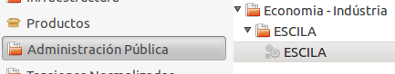

# Documentació del mòdul de generació de l'informe ESCILA per comercialitzadores

## Descripció

Aquest mòdul permet generar l'informe sol·licitat pel ministeri de indústria
Energia i turisme (*MINETUR*) segons RD 1658/2012 i recollits en el manual de
la aplicació ESCILA.

Es tracta de una estadística en format XML de la potencia contractada per la
comercialitzadora agrupada per CNAE i provincia

## Assistent

Podeu trobar l'assistent de generació de l'informe a:

`Administració pública -> Economia - Indústria -> ESCILA -> ESCILA`

   Accés a l'assistent per generar informe ESCILA

L'assistent ens permet generar l'XML  per publicar-lo directament. Per a poder
analitzar més fàcilment el resultat generat, es mostren els fitxers CSV amb les
dades que s'utilitzen per generar el XML.

   Assistent per generar informe ESCILA

Per generar el fitxer XML només cal seleccionar l'any del qual es vol generar
la estadística en el camp **Any** i prèmer en el botó **Exportar**

Com a resultat obtindrem:

* **CSV CNAE**: CSV amb les dades utilitzades per generar la part de CNAE's del
  XML
* **CSV Tarifa**: CSV amb les dades utilitzades per generar la part de Tarifes
  del XML
* **Fitxer**: XML preparat per a ser publicat al sistema MINETUR

El fitxer XML generat es pot emmagatzemar a disc amb el nom
`ESCILA_[NOM_EMPRESA]_[YYYY].csv` on:

* **NOM_EMPRESA**: Es substitueix per el nom de la empresa en majúscules sense
  accents i amb els espais substituïts per `_`
* **YYYY**: Es substitueix per l'any amb 4 dígits.

##ANNEX I: Format dels CSV's

###CSV CNAE

El CSV dels cnae's inclou les següents columnes:

* **Codi de Província**: Segons especifiquen les especificacions
* **CNAE**: Codi del CNAE. El CNAE de cada pòlissa es pot modificar al camp
   **CNAE** de la fitxa de la pòlissa
* **Num de contractes**: Contractes amb aquest CNAE
* **Potència total contractada**: Potència de tots els contractes amb aquest
   CNAE
* **Contractes**: Números de contracte amb aquesta tarifa separat per comes

El fitxer es pot emmagatzemar a disc amb el nom
`ESCILA_CNAE_[NOM_EMPRESA]_[YYYY].csv` on:

* **NOM_EMPRESA**: Es substitueix per el nom de la empresa en majúscules sense
  accents i amb els espais substituïts per `_`
* **YYYY**: Es substitueix per l'any amb 4 dígits.

!!! note:
    Les especificacions ESCILA indiquen que els CNAE's s'han d'agrupar segons
    els seus propis criteris. El mòdul implementa la agrupació d'aquests CNAE's
    automaticament al generar el XML

###CSV TARIFA

El CSV de les tarifes inclou les següents columnes:

* **Codi de Província**: Segons especifiquen les especificacions
* **Tarifa**: Nom de la tarifa, p.e 2.0DHA
* **Num de contractes**: Contractes amb aquesta Tarifa
* **Potència total contractada**: Potència de tots els contractes amb aquesta
   Tarifa
* **Energia activa consumida**: Energía activa facturada per totes les
   pólisses amb aquesta tarifa en kWh
* **Total factura**: Total facturat per totes les pólisses amb aquesta
   tarifa en €. Inclou tots els termes d'energía, reactiva, potència, lloguer i
   conceptes
* **Contractes**: Números de contracte amb aquesta tarifa separat per comes

El fitxer es pot emmagatzemar a disc amb el nom
`ESCILA_TARIFA_[NOM_EMPRESA]_[YYYY].csv` on:

* **NOM_EMPRESA**: Es substitueix per el nom de la empresa en majúscules sense
  accents i amb els espais substituïts per `_`
* **YYYY**: Es substitueix per l'any amb 4 dígits.
