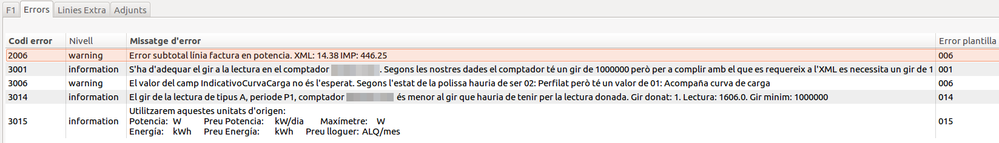
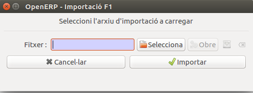

# Facturació comer

## Llistes de preus

Les llistes de preus....

## Pool de lectures

## Importació fitxers F1 (Revisar)

El mòdul de Switching permet, de moment, processar els fitxers XML de
facturació, ja sigui agrupats en un sol fitxer zip o individualment. Noves
funcionalitats s'aniran incorporant properament.

Aquest document descriu les funcionalitats del mòdul de Switching de facturació.

### Comportament importació fitxer F1

#### Comportament importació F1 normal

#### Comportament importació F1 rectificadora

Quan s'importa una factura rectificadora de proveïdor, el que fa amb les lectures
de la pòlissa es modifcar les lectures del pool.

Un cop en el pool s'han d'esborrar de les lectures de `facturacio` i després carregar del Pool
un altra cop les lectures per facturar amb els nous valors.

### Lot d'importació i línies

Denominem com a **lot d'importació** aquell conjunt de fitxers XML generats per
un mateix emisor i que ens convé tenir agrupats. El lot d'importació ens
permetrà importar el fitxer zip i/o xmls individualment.

Cada un dels fitxers xml importats, ja sigui provinents d'un fitxer zip o
individualment, genera una **línia d'importació**. La línia d'importació
conté informació relacionada al fitxer xml importat i ens permet llistar les
factures associades al fitxer xml o reimportar el fitxer en cas d'error.

El mòdul de switching de facturació  es troba en el submenú:

**Facturació > Mercat Lliure > Factures Proveïdor > Importacions**

 Figura 1: Ubicació del formulari d'importacions.

Aquest
desplegarà una vista amb el llistat de lots d'importació (veure `Figura 2`).
El llistat ens mostra informació relacionada a cada lot d'importació com ara el
nom dels fitxers importats, l'empresa emisora i altre informació relacionada
amb el resultat.

També podem accedir al llistat de tots els fitxers XML individuals importats (o
línia d'importació) des del sub-menú *Fitxers F1 importats*

En prémer en un lot d'importació veurem el formulari del lot en qüestió (veure
`Figura 3`). El formulari mostra juntament amb la informació del llistat,
una sèrie d'opcions a la dreta: Importar F1, Llistat de factures divergents,
Llistat de factures i Llistat de fitxers que es detallen a continuació.

* Importar F1:

    Ens permetrà importar un nou fitxer zip i associar-lo al lot d'importació. El
    widget que ens apareixerà es mostra en la `Figura 4`. Aquest ens
    demanarà el nom de l'emprea emisora, i ens permetrà sel·leccionar el fitxer a
    importar.

    En el cas de voler importar un nou fitxer zip en un lot d'importació existent,
    l'empresa emisora haurà de coincidir amb l'empresa emisora associada a lot
    d'importació i que haurà quedat vinculada a partir de l'importació anterior.

    En prémer Importar, es realitzarà la importació en *background*. El que
    significa que podrem seguir treballant mentre l'ERP va important els xmls. En
    finalitzar el procés se'ns notificarà a través d'una nova sol·licitud (*Request*
    que es mostra abaix a la dreta de la `Figura 3`).

    També podem anar prement el refrescar del formulari veure l'estat de la barra
    de progrés.

    En finalitzar la importació se'ns actualitzarà la informació del lot
    d'importació, mostrant en el cas que no hi hagin hagut incidents, el nombre de
    fitxers xmls importats i factures creades.

* Llistat de fitxers:

    Ens permet mostrar els fitxers xml que hi ha associats al lot d'importació
    després d'importar-los individualment o a través d'un fitxer zip. En prémer es
    mostra el llistat de línies d'improtació. Veure `Figura 5`. El llistat
    ens mostra informació relacionada amb cadascun dels fitxers xml processats.

    En prémer en una línia d'importació podrem veure un resum de la informació
    de les factures generades en el cas d'haver-se importat de manera correcte.
    veure `Figura 6`. Prement el botó **Llistar factures** podrem veure tota la
    informació de les factures (veure `Figura 7`).

    Si la importació ha estat errònia, el que veurem és el que es mostra en la
    `Figura 8`. En aquest cas ens permet reimportar el fitxer xml
    individualment. Es pot veure el wizard que ens apareixerà en la
    `Figura 9`.

* Llistat de factures:

    Ens mostrarà totes les factures associades al lot d'importació, sigui quin
    sigui el seu estat (típicament obert o borrador).

* Llistat de factures divergents:

    Ens mostrarà aquelles factures que han resultat ser divergents respecte la
    facturada per l'ERP.  A continuació s'explicarà el concepte de divergència.

Accés a fitxers F1 d'un CUPS
----------------------------

Cada vegada que es processa una línia d'importació s'emmagatzema la informació
del CUPS al qual fa referència. Això ens permet accedir des d'un CUPS a tots els
fitxers F1 (o línies d'importació) que hi fan referència. Veure `Figura 14`

Procediment d'importació
------------------------

En processar un fitxer xml, ja sigui provinent d'un zip o individualment, el
mòdul realitza les següents accions:

1. Facturar a partir de les lectures del fitxer xml.
2. Generar una factura a partir de les línies de factura del fitxer xml.
3. Comparar ambdues factures.

Del procés anterior poden resultar-ne les situacions següents:

* Mateix total en les dues factures:

    S'elimina la factura generada a partir de les lectures, quedant únicament la
    factura importada. Aquest última es deixa en estat **obert**. El formulari de
    la línia d'importació ens mostrarà un resum de les factures i ens donarà la
    opció de llistar-ne tota la informació.

* Divergència en els totals:

    En aquest cas es conserven les dues factures per un anàlisi posterior. Les
    dues factures es deixen amb estat de **borrador**. El formulari de la línia
    d'importació associada a l'xml ens mostrarà les factures i el valor de la
    divergència en els totals. Veure `Figura 10`. Tal i com s'observa,
    La factura realitzada per l'ERP a partir de les lectures de l'xml se li
    assigna el mateix origen que la factura importada, juntament amb la
    cadena de text '/comp'. Indicant que és la factura que s'usa per comparar.
    L'altre factura, la importada a partir de les línies de factura, mostra en
    el camp divergència la resta dels totals.

    El formulari ens donarà la opció de reimportar el fitxer xml i llistar les
    factures (`Figura 11`).

Aprovar factures divergents
---------------------------

Per tal d'acceptar la divergència que s'ha produït i donar la factura per
vàlida, cal visualitzar les factures divergents mitjançant el botó **LListat de
factures divergents** del formulari del lot d'importació. Inicialment es
mostraran totes les factures divergents del lot. Podem refinar la cerca i
mostrar únicament aquelles factures amb divergències dins un rang acceptable
com es mostra en l'exemple de la `Figura 12`, que mostraria totes les
factures per aprovar amb divergència per sota d'un euro.

Tot seguit es pot prémer el botó de la barra d'eines **Action** que ens
desplegarà les accions disponibles (`Figura 13`). Únicament serà
necessari prémer **Aprovar factura F1 (XML)**. Quedaran aprovades aquelles factures del
llistat que estiguin sel·leccionades, o bé totes si no se n'ha sel·leccionat
cap.

## Figures

### Figura 2
 

  Figura 2: Llistat de lots d'importació.

### Figura 3

   Figura 3: Formulari d'un lot d'importació.

## Figura 4

   Figura 4: Importació d'un zip.

### Figura 5

   Figura 5: Llistat de línies d'importació.

### Figura 6

   Figura 6: Formulari d'una línia d'importació correcte.

### Figura 7

   Figura 7: Llistat de factures vinculades a la línia d'importació.

### Figura 8

   Figura 8: Formulari d'una línia d'importació errònia.

### Figura 9

   Figura 9: Importació d'un XML.

### Figura 10

   Figura 10: Formulari d'una línia d'importació amb divergències en els
   totals.

### Figura 11

   Figura 11: Llistat de factures divergents associades a la línia
   d'importació.

### Figura 12

   Figura 12: Llistat de factures divergents.

### Figura 13

   Figura 13: Aprovar factures divergents

### Figura 14

   Figura 13: Accés a F1's des de CUPS

## Importació fitxers Q1 (Revisar)

El mòdul de Switching de lectures permet processar els fitxers XML de
lectures (Q1), ja sigui agrupats en un sol fitxer zip o individualment.

Aquest document descriu les funcionalitats del mòdul de Switching de lectures.

### Lot d'importació i línies

Denominem com a **lot d'importació** aquell conjunt de fitxers XML generats per
un mateix emisor i que ens convé tenir agrupats. El lot d'importació ens
permetrà importar el fitxer zip i/o xmls individualment.

Cada un dels fitxers xml importats, ja sigui provinents d'un fitxer zip o
individualment, genera una **línia d'importació**. La línia d'importació
conté informació relacionada al fitxer xml importat i ens permet llistar les
factures associades al fitxer xml o reimportar el fitxer en cas d'error.

El mòdul de switching de facturació  es troba en el submenú: Facturació >
Mercat Lliure > Lectures > Importacions Q1 (veure `Figura 1`). Aquest
desplegarà una vista amb el llistat de lots d'importació  (veure `Figura 2`).
El llistat ens mostra informació relacionada a cada lot d'importació com ara el
nom dels fitxers importats, l'empresa emisora i altre informació relacionada
amb el resultat. Per crear un nou lot d'importació cal prémer el botó *NEW*.

També podem accedir al llistat de tots els fitxers XML individuals importats (o
línia d'importació) des del su-menú *Fitxers Q1 importats*

En prémer en un lot d'importació veurem el formulari del lot en qüestió (veure
`Figura 3`). El formulari mostra juntament amb la informació del llistat,
una sèrie d'opcions a la dreta: Importar Q1 i Llistat de fitxers que es
detallen a continuació.

* Importar Q1:

    Ens permetrà importar un nou fitxer zip i associar-lo al lot d'importació. El
    widget que ens apareixerà es mostra en la `Figura 4`. Aquest ens
    demanarà el nom de l'emprea emisora, i ens permetrà sel·leccionar el fitxer a
    importar.

    En el cas de voler importar un nou fitxer zip en un lot d'importació existent,
    l'empresa emisora haurà de coincidir amb l'empresa emisora associada a lot
    d'importació i que haurà quedat vinculada a partir de l'importació anterior.

    En prémer Importar, es realitzarà la importació en *background*. El que
    significa que podrem seguir treballant mentre l'ERP va important els xmls. En
    finalitzar el procés se'ns notificarà a través d'una nova sol·licitud (*Request*
    que es mostra abaix a la dreta de la `Figura 3`).

    També podem anar prement el refrescar del formulari veure l'estat de la barra
    de progrés.

    En finalitzar la importació se'ns actualitzarà la informació del lot
    d'importació, mostrant en el cas que no hi hagin hagut incidents, el nombre de
    fitxers xmls importats i factures creades. Veure `Figura 5`.

* Llistat de fitxers:

    Ens permet mostrar els fitxers xml que hi ha associats al lot d'importació
    després d'importar-los individualment o a través d'un fitxer zip. En prémer es
    mostra el llistat de línies d'improtació. Veure `Figura 6`. El llistat
    ens mostra informació relacionada amb cadascun dels fitxers xml processats.

    En prémer en una línia d'importació podrem veure un resum de la informació
    de les lectures generades en el cas d'haver-se importat de manera correcte.
    veure `Figura 7`.

    Si la importació ha estat errònia, el que veurem és el que es mostra en la
    `Figura 8`. En aquest cas ens permet reimportar el fitxer xml
    individualment. Es pot veure el wizard que ens apareixerà en la
    `Figura 9`.

### Accés a fitxers Q1 d'un CUPS

Cada vegada que es processa una línia d'importació s'emmagatzema la informació
del CUPS al qual fa referència. Això ens permet accedir des d'un CUPS a tots
els fitxers Q1 (o línies d'importació) que hi fan referència. Veure `Figura
10`.

###Figures

### Figura 1

   Figura 1: Ubicació del formulari d'importacions.

### Figura 2

   Figura 2: Llistat de lots d'importació.

### Figura 3

   Figura 3: Formulari d'un lot d'importació.

### Figura 4

   Figura 4: Importació d'un zip.

### Figura 5

   Figura 5:   Llistat de línies d'importació.

### Figura 6

   Figura 6: Llistat de línies d'importació.

### Figura 7

   Figura 7: Formulari d'una línia d'importació correcte.

### Figura 8

   Figura 8: Formulari d'una línia d'importació errònia.

### Figura 9

   Figura 9: Importació d'un XML.

### Figura 10

   Figura 10: Accés a Q1's des de CUPS

## Impressió de factures

### Impressió de factures per zona i ordre

Si volem imprimir factures a partir de la zona i l'ordre que tenen els contractes
hem d'utilitzar l'assistent **Imprimir factures per zona i ordre**

Per poder cridar aquest assistent s'ha de fer des de el llistat de **Factures client**

o des de **Factures generades** del lot.

Un cop estiguem en llistat de les factures hem d'anar a **Acció (1)** i escollir el
l'assistent **Imprimir factures per zona i ordre (2)**

#### Assistent per la impressió de factures per zona i ordre

L'objectiu d'aquest assistent és imprimir una seleccció de factures en agrupades per zones i dins d'aquestes zones ordenades pel camp ordre.
 Aquests camps es defineixen dins dels contractes.

1. **Estat**

    Aquest filtre serveix per indicar l'estat de les factures que volem imprimir.
    Per defecte el valor que té és **Totes** de forma que no aplica cap filtre en la selecció de les factures.

    

    **Per exemple** es pot utilitzar per imprimir només les que estan *Obertes*  per si anem
    imprimint les factures a mesura que anem facturant el *Lot de facturació*

2. **Diari**

    Aquest filtre serveix per seleccionar les factures que estan en un determinat *Diari*.
    Per defecte el valor que té és **Tots** de forma que no aplica cap filtre en la selecció de les factures.

    

    **Per exemple** amb aquest camp podem filtra només les factures que siguin rectificadores indicant
    el *Diari* de *Factures d'Energia (Rectificadores)*

3. **Filtrar factures per**

    Aquest filtre serveix per seleccionar si volem filtrar per factures que estan dins d'un lot o entre dates.

    

    * Opció per **Lot** ens apareixerà al costat per indicar quin lot volem escollir.

        

    * Opció per **Dates** ens apareixerà a sota un rang per poder indicar data inicial i la data final.
        Aquests dos camps són obligatoris i són inclusius dins del rang.

        Per altra banda també apareix un filtre per indicar un rang de número de factura ambdós inclusius també

        

4. **Informe**

    Aquest camp serveix per escollir quin *Informe* volem utilitzar per la impressió de les factures.     

5. **Número de factures per PDF**

    Aquest camp serveix per generar fitxers PDF amb un límit de factures. D'aquesta forma podem controlar la mida dels documents generats.

    Com que la impressió de les factures es fa per zones si hi ha alguna zona que té més factures que les indicades en aquest camp llavors
    separarà en tants fitxers com sigui necessàri per fer el total de la impressió de la zona.

    **Per exemple** si volem imprimir una zona que té 1000 factures i el nostre límit és de 500 ens generarà dos fitxers PDF d'aquesta zona.

6. **Zona**

    Aquest camp serveix per poder escollir les zones de forma manual o totes o les que no tenen zona.

    Si escollim la opció *Seleccionar* en la part de l'assistent **(7) Selecció de zones**
    haurem d'escollir les zones de forma manual. Per les altres dos opcions desapareix l'opció de seleccionar manualment les zones.

    

7. **Selecció de zones**

    Aquest selector només serveix quan volem seleccionar les zones per imprimir de forma manual i com a mínim hem d'escollir una zona.

    

8. **Continuar**

    A partir de tots els filtres escollits anteriorment es fa una consulta per obtenir el total de factures que procedirem a imprimir.

    L'assistent canviarà de "pantalla" indicant-nos quin es el total de factures que imprimirem.

    

    En cas que no sigui el que esperem podem clicar sobre **Tornar** per acabar de ajustar els filtres.

    Si el resultat es l'esperat llavors farem clic sobre **Continuar** i l'assistent començarà a imprimir de forma paral·lela les factures.    

    En la "pantalla" de la impressió hi ha dos barres de progrés, la del *progrés general* i la del *progrés per zona*.

    * **Progrés General** Aquest barra indica el percentatge del total de les zones que s'ha d'imprimir.

    * **Progrés per zona** Aquest barra indica el percentatge del total de les factures de la zona s'han imprés ja.

    Per anar veient quina evolució tenen els percentatges hem d'anar clicant sobre el botó **Actualitzar**

    

    Quan el **progrés general** ha arribat al 100% ja podrem descarregar el contingut en un fitxer ZIP.

    

    En el camp **Informació** de la "pantalla" de descarrega del fitxer ZIP ens indica si hi ha hagut cap problema al intentar imprimir
    l'informe per alguna de les factures. Si el camp és buit vol dir que tot el procés ha sigut correcte.

    

    El contingut d'aquest ZIP es el següent:

    

    Una carpeta *tmp* on dins d'aquesta hi ha tots els PDF de les zones separat per **número de zona**
    i **número de pdf** en el cas que s'hagi superat el límit *(5) Número de factures per PDF*.

## Enviament de factures per correu electrònic

Hi ha la possibilitat d'enviar les factures d'energia a través del correu electrònic. Per defecte
ve configurat amb dos idiomes, el català i el castellà. Això vol dir que abans s'haurà de configurar
l'idioma dels clients al desitjat. També es pot modificar el text de la plantilla del correu
electrònic per tal d'adaptar-lo a les necessitats de cadascú.

### Configuració del client

Així doncs en un contracte ara disposarem d'uns camps nous per tal de decidir com es vol enviar la
factura.

Tenim tres opcions a l'hora de decidir com volem enviar una factura:

  * Correu postal
  * Correu postal i e-mail
  * E-mail

Per defecte el contracte ve amb Correu postal activat, i per tant s'hauran de marcar tots aquells que
es vulgui fer la comunicació a través de correu electrònic. Per dur a terme això farem una **nova**
modificació contractual i actualitzem el camp **Enviar factura via** amb el tipus d'enviament que
es desitgi i actualitzem l'**Adreça de pagament** amb l'e-mail correcte. També ens podem assegurar
que l'idioma de la **Persona pagadora** sigui el correcta.

Aquestes opcions ens serviran a l'hora de fer l'enviament massiu. Els que tinguin seleccionada alguna
de les dues opcions que inclouen l'e-mail es seleccionarà per enviar.

### Enviament massiu de factures a través del lot

Es pot realitzar un enviament massiu de les factures a través del lot de facturació. Per tal de realitzar-lo
obrim el lot i en el marge dret hi tindrem l'assistent disponible.

Els requisits per tal que l'assistent seleccioni una factura per enviar són els següents:

* La factura ha d'estar en estat **Obert**.
* La factura no ha d'haver estat enviada.
* La pòlissa ha de tenir una modificació contractual amb enviament per email i que comprengui la data de la
  factura.

Escollim l'idioma pel qual volem enviar les factures i apretem **Continuar**.
Un cop l'executem se'ns obrirà una finestra on se'ns mostren les factures per idioma d'aquest lot que tenim
pendents d'enviar.

Es mostrarà la plantilla per aquell idioma per si la volem modificar per aquesta ocasió i haurem d'escollir des
del compte que ho volem enviar.

Finalment apretem el botó **Envia tots els correus** i ens esperem a que faci la feina.

!!! note "Nota"
      Pot ser que se'ns quedi el client de l'ERP bloquejat, si ens passa el deixem continuar ja que està preparant
      la sortida dels correus electrònics. Podem obrir un altre client i continuar treballant.

Haurem de realitzar l'enviament per cada idioma.

### Enviament d'una sola factura (manual)

Quan volguem re-enviar una sola factura, o enviar-ne alguna que no estigui marcada per enviar també podrem fer-ho.
Obrim la factura i al marge dret veurem l'assistent **Enviar factura per e-mail Mail Form**.

Després ens sortirà la plantilla igual que en l'enviament massiu.

!!! note "Nota"
      Aquest assistent no contempla si la factura ja s'ha enviat, això vol dir que no ens avisarà si un correu ja ha
      sigut enviat.

### Enviament múltiple de factures (manual)

Ens hem de situar al llistat de factures i fer el filtre que volguem. És molt important fer el filtre de l'**Idioma Client**
ja que si no s'utiltiza aquest filtre s'enviarà amb l'idioma del client de la primera factura de la selecció.

Un cop tenim la selecció feta (Si no en seleccionem cap el programa entén que són tots els de la llista) apretem el botó
d'**Acció** del menú principal, ens apareixeran el llistat d'assistents disponibles i escollim **Enviar factura per e-mail
Mail Form**.

La resta és com l'enviament massiu.

!!! note "Nota"
      Aquest assistent no contempla si la factura ja s'ha enviat, això vol dir que no ens avisarà si un correu ja ha
      sigut enviat.

### Sistema d'enviament

    blockdiag {
        lot -> enviament -> enviar -> sortida -> email -> enviats;
        sortida -> sortida [label = "Cada 5m"]

        lot [shape = "note",
             label = "Lot"];
        enviament [label = "Enviament\nmassiu",
                   shape = "diamond"];
        email [shape = "mail"];
        enviar[label =  "Enviar",
               shape = "diamond"];
        sortida -> email [folded];
    }
  

Sempre que fem un enviament el correu es queda a la carpeta de **Sortida**, i el sistema cada 5 minuts
comprova si hi ha correus per enviar. En cas que n'hi hagi s'envien i es mouen a la carpeta d'**Enviats**.

### Camps addicionals a una factura d'energia

Si una factura està marcada per enviar per E-mail (una modificació contractual que comprèn la
data de la factura i que té seleccionat l'enviament per e-mail) tindrà 4 camps nous a la pestanya **Other info**.

* **Enviada per E-mail**: estarà marcat quan aquesta factura ja hagi sigut enviada.
* **Carpeta**: ens mostra a quina carpeta del sistema de correu es troba.

  * **Entrada**: S'utilitza per la recepció d'emails, en aquest cas no s'utilitzarà.
  * **Esborranys**: Quan fem un enviament i marquem que ho deixem a Esborrany, aquests correus electrònics mai
    s'enviaran fins que no els marquem per enviar.
  * **Sortida**: Està a punt de ser enviat.
  * **Papelera**: Per ser eliminat
  * **Enviats**: Ja ha sortit del nostre sistema i està entregat al sistema de correu destí.

* **Data enviament**: Data quan el correu electrònic va sortir del sistema.

En el cas que no estigui marcada per enviar per e-mail veuríem el següent text.

### Comprovació dels enviaments d'un lot

A partir del lot accedim a la drecera **Factures generades** i s'obrirà el llistat de les factures generades a través
d'aquell lot. Despleguem els filtres addicionals i veurem que hi ha 4 filtres nous.

* **Enviada per E-mail**: Ens permet seleccionar les que ja s'han enviat i les que no.
* **Carpeta**: A quina carpeta es troba.
* **Data enviament**: Busquem per data d'enviament.
* **Marcada enviar per E-mail**: Està marcada que s'ha d'enviar a través de correu electrònic.

Per tant utilitzant el filtre de **Marcada enviar per E-mail**: **Sí** i **Enviada per E-mail**: **No** tindríem
totes les que encara no s'han enviat.

### Comprovació d'enviaments pendents

Tenim un menú disponible a través de **Facturació > Mercat lliure > Factures Client > Factures pendents d'enviar per email**.
Aquest és un llistat de factures amb alguns filtres per defecte fets:

* La factura estigui marcada per enviar
* No s'hagi enviat

!!!note "Nota"
      Si en comptes de fer una modificació contractual nova, hem sobreescrit l'existent pot ser que en aquest llistat ens surtin
      factures antigues pendents d'enviar. Això és degut a que és la modificació contractual qui marca a partir de quina data
      una factura ha de ser enviada per email.
