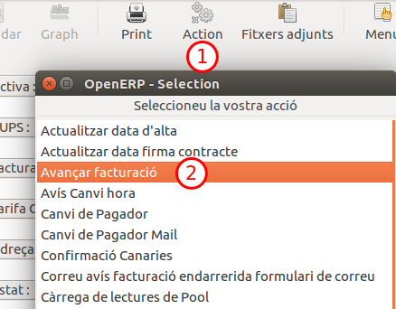

# Facturació comer

## Llistes de preus

Les llistes de preus....

## Pool de lectures

## Importació fitxers F1 (Revisar)

El mòdul de Switching permet, de moment, processar els fitxers XML de
facturació, ja sigui agrupats en un sol fitxer zip o individualment. Noves
funcionalitats s'aniran incorporant properament.

Aquest document descriu les funcionalitats del mòdul de Switching de facturació.

### Comportament importació fitxer F1

#### Comportament importació F1 normal

#### Comportament importació F1 rectificadora

Quan s'importa una factura rectificadora de proveïdor, el que fa amb les lectures
de la pòlissa es modifcar les lectures del pool.

Un cop en el pool s'han d'esborrar de les lectures de `facturacio` i després carregar del Pool
un altra cop les lectures per facturar amb els nous valors.

### Lot d'importació i línies

Denominem com a **lot d'importació** aquell conjunt de fitxers XML generats per
un mateix emisor i que ens convé tenir agrupats. El lot d'importació ens
permetrà importar el fitxer zip i/o xmls individualment.

Cada un dels fitxers xml importats, ja sigui provinents d'un fitxer zip o
individualment, genera una **línia d'importació**. La línia d'importació
conté informació relacionada al fitxer xml importat i ens permet llistar les
factures associades al fitxer xml o reimportar el fitxer en cas d'error.

El mòdul de switching de facturació  es troba en el submenú:

**Facturació > Mercat Lliure > Factures Proveïdor > Importacions**

 Figura 1: Ubicació del formulari d'importacions.

Aquest
desplegarà una vista amb el llistat de lots d'importació (veure `Figura 2`).
El llistat ens mostra informació relacionada a cada lot d'importació com ara el
nom dels fitxers importats, l'empresa emisora i altre informació relacionada
amb el resultat.

També podem accedir al llistat de tots els fitxers XML individuals importats (o
línia d'importació) des del sub-menú *Fitxers F1 importats*

En prémer en un lot d'importació veurem el formulari del lot en qüestió (veure
`Figura 3`). El formulari mostra juntament amb la informació del llistat,
una sèrie d'opcions a la dreta: Importar F1, Llistat de factures divergents,
Llistat de factures i Llistat de fitxers que es detallen a continuació.

* Importar F1:

    Ens permetrà importar un nou fitxer zip i associar-lo al lot d'importació. El
    widget que ens apareixerà es mostra en la `Figura 4`. Aquest ens
    demanarà el nom de l'emprea emisora, i ens permetrà sel·leccionar el fitxer a
    importar.

    En el cas de voler importar un nou fitxer zip en un lot d'importació existent,
    l'empresa emisora haurà de coincidir amb l'empresa emisora associada a lot
    d'importació i que haurà quedat vinculada a partir de l'importació anterior.

    En prémer Importar, es realitzarà la importació en *background*. El que
    significa que podrem seguir treballant mentre l'ERP va important els xmls. En
    finalitzar el procés se'ns notificarà a través d'una nova sol·licitud (*Request*
    que es mostra abaix a la dreta de la `Figura 3`).

    També podem anar prement el refrescar del formulari veure l'estat de la barra
    de progrés.

    En finalitzar la importació se'ns actualitzarà la informació del lot
    d'importació, mostrant en el cas que no hi hagin hagut incidents, el nombre de
    fitxers xmls importats i factures creades.

* Llistat de fitxers:

    Ens permet mostrar els fitxers xml que hi ha associats al lot d'importació
    després d'importar-los individualment o a través d'un fitxer zip. En prémer es
    mostra el llistat de línies d'improtació. Veure `Figura 5`. El llistat
    ens mostra informació relacionada amb cadascun dels fitxers xml processats.

    En prémer en una línia d'importació podrem veure un resum de la informació
    de les factures generades en el cas d'haver-se importat de manera correcte.
    veure `Figura 6`. Prement el botó **Llistar factures** podrem veure tota la
    informació de les factures (veure `Figura 7`).

    Si la importació ha estat errònia, el que veurem és el que es mostra en la
    `Figura 8`. En aquest cas ens permet reimportar el fitxer xml
    individualment. Es pot veure el wizard que ens apareixerà en la
    `Figura 9`.

* Llistat de factures:

    Ens mostrarà totes les factures associades al lot d'importació, sigui quin
    sigui el seu estat (típicament obert o borrador).

* Llistat de factures divergents:

    Ens mostrarà aquelles factures que han resultat ser divergents respecte la
    facturada per l'ERP.  A continuació s'explicarà el concepte de divergència.

Accés a fitxers F1 d'un CUPS
----------------------------

Cada vegada que es processa una línia d'importació s'emmagatzema la informació
del CUPS al qual fa referència. Això ens permet accedir des d'un CUPS a tots els
fitxers F1 (o línies d'importació) que hi fan referència. Veure `Figura 14`

Procediment d'importació
------------------------

En processar un fitxer xml, ja sigui provinent d'un zip o individualment, el
mòdul realitza les següents accions:

1. Pujar el fitxer F1 al servidor
2. Importar les dades generals de l'F1
3. Realitzar validacions sobre les lectures proporcionades per l'F1
4. Importar les lectures

Durant aquests passos, es van realitzant un seguit de validacions, definides a
continuació.

### Validacions a la importació d'F1

Les validacions que es mostren a continuació es realitzen en la importació de F1.

#### Identificadors de les validacions

Cada validació tindrà un codi a l'ERP. Aquest codi sempre comença amb la fase en
la qual es crea, seguit del nombre de template que té l'error. Per exemple,
[3001] seria la validació del template 001 de la fase 3. Tots els texts que
tinguin el mateix codi seguiran el mateix format i seran deguts a la mateixa causa.

Un sol fitxer F1 pot tenir dues o més vegades el mateix error si aquest error es repeteix.

#### Nivells de les validacions

Les validacions tenen tres nivells, descrits a continuació:

- **Critical (E)**: Aquest és un error que ens impedeix seguir amb la importació. Això causarà que la importació s'aturi en la iteració a la que estigui.
- **Warning (W)**: Aquest és un possible error que s'hauria de revisar però que no ha de ser necessàriament problematic. En aquest cas no s'aturarà la importació.
- **Information (I)**: Aquest és un cas especial però que no hauria de portar mai problemes, simplement es dona la informació que ha passat. Tampoc atura la importació.

#### Validacions que es realitzen

##### Fase 1

- **[1001] Error d'estructura (E)**: Error en la estructura de l'XML.
- **[1002] Emissor no identificat (E)**: No s'ha trobat l'emissor amb el codi donat.
- **[1003] Codi d'emissor repetit (E)**: Hi ha més d'un emissor amb el mateix codi.
- **[1004] Comercialitzadora incorrecte (E)**: El destinatari d'aquest fitxer no és la nostra comercialitzadora.
- **[1005] Cups no identificat (E)**: No hem trobat el cups amb el codi donat.
- **[1006] Fitxer ja processat (E)**: Ja hem processat aquest fitxer previament.
- **[1007] CUPS incorrecte segons distribuidora (E)**: El codi de la distribuidora del CUPS donat no és el de la distribuidora emissora de la factura.

##### Fase 2

- **[2001] Factura repetida (E)**: Ja existeix una factura amb el mateix origen i emissor.
- **[2002] Total incorrecte (W)**: El total de la factura importada no coincideix amb el de l'XML.
- **[2003] Periode incorrecte (E)**: No es pot identificar un dels periodes a importar.
- **[2004] Diari incorrecte (E)**: No es pot trobar el diari indicat.
- **[2005] CUPS sense pòlissa (E)**: No s'ha trobat cap pòlissa vinculada al CUPS donat en la data de la factura.
- **[2006] Subtotal incorrecte (W)**: El subtotal de la factura no coincideix amb la suma dels preus que el formen.
- **[2007] Factura de referència inexistent (E)**: No s'ha trobat la factura de referència indicada.
- **[2008] Configuració no trobada (E)**: No s'ha trobat la configuració de switching per l'emissor de la factura.
- **[2009] Producte no identificat (W)**: No s'ha pogut identificar un dels productes.
- **[2010] Factura anuladora ja carregada (I)**: Una factura ha estat descartada per no complir condicions de coherència. Té el mateix import que una factura anul·ladora ja carregada
- **[2011] Factura anuladora no trobada (I)**: Una factura ha estat descartada per no complir condicions de coherència. Probablement falta una factura anul·ladora
- **[2012] Creació forçada (I)**: No s'ha trobat la factura de referencia però s'ha forçat la creació de la factura.
- **[2013] Numero de factura repetit (E)**: En el fitxer importat hi ha dues o més factures amb el mateix número de factura.

##### Fase 3

- **Comprovacions comptadors**

    - **[3001] Adequar gir a lectura (I)**: És realitza una validació de que el gir que tenim a la base de dades és diferent al que ens donen al fitxer F1.
    - **[3014] El gir de l'F1 no es correcte (I)**: És realitza una validació de que el gir que ens donen al fitxer F1 sigui suficient per les lectures que ens donen. Per exemple, si ens donen un gir de 100 i una lectura de 4560 sabem que com a mínim el gir ha de ser de 10000.
    - **[3002] El comptador existeix (W)**: Comprovem que el comptador que ens donen existeix en la nostra base de dades. Tenim en compte que hi pot haver padding de zeros.
    - **[3003] Comptador repetit (I)**: Comprovem si en una sola factura tenim dues vegades un mateix comptador.
    - **[3004] Comptador de reactiva (I)**: Comprovem si algun dels comptadors només té lectures de reactiva (pels casos en que tenim un comptador per activa i un per reactiva).
    - **[3005] Més d'un comptador actiu (W)**: Comprovem si la pòlissa té més d'un comptador actiu actualment.
    - **[3030] Comptador nou amb conflictes (E)**: Quan importem un comptador nou comprovem que no causi conflictes de dates amb els comptadors que ja tenim per la pòlissa.

- **Comprovacions dades CCH**

    - **[3006] Coincidència amb estat del contracte (W)**: Comprovem quin és el valor del camp IndicativoCurvaCarga del fitxer F1. Depenent de la pòlissa esperarem els següents valors:
        - Si la pòlissa té una tarifa 3.1 o 6.X sempre haurà de ser *03*.
        - Si la pòlissa té una tarifa inferior a 3.1 dependrà de si tenim la telegestió activada o no
            - Si la pòlissa té la telegestió operativa, esperarem el valor *01*.
            - Si la pòlissa té la telegestió no operativa, esperarem el valor *02*.

- **Lectures d'Energia i Reactiva**

    - **[3007] Divergència entre la lectura existent i l'F1 (E)**: Si tenim una lectura entrada pel mateix dia que ens arriba amb el fitxer F1, comprovem si són iguals. Aquesta comprovació només es realitza per factures no rectificadores.
    - **[3008] Nombre de períodes (E)**: Tenim un nombre incorrecte de períodes per un comptador segons la seva tarifa.
    - **[3009] Lectures negatives (E)**: El consum d'alguna de les lectures importades és negatiu.
    - **[3010] Ajust integrador (I)**: Alguna de les lectures importades té ajust integrador.
    - **[3011] Possible gir de comptador (I)**: Alguna de les lectures finals són inferiors a les lectures inicials.
    - **[3012] Factura rectificadora (I)**: La factura és rectificadora, de manera que les lectures es sobreescriuran.
    - **[3013] Origen "Sin lectura (99)" (I)**: Alguna de les lectures té com a origen 99, és a dir, no hi ha lectura.
    - **[3015] Unitats d'importació (I)**: S'indicaran quines són les unitats amb les que suposarem que ens venen els valors.
    - **[3029] Conflicte en les lectures (E)**: El fitxer dona diferents valors per una mateixa lectura.

- **Lectures de Maxímetre**

    - **[3007] Divergència entre la lectura existent i l'F1 (E)**: Si tenim una lectura entrada pel mateix dia que ens arriba amb el fitxer F1, comprovem si són iguals. Aquesta comprovació només es realitza per factures no rectificadores.
    - **[3008] Nombre de períodes (E)**: Tenim un nombre incorrecte de períodes per un comptador i un tipus.
    - **[3009] Lectures negatives (E)**: El consum d'alguna de les lectures importades és negatiu.
    - **[3010] Ajust integrador (I)**: Alguna de les lectures importades té ajust integrador.
    - **[3029] Conflicte en les lectures (E)**: El fitxer dona diferents valors per una mateixa lectura. Només es tenen en compte les lectures finals.

- **Lectures d'energia**

    - **[3016] Lectura impossible (W)**: La lectura no és possible ja que el seu valor és superior a consumir la potència contractada durant totes les hores del període entre les dates de les lectures.

- **Mode facturació**

    - **[3017] Tarifes inconsistents (W)**: La tarifa que tenim guardada i la tarifa de l'XML no coincideixen.
    - **[3018] Facturació de potència inconsistent (W)**: El mode de facturació de potència (Maxímetre o ICP) que tenim guardat per la pòlissa i el que indica l'XML no coincideixen.
    - **[3019] Lectura en baixa inconsistent (W)**: L'indicador de si les lectures són en baixa no coincideix entre el que tenim guardat per la pòlissa i l'XML.
    - **[3020] Autoconsum inconsistent (I)**: Hi ha algun concepte amb tipus corresponent a l'autoconsum però nosaltres tenim la pòlissa sense autoconsum.
    - **[3027] Trafo a 0 en 3.1A LB (W)**: La tarifa de la factura importada és una 3.1A LB però en la nostra pòlissa la tarifa té el valor de trafo KVA a 0.

- **Conceptes**

    - **[3021] Falten les unitats (I)**: Un dels conceptes no té el nombre d'unitats.
    - **[3022] Falta el preu (I)**: Un dels conceptes no té el preu per unitat.
    - **[3023] Preu total incorrecte (I)**: Per un dels conceptes el total no és igual a la multiplicació del preu per el nombre d'unitats.
    - **[3024] Concepte inexistent (I)**: Un dels conceptes té com a codi un valor que no correspon amb cap dels definits per la CNMC.

- **Dates**

    - **[3025] Dates incorrectes pel comptador (W)**: L'inici o el final d'alguna lectura està fora del període durant el qual el comptador està actiu.
    - **[3026] Un període de dates inclou una modificació contractual (W)**: Hi ha una modificació contractual entre alguna de les lectures d'inici i de final.

- **Simulació de la factura**

    - **[3028] Simulació de la factura**: Creem una factura amb les dades que ens envien en l'F1 i comprovem que els totals siguin els mateixos que ens passen. Aquesta validació pot crear diferents subcodis d'error:
        - **[3028-A] Error en la potència**: El preu de la potencia total de la simulació no coincideix amb el donat a l'F1.
        - **[3028-B] Error en l'activa**: El preu de l'energia activa total de la simulació no coincideix amb el donat a l'F1.
        - **[3028-C] Error en la reactiva**: El preu de l'energia reactiva total de la simulació no coincideix amb el donat a l'F1.
        - **[3028-D] Error en l'excés de potència**: El preu de l'excés de potència total de la simulació no coincideix amb el donat a l'F1.
        - **[3028-E] Base d'impost incorrecte**: La base d'un dels IVAs donats a l'XML no coincideix amb el que hem simulat.
        - **[3028-F] Total d'impost incorrecte**: El total d'un dels IVAs donats a l'XML no coincideix amb el que hem simulat.
        - **[3028-G] Impost inesperat**: En l'XML apareix un IVA amb un percentatge que no correspon a cap dels conceptes cobrats.
        - **[3028-H] Impost faltant**: En l'XML falta un IVA amb un percentatge que hauria d'aparèixer segons els conceptes cobrats.
        - **[3028-I] Error en el total**: El preu total de la simulació no coincideix amb el donat a l'F1.

##### Fase 4

En la fase 4 no hi ha validacions ja que totes les validacions necessaries s'han realitzat a la fase anterior.

#### Activar i desactivar validacions

Podem activar i desactivar algunes de les validacions. Per tal de fer-ho
simplement ens hem de dirigir a
`Facturació > General > Configuració > Switching > Error plantilles`.

No totes les validacions es poden activar i desactivar. Concretament, hi ha
validacions que estan incloses en el codi, de manera que no ens les podem
saltar. D'altra banda, per qüestions de seguretat, s'ha decidit que les
validacions de nivell crític no es podran desactivar mai.

Existeix un camp que ens permet cercar les validacions segons si es poden
desactivar o no, per facilitar la cerca de les validacions que es poden desactivar.

El camp `actiu` es mostrarà en només lectura quan aquest no es pugi desactivar.
Altrament, es mostrarà modificable si es pot desactivar.

Aprovar factures divergents
---------------------------

Per tal d'acceptar la divergència que s'ha produït i donar la factura per
vàlida, cal visualitzar les factures divergents mitjançant el botó **LListat de
factures divergents** del formulari del lot d'importació. Inicialment es
mostraran totes les factures divergents del lot. Podem refinar la cerca i
mostrar únicament aquelles factures amb divergències dins un rang acceptable
com es mostra en l'exemple de la `Figura 12`, que mostraria totes les
factures per aprovar amb divergència per sota d'un euro.

Tot seguit es pot prémer el botó de la barra d'eines **Action** que ens
desplegarà les accions disponibles (`Figura 13`). Únicament serà
necessari prémer **Aprovar factura F1 (XML)**. Quedaran aprovades aquelles factures del
llistat que estiguin sel·leccionades, o bé totes si no se n'ha sel·leccionat
cap.

## Figures

### Figura 2
 

  Figura 2: Llistat de lots d'importació.

### Figura 3

   Figura 3: Formulari d'un lot d'importació.

### Figura 4

   Figura 4: Importació d'un zip.

### Figura 5

   Figura 5: Llistat de línies d'importació.

### Figura 6

   Figura 6: Formulari d'una línia d'importació correcte.

### Figura 7

   Figura 7: Llistat de factures vinculades a la línia d'importació.

### Figura 8

   Figura 8: Formulari d'una línia d'importació errònia.

### Figura 9

   Figura 9: Importació d'un XML.

### Figura 10

   Figura 10: Formulari d'una línia d'importació amb divergències en els
   totals.

### Figura 11

   Figura 11: Llistat de factures divergents associades a la línia
   d'importació.

### Figura 12

   Figura 12: Llistat de factures divergents.

### Figura 13

   Figura 13: Aprovar factures divergents

### Figura 14

   Figura 13: Accés a F1's des de CUPS

## Importació fitxers Q1 (Revisar)

El mòdul de Switching de lectures permet processar els fitxers XML de
lectures (Q1), ja sigui agrupats en un sol fitxer zip o individualment.

Aquest document descriu les funcionalitats del mòdul de Switching de lectures.

### Lot d'importació i línies

Denominem com a **lot d'importació** aquell conjunt de fitxers XML generats per
un mateix emisor i que ens convé tenir agrupats. El lot d'importació ens
permetrà importar el fitxer zip i/o xmls individualment.

Cada un dels fitxers xml importats, ja sigui provinents d'un fitxer zip o
individualment, genera una **línia d'importació**. La línia d'importació
conté informació relacionada al fitxer xml importat i ens permet llistar les
factures associades al fitxer xml o reimportar el fitxer en cas d'error.

El mòdul de switching de facturació  es troba en el submenú: Facturació >
Mercat Lliure > Lectures > Importacions Q1 (veure `Figura 1`). Aquest
desplegarà una vista amb el llistat de lots d'importació  (veure `Figura 2`).
El llistat ens mostra informació relacionada a cada lot d'importació com ara el
nom dels fitxers importats, l'empresa emisora i altre informació relacionada
amb el resultat. Per crear un nou lot d'importació cal prémer el botó *NEW*.

També podem accedir al llistat de tots els fitxers XML individuals importats (o
línia d'importació) des del su-menú *Fitxers Q1 importats*

En prémer en un lot d'importació veurem el formulari del lot en qüestió (veure
`Figura 3`). El formulari mostra juntament amb la informació del llistat,
una sèrie d'opcions a la dreta: Importar Q1 i Llistat de fitxers que es
detallen a continuació.

* Importar Q1:

    Ens permetrà importar un nou fitxer zip i associar-lo al lot d'importació. El
    widget que ens apareixerà es mostra en la `Figura 4`. Aquest ens
    demanarà el nom de l'emprea emisora, i ens permetrà sel·leccionar el fitxer a
    importar.

    En el cas de voler importar un nou fitxer zip en un lot d'importació existent,
    l'empresa emisora haurà de coincidir amb l'empresa emisora associada a lot
    d'importació i que haurà quedat vinculada a partir de l'importació anterior.

    En prémer Importar, es realitzarà la importació en *background*. El que
    significa que podrem seguir treballant mentre l'ERP va important els xmls. En
    finalitzar el procés se'ns notificarà a través d'una nova sol·licitud (*Request*
    que es mostra abaix a la dreta de la `Figura 3`).

    També podem anar prement el refrescar del formulari veure l'estat de la barra
    de progrés.

    En finalitzar la importació se'ns actualitzarà la informació del lot
    d'importació, mostrant en el cas que no hi hagin hagut incidents, el nombre de
    fitxers xmls importats i factures creades. Veure `Figura 5`.

* Llistat de fitxers:

    Ens permet mostrar els fitxers xml que hi ha associats al lot d'importació
    després d'importar-los individualment o a través d'un fitxer zip. En prémer es
    mostra el llistat de línies d'improtació. Veure `Figura 6`. El llistat
    ens mostra informació relacionada amb cadascun dels fitxers xml processats.

    En prémer en una línia d'importació podrem veure un resum de la informació
    de les lectures generades en el cas d'haver-se importat de manera correcte.
    veure `Figura 7`.

    Si la importació ha estat errònia, el que veurem és el que es mostra en la
    `Figura 8`. En aquest cas ens permet reimportar el fitxer xml
    individualment. Es pot veure el wizard que ens apareixerà en la
    `Figura 9`.

### Accés a fitxers Q1 d'un CUPS

Cada vegada que es processa una línia d'importació s'emmagatzema la informació
del CUPS al qual fa referència. Això ens permet accedir des d'un CUPS a tots
els fitxers Q1 (o línies d'importació) que hi fan referència. Veure `Figura
10`.

###Figures

### Figura 1

   Figura 1: Ubicació del formulari d'importacions.

### Figura 2

   Figura 2: Llistat de lots d'importació.

### Figura 3

   Figura 3: Formulari d'un lot d'importació.

### Figura 4

   Figura 4: Importació d'un zip.

### Figura 5

   Figura 5:   Llistat de línies d'importació.

### Figura 6

   Figura 6: Llistat de línies d'importació.

### Figura 7

   Figura 7: Formulari d'una línia d'importació correcte.

### Figura 8

   Figura 8: Formulari d'una línia d'importació errònia.

### Figura 9

   Figura 9: Importació d'un XML.

### Figura 10

   Figura 10: Accés a Q1's des de CUPS

## Impressió de factures

### Impressió de factures per zona i ordre

Si volem imprimir factures a partir de la zona i l'ordre que tenen els contractes
hem d'utilitzar l'assistent **Imprimir factures per zona i ordre**

Per poder cridar aquest assistent s'ha de fer des de el llistat de **Factures client**

o des de **Factures generades** del lot.

Un cop estiguem en llistat de les factures hem d'anar a **Acció (1)** i escollir el
l'assistent **Imprimir factures per zona i ordre (2)**

#### Assistent per la impressió de factures per zona i ordre

L'objectiu d'aquest assistent és imprimir una seleccció de factures en agrupades per zones i dins d'aquestes zones ordenades pel camp ordre.
 Aquests camps es defineixen dins dels contractes.

1. **Estat**

    Aquest filtre serveix per indicar l'estat de les factures que volem imprimir.
    Per defecte el valor que té és **Totes** de forma que no aplica cap filtre en la selecció de les factures.

    

    **Per exemple** es pot utilitzar per imprimir només les que estan *Obertes*  per si anem
    imprimint les factures a mesura que anem facturant el *Lot de facturació*

2. **Diari**

    Aquest filtre serveix per seleccionar les factures que estan en un determinat *Diari*.
    Per defecte el valor que té és **Tots** de forma que no aplica cap filtre en la selecció de les factures.

    

    **Per exemple** amb aquest camp podem filtra només les factures que siguin rectificadores indicant
    el *Diari* de *Factures d'Energia (Rectificadores)*

3. **Filtrar factures per**

    Aquest filtre serveix per seleccionar si volem filtrar per factures que estan dins d'un lot o entre dates.

    

    * Opció per **Lot** ens apareixerà al costat per indicar quin lot volem escollir.

        

    * Opció per **Dates** ens apareixerà a sota un rang per poder indicar data inicial i la data final.
        Aquests dos camps són obligatoris i són inclusius dins del rang.

        Per altra banda també apareix un filtre per indicar un rang de número de factura ambdós inclusius també

        

4. **Informe**

    Aquest camp serveix per escollir quin *Informe* volem utilitzar per la impressió de les factures.     

5. **Número de factures per PDF**

    Aquest camp serveix per generar fitxers PDF amb un límit de factures. D'aquesta forma podem controlar la mida dels documents generats.

    Com que la impressió de les factures es fa per zones si hi ha alguna zona que té més factures que les indicades en aquest camp llavors
    separarà en tants fitxers com sigui necessàri per fer el total de la impressió de la zona.

    **Per exemple** si volem imprimir una zona que té 1000 factures i el nostre límit és de 500 ens generarà dos fitxers PDF d'aquesta zona.

6. **Zona**

    Aquest camp serveix per poder escollir les zones de forma manual o totes o les que no tenen zona.

    Si escollim la opció *Seleccionar* en la part de l'assistent **(7) Selecció de zones**
    haurem d'escollir les zones de forma manual. Per les altres dos opcions desapareix l'opció de seleccionar manualment les zones.

    

7. **Selecció de zones**

    Aquest selector només serveix quan volem seleccionar les zones per imprimir de forma manual i com a mínim hem d'escollir una zona.

    

8. **Continuar**

    A partir de tots els filtres escollits anteriorment es fa una consulta per obtenir el total de factures que procedirem a imprimir.

    L'assistent canviarà de "pantalla" indicant-nos quin es el total de factures que imprimirem.

    

    En cas que no sigui el que esperem podem clicar sobre **Tornar** per acabar de ajustar els filtres.

    Si el resultat es l'esperat llavors farem clic sobre **Continuar** i l'assistent començarà a imprimir de forma paral·lela les factures.    

    En la "pantalla" de la impressió hi ha dos barres de progrés, la del *progrés general* i la del *progrés per zona*.

    * **Progrés General** Aquest barra indica el percentatge del total de les zones que s'ha d'imprimir.

    * **Progrés per zona** Aquest barra indica el percentatge del total de les factures de la zona s'han imprés ja.

    Per anar veient quina evolució tenen els percentatges hem d'anar clicant sobre el botó **Actualitzar**

    

    Quan el **progrés general** ha arribat al 100% ja podrem descarregar el contingut en un fitxer ZIP.

    

    En el camp **Informació** de la "pantalla" de descarrega del fitxer ZIP ens indica si hi ha hagut cap problema al intentar imprimir
    l'informe per alguna de les factures. Si el camp és buit vol dir que tot el procés ha sigut correcte.

    

    El contingut d'aquest ZIP es el següent:

    

    Una carpeta *tmp* on dins d'aquesta hi ha tots els PDF de les zones separat per **número de zona**
    i **número de pdf** en el cas que s'hagi superat el límit *(5) Número de factures per PDF*.

## Enviament de factures per correu electrònic

Hi ha la possibilitat d'enviar les factures d'energia a través del correu electrònic. Per defecte
ve configurat amb dos idiomes, el català i el castellà. Això vol dir que abans s'haurà de configurar
l'idioma dels clients al desitjat. També es pot modificar el text de la plantilla del correu
electrònic per tal d'adaptar-lo a les necessitats de cadascú.

### Configuració del client

Així doncs en un contracte ara disposarem d'uns camps nous per tal de decidir com es vol enviar la
factura.

Tenim tres opcions a l'hora de decidir com volem enviar una factura:

  * Correu postal
  * Correu postal i e-mail
  * E-mail

Per defecte el contracte ve amb Correu postal activat, i per tant s'hauran de marcar tots aquells que
es vulgui fer la comunicació a través de correu electrònic. Per dur a terme això farem una **nova**
modificació contractual i actualitzem el camp **Enviar factura via** amb el tipus d'enviament que
es desitgi i actualitzem l'**Adreça de pagament** amb l'e-mail correcte. També ens podem assegurar
que l'idioma de la **Persona pagadora** sigui el correcta.

Aquestes opcions ens serviran a l'hora de fer l'enviament massiu. Els que tinguin seleccionada alguna
de les dues opcions que inclouen l'e-mail es seleccionarà per enviar.

### Enviament massiu de factures a través del lot

Es pot realitzar un enviament massiu de les factures a través del lot de facturació. Per tal de realitzar-lo
obrim el lot i en el marge dret hi tindrem l'assistent disponible.

Els requisits per tal que l'assistent seleccioni una factura per enviar són els següents:

* La factura ha d'estar en estat **Obert**.
* La factura no ha d'haver estat enviada.
* La pòlissa ha de tenir una modificació contractual amb enviament per email i que comprengui la data de la
  factura.

Escollim l'idioma pel qual volem enviar les factures i apretem **Continuar**.
Un cop l'executem se'ns obrirà una finestra on se'ns mostren les factures per idioma d'aquest lot que tenim
pendents d'enviar.

Es mostrarà la plantilla per aquell idioma per si la volem modificar per aquesta ocasió i haurem d'escollir des
del compte que ho volem enviar.

Finalment apretem el botó **Envia tots els correus** i ens esperem a que faci la feina.

!!! note "Nota"
      Pot ser que se'ns quedi el client de l'ERP bloquejat, si ens passa el deixem continuar ja que està preparant
      la sortida dels correus electrònics. Podem obrir un altre client i continuar treballant.

Haurem de realitzar l'enviament per cada idioma.

### Enviament d'una sola factura (manual)

Quan volguem re-enviar una sola factura, o enviar-ne alguna que no estigui marcada per enviar també podrem fer-ho.
Obrim la factura i al marge dret veurem l'assistent **Enviar factura per e-mail Mail Form**.

Després ens sortirà la plantilla igual que en l'enviament massiu.

!!! note "Nota"
      Aquest assistent no contempla si la factura ja s'ha enviat, això vol dir que no ens avisarà si un correu ja ha
      sigut enviat.

### Enviament múltiple de factures (manual)

Ens hem de situar al llistat de factures i fer el filtre que volguem. És molt important fer el filtre de l'**Idioma Client**
ja que si no s'utiltiza aquest filtre s'enviarà amb l'idioma del client de la primera factura de la selecció.

Un cop tenim la selecció feta (Si no en seleccionem cap el programa entén que són tots els de la llista) apretem el botó
d'**Acció** del menú principal, ens apareixeran el llistat d'assistents disponibles i escollim **Enviar factura per e-mail
Mail Form**.

La resta és com l'enviament massiu.

!!! note "Nota"
      Aquest assistent no contempla si la factura ja s'ha enviat, això vol dir que no ens avisarà si un correu ja ha
      sigut enviat.

### Sistema d'enviament

blockdiag {
    lot -> enviament -> enviar -> sortida -> email -> enviats;
    sortida -> sortida [label = "Cada 5'"]
    lot [shape = "note", label = "Lot"];
    enviament [label = "Enviament\nmassiu", shape = "diamond"];
    email [shape = "mail"];
    enviar[label =  "Enviar", shape = "diamond"];
    sortida -> email [folded];
}

Sempre que fem un enviament el correu es queda a la carpeta de **Sortida**, i el sistema cada 5 minuts
comprova si hi ha correus per enviar. En cas que n'hi hagi s'envien i es mouen a la carpeta d'**Enviats**.

### Camps addicionals a una factura d'energia

Si una factura està marcada per enviar per E-mail (una modificació contractual que comprèn la
data de la factura i que té seleccionat l'enviament per e-mail) tindrà 4 camps nous a la pestanya **Other info**.

* **Enviada per E-mail**: estarà marcat quan aquesta factura ja hagi sigut enviada.
* **Carpeta**: ens mostra a quina carpeta del sistema de correu es troba.

  * **Entrada**: S'utilitza per la recepció d'emails, en aquest cas no s'utilitzarà.
  * **Esborranys**: Quan fem un enviament i marquem que ho deixem a Esborrany, aquests correus electrònics mai
    s'enviaran fins que no els marquem per enviar.
  * **Sortida**: Està a punt de ser enviat.
  * **Papelera**: Per ser eliminat
  * **Enviats**: Ja ha sortit del nostre sistema i està entregat al sistema de correu destí.

* **Data enviament**: Data quan el correu electrònic va sortir del sistema.

En el cas que no estigui marcada per enviar per e-mail veuríem el següent text.

### Comprovació dels enviaments d'un lot

A partir del lot accedim a la drecera **Factures generades** i s'obrirà el llistat de les factures generades a través
d'aquell lot. Despleguem els filtres addicionals i veurem que hi ha 4 filtres nous.

* **Enviada per E-mail**: Ens permet seleccionar les que ja s'han enviat i les que no.
* **Carpeta**: A quina carpeta es troba.
* **Data enviament**: Busquem per data d'enviament.
* **Marcada enviar per E-mail**: Està marcada que s'ha d'enviar a través de correu electrònic.

Per tant utilitzant el filtre de **Marcada enviar per E-mail**: **Sí** i **Enviada per E-mail**: **No** tindríem
totes les que encara no s'han enviat.

### Comprovació d'enviaments pendents

Tenim un menú disponible a través de **Facturació > Mercat lliure > Factures Client > Factures pendents d'enviar per email**.
Aquest és un llistat de factures amb alguns filtres per defecte fets:

* La factura estigui marcada per enviar
* No s'hagi enviat

!!!note "Nota"
      Si en comptes de fer una modificació contractual nova, hem sobreescrit l'existent pot ser que en aquest llistat ens surtin
      factures antigues pendents d'enviar. Això és degut a que és la modificació contractual qui marca a partir de quina data
      una factura ha de ser enviada per email.

## Avançar facturació d'una pòlissa endarrerida

Si volem avançar la facturació d'una pòlissa endarrerida (que no pertany al lot
de facturació actual) podem utilitzar l'assistent per tal de carregar
lectures per facturar del pool de lectures.

Per cridar aquest assistent ho podem fer de dues maneres:

1. Seleccionem l'opció d'**Avançar facturació** en
la llista d'opcions del lateral dret d'un contracte

2. Seleccionem un contracte en el llistat de contractes i escollim l'acció
d'**Avançar facturació**

#### Assistent per avançar facturació

L'objectiu d'aquest assistent és el d'avançar la facturació d'una pòlissa endarrerida
al lot de facturació actual. Per fer això l'assistent crearà factures des de
la data de l'última lectura facturada fins a la data actual i afegirà el lot de
facturació actual a la pòlissa.

Cada factura que generi serà entre la data de l'última lectura facturada i la
data de l'última lectura carregada. En cas de no haver-hi lectures carregades
les intentarà carregar del pool de lectures, o bé en crearà una lectura estimada
si han passat els dies del llindar d'estimació (indicats per la variable de
configuració **'pool_llindar_estimacio_lectures'**) des de la data de l'última lectura.

L'assistent permet introduir la data per la qual volem que es generi la factura.

Un cop generada la factura ens informarà entre quines dates s'ha generat.

En cas de no haver generat la factura ens mostrarà que no s'ha pogut facturar i
el motiu pel qual no s'ha pogut facturar.

