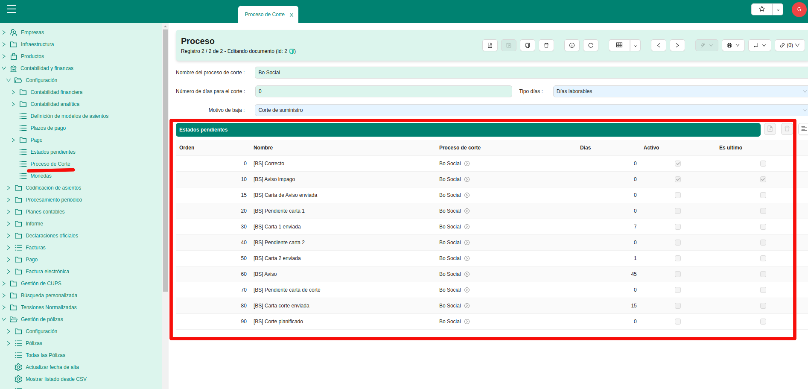
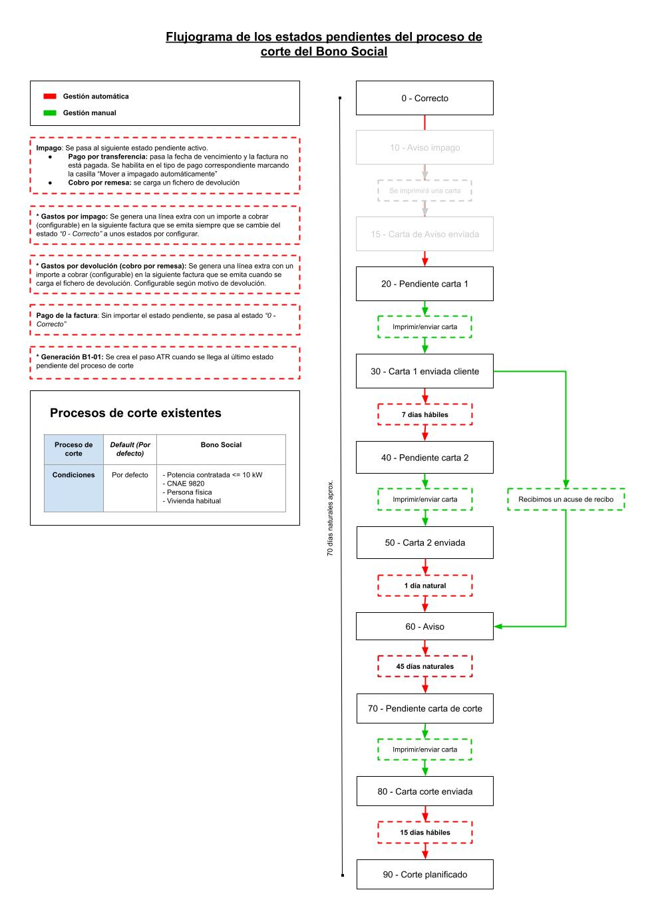
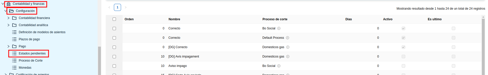
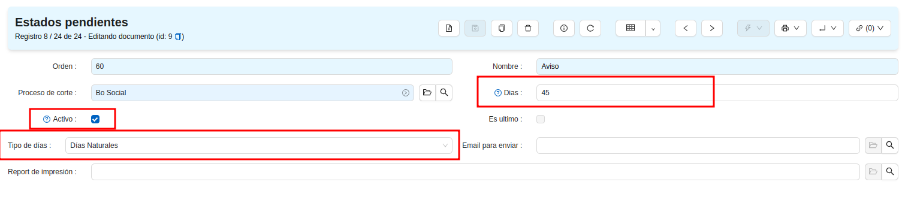
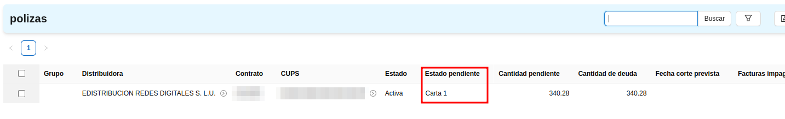
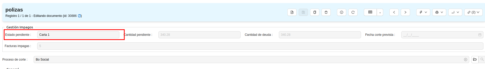
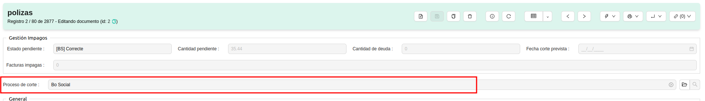
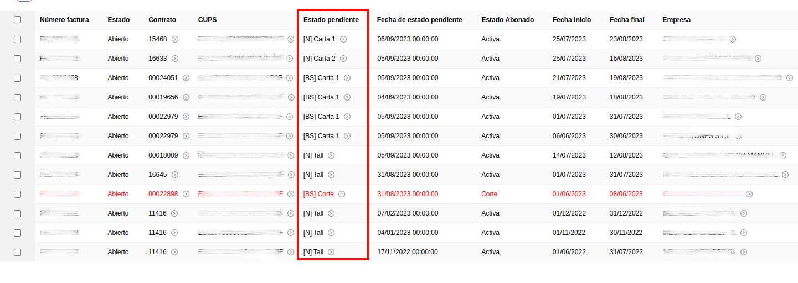
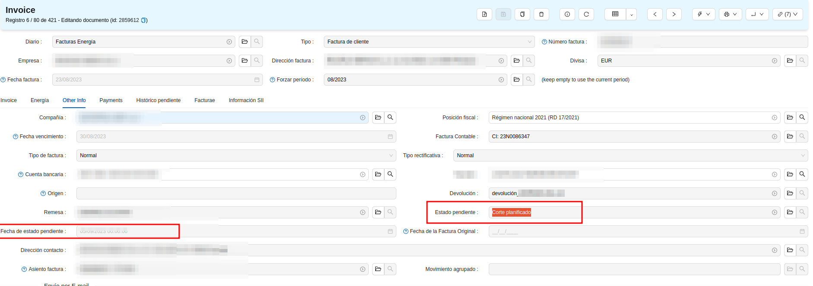
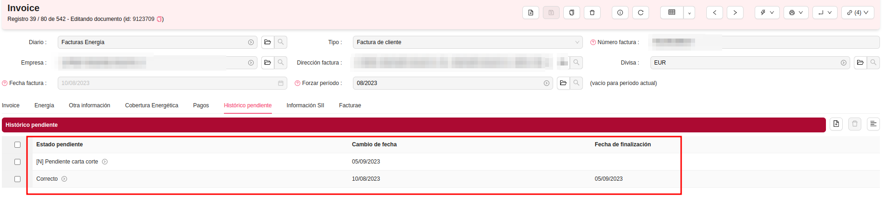

# Gestió impagats

La gestió d'impagats ens serveix per controlar l'estat de les factures d'electricitat impagades segons la normativa del [Real Decret 897/2017](https://www.boe.es/buscar/doc.php?id=BOE-A-2017-11505), on es defineix el protocol pels contractes susceptibles de contractar el bo social perquè segueixin uns terminis determinats. Per la resta de contractes es podran gestionar de forma personalitzada els terminis a seguir.
## Processos de talls

Hi ha dos processos de tall principals:

- **Bo Social** [BS]: Tots els contractes que compleixin les següents característiques se'ls aplica de forma automàtica aquest procés.
    - CNAE 9820
    - Habitatge habitual
    - Número d'identificació fiscal ha de ser fer persona física (DNI o NIE) 
    - Potència contractada igual o inferior a 10kW

- **Default process** [N]: La resta de contractes que no compleixin els anteriors requisits s'inclouen en aquest procés.

La principal diferència entre aquests processos són que els terminis del **Bo Social** venen regulats pel [Real Decret 897/2017](https://www.boe.es/buscar/doc.php?id=BOE-A-2017-11505). 

El nom del procés **Bo Social** significa que aquests contractes són susceptibles de poder contractar el bo social amb una comercialitzadora de referència, i per això es tracten diferent. En cap cas vol dir que els hi hàgiu d'oferir un contracte de bo social.

Tots els processos de tall tenen uns estats que s'anomenen **estats pendents**, que serveixen per poder gestionar el procés que s'ha de seguir. Aquests estats es poden configurar per canviar automàticament, avançant cap al següent estat, a mesura que van passant els dies.

Tots els processos de tall tenen un primer estat que sempre es fa servir quan la factura no està impagada. També tenen un nombre de dies per afegir sobre la data de planificació del tall. En el procés del bo social és 0.

Dins de l'ERP poden veure des del Menú: “Comptabilitat/Configuració/Processos de tall”

### Procés Bo Social

El fluxograma derivat del [Real Decret 897/2017](https://www.boe.es/buscar/doc.php?id=BOE-A-2017-11505) és el següent:

Els estats pendents són:

- **0 Correcte:** La factura no està impagada.
- **10 Avis impagament:** Ha arribat una devolució o s'ha passat el termini voluntari de pagament d'una factura. En aquest estat la factura està pendent d'enviar l'avís. *És opcional i, per tant, aquest estat es pot desactivar*
- **15 Carta d'Avís Enviada:** Avís d'impagament enviat. Es poden configurar el nombre de dies que s'ha d'esperar aquest estat per saltar al següent. No cal que aquest avís sigui certificat. *És opcional i, per tant, aquest estat es pot desactivar*
- **20 Pendent Carta 1:** Pendent d'enviar la primera notificació certificada.
- **30 Carta 1 enviada:** Primera notificació certificada enviada. En cas de rebre un justificant de recepció de la notificació, l'estat saltarà a l'estat pendent **60**. En cas de no rebre'l **s'ha d'esperar set dies laborals mínim** per avançar al següent estat pendent.
- **40 Pendent carta 2:** Pendent d'enviar la segona notificació certificada.
- **50 Carta 2 enviada:** Segona notificació certificada enviada. En aquest estat **s'ha d'espera un dia natural mínim**.
- **60 Avís:** En aquest estat el sistema dona ja per notificada que es produirà un tall, sigui per la primera notificació, o per la segona. En aquest estat **_s'ha d'espera quaranta-cinc dies naturals mínim_** per avançar cap al següent estat.
- **70 Pendent carta de tall:** Pendent d'enviar la notificació certificada del tall.
- **80 Carta de tall enviada**: Notificació certificada del tall enviat. En aquest estat **s'ha d'espera quinze dies laborables mínim** per avançar cap al següent estat.
- **90 Tall planificat**: Planificació del tall del contracte amb la creació del procés ATR **B1** per enviar a la distribuïdora i pendent que s'executi el tall.

### Procés per defecte

El procés per defecte només ve configurat amb el primer estat **0 Correcte**. Cada empresa determinarà quins nous estats voldrà seguir en aquest procés, ja que legalment no hi ha cap imposició al respecte.

Uns estats pendents d'exemple:

- **0 Correcte:** La factura no està impagada.
- **10 Pendent carta de tall**: Pendent d'enviar la carta de tall.
- **20 Tall planificat**: Carta de tall enviada i planificació del tall del contracte amb la creació del procés ATR **B1** per enviar a la distribuïdora i pendent que s'executi el tall.

## Estats pendents

Dins de l'ERP poden trobar-ho des del Menú: “Comptabilitat/Configuració/Estats pendents”

Dins dels estats pendents podem configurar els següents camps:

- **Nom**: Nom amb el qual es descriu aquest estat
- **Dies**: Dies que s'ha d'esperar per avançar cap al següent estat.
- **Tipus de dies**: Si són dies laborables o naturals
- **Actiu**: Si està actiu, es té en compte a l'hora d'avançar cap als següents estats. Si està desactivat, no es tindrà en compte a l'hora d'avançar d'estat.

## Visualització dins l'ERP

### Pòlisses
Les pòlisses tenen un camp on surt el procés de tall que l'afecta en aquell moment, que és el pitjor estat pendent de totes les seves factures impagades.

**Pitjor estat pendent**

Al llistat

A la fitxa

**Procés de tall**

### Factures

En les factures tenim l'estat pendent en el qual es troba. També tenim l'històric d'estats pendents pels quals ha anat passant.

**Estat pendent**

Al llistat

A la fitxa

**Històric pendents**

Llistat de tots els estats pendents que ha tingut una factura des de la seva obertura. Aquest llistat inclou la data dels canvis d'estat. L'estat que no té data de finalització és el que està vigent.

## Gestió de les notificacions d'impagaments

### Notifiacions per carta

#### Bo Social

#### Procés per defecte

### Notifiacions per email certificat
#### Bo Social

#### Procés per defecte
