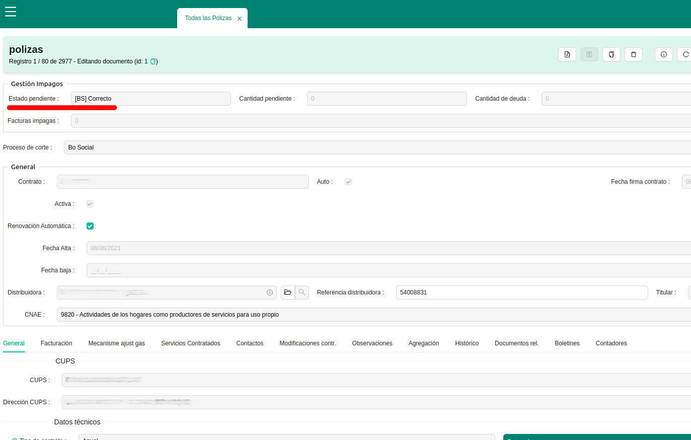

# Gestió impagats

## Estats pendents
Les factures de client i les pòlisses tenen un camp anomenat "estat pendent" per poder gestionar el procés que s'ha de seguir quan un client no paga una o unes factures d'un contracte de comercialització d'electricitat. 

Hi ha una diferenciació entre els contractes domèstics i la resta per imperatiu legal, ja que els terminis i procesos han de ser diferents. Les carecterístiques dels domèstics (anomenats Bo social [BS] a l'ERP):

    • Tenir un CNAE 9820
    • El número d'identificació fiscal d'un particular (DNI o NIE)
    • Una potència igual o inferior a 10kW
    
La resta de contractes (anomenats Default Process o procés per defecte), si no compleix amb algun dels supòsits anteriors, les factures retornades seguiran un procediment diferent a les factures dels contractes particulars. La principal diferència són els terminis dels contractes amb estat pendent Bo Social, que són molt més llargs i amb més tràmits i avisos a realitzar. Tot això ve regulat pel [Real Decret 897/2017](https://www.boe.es/buscar/doc.php?id=BOE-A-2017-11505)

Aquests estats canvien automáticament a mesura que van passant els dies, segons aquest esquema:

Els estats pendents de les factures de contractes domèstics son:

- **0 Correcte:** factura correcta, es a dir, no hi ha hagut devolució, està pagada.
- **10 Avis impagament:** ha arribat la devolució de la factura i està pendent d'enviar el primer correu d'avís.
- **15 Carta d'Avís Enviada:** primer avís d'impagament enviat.
- **20 Pendent Carta 1:** està pendent d'enviar la primera correu d'avís certificat.
- **30 Carta 1 enviada:** primer avís d'impagament certificat enviat.
- **40 Pendent carta 2:** està pendent d'enviar el segon correu d'avís certificat.
- **50 Carta 2 enviada:** segon avís d'impagament certificat enviat.
- **60 Avís:** superació de la data límit per fer consultes a serveis socials, o avisos "amistosos".
- **70 Pendent carta de tall:** està pendent d'enviar el correu d'avís de tall certificat.
- **80 Carta de tall enviada:** avís de tall certificat enviat.
- **90 Tall planificat:** creació del b1 per enviar a la distri i que s'executi el tall.

Aquest menú és configurable, i es poden activar o desactivar en funció de quin sigui el protocol que es vulgui seguir en els dos casos (Bo social o procés per defecte). Fins i tot, es poden establir més casos concrets per tipus de titulars. 

