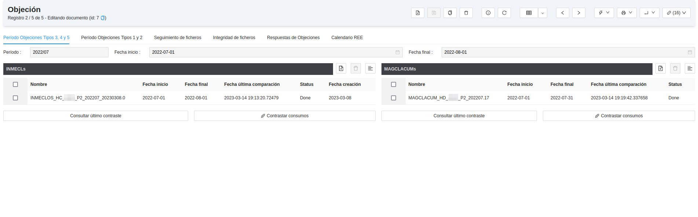
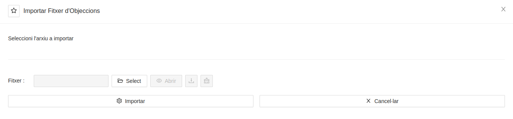
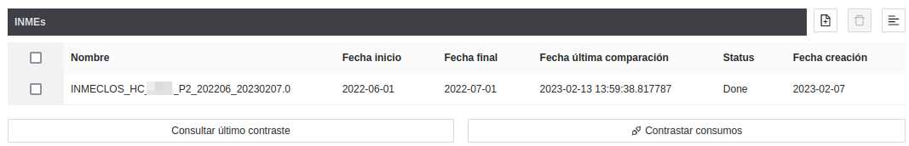
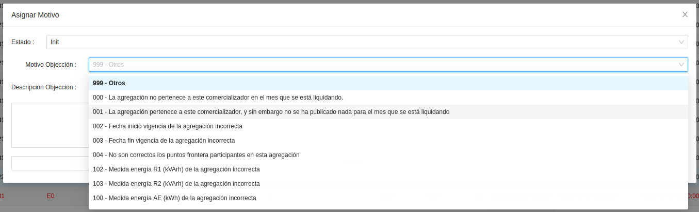
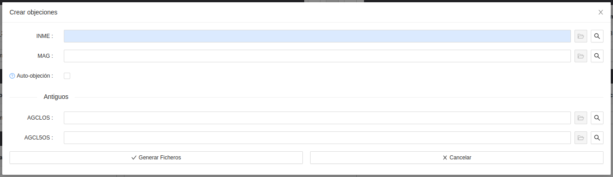
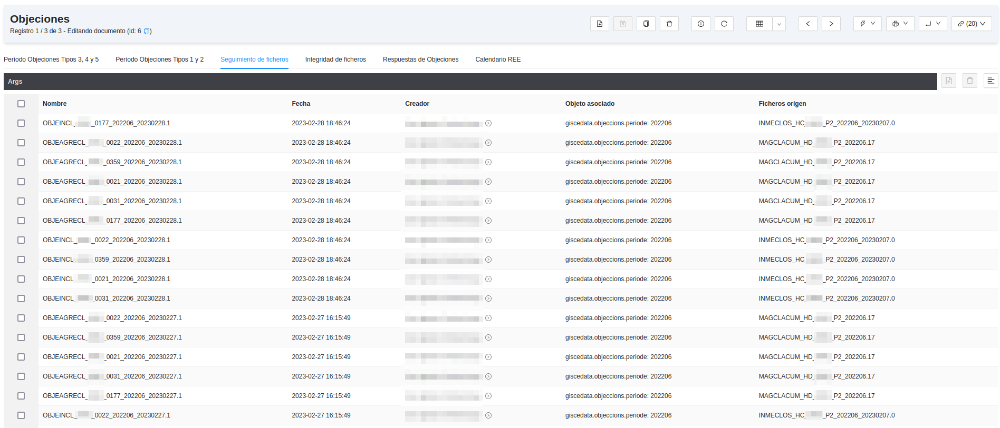
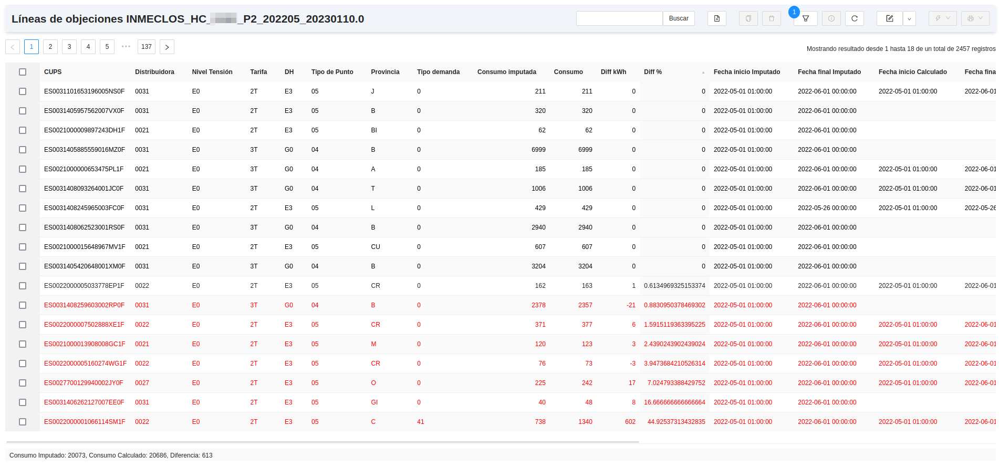
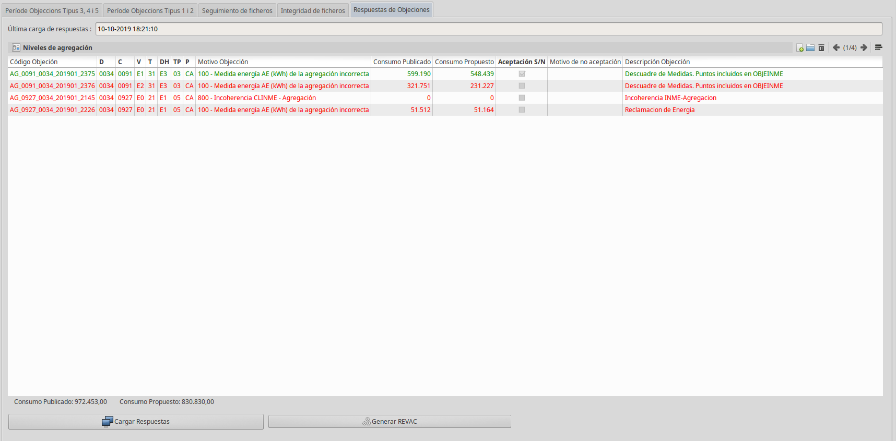

# Tractament del sistema d'Objeccions

Amb la finalitat de generar fitxers d'objeccions de forma semiautomàtica, s'utilitza
el módul d'objeccions situat a: **Mesures REE > Objeccions**

## Fonts de dades i preparació

Per tal de que la comercialitzadora pugui calcular i verificar els consums que se
li imputen desde la distribuidora, cal importar i/o perfilar corbes.

* F5D: són corbes sense forats i ajustades a la facturació dels tipus 5 (<=15kWh)
* Perfils: a l'obrir una factura de proveïdor, s'en perfila el seu consum
utilitzant els coeficients mensuals publicats per REE. D'aquesta manera, amb les
línies de consum de la factura, construïm una corba.

## Fitxers que s'utilitzen

* CLINMEOS
* AGCLOS
* AGCL5OS
* AGCLACUM
* AGCLACUM5
* ACUM
* OBJEINME
* OBJEAGCL
* AOBJEAGCL
* REVAC

## Períodes d'objeccions

Un període d'objeccions engloba les eines necessàries pel tractament
d'aquestes, posant a disposició importadors, càlculs de consums, validacions de dades...
Un període d'objeccions és a mes natural, són els períodes en que treballa REE.
No cal crear cap període de forma manual, aquests es crean a l'importar un fitxer
d'objeccions.
El diagrama de fluxe de les objeccions és el següent: **Importar fitxers de consums -
Contrastar dades imputades vs calculades - Selecció i filtrat d'objeccions
detectades - Generació de fitxer d'objeccions - envíament - cárrega de respostes
- generació de fitxer d'objeccions de resposta**

### Importació de fitxers

El sistema d'objeccions permet importar els següents fitxers:

* CLINMEOS
* AGCLOS
* AGCL5OS
* AGCLACUM
* AGCLACUM5
* ACUM

Per importar-ne un, cal dirigir-se a: **Mesures REE > Objeccions > Importar Fitxers d'Objeccions**.
Permet importar .zip, .bz2 i fitxers plans. Es poden també importar varis alhora. És recomanable
no importar fitxers amb un nom diferent al de publicació, ja que es fa servir
per calcular dates, versions...
Si a l'importar un fitxer el període del qual forma part no existeix, s'en crea
automàticament un i seguidament importa el fitxer

### Càlcul d'Objeccions

De cada fitxer importat, n'associarem un càlcul que es treurá de les línies del fitxer
vs el calculat del sistema.

### Automatisme d'objeccions

Cada fitxer importat, té asociat un botó de **Contrastar consums**, s'utilitzará
per posar a calcular un fitxer en concret. Al fer-ho, es demana sobre quin fitxer
es vol realitzar el càlcul.
El fitxer canviarà d'estat a **Processant**, i un cop acabat el càlcul, l'estat
s'actualitzará a **Acabat** i s'actualitzarà la data d'última comparació

### Filtratge d'objeccions

Un cop acabada la contrastació, es podrán escollir i/o descartar aquelles
objeccions que el sistema hagi precalculat, crear-ne de noves si cal i generar
fitxers d'objeccions.

* cups a cups es crearà el fitxer OBJEINME
* agregació a agregació és el fitxer OBJEAGCL

S'en crearà un per distribuidora.
Per fer-ho, s'utilitza el botó **consultar últim contrast**. Automàticament
obrirá una pestanya amb el càlcul generat préviament.

* Es pot filtrar per:
  * % diferència
  * diferéncia de consum (kWh)
  * Motiu d'objecció concret
  * Qualsevol motiu
  * distribuidora
  * tensió
  * tarifa
  * tipus de punt
  * codi d'agregació
  * ...

Per objectar, s'ha d'especificar un motiu amb un codi definit per REE.
**Totes** les línies que tinguin **motiu** s'inclouran en el fitxer d'Objeccions
OBJEINME o OBJEAGCL. Per tant, per **definir qué objectem**, assignem i/o desasignem
motiu a les línies que s'han calculat. Per fer-ho, les seleccionem i utilitzem:
**Acció > Assignar Motius**

!!!info "Nota"
    per descartar una objecció, utilitzem la opció deshacer motivo del mateix
    asistent

### Generar objeccions

Per generar els fitxers OBJEINME i OBJEAGCL amb el contingut predefinit anteriorment,
(recordar que s'inclouran només les línies que tinguin motiu) des del període en
concret, fem: **Acció > Crear Objeccions**. S'ens demanarà quina contrastació/càlcul
es vol utilitzar per crear el fitxer escollint els fitxers que hem importat i calculat.

Un cop realitzat, s'hauran creat i adjuntat al període els fitxers resultants, agrupats
per distribuidora. Per visualitzar-los o descarregar-los hi accedim desde la
pestanya **Seguiment de fitxers** del propi període, o amb el botó **Arxius adjunts**

Com s'aprecia a la imatge, aquests porten especificats els fitxers d'origen per tenir
traçabilitat sobre en quines dades i càlculs s'ha creat.

### Justificant de recepció

Una vegada enviada i processada l'objecció, la distribuidora mitjançant REE, contesta
acceptant-la o rebutjant-la. Es fa mitjançant un fitxer "acuse de recibo" anomenat **AOBJEAGCL**. Aquest,
té indicat amb un camp si s'accepta o no l'objecció.
Per carregar-lo al sistema: **Respostes d'Objeccions > Carregar respostes**
Si alguna objecció ha estat rebutjada, es pot tornar a enviar mitjançant un fitxer **REVAC**, així que
un cop importat l'AOBJEAGCL, podem utilitzar el botó **Generar REVAC**, que generarà un fitxer
de resposta "d'acuse de recibo" amb les objeccions no acceptades.

