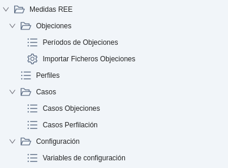
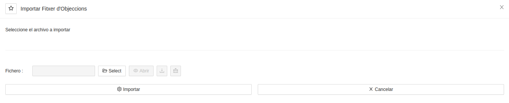

# Tractament d'Objeccions

Els fitxers d'objeccions són l'eina que tenen les Comercialitzadores per a comunicar a
l'Operador del Sistema que les mesures que les Distribuïdores les han imputat no són correctes.
L'Operador del Sistema recull i valida aquestes objeccions i les fa arribar a la Distribuïdora
objectada, la qual haurà de revisar les objeccions i donar resposta a les mateixes.

Amb la finalitat de generar fitxers d'objeccions de forma semiautomàtica, es pot utilitzar
el mòdul d'objeccions situat a: **Mesures REE > Objeccions**

## Mòdul de Mesures REE

Aquest mòdul serveix per a gestionar d'una forma més pràctica les objeccions que es volen presentar a les Distribuïdores
quan aquestes ens imputen un consum incorrecte.

Per tant, aquest mòdul inclou eines d'importació, d'anàlisi i de generació dels fitxers necessaris per a realitzar el
tractament d'objeccions a Comercialitzadora.

En el menú de Mesures REE que segueix a la imatge, s'hi troben els següents
apartats.

* **Perfils:** Permet visualitzar els perfils horaris generats a filtrar per factura o CUPS. Aquests es calculen

### Objeccions
* **Períodes d'Objeccions:** Mostra l'estat i el progrés dels períodes de mesures.
* **Importar Fitxers d'Objeccions:** Assistent per a carregar fitxers `INMECLOS` i `MAGCLACUM` per a poder-ne contrastar
el consum.

### Casos
automàticament en obrir la factura de proveïdor si així està configurat a l'ERP.
* **Casos de Perfilació:** Casos CRM que reporten el comportament al perfilar factures de proveïdor.
* **Casos d'Objeccions:** Casos CRM que reporten el comportament al contrastar consums.

### Configuració
* **Variables de configuració:** Configuració general del mòdul.

## Fonts de dades i preparació

Per tal de que la Comercialitzadora pugui calcular i verificar els consums que se
li imputen des de les Distribuïdores, cal importar i/o perfilar les corbes horàries de
consum.

Aquestes corbes poden tenir dos orígens, principalment:

* `F5D`: Són corbes sense forats i ajustades a la facturació dels subministraments de tipus 5 (<=15kW). Aquestes
corbes es poden carregar manualment des de l'assistent **Infraestructura > Carregar corba en comptador** o bé
poden arribar de forma automatitzada si s'ha configurat a l'ERP.
* `Perfils`: Són corbes generades a partir dels tancaments facturats, perfilant-ne el consum utilitzant els coeficients 
mensuals publicats per REE. D'aquesta manera, l'ERP pot obtenir una corba vàlida encara que la Distribuïdora no l'hagi
comunicat. Els perfils es poden generar manualment perfilant les factures de proveïdor, o bé es pot activar un automatisme 
per a que aquestes es perfilin automàticament quan s'obren des de l'ERP.

L'objectiu és que tot CUPS pel qual s'hagi facturat consum, i pel qual les Distribuïdores hagin imputat consum, tingui
una corba horària per a quantificar aquesta energia.

## Fitxers que s'utilitzen

En el tractament d'Objeccions s'utilitza un conjunt de fitxers específics:

### Agregats
* **MAGCLACUM**: Acumulat mensual d'energia d'agregacions de clients tipus 3, 4 i 5.
* **OBJEAGRECL**: Objeccions d'agregacions de clients tipus 3, 4 i 5.
* **REOBJEAGRECL**: Resposta a objeccions d'agregacions de clients tipus 3, 4 i 5.
* **AOBJEAGRECL**: Justificant de recepció a objeccions d'agregacions de clients tipus 3, 4 i 5.
* **REVAGRE**: Sol·licitut de revisió de la resolució d'objeccions d'agregacions de clients tipus 3, 4 i 5.

### Desagregats
* **INMECLOS**: Acumulat mensual d'energia de clients tipus 3, 4 i 5 desagregats
* **OBJEINCL**: Objeccions de clients tipus 3, 4 i 5 desagregats.
* **REOBJEINCL**: Resposta a objeccions de clients tipus 3, 4 i 5 desagregats.

* **OBJE2**: Objeccions de clients tipus 1 i 2.
* **REOBJE2**: Resposta a objeccions de clients tipus 1 i 2.
* **REVCL**: Sol·licitut de revisió de la resolució d'objeccions de clients tipus 1 i 2.

* **OBJECIL**: Objeccions de punts frontera d'instal·lacions de producció d'energia elèctrica a partir de fonts d'energia
renovables, cogeneració i residus (RECORE) tipus 3, 4 i 5.
* **REOBJECIL**: Resposta a bjeccions de punts frontera d'instal·lacions de producció d'energia elèctrica a partir de 
fonts d'energia renovables, cogeneració i residus (RECORE) tipus 3, 4 i 5.
* **REVCIL**: Sol·licitut de revisió de la resolució d'objeccions de punts frontera d'instal·lacions de producció d'energia
elèctrica a partir de fonts d'energia renovables, cogeneració i residus (RECORE) de tipus 3, 4 i 5.

Per a més detalls sobre els fitxers, el seu format, i el seu contingut, podeu consultar la versió més
recent del document `Ficheros para el intercambio de información de medida` que es publica i es va revisant a REE.

## Períodes d'objeccions

Els períodes d'objeccions són sempre a mes natural, i són els períodes amb els que treballa REE.
No cal crear cap període d'objeccions de forma manual, aquests es creen automàticament en cas de no existir encara, en el
moment en que s'importa un fitxer d'objeccions `INMECLOS` o `MAGCLACUM`.

El tractament de les objeccions es realitza seguint el següent ordre d'accions: 

* **Importar fitxers de consums**
* **Contrastar energia imputada VS energia facturada**
* **Seleccionar i filtrar objeccions detectades**
* **Generar els fitxers d'objecció**
* **Enviar els fitxers d'objecció** 
* **Enviar els fitxers d'objecció** 
* **Carregar fitxers de resposta a les objeccions**
* **Generar fitxer d'objeccions de resposta**

El procediment per a realitzar cada acció es detalla a continuació.

### Importació de fitxers de consums

El sistema d'objeccions permet importar els següents fitxers:

* **INMECLOS**
* **MAGCLACUM**

Per importar-ne un, cal utilitzar l'assistent que trobareu a: **Mesures REE > Objeccions > Importar Fitxers d'Objeccions**.
L'assistent permet importar fitxers plans o bé comprimits en format ".zip" o format ".bz2". També es permet importar més d'un
fitxer simultàniament.

És recomanable no importar fitxers amb un nom diferent al de publicació, ja que aquest es fa servir per a calcular dates
i versions.

Si quan s'importa un fitxer, el període al qual pertany no existeix encara a l'ERP, el període es crea automàticament i 
a continuació s'importa el fitxer.

Un cop importat un fitxer de mesures, es poden consultar les línies contingudes al mateix fent doble clic al fitxer des
de la seva consola i prement el botó **Veure fitxer**.

Aquesta acció obrirà una vista de llistat on es podran consultar, ordenant i filtrant, totes les línies que conté el
fitxer de mesures importat.

### Contrast d'energia imputada VS energia facturada

Per a cada fitxer de consum importat, es pot realitzar un càlcul que mostrarà el contrast per a cada línia dels fitxers.
Aquest contrast compararà a cada línia l'energia que imputa la Distribuïdora amb l'energia que hi ha present a les corbes
horàries (`F5D` o `perfilades`). 

!!! Nota "Nota"
    En cas d'existir les dues corbes, `F5D` i `perfils`, l'estratègia del contrast és utilitzar la més propera
    a l'energia imputada per la Distribuïdora.

A la consola de fitxers `INMECLOS` i `MAGCLACUM`, trobareu un botó de **Contrastar consums**, que us permetrà triar per a
quin fitxer de la consola voleu realitzar el càlcul (si només n'hi ha un, ja es seleccionarà automàticament aquest). 

Un cop confirmeu l'acció a l'assistent, el fitxer canviarà el seu estat a `Processant` i, un cop acabat el càlcul, aquest
s'actualitzarà a `Finalitzat`. 

L'assistent permet contrastar energies en segon pla, de manera que el procés s'executa en paral·lel i es va fent mentre
podeu seguir operant amb l'ERP sense interrupció. Quan el procés finalitzi, s'actualitzarà l'estat en el fitxer.

### Seleccionar i filtrar objeccions detectades

Un cop finalitzat el contrast, es poden escollir i/o descartar els motius d'objecció que el sistema hagi precalculat, 
assignar-ne de nous si es creu oportú.

Per a revisar els motius d'objecció i modificar-los, cal utilitzar el botó **Consultar últim contrast** de la consola de fitxers
`INMECLOS` o `MAGCLACUM` i triar el fitxer pel qual es vol consultar el contrast (si només n'hi ha un, aquest ja es selecciona
automàticament). Això obrirà una vista de llistat amb totes les línies del fitxer, on podreu filtrar i ordenar pels codis 
d'agregació de REE i/o per les diferències d'energia.

Si es vol assignar un motiu d'objecció, tan sols cal clicar la línia que voleu objectar i utilitzar l'assistent **Assignar motiu**.
A l'assistent es podrà seleccionar quin motiu es vol assignar a la línia a objectar.

Si pel contrari, es vol eliminar un motiu d'objecció, es pot fer servir el mateix assistent **Assignar motiu** però triant
la darrera opció "Desfer motiu" en el llistat.

Es recomana ordenar i filtrar les línies dels fitxers `INMECLOS` per diferència d'energia i, a continuació, anar revisant i
objectant les línies que es consideri. Un cop fet això, es pot fer servir l'assistent **Integritat i unió de motius** des del
període de mesures per a que els motius d'objecció dels CUPS del contrast del fitxer `INMECLOS` seleccionat es traslladin 
també a les agregacions del contrast del fitxer `MAGCLACUM` seleccionat. El camp d'informació de l'assistent dóna més detalls
sobre com es tracta aquesta unió de motius i permet també un parell d'ajustos opcionals.

Un cop ha acabat aquest procés, ja es pot procedir a generar els fitxers d'objeccions pròpiament. Però es recomana revisar per
darrer cop els motius d'objecció assignats.

### Generar els fitxers d'objeccions

Per a generar els fitxers d'objeccions, tan sols cal utilitzar l'assistent **Crear objeccions** des del període d'objeccions.
Aquest assistent deixa triar el fitxer `INMECLOS` i el fitxer `MAGCLACUM` que s'han fet servir per a contrastar les energies i
assignar els motius d'objecció. També permet marcar si les objeccions són a una "Auto-objecció", que és un cas particular que
es pot donar.

La generació de fitxers crearà el següent:
* Un fitxer `OBJEINCL` per a cada Distribuïdora per a la qual hi hagi com a mínim un CUPS amb motiu d'objecció.
* Un fitxer `OBJEAGRECL` per a cada Distribuïdora per a la qual hi hagi com a mínim una agregació amb motiu d'objecció.
agregació a agregació és el fitxer OBJEAGRECL

!!! Nota "Nota"
    Els fitxers d'objeccions generats només contindran línies per a les quals hi hagi assignat un motiu d'objecció,
    descartant la resta de línies dels contrastos d'energia.

Els fitxers generats quedaran adjunts en el periode d'objeccions i també es poden revisar a la pestanya **Seguiment de fitxers**.

### Enviar els fitxers d'objecció

Des de la pestanya **Seguiment de fitxers** es poden llistar i descarregar tots els fitxers d'objeccions que s'han generat
pel període. Però si es volen descarregar massivament, es recomana accedir a l'enllaç **Adjunts** del període, seleccionar
tots els fitxers que es volen descarregar i utilitar l'assistent **Attachment ZIP** per a descarregar-los d'una única vegada
en un fitxer comprimit en format ".zip".

Un cop descarregats els fitxers, es poden revisar per darrera vegada i, si tot està correcte, es poden publicar al portal
per a que arribin a l'Operador del Sistema i aquest publiqui les objeccions a les Distribuïdores objectades.

### Carregar fitxers de resposta a les objeccions

Un cop enviat i processat un fitxer d'objecció, la Distribuïdora respon a l'Operador del Sistema acceptant-la o
rebutjant-la. Es fa mitjançant un fitxer de "justificant de recepció" anomenat `AOBJEAGRECL`. Aquest, té indicat en un
dels camps si s'accepta o no l'objecció.

Per a carregar-lo al sistema, es pot importar el fitxer `AOBJEAGRECL` amb el botó **Carregar Respostes** que trobareu a
la pestanya **Respostes d'Objeccions** en el període.

### Generar fitxer d'objeccions de resposta

Si alguna objecció ha estat rebutjada, es pot tornar a enviar mitjançant un fitxer `REVAGRE`, així que
un cop importat el fitxer `AOBJEAGRECL`, es pot utilitzar el botó **Generar REVAGRE**, que generarà un fitxer
de resposta de "justificació de recepció" amb les objeccions no acceptades.
