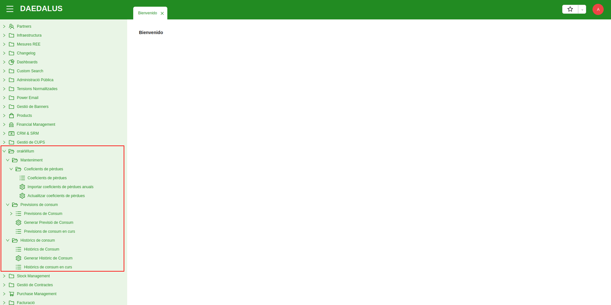
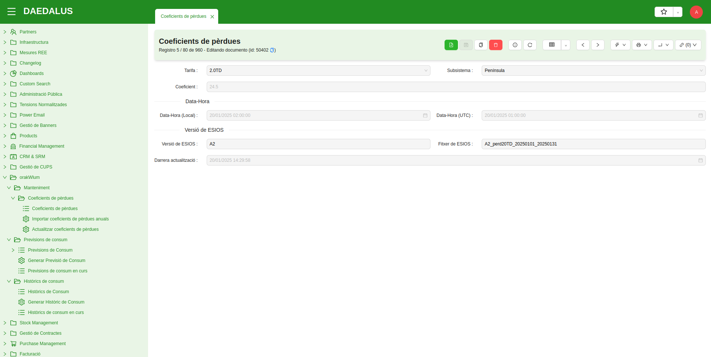
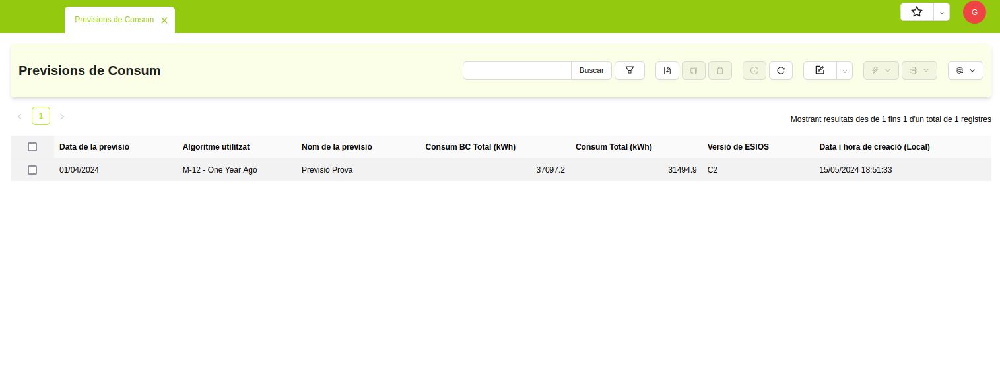
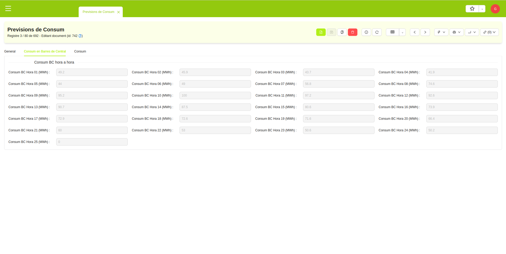
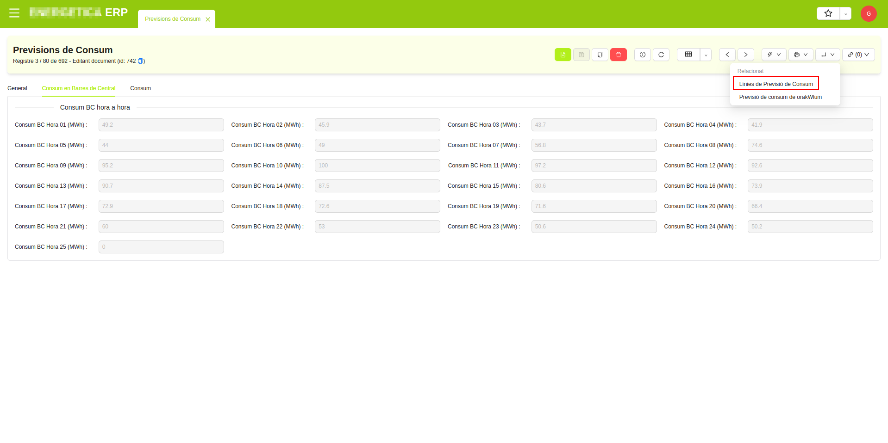
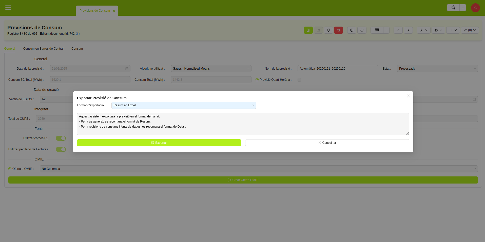
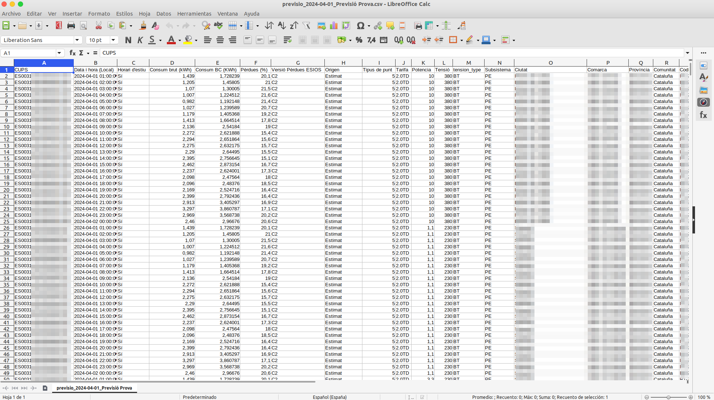
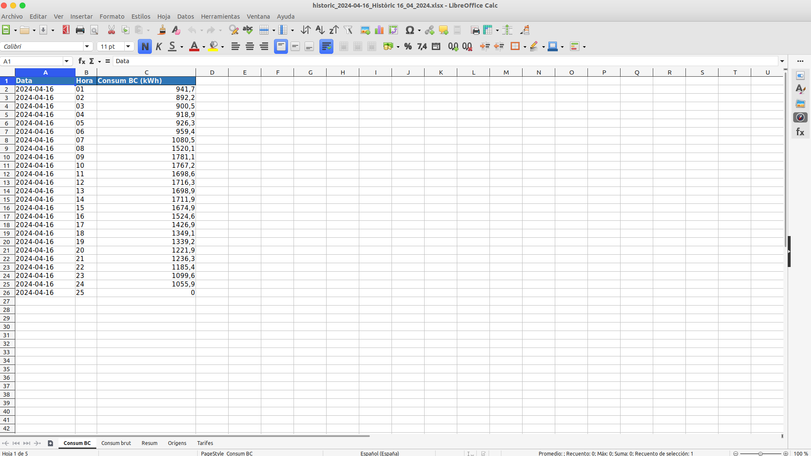

# orakWlum

**orakWlum** és una eina capaç de generar **previsions de consum** a partir de les mesures històriques de l'ERP de Comercialitzadora
amb la finalitat de tenir una base sòlida sobre la que generar les ofertes de compra a publicar a l'Operador del Mercat
(OMIE).

A més a més d'aquestes previsiones, **orakWlum** permet també generar **històrics**, amb la finalitat de poder mesurar el consum
real de la cartera de subministraments de la Comercialitzadora.

En ambdós elements, tant les previsions com els històrics, les dades per a alimentar el càlcul i la mesura són les diverses
col·leccions de perfils horaris (corbes publicades per les Distribuïdores i perfilats de diversos tipus) existents en el
propi ERP.

Trobareu totes les eines de **orakWlum** al menú principal amb el mateix nom, i a continuació s'indiquen els llistats i assistents
disponibles.

* **Manteniment:** Eines auxiliars de orakWlum, com per exemple l'importador de **pèrdues de ESIOS**.

* **Previsions de consum:** Eines per a generar i revisar **Previsions de consum**.

* **Històrics de consum:** Eines per a generar i revisar **Històrics**.

Cada un dels submenús anteriors conté llistats per a revisar els elements existents i també assistents per a actuar-hi.

## Pèrdues del sistema

Les ofertes de compra publicades a mercat han d'expressar el consum **elevat en barres de central** i en **MWh amb un únic
decimal**
d'arrodoniment. Per tant, quan es generin previsions i històrics, caldrà que l'energia es mostri elevada aplicant-hi les
pèrdues corresponents.

El menú de **Manteniment** compta amb dos assistents:

* **Importar coeficients de pèrdues anuals:** Permet descarregar les pèrdues del sistema que publica l'Operador del Sistema
(REE) a `ESIOS` i enregistrar-les a l'ERP. Aquestes pèrdues seràn necessàries per a generar tant previsions de consum com
històrics. L'assistent permet triar l'any, la tarifa d'accés i el subsistema pel qual es volen importar les pèrdues, però
també és possible importar-ho tot amb una sola acció si es tria l'opció `Tots`/`Totes` als camps corresponents.

!!! Info "Nota 1"
    Per tal de poder descarregar les pèrdues des de `ESIOS` serà necessari disposar d'un `token d'autenticació`, que caldrà
    tenir ja configurat a l'ERP, de la mateixa manera que és requerit també per a facturar a preu indexat a mercat.

Un cop importades les pèrdues, si es vol es poden revisar al llistat **Coeficients de pèrdues** on es mostrarà el percentatge
de pèrdues, la tarifa d'accés i el subsistema al que corresponen i la versió de la publicació que s'ha importat (**orakWlum**
sempre importarà la versió més recent publicada a `ESIOS`.). 

També es pot veure la data/hora de la importació i el fitxer
d'`ESIOS` del qual s'han importat.

* **Actualitzar coeficients de pèrdues:** Com que els coeficients de pèrdues es van actualitzant amb cada publicació de
`ESIOS`, **orakWlum** permet actualitzar els registres de les mateixes a l'ERP de Comercialitzadora. Per a fer-ho, podeu
utilitzar aquest assistent indicant la data per a la qual voleu actualitzar a la versió més recent les pèrdues de la tarifa
d'accés i el subsistema indicat.

!!! Info "Nota 2"
    Les previsions de consum, com que es solen generar a futur, sempre faran servir la versió `A2` de les pèrdues, però
    els històrics, al generar-se "a passat" podran fer servir versions més recents com la `C2`, `C3`, etc.

Amb tot aquest conjunt d'eines senzilles, es pot tenir un registre clar i precís de les pèrdues del sistema a utilitzar
a **orakWlum**. Tot i que les previsions de consum i els històrics ja descarreguen i importen les pèrdues dels dies en qüestió
automàticament, s'aconsella fer una primera importació massiva per any per si cal revisar les pèrdues d'algun dia en concret.

## Previsions de consum

### Generació de previsions

Per a generar una **previsió de consum** tan sols és necessari fer servir l'assistent **orakWlum > Previsions de consum > 
Generar Previsió de Consum**. 

A l'assistent podreu triar la **data** per a la qual voleu generar la previsió i podeu assignar un **nom** descriptiu a 
la mateixa (si no l'especifiqueu, s'assignarà un nom per defecte). També es pot controlar **l'algoritme** de predicció a fer 
servir i quines **fonts** de consum històric es volen fer servir per a la previsió (per defecte vindran activades totes) i 
podreu triar també si voleu que la previsió es generi **en segon pla** o no (per defecte es generarà de manera asíncrona, 
en segon pla, per a poder seguir treballant amb l'ERP mentrestant es va processant el càlcul.

!!! Info "Nota 3"
    Les fonts disponibles són les pròpies corbes i perfils existents a l'ERP de Comercialitzadora, i aquestes poden variar
    segons els mòduls que hi hagi instal·lats o no al propi ERP. Per defecte, es fan servir totes les fonts disponibles.

!!! Info "Nota 4"
    Els algoritmes disponibles depenen també dels mòduls instal·lats que hi hagi a l'ERP. Hi ha un altre capítol dels
    manuals dedicat a aquests i al seu funcionament.

!!! Info "Nota 5"
    Hi ha una opció per a generar una previsió de consum quart-horària, ja que en un futur el mercat diari de l'energia
    anirà amb integració quart-horària i no en horària com fins ara. Aquesta opció fa que, un cop s'ha generat la previsió
    horària, aquesta es converteixi en quart-horària, repartint el consum de cada hora entre els seus quatre quarts d'hora
    corresponents.

!!! Info "Nota 6"
    Al seleccionable de l'algoritme es pot triar l'opció "Importada". Si es fa, la selecció de fonts desapareix i apareix
    un selector per a poder carregar un fitxer en format CSV amb la previsió. Aquesta opció serveix per a poder importar
    a orakWlum previsions de consum generades amb eines externes, si es desitja.

Si heu posat a generar la previsió de consum en segon pla, podeu tancar l'assistent. Apareixerà al llistat **Previsions de
consum** un cop s'hagi acabat de processar. 

També podeu utilitzar el llistat **Previsions de consum en curs** per a comprovar
el número de tasques en execució que hi ha a la cua corresponent, per a comprovar si hi ha tasques en curs o no.

Accedint a una **previsió de consum**, al seu formulari podem comprovar tota la informació relacionada amb la mateixa:
- Data de la previsió.
- Algoritme utilitzat per a calcular-la.
- Nom de la previsió.
- Consum total en kWh (amb i sense pèrdues).
- Versió dels coeficients de pèrdues d'ESIOS utilitzats.
- Total de CUPS actius en la data de la previsió.
- Total de CUPS amb consum estimat.
- Percentatge de CUPS amb consum obtingut de fonts de consum reals (sense perfilació ni estimació).
- Fonts de consum utilitzades.

També és possible comprovar el consum de cada una de les hores del dia, amb i sense pèrdues, anant a les pestanyes
**Consum en Barres de Central** i **Consum**, respectivament.

Per últim, es poden comprovar totes les fonts utilitzades en les previsions, per si es volgués consultar l'origen de la
mesura d'alguns CUPS en concret. Per a fer-ho podeu fer servir l'enllaç **Línies de Previsió de Consum**.

L'enllaç obrirà en una nova pestanya de l'ERP un llistat amb totes les fonts utilitzades. En aquest llistat, podreu ordenar
i filtrar per múltiples camps útils, com són el **CUPS**, la **tarifa d'accés**, el **tipus de punt** o l'**origen** de 
la mesura.

D'aquesta manera podeu saber quina mesura s'ha fet servir com a històric de consum per a cada CUPS a cada hora, si és
necessari.

### Exportació de previsions

Una **previsió de consum** pot exportar-se des de l'ERP per a poder-la revisar o per a treballar-hi des de Excel.

Per a fer-ho, es pot utilitzar l'assistent **Exportar Previsió de Consum**. En aquest podrem triar dos formats d'exportació:
- Resum en Excel.
- Detall en CSV.

El format de **resum** és útil la majoria de vegades, ja que inclou tota la informació bàsica de la previsió, la mateixa que
es pot consultar des de la vista de formulari de la mateixa. El fitxer Excel resultant ja inclou diverses pestanyes per a
mostrar la informació d'una manera clara i ordenada.

El format de **detall** és útil per a revisar les mesures dels CUPS, ja que inclou tota la informació de les línies de consum
emprades al generar la previsió.

### Reprocessat de previsions

Una **previsió de consum** es pot tornar a calcular, sobreescrivint els càlculs anteriors. Això té sentit, per exemple,
quan s'ha creat una previsió amb molta antelació i, conforme s'acosta la data de la previsió, el nostre històric de consum
té mesures més recents i més completes, així que interessa tornar a calcular la previsió per si els perfils de consum han
canviat.

Per a tornar a calcular una previsió, es pot fer servir l'assistent **Reprocessar Previsió de Consum**. El reprocessat no
crea una nova previsió, sinó que la recalcularà utilitzant la mateixa data, el mateix algoritme i les mateixes fonts utilitzades
anteriorment quan es va crear la mateixa.

!!! Info "Nota 7"
    El reprocessat de previsions sempre s'executa en segon pla, així que cal esperar una estona per a veure els canvis
    reflectits a la previsió de consum recalculada. Novament, es pot fer servir el llistat **Previsions de consum en curs**
    per a saber si la cua de previsions de orakWlum té tasques en curs, per saber si ha acabat o no.

## Històrics de consum

### Generació d'històrics

Per a generar un **històric de consum** tan sols és necessari fer servir l'assistent **orakWlum > Històrics de consum > 
Generar Històric de Consum**. 

A l'assistent podreu triar la **data** per a la qual voleu generar l'històric i podeu assignar un **nom** descriptiu al  
mateix (si no l'especifiqueu, s'assignarà un nom per defecte). També es pot controlar quines **fonts** de consum històric es 
volen fer servir per a l'històric (per defecte vindran activades totes) i podreu triar també si voleu que l'històric
es generi **en segon pla** o no (per defecte es generarà de manera asíncrona, en segon pla, per a poder seguir treballant
amb l'ERP mentrestant es va processant el càlcul.

!!! Info "Nota 8"
    Els històrics de consum no poden fer servir perfilats com a fonts de consum històric. Utilitzaran exclussivament les
    corbes publicades per les Distribuïdores.

!!! Info "Nota 9"
    Els històrics de consum no fan servir cap algoritme de predicció. Obtindran les mesures reals de cada CUPS de la font
    més ferma possible (prioritzant `F1` i `F5D` per sobre de `P1` i `P5D`) i en sumaran el consum.

Si heu posat a generar l'històric de consum en segon pla, podeu tancar l'assistent. Apareixerà al llistat **Històrics de
consum** un cop s'hagi acabat de processar. 

També podeu utilitzar el llistat **Històrics de consum en curs** per a comprovar
el número de tasques en execució que hi ha a la cua corresponent, per a comprovar si hi ha tasques en curs o no.

Accedint a un **històric de consum**, al seu formulari podem comprovar tota la informació relacionada amb el mateix:
- Data de l'històric.
- Nom de l'històric.
- Consum total en kWh (amb i sense pèrdues).
- Versió dels coeficients de pèrdues d'ESIOS utilitzats.
- Total de CUPS actius en la data de l'històric.
- Total de CUPS amb històric.
- Percentatge d'integritat, indicant els CUPS que tenen mesura històrica..
- Fonts de consum utilitzades.

També és possible comprovar el consum de cada una de les hores del dia, amb i sense pèrdues, anant a les pestanyes
**Consum en Barres de Central** i **Consum**, respectivament.

Per últim, es poden comprovar totes les fonts utilitzades en els històrics, per si es volgués consultar l'origen de la
mesura d'alguns CUPS en concret. Per a fer-ho podeu fer servir l'enllaç **Línies de Consum Històric**.

L'enllaç obrirà en una nova pestanya de l'ERP un llistat amb totes les fonts utilitzades. En aquest llistat, podreu ordenar
i filtrar per múltiples camps útils, com són el **CUPS**, la **tarifa d'accés**, el **tipus de punt** o l'**origen** de 
la mesura.

D'aquesta manera podeu saber quina mesura s'ha fet servir com a històric de consum per a cada CUPS a cada hora, si és
necessari.

### Exportació d'històrics

Un **històric de consum** pot exportar-se des de l'ERP per a poder-lo revisar o per a treballar-hi des de Excel.

Per a fer-ho, es pot utilitzar l'assistent **Exportar Històric de Consum**. En aquest podrem triar dos formats d'exportació:
- Resum en Excel.
- Detall en CSV.

El format de **resum** és útil la majoria de vegades, ja que inclou tota la informació bàsica de l'històric, la que
es pot consultar des de la vista de formulari del mateix. El fitxer Excel resultant ja inclou diverses pestanyes per a
mostrar la informació d'una manera clara i ordenada.

El format de **detall** és útil per a revisar les mesures dels CUPS, ja que inclou tota la informació de les línies de consum
emprades al generar l'històric.

### Reprocessat d'històrics

Un **històric de consum** es pot tornar a calcular, sobreescrivint els càlculs anteriors. Això té sentit, per exemple,
quan s'ha creat un històric per una data molt recent i, conforme passen els dies, rebem més fitxers de corba de les distribuïdores, 
així que interessa tornar a calcular l'històric per veure si el percentatge d'integritat augmenta.

Per a tornar a calcular un històric, es pot fer servir l'assistent **Reprocessar Històric de Consum**. El reprocessat no
crea un nou històric, sinó que el recalcularà utilitzant la mateixa data i les mateixes fonts utilitzades anteriorment 
quan es va crear el mateix.

!!! Info "Nota 10"
    El reprocessat d'històrics sempre s'executa en segon pla, així que cal esperar una estona per a veure els canvis
    reflectits a l'històric de consum recalculat. Novament, es pot fer servir el llistat **Històrics de consum en curs**
    per a saber si la cua d'històrics de orakWlum té tasques en curs, per saber si ha acabat o no.
