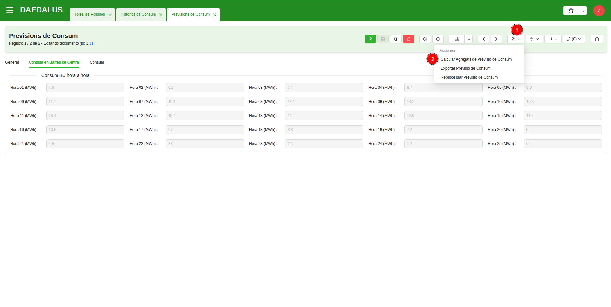
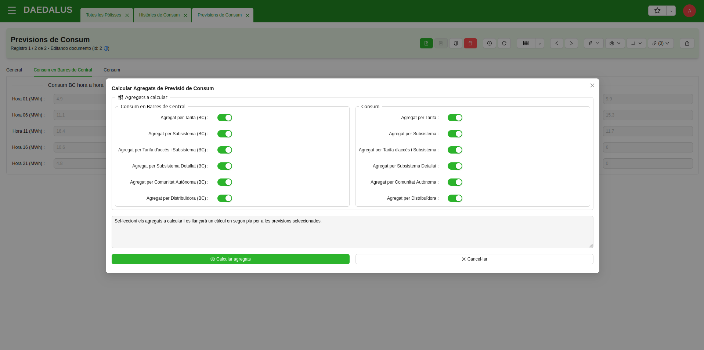
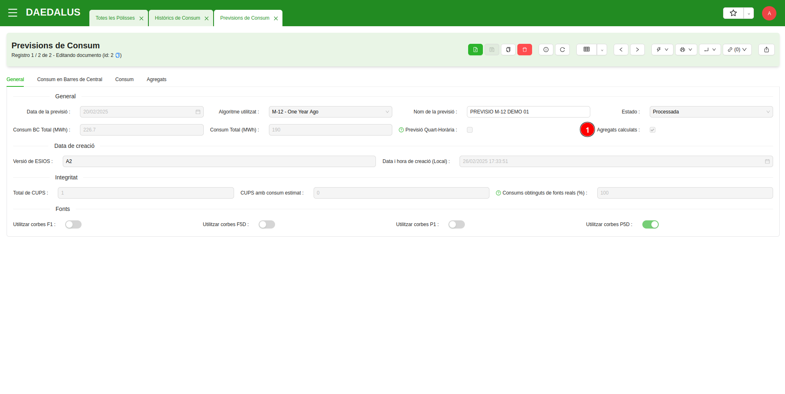
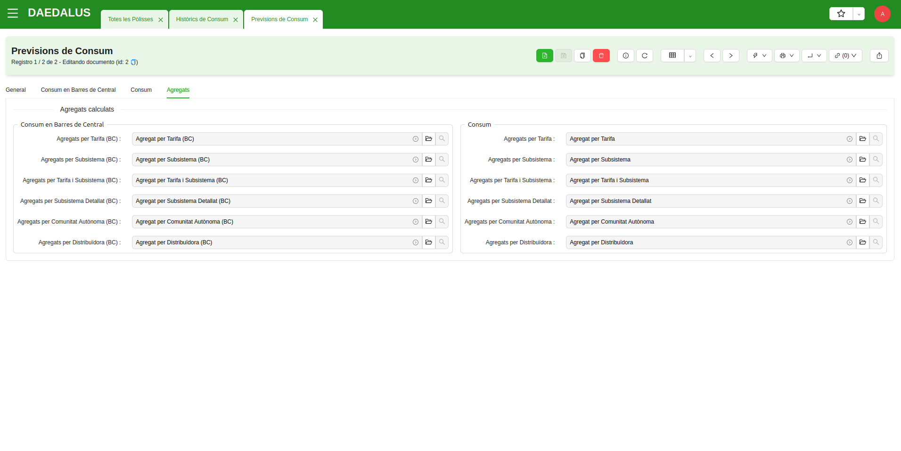
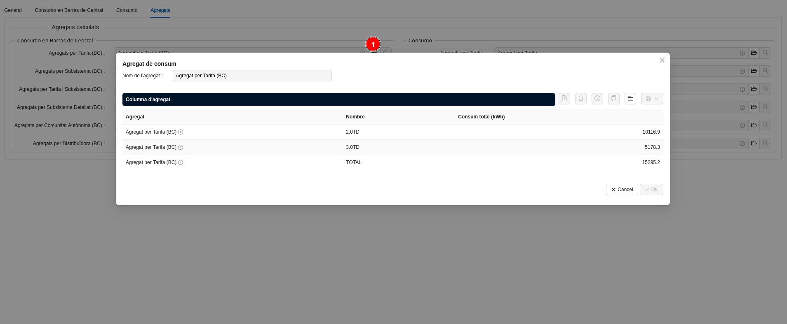
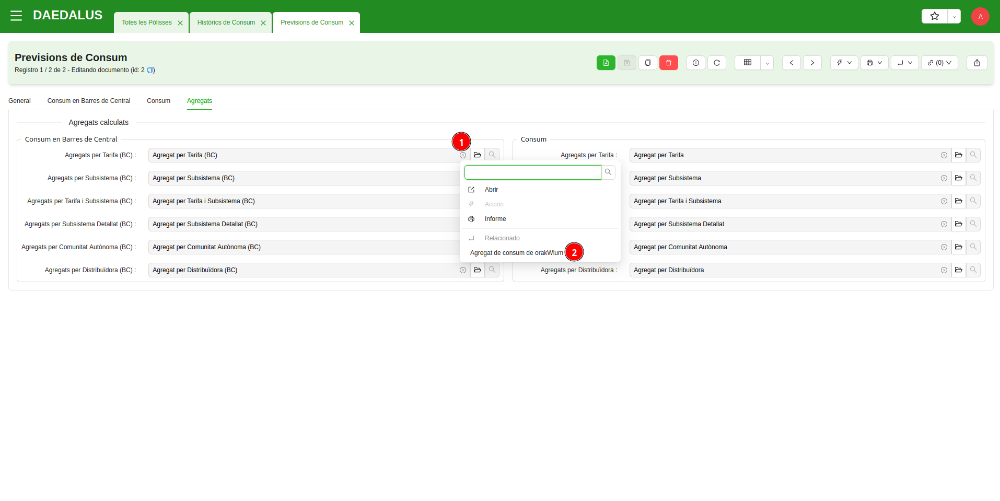
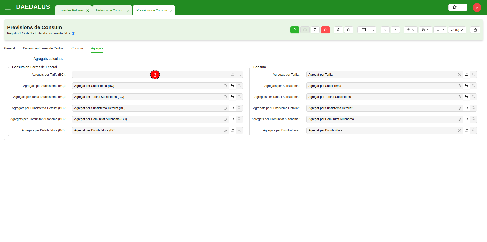
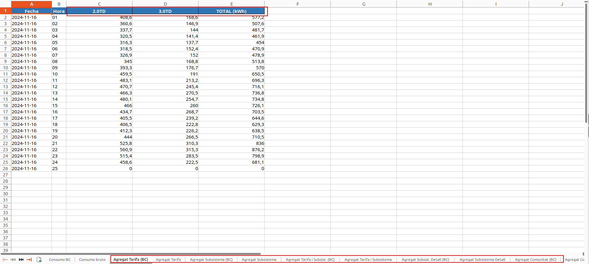

# Càlcul i revisió d'agregats de consum

A **orakWlum**, un agregat és una **agrupació del consum** hora a hora (o quart d'hora a quart d'hora) d'una previsió o
d'un històric prèviaments generats.

En un agregat, es determinen **una sèrie de camps** de les dades de consum històric utilitzades per a fer-ne una agrupació.
Pot ser un únic camp (per exemple, per a generar un agregat per tarifa d'accés) o bé poden ser més d'un (per exempe,
per a generar un agregat per tarifa d'accés i comunitat autònoma).

Un cop determinats els camps pels quals es vol generar l'agregat, la informació del consum deixarà de mostrar-se només
com a sèrie temporal, sinó que **es separarà el consum per columnes**, agrupant el consum pels diferents valors presents
als camps seleccionats.

## Calcular agregats

Per a calcular agregats des d'una `previsió de consum`, tan sols cal anar a la vista de formulari de l'element
en qüestió i invocar l'assistent **Calcular Agregats de Previsió de Consum**. Trobareu un assistent idèntic des dels
`històrics de consum`.

!!! Info "Nota 1"
    És possible llançar un càlcul d'agregats de consum des de múltiples previsions o històrics amb una sola acció,
    seleccionant primer els elements des de la vista de llistat i invocant sobre ells l'assistent de calcular agregats.

A l'assistent podreu sel·leccionar **quins agregats voleu** que es calculin per a la previsió o històric en qüestió (per
defecte venen marcats tots). Hi ha diversos agregats i podeu calcular només els que siguin útils per a la Comercialitzadora.

!!! Info "Nota 2"
    Tots els agregats es troben disponibles en dues versions: utilitzant el consum brut o utilitzant el
    consum elevat en barres de central (amb pèrdues aplicades). L'assistent permet per a cada tipus d'agregat calcular
    les dues versions, només una de les dues, o cap.

Un cop llançat el càlcul d'agregats de consum, aquest **s'executarà en segon pla**. En acabar, veurem que a les
previsions o històrics on hi hagi agregats calculats, queda marcada una casella indicant-ho. La casella es diu
**Agregats calculats**.

També apareixerà una columna **Agregats** des d'on podreu revisar els agregats de consum calculats.

!!! Info "Nota 3"
    Si una previsió o un històric són reprocessats, es poden actualitzar els seus agregats tornant-los a calcular, amb
    l'assistent.

Des de la pestanya **Agregats**, a més de veure els agregats dels que disposa una previsió o un històric, també és
possible visualitzar-los si es clica a la icona de la seva carpeta. Així a simple vista es pot analitzar quanta energia
hi ha en total i per a cada agrupació de consum disponible a l'agregat.

!!! Info "Nota 4"
    No és possible calcular agregats de consum sobre històrics o previsions que no estiguin en estat "processat". El
    càlcul no modificarà elements a mig processar o amb errors.

## Eliminar agregats de consum

Si en un moment donat, us interessa **eliminar un agregat de consum** d'un històric o d'una previsió, simplement podeu
accedir-hi des de l'icona de la fletxeta i eliminar-lo. També és possible eliminar agregats amb l'assistent, llançant un
recàlcul amb només un agregat seleccionat (el càlcul esborrarà els no sel·lecionats) i un cop enllestit el càlcul,
eliminant manualment l'agregat que queda.

Els agregats que s'eliminin, deixaran d'aparèixer a la pervisió o històric on es van generar. Si un element queda sense
agregats, la casella **Agregats calculats** quedarà desmarcada i la pestanya **Agregats** deixarà de mostrar-se.

## Exportar previsions o històrics amb agregats calculats

Si s'exporta a **format Excel** una previsió o un històric, figuraran pestanyes addicionals amb els agregats que l'element
exportat tingui calculats.

!!! Info "Nota 5"
    No serà possible concatenar previsions o històrics en una exportació a Excel si els elements seleccionats no tenen
    tots els mateixos agregats calculats, ja que la informació seria inconsistent.
