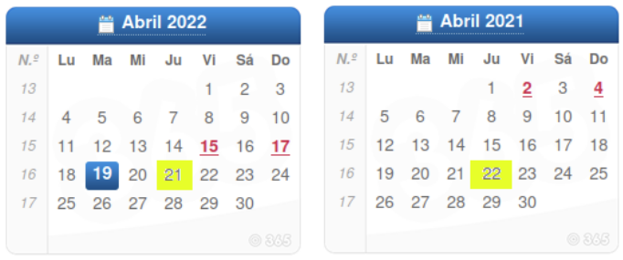
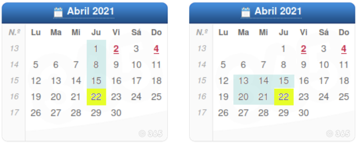

# Algoritmes de predicció de orakWlum

**orakWlum** és una eina capaç de generar **previsions de consum** a partir de les mesures històriques de l'ERP de Comercialitzadora
amb la finalitat de tenir una base sòlida sobre la que generar les ofertes de compra a publicar a l'Operador del Mercat
(OMIE).

Per a fer-ho, tan sols cal triar una data i un **algoritme de predicció** d'entre els disponibles. Les prediccions variaran
segons l'algoritme utilitzat, ja que cadascun d'ells empra diferents estratègies i variaran les dades històriques utilitzades
per a calcular la predicció.

Un cop creada la previsió de consum, aquesta es calcularà utilitzant l'algoritme predictiu triat.

## Teoria comuna

Quan orakWlum tracta de trobar consum històric per als CUPS, l'algorisme utilitzat anirà recorrent les fonts en ordre de 
prioritat ascendent, és a dir, començant per la que tingui el valor de prioritat més baix. Si no es troba el consum per 
a les 24 hores del dia a la font consultada, es salta a la següent en ordre de prioritat, fins que s'han recorregut totes.

Si després de recórrer totes les fonts, el CUPS queda sense consum, el que es fa és consultar la tarifa d'accés i calcular 
una mitjana per tarifa i hora a partir de tots els CUPS amb aquesta mateixa tarifa que sí que han trobat consum històric 
a les fonts.

D'aquesta manera, es garanteix que s'obté el consum per a tots els CUPS, encara que algun pugui no ser present a les fonts.

En el diagrama següent es mostra com un conjunt de CUPS van obtenint la previsió de consum a partir de l'històric o, per 
al cas dels CUPS que no disposin d'aquest, de la mitjana de consum de la resta de CUPS amb la mateixa tarifa d'accés.

Inicialment, cap dels CUPS no disposa de consum històric. A mesura que es recorren per ordre de prioritat les fonts de 
consum històric (F5D, F1, P1, etc.) cada cop hi ha més CUPS que han obtingut consum (conjunt blau) mentre que va minvant 
el nombre de CUPS que no l’han obtingut (conjunt vermell). En acabar el recorregut de les fonts, s'obté el consum per els 
CUPS que encara no en tenen mitjançant la mitjana per hora dels CUPS de la mateixa tarifa que sí que han obtingut consum.

Un cop feta l'obtenció del consum de cada hora per a tots els CUPS, s'agrupen aquests consums per hora i es genera així 
la previsió.

## M-12 (One-Year-Ago)

Aquest algorisme és molt ràpid. La seva estratègia és, atesa la data per a la qual es vol calcular la previsió de consum, 
retrocedir un any exacte en el temps per trobar aquest mateix dia de la setmana fa un any i consultar el seu històric de 
consum a les fonts d'orakWlum.

En el següent exemple, es vol generar una previsió de consum per al 21 d'abril del 2022 (marcat en groc al calendari). 
orakWlum calcularà quin és el dijous equivalent de fa un any i obtindrà dels històrics de consum d’aquesta data el consum a 
proposar. En aquest exemple, la data objectiu serà el 22 d'abril del 2022 (marcat en groc al calendari). Els CUPS que no tinguin 
històric de consum en aquesta data, s'estimaran amb la mitjana horària d'acord amb la tarifa, tal com s'explica al diagrama de
la secció anterior d'aquest document.

Aquest algorisme és molt lleuger, permet fer prediccions per a milers de CUPS en uns segons i funciona especialment bé quan 
el conjunt de CUPS té una estacionalitat molt marcada, és a dir, quan els CUPS tenen un perfil de consum molt diferent segons 
l'època de l'any (per exemple, els associats a hotels o zones turístiques).

### Avantatges

* Rapidesa de càlcul.
* Bon funcionament amb carteres de CUPS amb perfil de consum marcadament estacional.

### Limitacions

* Sensible a desviacions provocades per perfils de consum atípics un any enrere de la data de la predicció.

## Gauss (Mitjanes Normalitzades)

Aquest algorisme és més robust. La seva estratègia és, atesa la data per a la qual es vol calcular la previsió de consum, 
crear una col·lecció de dies “candidats” dels quals obtenir consum històric per calcular la previsió.

Per això, en primer lloc hem de definir els “tipus de dies” de la setmana. El comportament de l'algorisme serà diferent 
segons tractem cadascun dels 7 dies de la setmana com un tipus de dia diferent o si, com es decideix de vegades, es tracten 
com el mateix tipus de dia els dimarts, els dimecres i els dijous. D'aquesta manera, si decidim que els dijous són un tipus 
de dia en particular, quan es consulti el consum històric, la col·lecció de dies candidats constarà de diversos dijous 
anteriors a la data de la predicció. Si s'opta per considerar que dimarts, dimecres i dijous són un mateix tipus de dia, 
aleshores la predicció per a un dijous farà servir dimarts, dimecres i dijous de les setmanes anteriors a la data de predicció. 
En tot cas, els festius i els diumenges sempre es consideraran un mateix tipus de dia.

El principal objectiu d'aquest algorisme i la seva evolució respecte al **M-12** és que tinguem una mostra de consums històrics 
més recents i més propers a la data de la previsió. Per això, es pot ajustar el paràmetre “max” per dir fins quants dies 
enrere volem consultar quan es faci una predicció. D'aquesta manera, si el paràmetre “max” s'ajusta a 10 dies, en calcular 
una predicció per a dijous que ve, es faran servir com a dies candidats els 10 dijous anteriors, en ordre temporal invers, 
del més recent al més antic. És important assenyalar, que si es va establir que dijous és el mateix tipus de dia que dimarts 
i dimecres, aleshores la mostra de dies candidats dels quals consultar el consum històric a les fonts seran per aquest ordre: 
dimecres anterior, el dimarts anterior, dijous de fa una setmana, dimecres de fa una setmana, dimarts de fa una setmana, 
dijous de fa dues setmanes, dimecres de fa una setmana, etc. fins arribar als 10 dies candidats, com estableix el paràmetre 
max. Aquest paràmetre permet llavors definir com de propers volem que siguin els dies candidats per tenir en compte el perfil 
de consum.

Un problema que passa de vegades amb l'algorisme **M-12** és que com que es fa servir un únic dia per consultar l'històric, 
és possible que aquell dia tingués unes condicions diferents del de la predicció. Per exemple, una temperatura extrema i 
rara per a l'època o qualsevol altra circumstància que provoqui que el perfil de consum dels CUPS no fos típic i en desviï 
la previsió. Per evitar això, l'algorisme **Gauss** té un últim paràmetre anomenat “min” que defineix el nombre mínim de dies 
sobre els quals es consultarà el consum. Això significa que si ajustem el paràmetre “min” a 3 dies, per exemple, en lloc 
de recórrer els dies candidats enrere en el temps i fer servir per a cada CUPS el primer dia que trobi el consum de les 24 
hores, aniré guardant dies complets fins a tenir els requerits pel paràmetre. És a dir, que orakWlum guardarà per a cada 
CUPS una mostra de 3 dies complets amb el consum en cadascuna de les 24 hores. Un cop acabat el recorregut, per a cada CUPS 
es farà una mitjana normalitzada entre els consums de la mostra hora a hora, suavitzant així els possibles consums atípics 
que poguessin desviar la previsió.

Al següent exemple, es vol generar una previsió de consum per al 22 d'abril de 2021. A l'exemple de l'esquerra, s'ha ajustat 
que dijous és un únic tipus de dia i l'exemple de la dreta, es consideren el mateix tipus de dia dimarts, dimecres i dijous. 
En tots dos casos, s'anirà retrocedint en el temps fins al màxim de dies establert a l'algorisme (6 dies, en aquest cas). 
Al primer exemple, veiem que només es tenen en compte els dijous anteriors a la data de la previsió, mentre que a l'exemple 
de la dreta, es tenen en compte els dimarts, dimecres i dijous anteriors a la data de previsió fins a tenir així els 6 dies 
candidats. Un cop seleccionats aquests dies candidats, orakWlum els recorrerà de més recent a més antic consultant els consums 
històrics corresponents als CUPS en aquestes dates.

Els CUPS que no hagin pogut obtenir una mostra de consum històric, s'estimaran amb la mitjana horària d'acord amb la tarifa,
tal com s'explica al diagrama de la secció anterior d'aquest document.

### Avantatges

* Millor precisió que l'algoritme **M-12**, al ser menys sensible als perfils de consum atípics dels històrics.
* Gran fiabilitat, al consultar una mostra de consum històric el més propera possible a la data de la predicció.
* Major personalització, al poder ajustar els paràmetres disponibles.

### Limitacions

* Temps de càlcul molt més elevat que l'algoritme **M-12** al tenir que obtenir moltes més dades i normalitzar-les, abans 
d'obtenir el consum proposat.

## MVH (Millor Valor Horari)

Aquest algorisme es basa en la idea de l'algoritme **Gauss** però eliminant la necessitat de consultar una per una totes
les col·leccions de dades de consum històric. Enlloc d'això, un cop sel·leccionats els dies candidats a consultar, es farà
la consulta únicament en una nova col·lecció anomenada `mvh` (Millor Valor Horari). El fet d'eliminar les múltiples
consultes, fa que sigui més lleuger que l'algoritme **Gauss** mantenint una bona qualitat en les mesures obtingudes.

L'objectiu principal de l'algoritme **MVH** és que no sigui `orakWlum` qui s'encarregui de recórrer totes les fonts de
consum històric per a determinar la millor mesura horària de cada CUPS, sino que això ho hagi fet ja un procés independent
que es pugui llançar manualment o mitjançant algun automatisme, recalculant el millor valor horari de tots els CUPS actius
pel Comercialitzador donat un rang de dates. El resultat, és un algoritme robust però més lleuger en temps computacional
que l'algoritme **Gauss**.

A més de comptar amb la personalització de la tipologia de dia de la setmana i del màxim de dies que es permet tirar enrere
en el temps a l'hora de generar la llista de dies candidats, amb l'algoritme **MVH** apareixen nous paràmetres:

* En primer lloc la quantitat de dies candidats es volen consultar a la col·lecció `mvh` (mostra màxima) i quin pes
  s'assignarà a la mesura de cada día. Un exemple seria la configuració per defecte: 3 dies candidats, assignant al valor
  proposat un 70% del dia més proper, un 20% del segon dia més proper i un 10% del dia menys proper.
* En segon lloc, un multiplicador global que, un cop obtinguda la previsió de consum hora a hora, farà que aquesta creixi
  o decreixi, en funció de com es configuri el paràmetre. Aquest paràmetre per defecte està assignat a 100%, per a que no
  afecti al consum proposat. Si es vol activar, cal configurar-ho a les variables de l'ERP. És especialment útil, per a
  que les previsions compensin automàticament el desviament observat entre la previsió i la realitat.

Com amb els altres algoritmes, els CUPS que no hagin pogut obtenir una mostra de consum històric, s'estimaran amb la mitjana
horària d'acord amb la tarifa, tal com s'explica al diagrama de la secció anterior d'aquest document.

### Avantatges

* Bona relació entre temps de càlcul i fiabilitat de la previsió de consum final.
* Compensació automàtica del desviament, si es configura el multiplicador per a que el corregeixi un cop s'ha generat
  la previsió.

### Limitacions

* Requereix que s'hagi calculat prèviament el millor valor horari (`mvh`) pels dies que es faran servir com a candidats
  a l'hora d'obtenir dades de consum històric.
