# Eines de OMIE

L'ERP de Comercialitzadora compta amb eines per a poder-se **comunicar directament amb OMIE**.

Concretament, és possible generar **ofertes** d'OMIE des d'una **previsió de orakWlum**, editar-les si és necessari, i 
publicar-les a una sessió de Mercat oberta. D'aquesta manera, és possible publicar les ofertes de compra d'energia **sense
utilitzar cap eina externa**.

!!! Info "Nota 1"
    Per a poder operar a OMIE des de l'ERP, cal contactar a GISCE-TI per a poder realiztar les instal·lacions i configuracions
    pertinents.

## Ofertes pel Mercat Diari (MD)

### Generar Ofertes de Mercat Diari

Per a generar una oferta de mercat, tan sols cal anar al llistat de les previsions de consum generades, accedir a la vista
de formulari d'una d'elles i fer clic al botó **Crear Oferta MD OMIE**.

[ 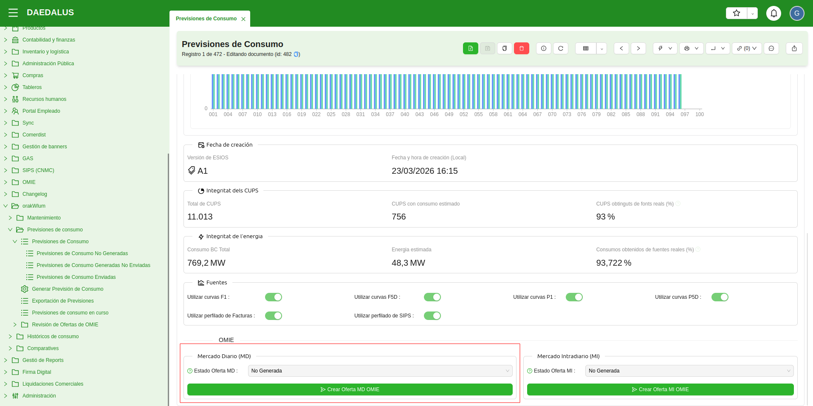](../_static/orakWlum/generar_oferta_omie.png)

Un cop creada l'oferta, des de la mateixa previsió es pot revisar, se'n pot veure l'estat i es pot obrir
en una pestanya nova del client web.

[ 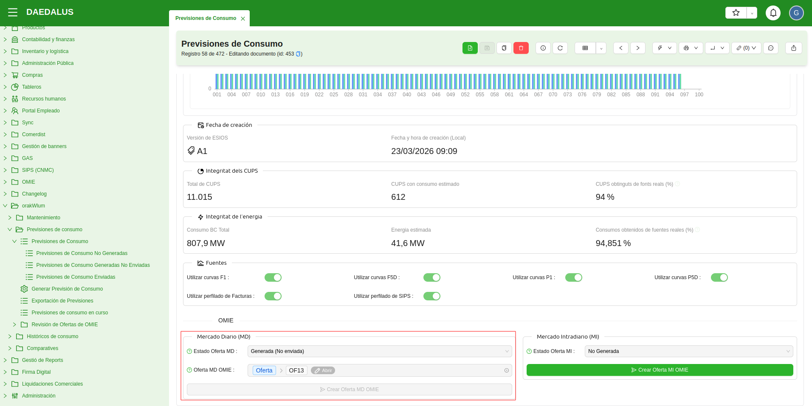](../_static/orakWlum/oferta_omie_generada.png)

Si s'accedeix a l'oferta, es pot revisar l'energia ofertada **per cada quart d'hora**, amb el seu preu corresponent. 

La data de la sessió i el tipus de mercat s'omplen segons si hem creat una oferta pel **Mercat Diari** (MD) o pel 
**Mercat Intradiari** (MI). En el cas de tractar-se d'una oferta pel MI, es tria per a quina de les tres sessións de MI 
(**IDA1**, **IDA2** o **IDA3**).

[ 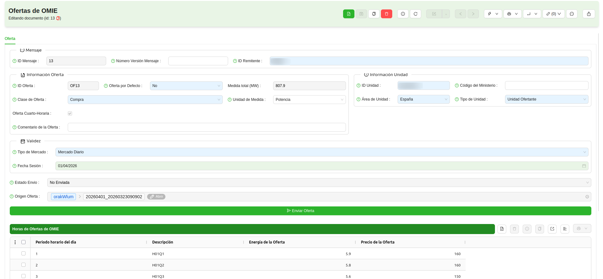](../_static/orakWlum/revision_oferta_omie.png)

!!! Info "Nota 2"
    Els valors d'energia són directament els de la pròpia previsió d'orakWlum. Si l'oferta ha estat "afinada", es fan
    servir els valors afinats. En cas contrari, es fan servir els valors originals de la previsió.

Si es volen canviar modificar els valors d'energia i/o els preus de les oferets, es pot fer amb l'assistent 
**Omplir Hores Oferta**, que mostrarà els valors tal qual figuren a l'oferta i permetrà modificar-los.

[ 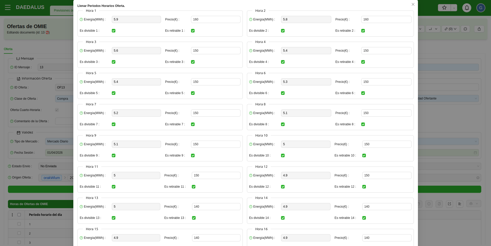](../_static/orakWlum/editar_oferta_omie.png)

!!! Info "Nota 3"
    Els preus per defecte per a cada quart d'hora s'agafen d'una variable de configuració que es pot editar amb un 
    assistent, com s'explica més abaix en aquest mateix manual.

### Publicar Ofertes de Mercat Diari a OMIE

Un cop fetes les revisions pertinents, l'oferta es pot publicar a OMIE fent clic al botó **Enviar Oferta**. L'enviament 
és inmediat i apareixerà una pestanya **Resposta** on es podrà veure el resultat de l'enviament.

[ 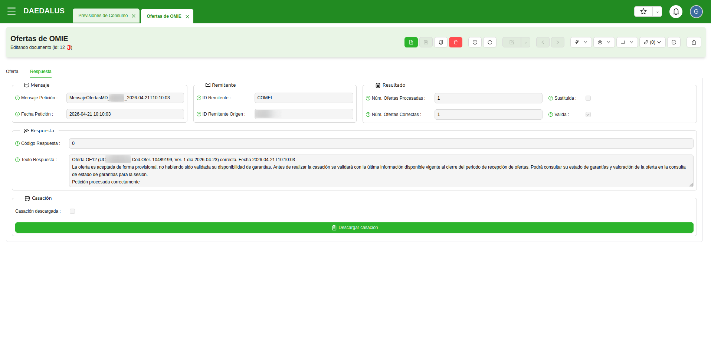](../_static/orakWlum/oferta_aceptada.png)

!!! Info "Nota 4"
    Si s'envia una oferta fora de temps (per una sessió ja tancada) aquesta quedarà en estat "enviada amb errors".

### Descarregar casació des de OMIE

Si tenim una oferta enviada a OMIE, un cop s'hagi tancat la sessió de mercat corresponent i s'hagi publicat la casació,
és possible consultar-la des de la pròpia oferta.

Per a fer-ho, tan sols cal clicar al botó **Descarregar casació**, a la pestanya **Resposta**. Un cop descarregada, la
casació queda enregistrada a l'ERP i es pot consultar directament des de la seva oferta d'OMIE corresponent.

[ 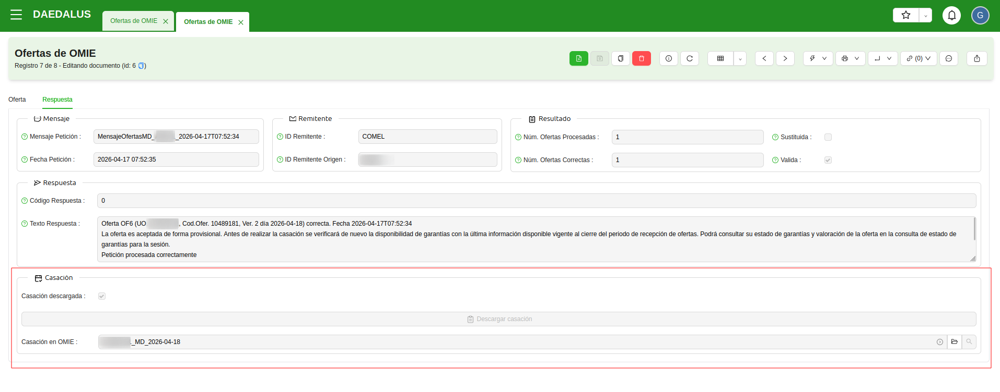](../_static/orakWlum/casacion_omie_descargada.png)

Si es revisa una casació descarregada, la vista és molt similar a la de les ofertes d'OMIE. Es pot veure la **potència total**
i també la **potència casada per a cada quart d'hora** del dia. No es pot consultar el preu, ja que la casació d'OMIE només informa
de l'energia. El preu es publica a **ESIOS** amb les **Liquidacions Comuns**, cada tarda a partir de les 14:00.

[ 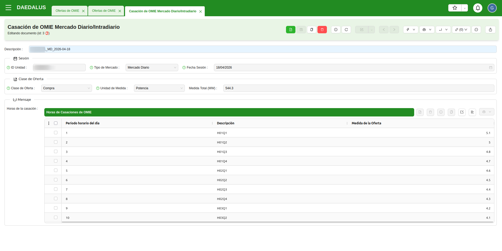](../_static/orakWlum/revision_casacion_omie.png)

## Ofertes pel Mercat Intradiari (MI)

Si no s'ha casat l'energia que es vol (que es pot saber comparant la casació amb l'oferta al Mercat Diari), es poden generar
i publicar ofertes a les sessions de **Mercat Intradiari** (MI).

### Generar Ofertes de Mercat Intradiari

El funcionament, és pràcticament el mateix que per a les ofertes de MD, trobareu el botó **Crear Oferta MI OMIE** a les
previsions de consum.

[ 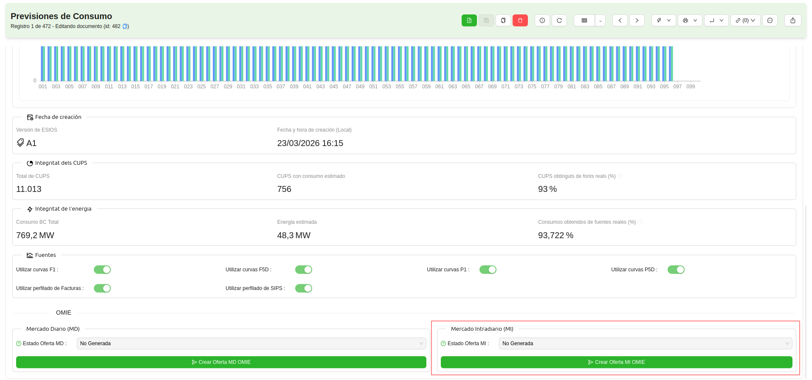](../_static/orakWlum/generar_oferta_mi_omie.png)

L'acció realtizarà les següents operacions:

* 1) Descarregarà la casació pel dia de la previsió.
* 2) Compararà quart d'hora a quart d'hora l'energia casada amb l'energia de la previsió de orakWlum.
* 3) Generarà ofertes pel Mercat Intradiari a partir de les diferències d'energia.

!!! Info "Nota 5"
    El resultat de crear ofertes de MI poden ser o cap oferta (tota l'energia de la previsió s'ha casat al MD), una oferta
    de compra (amb l'energia que falta per casar), una oferta de venda (es pot generar una oferta de MI des d'una previsió
    de consum més nova que hagi canviat els valors d'energia quart d'hora a quart d'hora) o bé una oferta de cada.

A diferència de les ofertes pel Mercat Diari, a les ofertes pel Mercat Intradiari, cal seleccionar a **quina de les tres
sessions** del MI s'envia l'oferta (per defecte, la primera, la **IDA1**, que té lloc cada dia entre les 14:00 i les 15:00).

### Publicar Ofertes de Mercat Intradiari a OMIE

El procediment per a publicar les ofertes de MI un cop generades és exactament el mateix que amb les ofertes de MD. Des de la
pròpia oferta es pot fer clic a **Enviar Oferta** i a l'instant veurem el resultat en l'estat i en la pestanya **Resposta**.

### Descarregar casació des de OMIE

També de la mateixa manera que amb les ofertes de MD, un cop tancada la sessió de mercat a OMIE, es pot consultar la casació.
D'aquesta manera, es pot comprovar novament si s'ha casat tota l'energia de la previsió.

## Automatismes 

Des de GISCE-TI hem dissenyat i implementat uns automatismes bàsics per a poder operar de forma semi-assistida amb OMIE. 

### Automatisme MD

A l'ERP de Comercialitzadora es pot configurar i programar un automatisme que diàriament genera una previsió de consum
de orakWlum per l'endemà (dia D+1) i la publica al Mercat Diari d'OMIE.

En fer l'enviament, s'envia un e-mail amb el resum de les operacions i el seu resultat, informant de les ofertes que s'han
pogut publicar correctament i del volumn d'energia ofertat.

Aquest automatisme es pot deixar programat per a qualsevol moment anterior a les 12:00 del dia anterior al de la sessió on
es vol publicar. Per defecte, solem programar l'automatisme a les 11:00 per a que generi i publiqui oferta pel dia D+1.

### Automatisme MI

A l'ERP de Comercialitzadora es pot configurar i programar una utomatisme que diàriament obté la casació pel dia D+1 i,
si detecta que la casació no coincideix amb l'energia de la previsió de consum ofertada, genera i publica ofertes al Mercat
Intradiari, a fi de corregir-ne la casació i fer coincidir el volum d'energia casada amb l'energia present a la previsió.

En fer els enviaments, s'envia un e-mail amb el resum de les operacions i el seu resultat, informant de les ofertes que
s'han pogut publicar correctament i del volumn d'energia ofertat.

Aquest automatisme només es pot deixar programat a partir de les 14:00 per a que descarregui la casació del dia D+1, comprovi
si falta o sobra energia per casar i generi i publiqui al MI les ofertes de compra i venda corresponents.

### Automatismes personalitzats

Si teniu interés en qualsevol dels automatismes, o voleu encarregar un desenvolupament per a un automatisme personalitzat, 
tan sols heu de contactar amb nosaltres a través d'un SAC per a comunicar-ho.

## Eines auxiliars

### Casacions i Programes

A l'ERP hi ha un menú **OMIE** amb diversos llistats i assistents. Aquest menú és genèric i, per tant, útil tant per a
Comercialitzadores com per a Representants a mercat. A continuació s'en detalla la utilitat.

[ 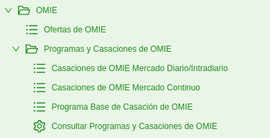](../_static/orakWlum/menu_omie.png)

* **Ofertes de OMIE**: Des d'aquest llistat es poden veure totes les ofertes generades, tant pel MD com pel MI.
* **Programes i Casacions de OMIE**: En aquest submenú es poden trobar les següents eines:
    * **Casacions de Mercat Diari/Intradiari**: Llistat de casacions descarregades des de OMIE per a sessions de MD/MI.
    * **Casacions de Mercat Continu**: Llistat de casacions descarregades des de OMIE per a sessions de Mercat Continu.
    * **Programes Base de Casació**: Llistat de PBCs descarregats des de OMIE.
    * **Consultar Programes i Casacions de OMIE**: Assistent que permet triar un tipus de descàrrega, una unitat d'oferta 
        i una sessió, per a poder descarregar casacions o programes base de casació.

Aquestes eines permeten revisar casacions descarregades a l'ERP directament, sense accedir-hi des de les previsions de
consum de **orakWlum**. I amb l'assistent, també és possible descarregar-ne qualsevol simplement especificant la unitat
d'oferta i la sessió que desitgeu.

### Assistent per a modificar els preus d'oferta

A l'ERP de Comercialtizadora existeix un assistent per a poder revisar i modificar els preus d'oferta d'OMIE. 
El trobareu a **OMIE > Revisar preus de mercat**.

[ 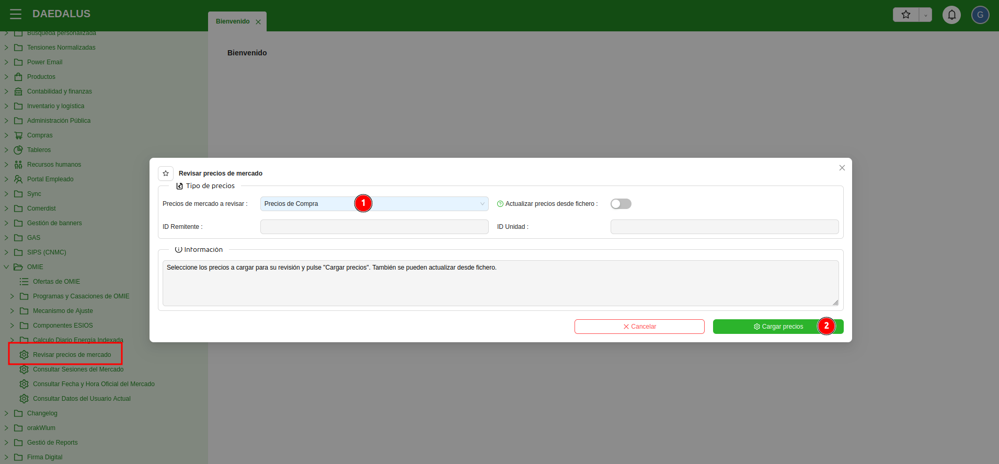](../_static/orakWlum/revisar_precios_omie.png)

Al invocar-lo podreu triar si voleu revisar els preus de compra o els de venda (es guarden per separat a l'ERP). Un cop
triat això es pot clicar "Carregar preus" per a visualitzar els valors actuals que hi ha a l'ERP pel preu de cada quart
d'hora del dia, expressat en €/MWh.

[ 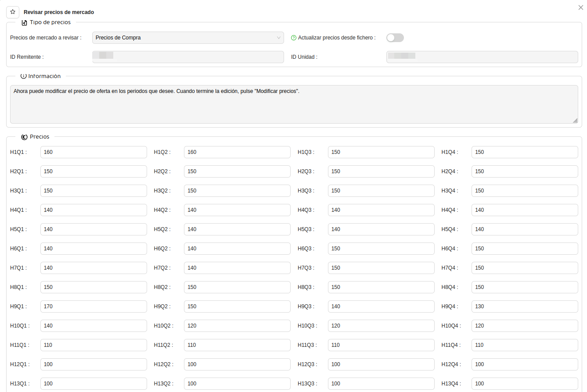](../_static/orakWlum/modificar_precios_omie.png)

En aquesta vista es pot modificar el valor dels preus que es vulguin canviar i desar els canvis amb el botó **Modificar preus**.
A continuació apareixerà un camp d'informació on figuraran tots els canvis introduïts per l'usuari respecte als preus actuals.

[ 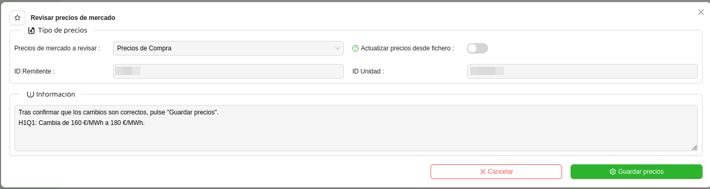](../_static/orakWlum/confirmar_precios_omie.png)

Un cop revisat que tot és correcte, es pot prèmer el botó **Desar preus** per a persistir els canvis.

!!! Info "Nota 6"
    Abans de carregar els preus en el primer pas, es pot activar l'opció **Actualitzar preus des de fitxer**. Això farà
    aparèixer un espai a l'assistent per a importar un fitxer d'Excel on figuri a la primera línia els 100 valors pels preus
    de cada quart d'hora del dia, de forma ordenada. Així es pot actualitzar de forma més àgil els preus, si és necessari.

Tingueu en compte que si no es desen els canvis, els preus es mantenen amb el valor existent a l'ERP, encara que
n'hagueu importat de nous amb un fitxer Excel o que n'hagueu modificat algun valor manualment.
