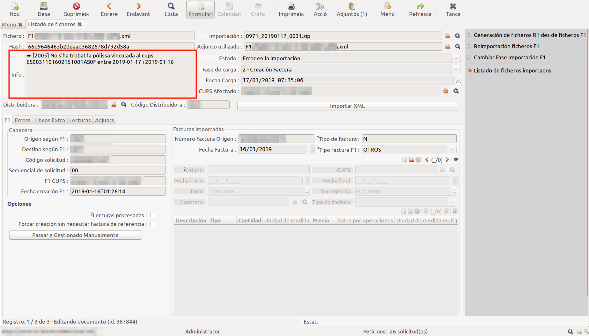
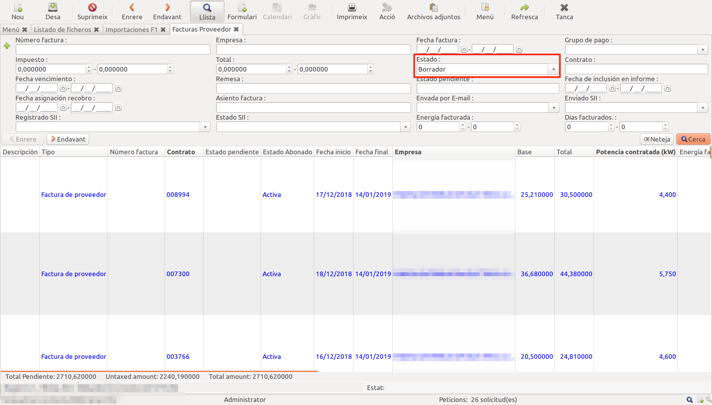
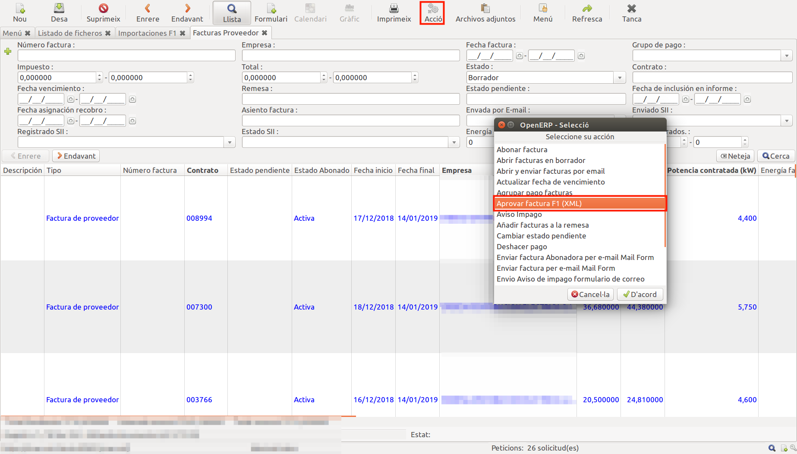

# Procés de Facturació

El procés de facturació inclou 3 fases:

 - Carrega de F1 i gestió de factures de proveïdor
 - Generació de factures de client i enviament de factures
 - Gestió de cobraments

## 1. Carrega de F1 i Gestió de Factures de Proveïdor

L'objectiu de la carrega de F1 és obtenir les lectures amb les quals 
posteriorment es facturarà al client, a més de portar un control del que es paga 
a les distribuïdores. Es pot trobar més informació sobre els F1 al següent [enllaç](https://manuals.gisce.net/comer/facturacion/#importacio-fitxers-f1).

El següent esquema mostra un resum de les fases per les que passa un F1 quan es carrega al ERP:

### 1.1. Carregar fitxers F1 (XML)

1. Fer un zip amb tots els fitxers XML corresponents als F1 a carregar.
2. Utilitzar l'assistent `Facturació -> General -> Factures Proveïdor -> Importació fitxers F1`

3. S'haurà generat un lot de importació de F1 al que podem anar per el menú 
`Facturació -> General -> Factures Proveïdor -> Importacions F1`. Aquest lot tindra el nom del ZIP carregat.

4. S'obre el lot de F1 importat i es va refrescant fins que la barra `Progrés` i `Finalitzats ` deixa de avançar.
Aquestes barres indiquen el percentatge de XML carregats i el percentatge de XML carregats correctament respectivament.

5. Quan la barra de progrés ha arribat al 100% ja s'ha acavat la carrega de F1. 
Si la barra de finalitzats no està al 100% algún F1 no s'ha carregat correctament 
i s'ha de passar a la [gestió de errors de F1 i reimportació](#12-gestio-de-errors-de-f1-i-reimportacio). 
Si la barra de finalitzats està al 100% es pot passar a [gestió de factures de proveïdor i pagaments](#13-obrir-factures-de-proveidor).

### 1.2. Gestió de Errors de F1 i Reimportació

1. Anar als F1 amb error de importació. Hi ha 2 opcions:

    - Desde el lot de importació de F1 que no te la barra `Finalitzats` al 100% utilitzar l'enllaç `Listado de ficheros`.

    - Desde el menú `Facturació -> General -> Factures Proveïdor -> Fitxers F1 importats`.

      En ambdós casos, en el llistat resultant s'ha de filtrar per `Estat = Error en la importació`.

2. Entrar al F1 que es vol corregir i llegir el missatge de error.

3. Els errors de importació es produeixen per una divergéncia o una inconsistencia entre les dades que arriben del F1 i les dades que es tenen al ERP.

    - Més informació sobre les validacions de F1 en aquest [enllaç](https://manuals.gisce.net/comer/facturacion/#passos-que-es-realitzen-en-una-importacio).

4. Si l'error es pot solucionar corregint alguna dada del ERP, es corregeix i es reimporta el F1 amb el botó `Importar XML`.

   - Més informació sobre les reimportacions en aquest [enllaç](https://manuals.gisce.net/comer/facturacion/#reimportacions-dun-fitxer).

5. Si l'error es per culpa de la distribuïdora, es pot fer un R1 amb l'assistent `Generació de fitxers R1 desde fitxers F1`.

### 1.3. Obrir Factures de Proveïdor

1. Els F1 que estan en estat `Importat Correctament` han generat factures de proveïdor en borrador que ja es poden obrir.
2. Per obrir aquestes factures hi ha dos opcions:

    - Desde el lot de importació de F1.
    - Desde el llistat de factures de proveïdor.

3. Obrir factures desde el lot d'importació de F1:

    3.1. Anar al llistat de lots de importació de F1.
    
    3.2. Buscar lots amb la barra de "Oberts" per sota del 100%. Aquesta barra indica el percentatge de factures de proveïdor obertes.
    3.3. Desde dins de un lot de importació, utilitzar el botó `Aprovar factures`.
    

4. Obrir factures desde el llistat de factures de proveïdor `Facturació -> General -> Factures Proveïdor`.

     4.1. Buscar les factures que estiguin en estat `borrador`.
     

     4.2. eleccionar les factures que es volen obrir i utilitzar l'assistent `Aprovar factura F1 (XML)`.
     

### 1.4. Gestió de Pagaments
1. Per pagar factures de proveïdor hi ha dos opcions:

    - Desde remesas de pagament.
    - Desde el llistat de factures de proveïdor.

2. Desde remesas de pagament: Quan s'importa un F1, si es té configurat així, automàticament es creen remesas de pagament amb la informació que envia la distribuïdora en el F1 i es posen les factures de proveïdor en aquestes remeses.

    2.1. Anar a les remeses de pagament: menú `Contabilitat i Finançes -> Pagament -> Ordres de Pagament -> Ordres de Pagament`
    

    2.2. Buscar remeses de cobrament no pagades amb el filtre `Pagat = No`.
    
   
    2.3. Desde una remesa no pagada:
 
       - Revisar que el camp `Sheduled date if fixed` tingui la data en que es volen marcar com a pagades les factures.
       - Clicar el botó `Confirmar pagaments`
       - Si no es vol enviar cap fitxer al banc perqué es té domiciliat el pagament a la distribuïdora o ja s'ha pagat: Marcar el checkbox `Forçar pagament sense exportar fitxer`
       

    2.4. Clicar el botó `Realitzar pagaments`.
    

3. Desde el llistat de factures de proveïdor.

    3.1. Buscar les factures en estat `Obert` (no pagades).
    
   
    3.2. Seleccionar les factures a pagar i utilitzar l'assistent `Pagar grup factures`.
    
   
   
