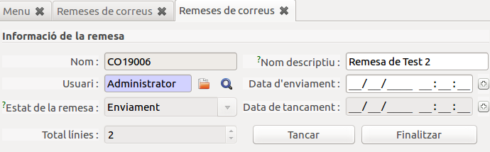

## RepartiBé

### Menú, localització i funcionalitats

#### Menú de correos - Repartibé

#### Llistat de remeses

#### Formulari remesa

#### Línies d'una remesa

**Verd &rarr; entregada || Vermell &rarr; No entregada**

### Circuit i funcionament

#### Primer pas - Crear remesa amb factures impagades
Per crear una nova remesa, s'ha de fer a traves del llistat de remeses del menú de correus mitjançant el botó new.

Per afegir les factures impagades, ho farem des del llistat de factures (factures o invoices), encara que serà obligatori que les invoices seleccionades tinguin una factura d'energia associada.

Un cop seleccionada l'acció, apareixera la primera pantalla de l'assistent, on podrem seleccionar la ramesa a la que s'afegiran les factures (Només es podran afegir a remeses en esborrany).

Un cop finalitzat el procés, la remesa seleccionada ja tindra les linies
corresponents a les factures que hem afegit.

#### Segon pas - Generar fitxer d'enviament
Per generar el fitxer d'enviament, cal accedir a la remesa per la qual es vol
generar i utilitzar l'acció corresponent.

A la primera pestanya, apareixerà una casella de verificació
(**Següent estat**), si aquesta esta marcada, s'avançaran els estats de les
factures que apareixin en els fitxers generats i les linies corresponents es
marcaran com a exportades auttomaticament.

En cas que per algun error no es pugui generar el fitxer per alguna factura,
aquestes no apareixeran a cap dels fitxers, no avançara l'estat d'impagat ni es marcara com a exportat, al la pantalla final informara d'aquests errors.

Cal tenir en compte que les linies ja exportades o amb factures ja pagades no apareixeran en el fitxer generat, ni s'avançara l'estat encara que la casella
estigui marcada.

A la pantalla final s'haura de descarregar els dos fitxers generats (xls i pdf)

**Atenció, assegureu-vos de descarregar el fitxer sino després sera dificil generar-lo de nou!!**

Un cop exportats amb la casella marcada, les factures afectades i les línies hauran canviat d'estat.

**Facturas afectadas**

**Lineas de la remesa afectadas**

#### Tercer pas - Importar fitxers de recepció

Per importar els fitxers de recepció, cal fer-ho a través de l'assistent
que es troba en el menú de correos.

A la primera finestre de l'asistent permet seleccionar el fitxer:

Suposem el seguent fitxer de retorn relacionat amb les factures anteriors, on el
codi 1 es carta entregada i el 6 carta rebutjada, en el primer cas la linia
pasara a estat entregat i la factura canviara el seu estat a avís, per el contrari el segon cas el client a rebutjat la carta per tant l'estat de la factura pasara a pendent carta 2 per seguir el procés. En els dos casos a les linies s'actualitzara l'estat de recepció i la data de canvi d'estat i és consideraran entregades ja que els dos l'hauran rebut.

En cas que hi hagués hagut algun error, s'informaria a la pantalla final.

**Facturas Actualitzades**

**Linies Actualitzades**

Arribat a aquest punt, ja tindriem totes les factures de la remesa exportades
i entregades i caldria donar-la per tancada.

En el cas de la factura que s'ha quedat en estat **pendent carta 2** hauriem
d'afegir-la a una nova remesa i tornar a començar el process per la segona
carta en aquest cas.
