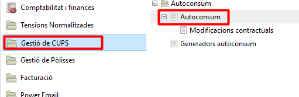
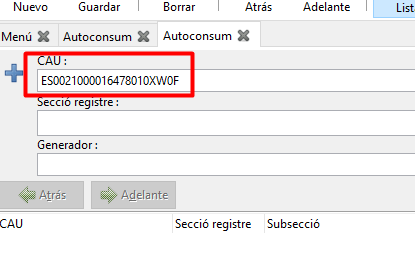
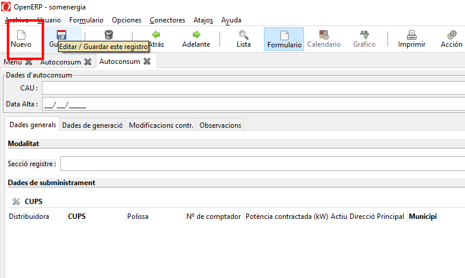
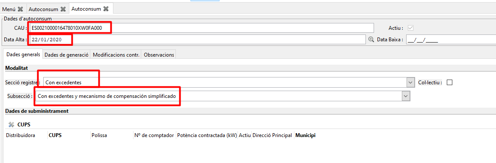
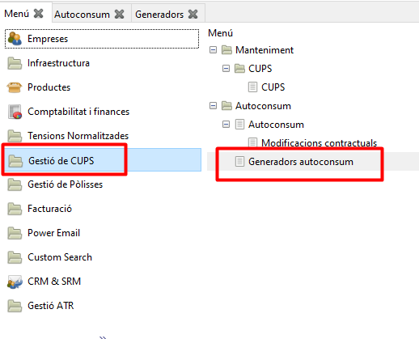
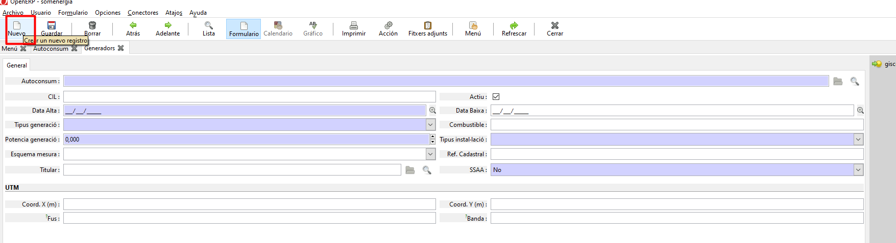
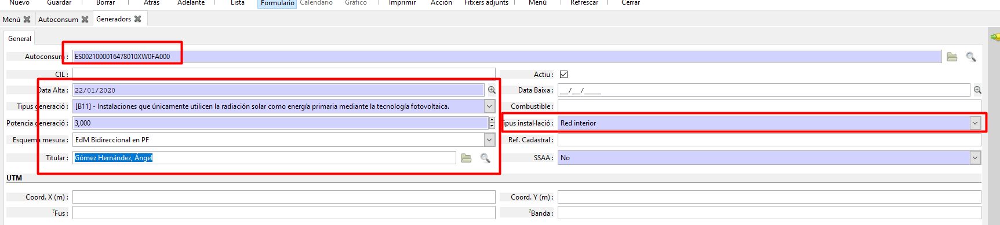
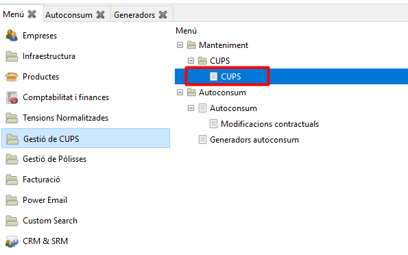
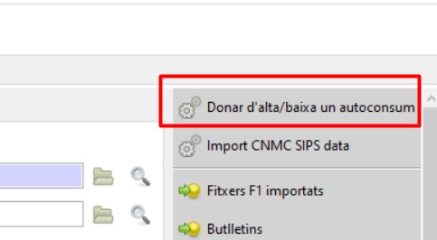

# **Generació fitxes autoconsum**
## **La fitxa autoconsum**

La fitxa d'autoconsum es genera en esborrany quan generem el M1 01
d'autoconsum i s'activarà amb el M1 05.

En alguns casos aquesta fitxa no es fa automàticament i cal crear la fitxa
d'autoconsum, el generador i associar el generador al CUPS manualment:
Anar a Menú de l'ERP a l'apartat d'autoconsum:

Fer una primera cerca amb el CUPS a l'espai de CAU per cercar si ja està creat o no.

Si no està creat hem de crear un de nou, “Nuevo” i omplir els següents camps:

A la data d'alta posarem la data que indica l'xml i a la resta de camps igualment.
Si es tracta d'una fitxa d'autoconsum que estem creant per un canvi de comercialitzadora amb autoconsum com data d'alta, farem constar la data d'activació del contracte amb nosaltres. La modalitat l'escollirem segons el camp TipoAutoconsumo del CX 05. 

Si és 41 és que té excedents, no col·lectiu i subsecció Con excedentes y mecanismo de compensación simplificado. Haurem de demanar les dades de la seva instal·lació.

Un cop desat, la fitxa queda en esborrany. Quan s'activa la Cx 05 o la
M1 05 la fitxa ja s'activarà amb la data del 05.
Només activem manualment les fitxes d'auto en casos que no hi hagi cas
ATR. 

**Generador**

Un cop creada la fitxa cal crear el "Generador". Anar al mateix apartat d'autoconsum a la secció "Generadors autoconsum".

Creem un “nuevo” i omplim els diferents camps de les següents imatges.

Autoconsum: el CAU del xml D1 01

Tipus instal·lació:

### 01 - Red interior
### 02 - Red interior de varios consumidores (instalación de enlace)
### 03 - Próxima a través de red

Esquema mesura:

### A - EdM Bidireccional en PF
### B - EdM Bidireccional en PF y EdM gen. Neta
### C - EdM Consumo Total y EdM bidireccional gen. Neta
### D - EdM Consumo Total y EdM gen bruta y EdM SSAA
### E - Configuración singular

És necessari també indicar la referència cadastral que ens informen a l'xml
per evitar problemes si ens indiquen modificacions sobre el mateix
generador.

## **Associació del Generador amb el CUPS**

Un cop creat el generador cal associar-ho al CUPS, perquè aparegui la
pestanya “Autoconsum” en el contracte. Anem a l'apartat de CUPS,
cerquem el CUPS que li correspon.

Donem d'alta l'autoconsum des de CUPS -> Acció -> "Donar d'alta/baixa
un autoconsum".

S'activarà amb el M 05 d'autoconsum (Si és un canvi de comercialitzadora
no es crearà la M 05).

Si s'ha produït un error i la fitxa d'autoconsum no és correcta, possiblement perquè el titular ens ha indicat malament les dades d'auto o per error en el registre, només hem de desvincular el CAU del CUPS fent la mateixa acció, però indicant la data de baixa.
Recomanem revisar que la data de baixa no sigui igual o posterior a la data d'activació del cas ATR que volem activar (Cx05, D101, etc…). La data de baixa sempre haurà de ser anterior al cas que vulguem activar.