El document de referència dels TI serà el document
[2015-13488](https://www.boe.es/diario_boe/verifica.php?c=BOE-A-2015-13488&acc=Verificar)

# Índex
1. [TIs de Línies d’Alta Tensió](#1-tis-de-linies-dalta-tensio)
2. [TIs de Línies de Baixa Tensió](#2-tis-de-linies-de-baixa-tensio)
3. [TIs de Centres Transformadors](#3-tis-de-centres-transformadors)
4. [TIs de Subestacions](#4-subestacions)
5. [TIs de Posicions](#5-tis-de-posicions)
6. [TIs de Màquines](#6-tis-de-maquines)
7. [TIs de cel·les i elements de tall (fiabilitat)](#7-tis-de-celles-i-elements-de-tall-fiabilitat)

!!! Note
    Quan el sistema no pogui assignar un TI a la instal·lació
    deixarà **en blanc** el camp.

    El **TI-000 no s’assignarà mai de forma automàtica** i es reserva
    per què l’usuari l’assigni a un element i premi la tecla “**Bloquear TI**”

!!! Note
    S’han detectat alguns TIs sospitosos ja que no segueixen
    el mateix ordre que la resta, són els següents:

    TI-AUY,TI-AUX,TI-AUZ    
    TI-AVY,TI-AVX,TI-AVZ    
    TI-17UY,TI-17UX,TI-17UZ    
    TI-17VY,TI-17VX,TI-17VZ

    Tot i que possiblement siguin errors tipogràfics,
    **s’han implementat com estan al BOE**.

!!! Note
    El **TI-100U** no indica si és intempèrie, interior o mòbil.
    S’ha suposat que és **interior** a partir del patró
    que segueixen la resta de les posicions híbrides.

!!! Note
    S’ha detectat una incoherència dels següents TIs en la documentació:

    TI-157U i TI-158U: Tenen les **mateixes** característiques per a **diferents** TIs
    TI-158V i TI-158V: Tenen les **mateixes** característiques per a **diferents** TIs

    Davant aquesta incoherència en la documentació,
    **s’ha decidit utilitzar els TIs 158U i 158V**
    **en comptes dels 157U i 157V**.

!!! Note
    Ara trobem 2 valors per al TI:

    - CNMC Tipus Instal·lació: el valor que s’ha entrat manualment
    - Tipologia CNMC: el que recalcula el ERP

    Per a generar els formularis de moment agafem el valor "Tipologia CNMC"

    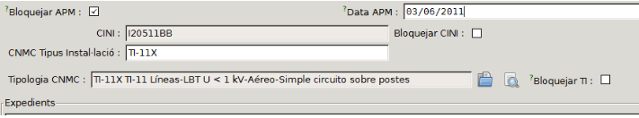

    Està previst que més endavant desapareixi el camp
    “CNMC Tipus Instal·lació” i únicament es mostri el calculat per l’ERP.

# 1. TIs de Línies d’Alta Tensió
Per calcular els TI’s de les línies d’Alta tensió es consulten els següents camps:

- **Tensió**: S’obté del camp “**Tensió màxima de disseny**”
  del tram d’Alta Tensió.

      

    - Si el camp de la “**Tensió màxima de disseny**” del tram d’AT
      és buit o zero, s’obté del camp “**Tensió**” de la
      **línia d’Alta Tensió** associada al tram d’AT:

  

  

- **Número de conductors**: s’obté del camp “**Conductors**”
  del tram d’Alta Tensió.    
	Aquest camp pren tres valors possibles:

    - **Simplex** = 1
    - **Dúplex** = 2
    - **Tríplex** = 3

  

- **Número de circuits**: s’obté del camp “**Circuits**” del tram d’Alta Tensió.

  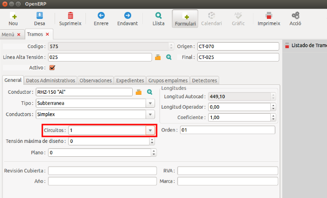

- **Secció**: s’obté del camp “**Secció**”
  del **conductor** associat al tram d’Alta Tensió.

  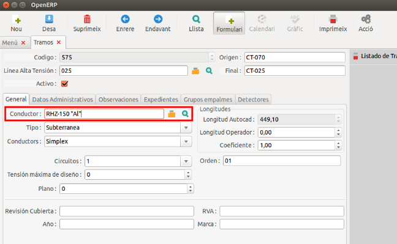

  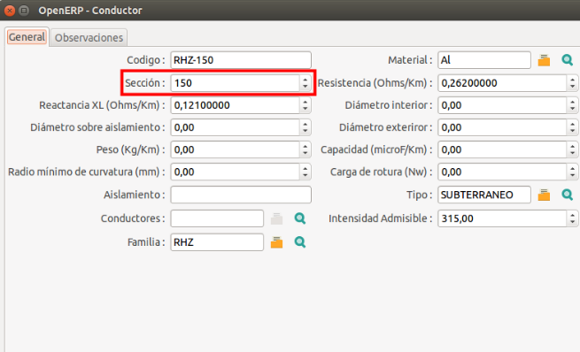

- **Estesa**: s’obté del valor del camp “**Tipus**” del tram d’Alta Tensió.
  Pren els valors **Subterrani** o **Aeri**:

    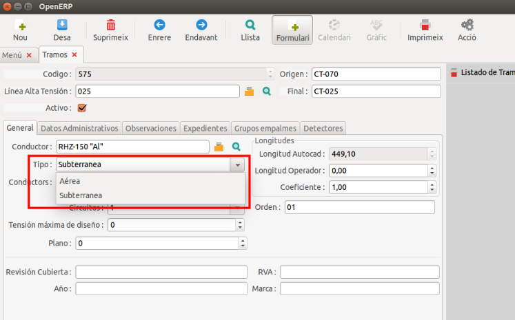

# 2. TIs de Línies de Baixa Tensió
Per calcular els TI’s de les línies de Baixa tensió
es consulten els següents camps:

- **Tensió**: s’obté del camp “**Voltatge**” de l’element de Baixa Tensió.

    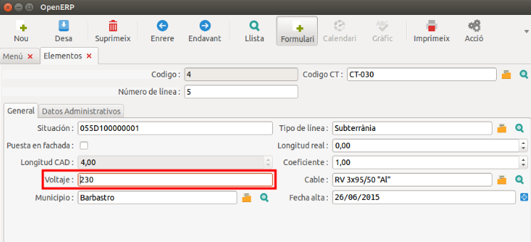

- **Número de conductors**: té un valor fixe de **1**.
- **Número de circuits**: té un valor fixe de **1**.
- **Secció**: s’obté del camp “**Secció**”
  del **cable** associat a l’element de Baixa Tensió.

    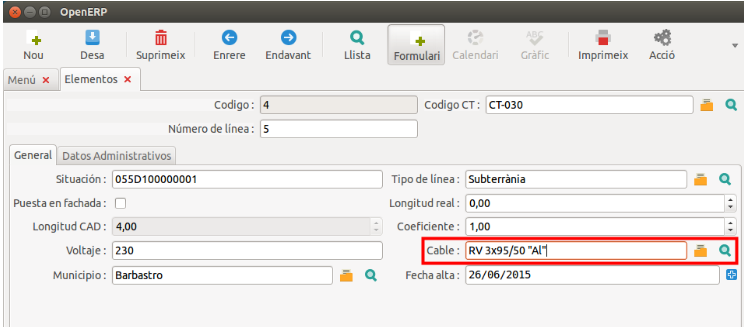

    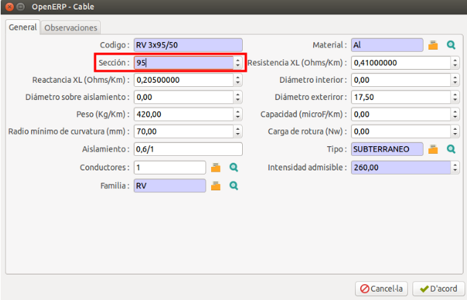

- **Estesa**: S’obté del camp “**Tipus de línia**” de l’element de Baixa Tensió.

    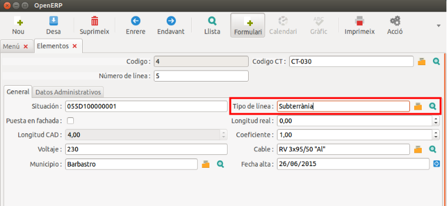

# 3. TIs de Centres Transformadors
Per calcular els TI’s dels CTs es consulten els següents camps:

- **Tensió**: S’obté del camp “**Tensió primari**” del centre transformador.

  

- **Número de màquines**: es compta el número de transformadors associats al CT.
- **Potència**: es realitza el sumatori de la potència dels
  transformadors **en funcionament** associats al CT.

    Es consideren en funcionament tots els transformadors
    que tenen codi d’estat = **1**.

- **Situació**: S’obté del “**Codi**” de la “**Categoria CNE**”
  del camp “**Tipus**” del CT.

    

    

    

    El codi pren un dels següents valors:

    - **C** = Caseta
    - **L** = Local
    - **I** = Intempèrie
    - **S** = Subterrani

## 4. Subestacions
Encara que en el ERP existeix el camp per a completar el TI,
no es contempla perquè:

  - En l’Inventari de la 4666, formulari 3:
    - No es sol·licita aquesta informació.
- 4707 no es sol·licita
- 4/2015 no es sol·licita
- En les taules de TI’s tampoc hi surt cap valor de TI
  que compleixi per a Subestacions.

# 5. TIs de Posicions
Per calcular els TI’s de les posicions es consulten els següents camps:

- **Tensió**: s’obté de la “**Tensió a aplicar**”
  del camp “**Tensió**” de la posició.

  

  

- **Situació**: s’obté a partir de la “**Categoria CNE**” del
  “**Tipus**” de la “**Subestació**” associada a la posició.

    Es considerarà una posició **interior** si la categoria CNE
    pren un dels següents valors:

    - **L**
    - **C**
    - **S**

    Per altra banda, si el codi CNE = **I** es considerarà **intempèrie**.

  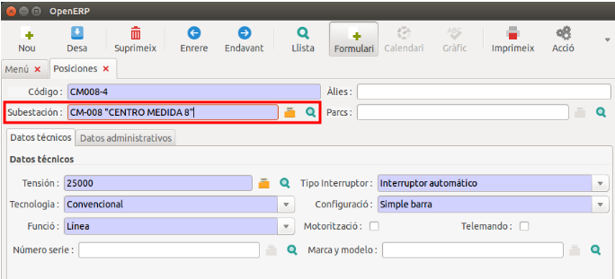

  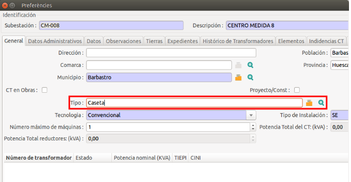

  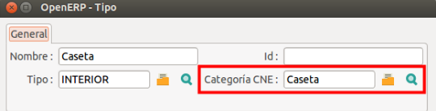

  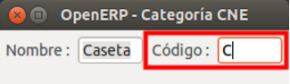

- **Tipus**: s’obté del camp “**Tecnologia**” de la posició.

  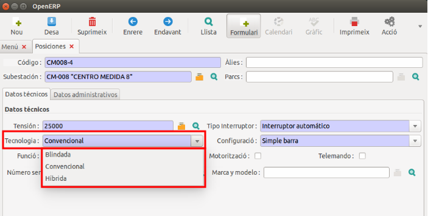

# 6. TIs de Màquines
En aquest apartat s’inclouen els transformadors de subsestació,
de reserva i móbils.    
Formulari 5 de la [4666](adm-pub/resoluciones/4666.md#inventari-4666).

Els TI’s de les màquines de Reserva, seràn sempre TI-000.

- Bloquejar el TI
- Entrar el valor TI-000 del desplegable

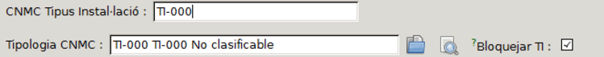

Per calcular els TI’s de les màquines de subestació
es consulten els següents camps:

- **Tensió primària**: Per la connexió **activa (connectada)**
  del transformador efectúa les següents comprovacions:

    - Si la connexió P2 és **connectada**, la **tensió primària = (V) P2**
    - Per altra banda, la **tensió primària = (V) P1**

    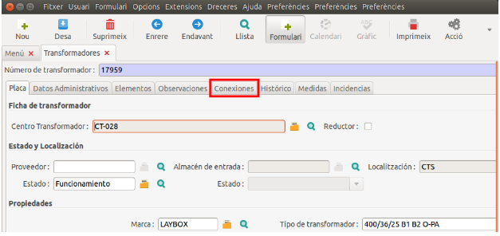

    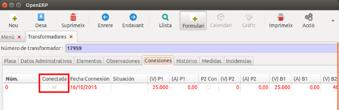

    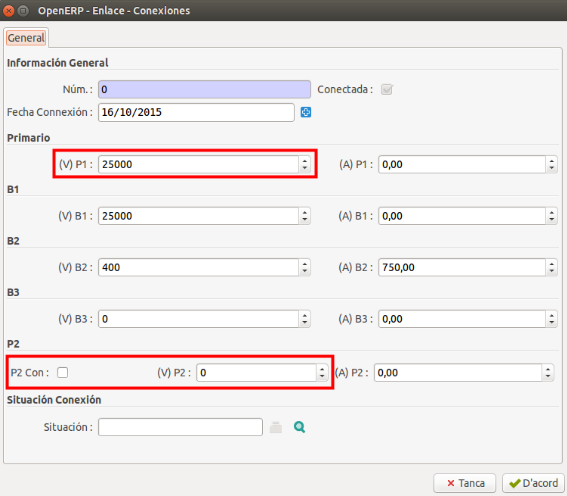

- **Tensió secundària**: Per la connexió **activa (connectada)**,
  obté el valor màxim d’entre els camps **(V) B1, (V) B2 i (V) B3**.

    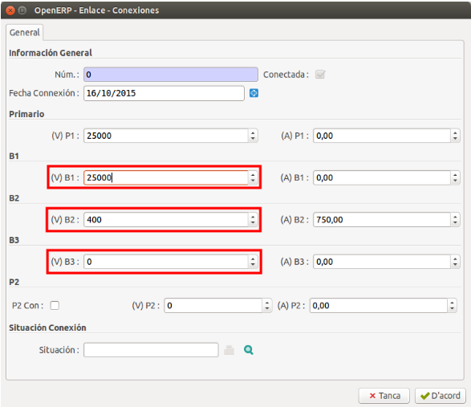

# 7. TIs de cel·les i elements de tall (fiabilitat)
Per tal de poder fer l’assignació dels TIs de fiabilitat,
a les cel·les i elements de tall s’ha creat un
**camp addicional** als **tipus d’element**. Per accedir,
cal entrar al menú del ERP a _Centres Transformadors → Manteniment →_
_Cel·les i elements de tall → Configuració → Tipus element_ :

!!! Note
    Al ser personalitzable, cal tenir en compte de no barrejar conceptes.
    Error freqüent: el CINI de fusible ha de tenir un TI de fusible.

Aquests tipus d’element **es poden modificar**. Per tant, per calcular
els TI’s de les cel·les i elements de tall es consulten els següents camps:

- **Tipus d’element**: s’obté del codi TI **configurat prèviament**
  (veure taula anterior) equivalent al tipus d’element seleccionat a la cel·la:

    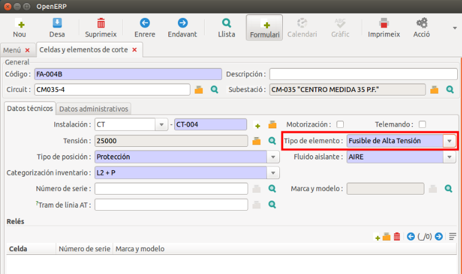

    En aquest exemple, el **codi TI** equivalent a
    **Fusible de Alta Tensión = TI-181 Seccionador Fusible (XS-SXS)**

!!! Note
    Si el TI calculat és el **TI-187** i té activada la opció
    de **telemando** s’assignarà el **TI-187A**
