# Documentació de les funcionalitats per CNE

## Liquidacions per la CNE

### Generació de les liquidacions per la CNE

Per tal de generar les liquidacions per la CNE utilitzarem l'assistent que es troba
en el menú principial de **Liquidacions**:

_"Liquidacions > Generar liquidacions a partir de les factures"_

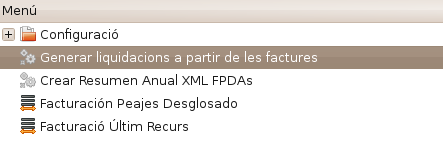

En executar aquest asssistent es mostrarà una finestra on hem d'escollir el període
pel qual volem generar la liquidació de la CNE.

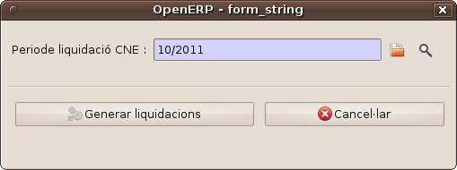

Apretem el botó **Generar liquidacions** i ens esperem a que finalitzi el càlcul.

!!! note
    Pot ser que el programa es bloquegi, segons el número de factures que estiguin
    incloses en el període de liquidació seleccionat. Veurem que el botó es queda
    _clavat_, ens hem d'esperar que finalitzi l'operació.

!!! tip   
    Si volem continuar treballant, podem obrir un altre client de l'ERP i continuar
    fent feina.

En el cas que ja hi haguessin línies de liquidació entrades en el període seleccionat i
aquest període de liquidació es trobés en estat **esborrany** el programa ens
avisaria que ja conté línies i si les volem eliminar.

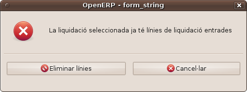

És una situació normal, quan es vol re-generar la liquidació ja sigui perquè s'han refet
algunes factures o s'ha corretgit algun error.

Un cop realitzada l'operació de les liquidacions se'ns mostrarà un diàleg
anunciant que l'operació s'ha realitzat correctament.

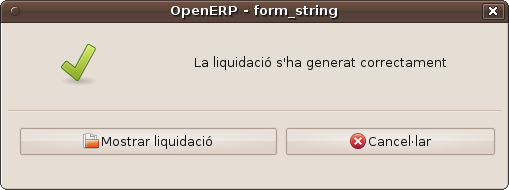

A través del botó **Mostrar liquidació** se'ns obrirà una pestanya nova amb la liquidació generada.

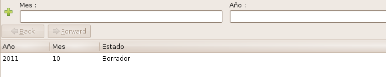

Podem fer doble clic sobre la liquidació generada i això ens obrirà la liquidació en
mode formulari.

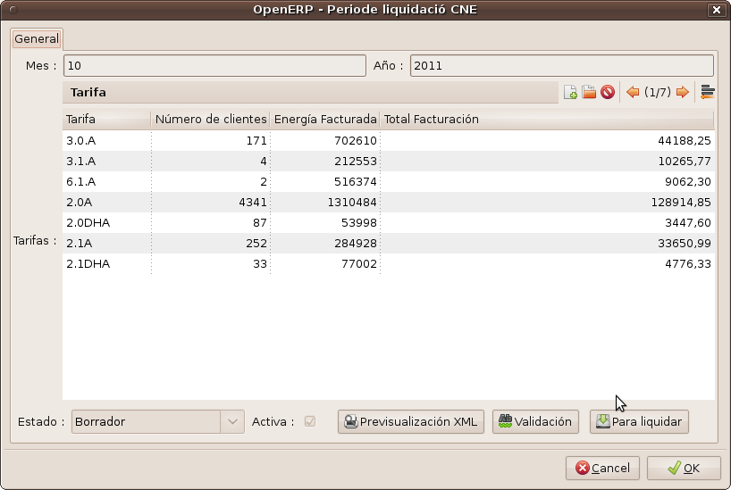

Podem imprimir la liquidació a PDF mitjançant el botó _Imprimir_ o la opció
_Liquidació_ al menú de la dreta un cop dins la liquidació

### Exportació de liquidacions a CSV

GISCE-ERP també permet exportar les liquidacions mitjançant un fitxer CSV. Per
fer-ho, podem seleccionar una liquidació i prèmer al botó _Acció_ o la opció
_Exportar Liquidació (CSV)_ del menú de la dreta un cop dins la liquidació. Se'ns obrirà
l'assistent que permetrà descarregar-nos el fitxer CSV generat.

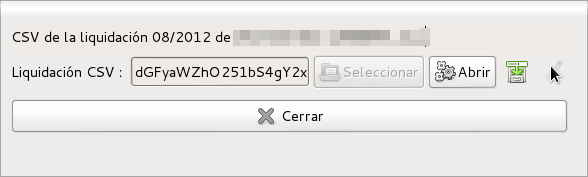

!!! note
    El Fitxer s'anomenarà automàticament amb el format
    **liquidacio_RRRR_YYYYMM.csv** on _RRRR_ és el codi de referència de la
    distribuidora i _YYYYMM_ l'any i mes de la liquidació.

!!! note
    El fitxer CSV generat separa els camps per punt i coma (**;**) i pels valors numèrics
    utilitza el punt (**.**) com a separador de decimals.

### Com es generen els càlculs de la liquidació

* **Factures normals**:

    Les factures normals generades a través d'un lot s'assignen al mateix període de liquidació que
    correspon al lot de facturació. Així doncs el lot de facturació 10/2011 es correspon amb el
    període de liquidació 10/2011.

* **Factures rectificadores/anul·ladores**:

    Quan es rectifica/anul·la una factura es demana en quin període de liquidació es vol assignar el
    resultat d'anul·lar rectificar. S'ha de tenir en compte que les anul·ladores comptaran en negatiu,
    per tant s'ha de vigilar on s'assignen les factures recitificadores/anul·ladores per tal que no surti
    un total negatiu.

### Localitzar factures segons els període de liquidació

Podem filtrar les factures segons el perídode de liquidació al llistat de factures generals, clicant
sobre el més per ampliar els paràmetres de filtratge i filtrant pel període de liquidació.

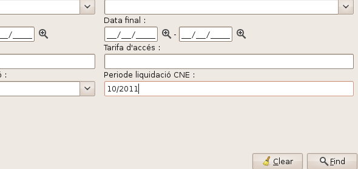

Podem veure en una factura el període de liquidació assignat a la pestanaya **Energia**.

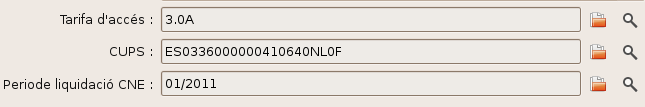

## Càlcul de les quotes per la CNE

Per tal de calcular les quotes que hem de presentar mensualment a la CNE ho
podem fer a través del menú **Administració Pública > CNE > Facturació >
Calcular quotes CNE**

Hem de seleccionar quin període volem generar les quotes.

Si en el període que ens trobem hi ha hagut un canvi de quotes per part de la
CNE, podem introduïr en l'assistent la data de canvi de les quotes en el
camp **data de tall**, d'aquesta forma el programa ja repartirà tant
l'energía com els euros facturats. La data de tall està inclosa en el segon
període per tant ha de ser la data en que s'apliquen els nous percentatges.

El la següent imatge es mostra un exemple on hi ha hagut un canvi en el dia
03/08/2013, per tant, aquesta és la data que hem de posar en el camp **data
de tall** i un cop calculat el resultat ens mostrarà els valors que hem
d'introduïr a la web de la CNE.

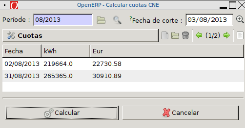

## Documentació del Assistent de Generació d'Informes Georeferenciats de la CNE

### Generació de fitxers georeferenciats per CNE segons Circular 1/2012 des de GISCE-ERP

#### Introducció:

En aquest document es detallen els camps que s'incorporen als informes georeferenciats F4,F5-AT,F5-BT y F7
segons la circular 1/2012 de la CNE respecte als sol·licitats l'any 2011 i en relació a la informació
gestionada mitjançant Gisce-ERP

#### F4 (Centres transformadors)

Els Centres transformadors que apareixen en aquest informe han de cumplir els següents requisits:

* Que el **tipus d'instal·lació** no sigui ni _Sub Estació_ (SE) ni _Central de producció Hidràulica_ (CH)

A més a més:

* El CT ha de tenir definit el **vèrtex**, el **municipi**, el **node** y la **categoria de la cne**.

**_Formulari de CTS amb camps per F4 georef CNE 2012_**
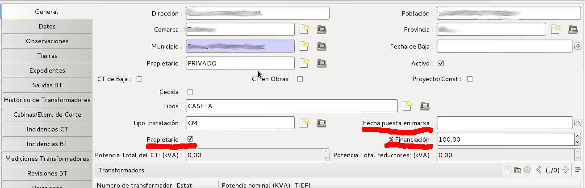

Aquest informe incorpora els següents camps:

* **Data de posada en marxa**:

	Indica a quina data es va posar en servei el centre transformador.
	S'utiliza el camp ja existent  “_Data posada en marxa_” de la fitxa del CT en qüestió.
	Si aquest camp està buit, s'utiliza la data “_Data Indústria_” de l'últim expedient rel·lacionat amb
	el ct, es a dir, el de “_Data indústria_” més recent que se pot visualizar a la pestanya d'Expedients.
	Si no se n'hi troba cap es deixa buit.

* **Propietari**:

	Indica si l'empresa distribuïdora és propietaria del centre transformador.
	S'utiliza el nou camp “_Propietari_” de la fitxa del CT en qüestió.
	Si està marcat, es considera que es propietat de l'empresa distribuïdora.
	Per defecte, s'ha marcat aquest camp, de manera que tots els CT’s són propietat de la distribuïdora.

* **% de Finançament**

	Indica quin és el percentatge de finançament de l'empresa distribuïdora en la construcció del CT.
	S'utiliza el nou camp “_% Finançament_” de la fitxa de CT’s.
	Per defecte s'ha omplert aquest camp al 100 %.

#### F5-AT (Línies d'Alta Tensió)

Els trams de línia que apareixen en aquest informe han de cumplir els següents requisits:

* El **nom** de la línia diferent de _1_

A més a més:

* El tram ha de tenir el **cable** i el **tipus de línia** correctament informat

**_Formulari de Línies d'Alta amb camps per F5-AT georef CNE 2012_**
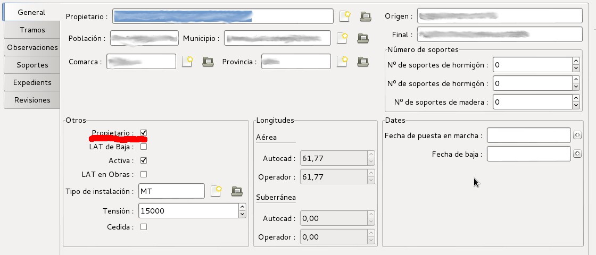

**_Formulari de Trams d'Alta amb camps per F5-AT georef CNE 2012_**
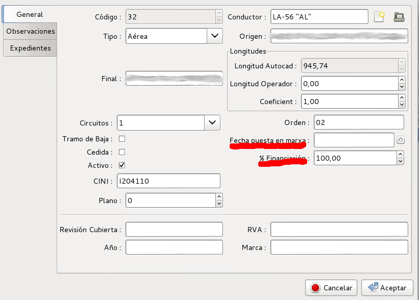

Aquest informe incorpora els següents camps en el formulari de Trams AT:

* **Data de posada en marxa**:

	Indica a quina data es va posar en servei el tram d'alta tensió.
	S'utiliza el nou camp “_Data posada en marxa_” de la fitxa del Tram d'alta en qüestió.
	Si aquest camp està buit, s'utiliza la data “_Data d'autorització d'Indústria_” de l'expedient més recent rel·lacionat amb
	la línia d'Alta, és a dir, el de “_Data indústria_” més recent que se pot visualizar a la pestanya Expedients.
	Si no se n'hi troba cap es deixa buit.

* **Propietari**:

	Indica si l'empresa distribuïdora és propietaria de la línia.
	S'utiliza el camp ja existent “_Propietari_” de la fitxa de la Línia en qüestió.
	Si està marcat, es considera que és propietat de l'empresa distribuïdora.

* **% de Finançament**

	Indica quin és el percentatge de finançament de l'empresa distribuïdora en la construcció del tram de línia.
	S'utiliza el nou camp “_% Finançament_” de la fitxa del tram d'alta en qüestió.
	Per defecte s'ha omplert aquest camp al 100 %.

#### F5-BT (Línies de Baixa Tensió)

Els trams de línia que apareixen en aquest informe han de cumplir els següents requisits:

* No estar de **baixa** i que el **tipus de cable** no sigui _Embarrat_ (E)

A més a més:

* El tram ha de tenir el **cable** i el **tipus de línea** correctament informat

Aquest informe incorpora els següents camps:

**_Formulari de Trams de Baixa amb camps per F5-BT georef CNE 2012_**
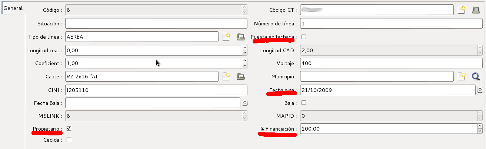

* **Data de posada en marxa**:

	Indica a quina data es va posar en servei el tram de baixa tensió.
	S'utiliza el camp ja existent  “_Data posada en marxa_” de la fitxa de l'Element en qüestió.
	Si no se n'hi troba cap es deixa buit.

* **Propietari**:

	Indica si l'empresa distribuïdora és propietaria de la línia.
	S'utiliza el nou camp “_Propietari_” de la fitxa de l'Element en qüestió.
	Si està marcat, es considera que és propietat de l'empresa distribuïdora.
	Per defecte, s'ha marcat aquest camp, de manera que tots els Trams són propietat de la distribuïdora.

* **% de Finançament**:

	Indica quin és el percentatge de finançament de l'empresa distribuïdora en la construcció del tram de línia.
	S'utiliza el nou camp “_% Finançament_” de la fitxa del tram d'alta en qüestió.
	Per defecte s'ha omplert aquest camp al 100 %.

* **Altres**:

	S'ha incorporat el nou camp “_Posat a façana_” per facilitar en el futur el càlcul del CINI,
	ja que a la seva codificació s'ha de tenir en compte si el tram de línia és sobre pals o penjat de façana.

#### F7 (CUPS)

Els CUPS que apareixen en aquest informe són **tots** els que estan actius

Aquest informe incorpora els següents camps:

**_Formulari de CUPS amb camps per F7 georef CNE 2012_**
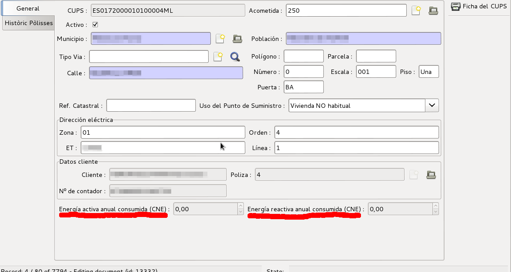

* **Energia activa anual consumida**:

	Indica el consum d'energia activa del CUPS durant l'any anterior.
	Es mostra aquest camp a la fitxa del CUPS en qüestió.
	Es pot omplir amb un procés automàtic si Gisce-ERP incorpora el mòdul de facturació
	o mitjançant la càrrega d'un fitxer CSV especialment preparat extret del sistema de facturació.

* **Energia reactiva anual consumida**

	Indica el consum d'energia reactiva del CUPS durant l'any anterior.
	Es mostra aquest camp a la fitxa del CUPS en qüestió.
	Es pot omplir amb un procés automàtic si Gisce-ERP incorpora el mòdul de facturació
	o mitjançant la càrrega d'un fitxer CSV especialment preparat extret del sistema de facturació.

* **Tensió**

	Indica la tensió assignada al CUPS.
	Per fer-ho, s'utiliza el camp "_Tensió_" de la línia de baixa que alimenta la escomesa associada al CUPS.

* **Equip de mesura**

	Indica quin tipus d'equip de mesura té el CUPS.
	En aquest moment se consideren tots "_Electromecánics_" (MEC). Es marquen com “_Contracte no actiu_” (CNA)
	els que no tenen una pòlissa activa associada

#### F8 (Règim Especial)

Aquest informe incorpora **tots** els CUPS que pertanyen a les instal·lacions de Règim Especial actives.
Destacar els següents camps de l'informe:

* **Energia anual consumida**

    Talment com en l'informe F7, aquest inclou les energies activa i reactiva anual consumides (camps 10 i 11 respectivament).
    Aquestes s'obtenen del formulari del CUPS. Veure imatge `F7 CUPS`.

* **Potència instal·lada**

    La potència instal·lada (9è camp del document) es pren del valor de potència nominal de la instal·lació de Règim Especial.

**_Formulari de Règim Especial amb camps per F8 georef CNE 2012_**
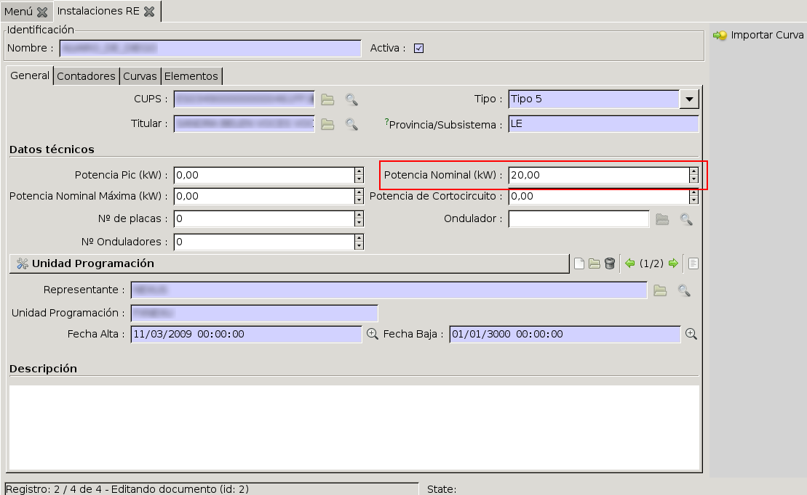

### Assistent de generació de fitxers georeferenciats per CNE segons Circular 1/2012 des de GISCE-ERP

#### Introducció:

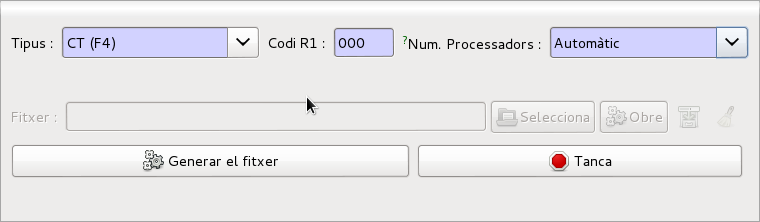

Els informes georeferenciats de la CNE es generen a partir de la informació emmagatzemada a
Gisce-ERP mitjançant una sèrie d'scripts de python. A més a més dels scripts que generen els
informes hi ha altres scripts que els complementen per omplir dades rellevants de fonts
externes que no es poden calcular automàticament utilitzant les dades de Gisce-ERP. Tots aquests
scripts s'engloben dins el projecte `georef` allotjat al `github de Gisce`.

Per permetre la generació dels informes des de Gisce-ERP s'ha desenvolupat un Assistent
específic. Aquest Assistent el trobareu a **Administració Pública -> CNE -> Generar informes georeferenciació**

Es poden generar els següents fitxers georefereniats de la CNE:

* **F1**: _Subestacions_. Posicions amb interruptor. _(SE)_
* **F1bis**: _Subestacions_. Posicions sense interruptor. _(SEbis)_
* **F4**: Centres transformadors _(CT)_
* **F5-AT**: Línies d'alta tensió _(LAT)_
* **F5-BT**: Línies de baixa tensió _(LBT)_
* **F7**: CUPS _(CUPS)_
* **F8**: Règim Especial _(RE)_

!!! note
    En el cas de les subestacions:
    La generació dels fitxers **F1** i **F1bis** només estarà disponible en aquelles
    instal·lacions que disposin del mòdul de Subestacions

### Característiques generals:

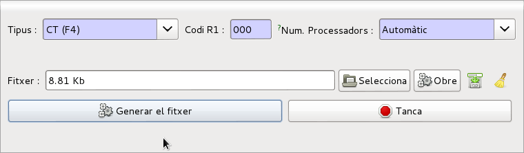

El Assistent està format per un sol formulari amb dos estats, _fitxer no generat_ i _fitxer generat_.
Els camps imprescindibles per qualsevol fitxer són:

* **Tipus**: Especifica l'informe que es vol generar
* **Codi R1**: Codi de l'empresa distribuidora segons circular 1/2012 de la CNE
* **Num. Processadors**: Numero de processos que utilitzarem per la generació del fitxer.

!!! note
    La generació de fitxers utilitza processos independents amb capacitat de
    multiprocés per accelerar-ne la generació.

!!! tip
    El número de processos afecta a la velocitat de la generació del fitxer,
    però també als recursos del servidor utilitzats. Normalment, el valor per
    defecte **Automàtic** és una bona opció no obstant, en servidors compartits
    i en moments de molta càrrega, pot ésser convenient utilitzar menys
    processos.

Les accions que es poden realizar es realitzen prement el botó corresponent:

* **Generar Fitxer**: Genera el fitxer seleccionat en el desplegable _Tipus_
* **Tanca**: Tanca el Assistent

El fitxer resultant es pot descarregar i veure en el camp **Fitxer** (fitxer generat)

* **Input de text**: Mostra la mida del fitxer
* **Botó seleccionar**: No té funcionaliat
* **Obrir**: Obre el fitxer a l'editor de textes
*  : Descarrega el fitxer
*  : Esborra l'accés al fitxer generat

Quan es descarrega el fitxer, el nom que es proposa per guardar ja és el nom recomanat per
la circular de la CNE:

* **YYYY**: Any de generació de l'informe
* **FN**: Número d'informe
* **RRR**: Codi R1 de la distribuidora

> `RR_YYYY_FN_R1-RRR.txt`

P.e:

> `RR_2011_F4_R1-000.txt`

### Càrrega d'energies per F7 (CUPS)

Per la generació de l'informe F7 (CUPS) es necessita el consum d'energia activa i reactiva
de l'any anterior. Aquesta informació es pot calcular mitjançant Gisce-ERP si inclou el mòdul de
facturació.
En cas contrari, es pot carregar aquesta informació mitjançant un fitxer CSV
conveninentment preparat extret del sistema extern de facturació.

Quan es selecciona l'informe F7, apareix automàticament un nou component del formulari en funció de
si Gisce-ERP té el mòdul de facturació o no.

#### Gisce-ERP amb facturació. Recàlcul de energia anual

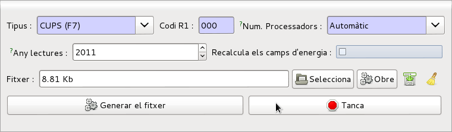

Apareixen dos camps nous:

* **Any lectures**:
  Any del qual es calcularan els consums. Per defecte any anterior a l'any en curs.
* **Recalcula camps energia**:
  Si es marca aquest ''checkbox'' s'omplen els camps d'energia abans de la generació del fitxer utilitzant les factures de l'any seleccionat

!!! note
    Un cop calculades les energies, no fa falta tornar a seleccionar el camp en successives generacions
    del fitxer, ja que les dades queden emmagatzemades permanentment.

#### Gisce-ERP sense facturació. Càrrega energies anuals

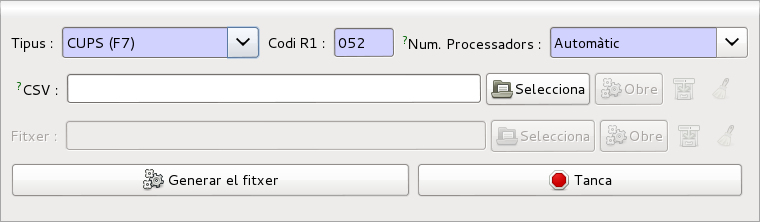

Apareix un nou camp de tipus fitxer **CSV**.

* **Botó seleccionar**: Ens permet escollir el fitxer CSV amb els consums

El fitxer CSV ha de contenir una línia per CUPS amb els camps separats per '**;**'
, en aquest ordre:

* Els 20 primers caracters del CUPS
* Energia Activa consumida durant l'any anterior en kWh
* Energia Reactiva consumida durant l'any anterior en kWh

Els decimals es separaran per punts, p.e. 5.4

Un exemple:

> `ES0999000000123456KH;103.4;12.03`

> `ES0999000000234567LM;23.4;0`

> `...`

!!! note
    Un cop carregades les energies mitjançant CSV, no fa falta tornar-les a carregar en
    successives generacions del fitxer, ja que les dades queden emmagatzemades permanentment.

!!! note

    Link al repositori del projecte georef

    https://github.com/gisce/georef

### Càrrega d'energies per F8 (CUPS)

En aquest moment únicament hi ha disponible la opció d'importar les energies dels CUPS de Règim Especial
a través de la càrrega d'energies anuals amb CSV. Tal i com pot fer-se amb els F7.
