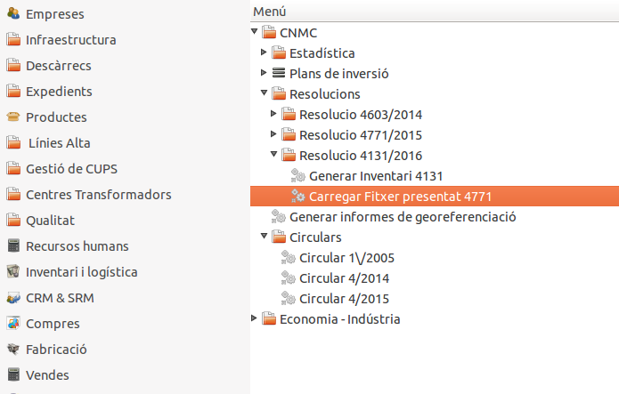
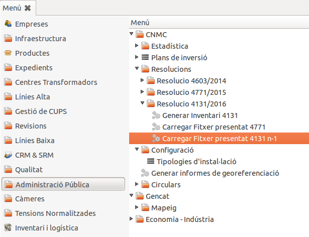
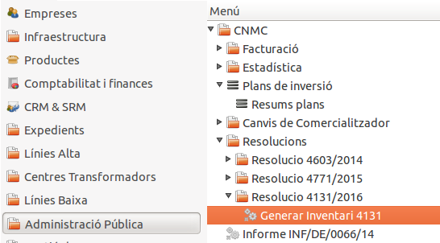
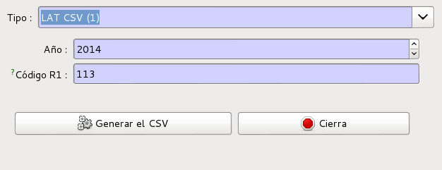

# Documentació dels mòduls de dins de CNMC

Continguts:

* [INF/DE/0066/44](#modul-per-generar-el-fixer-csv-segons-cnmc-infde006644-per-distribuidora)
* [Circular 1/2005](#circular-12005)
* [Circular 4/2014](#circular-42014)
* [Circular 4/2015](#circular-42015)
* [Circular 2/2016](#generacio-de-informes-sobre-reclamacions-de-consumidors)
* [Inventari 4131](#inventari-4131)


## Mòdul per generar el fixer CSV segons CNMC INF/DE/0066/44 per distribuïdora

### Introducció

Per poder fer una auditoria de canvis de comercialitzadora, la CNMC demana un
CSV amb el format definit a INF/DE/0066/14

### Generació

Per generar el fitxer, hem d'executar l'assistent que trobarem a
**Administració pública > CNMC > Informe INF/DE/0066/14**


Només caldrà introduïr l'any del qual es vol fer l'informe, que per defecte ja
és 2013 i prèmer el botó **Exportar**.

Des de **Fitxer** es podrà obrie el CSV i descarregar-lo a disc


### Dades utilitzades

Per omplir el fitxer es tenen en compte totes les pólisses creades dins l'any
escollit que tinguin la corresponent modificació contractual de tipus `alta`.

Així doncs, el fitxer generat serà correcte si les altes a la comercialitzadora
es registren com a modificació contractual de la pòlissa de tipus `alta`
correctament.

| Nom del camp               | Valor del camp                                 |
|----------------------------|------------------------------------------------|
| **CODIGO_INFORMANTE**      | Camp `Codi R2` de la companyia                 |
| **CODIGO_CUPS**            | CUPS                                           |
| **FECHA_ACTIVACION**       | Data inici de la modificació contractual nova  |


!!! note
    Codi R2 (R2-xxx) de la CNMC gestionable en el camp `Ref2` de la fitxa de
    l'empresa comercialitzadora accessible des del menú `Empreses`

--------------------------------------------------------------------------------

## Circular 1/2005

El mòdul permet al GISCE-ERP la generació dels informes referents a la
circular 1/2005 de la CNMC. Aquests informes venen definits per la mateixa **CNMC**.

* [Anexo I: Instrucciones para completar la información solicitada en los
  formularios del Anexo II](https://sede.cnmc.gob.es/sites/default/files/2016-11/20161111_AnexoI_Circ_1_2005.pdf)
* [Anexo II: Formularios de envío de información de la  CNE](https://sede.cnmc.gob.es/sites/default/files/2016-11/20161111_AnexoII_Circ_1_2005.pdf)
* [Anexo III: Tablas Circular 1/2005](https://sede.cnmc.gob.es/sites/default/files/2016-09/AnexoIII_Circ_1_2005.xls)

## Actualment, aquest mòdul és capaç de generar els següents informes:


### **1:** Informe de sol·licituds de canvi de MR a ML i de comercialitzadora.

**Informe trimestral.**

1. Omplim el camp de la secció 'tipus de fitxer' amb el valor '1' del desplegable.
2. Omplim els camps de la secció 'periode del trimestre' amb la data inicial i
   data final del trimestre.
3. Premem el botó 'exportar' per generar l'informe.
4. Quan s'ha generat l'informe apareix la secció 'nom del fitxer' on podrem
   escollir obrir o guardar l'informe.

En l'exemple hi ha les dates per generar l'informe del primer trimestre de l'any:


* Les dades s'extreuen dels canvis de comercialitzadora en les modificacions
  contractuals entre les data inicial i data final especificades en la secció
  'periode del trimestre', quan dues modificacions contractuals consecutives
  tenen diferent comercialitzadora.
* Només es tenen en compte els canvis de comercialitzadora de 'CUR' a 'NO CUR'
  i de 'NO CUR' a 'NO CUR'.
* Les dades s'agrupen per diferent tipus de punt de mesura.


### 2NA1 Informe de sol·licituds acceptades de canvi de comercialitzadora en funció del retràs fins a la data de canvi efectiu.

**Informe trimestral.**

1. Omplim el camp de la secció 'tipus de fitxer' amb el valor '2NA1' del
   desplegable.
2. Omplim els camps de la secció 'periode del trimestre' amb la data inicial i
   data final del trimestre.
3. Premem el botó 'exportar' per generar l'informe.
4. Quan s'ha generat l'informe apareix la secció 'nom del fitxer' on podrem
   escollir obrir o guardar l'informe.

En l'exemple hi ha les dates per generar l'informe del primer trimestre de l'any:


* Les dades s'extreuen dels canvis de comercialitzadora en les modificacions
  contractuals entre les data inicial i data final especificades en la secció
  'periode del trimestre', quan dues modificacions contractuals consecutives
  tenen diferent comercialitzadora.
* Només es tenen en compte els canvis de comercialitzadora de 'CUR' a 'NO CUR',
  de 'NO CUR' a 'NO CUR' i de 'NO CUR' a 'CUR'.
* Les dades s'agrupen per diferents comercialitzadores d'entrada i sortida,
  tipus de punt de mesura i tarifa d'accés.


### 5A Informe de classifació dels consumidors en funció del número de canvis efectuats de MR a ML.

**Informe semestral.**

1. Omplim el camp de la secció 'tipus de fitxer' amb el valor '5A' del desplegable.
2. Omplim els camps de la secció 'periode del trimestre' amb la data inicial i
   data final del trimestre.
3. Premem el botó 'exportar' per generar l'informe.
4. Quan s'ha generat l'informe apareix la secció 'nom del fitxer' on podrem
   escollir obrir o guardar l'informe.

En l'exemple hi ha les dates per generar l'informe del primer semestre de l'any:


* Les dades s'extreuen dels canvis de comercialitzadora en les modificacions
  contractuals entre les data inicial i data final especificades en la secció
  'periode del trimestre', quan dues modificacions contractuals consecutives
  tenen diferent comercialitzadora.
* Només es tenen en comtpe els canvis de comercialitzadora de 'CUR' a 'NO CUR'.
* Les dades s'agrupen per diferent tipus de punt de mesura.


### 5B Informe de classifació dels consumidors en funció del número de canvis efectuats de comercialitzadora.

**Informe semestral.**

1. Omplim el camp de la secció 'tipus de fitxer' amb el valor '5B' del desplegable.
2. Omplim els camps de la secció 'periode del trimestre' amb la data inicial i
   data final del trimestre.
3. Premem el botó 'exportar' per generar l'informe.
4. Quan s'ha generat l'informe apareix la secció 'nom del fitxer' on podrem
   escollir obrir o guardar l'informe.

En l'exemple hi ha les dates per generar l'informe del primer semestre de l'any:


* Les dades s'extreuen dels canvis de comercialitzadora en les modificacions
  contractuals entre les data inicial i data final especificades en la secció
  'periode del trimestre', quan dues modificacions contractuals consecutives
  tenen diferent comercialitzadora.
* Només es tenen en compte els canvis de comercialitzadora de 'NO CUR' a
  'NO CUR'.
* Les dades s'agrupen per diferent tipus de punt de mesura.

### 7NA Informe de classificació dels consumidors en funció del comercialitzador, tipus de punt de subministre, tipus de tarifa d'accés i la provincia on s'ubica el punt de subministrament.

**Informe trimestral.**

1. Omplim el camp de la secció 'tipus de fitxer' amb el valor '7NA' del desplegable.
2. Omplim el camp de la secció 'trimestre' amb la data final del trimestre.
3. Omplim els camps de la secció 'periode d'energia' amb la data inicial i la
   data final dels quatre últims trimestres anteriors al trimestre escollit en
   el camp de la secció 'trimestre'.
4. Premem el botó 'exportar' per generar l'informe.
5. Quan s'ha generat l'informe apareix la secció 'nom del fitxer' on podrem
   escollir obrir o guardar l'informe.

En l'exemple hi ha les dates per generar l'informe del primer trimestre de
l'any, amb els quatre últims trimestres anteriors al primer trimestre de l'any
com a periode d'energia:


* Les dades dels consumidors s'extreuen de les modificacions contractuals, on
  la data especificada a la secció 'trimestre' es troba entre les data inicial i
  data final de la modificació contractual.
* L'energia s'extreu de les factures, amb data de factura entre les data inicial
  i data final de la secció 'periode d'energia'.
* Ambdues es relacionen i s'agrupen per diferents comercialitzadores, tipus de
  punt de mesura, tarifa d'accés i provincia.

--------------------------------------------------------------------------------

## Circular 4/2014

### Introducció

Aquest mòdul genera els formularis _F1, F1bis i F11_ de la _Circular 4/2014_

!!! note
    Aquest mòdul va ser afegit a partir de la versió **v2.44** on es van afegir
    una sèrie de camps nous a la base de dades per tal de complementar la
    informació requerida en els formularis

### Nous camps a la base de dades

#### CUPS

!!! note
    Tots els camps referents a dades de la **CNMC** s'han mogut a una pestanya
    anomendada **Estadistiques** dins del formulari del CUPS.

    

S'han afegit nous camps estadístics de la CNMC:

* **Número de lectures (CNMC)**: És el número de lectures efectuades en el CUPS
  en l'any de generació de la circular.
* **Potència facturada (CNMC)**: És l'última potència facturada a aquest CUPS en
  l'any de generació de la circular.

#### Comptador

S'afegeix el codi CINI al comptador


* **Bloquejar CINI**: Un cop assignat un CINI de forma manual ens permet
  bloquejar-lo per tal d'evitar una modificació.
* **CINI**: És el codi CINI d'aquest comptador.
* **Calcular CINI (auto.)**: Aquest camp permet el càlcul del codi CINI mitjançant
  el lloguer del comptador.

!!! note
    El sistema de càlcul de CINI automàtic només està disponible utilitzant el
    mòdul de facturació de distribució de GISCE-ERP.

Es poden visualitzar tots els comptadors que no disposen de CINI entrat a través
del menú: **Infraestructura > Comptadors > Comptadors sense CINI**

**Càlcul CINI automàtic segons el lloguer**

S'ha realitzat una taula d'equivalència entre els lloguers dels comptador i els
CINIS:

Codi de lloguer |  CINI
:--------------:|:------:
   ALQ01        | I31011A
   ALQ02        | I31011B
   ALQ03        | I31011C
   ALQ04        | I31011G
   ALQ05        | I31011H
   ALQ06        | I31011D
   ALQ07        | I31011E
   ALQ08        | I31011F
   ALQ14        | I31011K
   ALQ15        | I31011L
   ALQ16        | I31011N
   ALQ17        | I31011O
   ALQ18        | I31011P
   ALQ19        | I31013P
   ALQ20        | I31013Q
    (\*)        | I31011U

(\*) L'utilitza per tota la resta que no pot identificar a través del producte
de lloguer, ja sigui perquè no el té definit o perquè no correspont a cap
codi dels anteriors.

Si el comptador té seleccionat que la propietat és de **client** es marcarà la
posició 5 del CINI automàticament amb 2.

Si es té activat el mòdul de **telegestió** GISCE-TG, es detectarà es marcarà
la posició 6 del CINI automàticament amb 3.


#### Centre transformador

Se ha añadido el campo **Número máximo de máquinas**


!!! note
    En el procés d'actualització aquest camp s'inicialitza de forma automàtica
    segons el número de transformadors instal·lats el CT. Després s'ha de
    **revisar** que el valor sigui el corresponent.


### Generació dels informes

Els informes es poden generar a través del menú: **Administració pública >
CNMC > Circulares > Circular 4/2014**

A través d'aquest assistent podem realitzar dues operacions:

1. Generar els informes
2. Actualitzar dades estadístiques de la CNMC que s'utilitzen en aquests
   informes

!!! note
    Abans de generar els informes, hem d'haver actualtizat les dades de la CNMC
    amb l'aque que volem realitzar l'informe.


#### Actualització de dades

Aquesta pestanya és diferent segons es tingui instal·lat el mòdul de facturació
de distribució de GISCE-ERP o no.

**Amb mòdul de facturació**


En el cas que el tinguem instal·lat, només ens apareix un botó per recalcular aquest
valors depenguent de l'any que tinguem introduït en la pestanya "Generador d'informes".

**Sense mòdul de facturació**


Tenim dues accions disponibles:

* **CUPS CSV**: Hem de seleccionar el fitxer CSV amb el contingut adequat per
  tal d'actualitzar els valors CNMC del CUPS i després apretar el botó
  **Actualitzar CUPS**. Veure el [format dels cups en el csv](#format-cups-csv)
* **Comptadors CSV**: Hem de seleccionar el fitxer CSV amb el contingut
  adequat per tal d'actualitzar els CINIS dels comptadors i després apretar el
  botó **Actualitzar CINIS**. Veure el [format dels comptadors en els csv](#format-comptadors-csv)


#### Generació dels informes


* **Formulari**: Ens permet seleccionar quin informe volem generar. Els
  disponibles són: F1, F1bis i F11.
* **Any del càlcul**: En quin any volem realitzar el càlcul. Aquest camp també
  ens serviex per l'actualització de dades del CUPS.
* **Codi R1**: Em d'introduïr el codi R1 de la nostra empresa, només els 3 digits.
* **Núm. Procesos**: Hem de seleccionar el número de processos que volem
  utilitzar alhora de generar l'informe.

Podem apretar el botó **Generar el ficher** per tal que comenci el procés de
generació de l'informe.

!!! note
    Depenguent de la quantitat de dades els informes poden tardar força temps
    en generar-se.

Una vegada hagi finalitzat el procés podrem descarregar l'informe geneat


--------------------------------------------------------------------------------

## Circular 4/2015

### Introducció

Aquest mòdul permet la generació dels formularis F1, F1bis, F9, F10, F11, F12,
F12bis, F13, F13bis, F13c, F14 , F15 i F20 de la Circular 4/2015.

!!! note
    Aquest mòdul va ser afegit a partir de la versió **v2.55** on es van afegir
    una sèrie de camps nous a la base de dades per tal de cumplimentar la
    informació requerida en els formularis.

### Nous camps a la base de dades: circular 4/2015

#### Transformador


S'han afegit nous camps a la fitxa de **transformadors**:

* **Pèrdues de buit**
* **Pèrdues de curtcircuit a potencia nominal**
* **Potència pic d'activa costat de baixa**
* **Potència pic de rectiva costat de baixa**
* **Energia anual circulada**

#### Cables Baixa Tensió


S'ha afegit un nou camp a la fitxa de **cables baixa tensió**:

* **Resistència**

### Generació dels informes

Els informes es poden generar a través del menú: **Administració pública >
CNMC > Circulares > Circular 4/2015**

A través d'aquest assistent podem realitzar dues operacions:

  1. Generar els informes
  2. Actualitzar dades estadístiques de la CNMC que s'utilitzen en aquests
     informes

!!! note
    Abans de generar els informes, hem d'haver actualtizat les dades de la CNMC
    amb l'aque que volem realitzar l'informe.

#### 1. Actualització de dades

Aquesta pestanya és diferent segons es tingui instal·lat el mòdul de facturació
de distribució de GISCE-ERP o no.

**Amb mòdul de facturació**


En el cas que el tinguem instal·lat, només ens apareix un botó per recalcular aquest
valors depenguent de l'any que tinguem introduït en la pestanya "Generador d'informes".

**Sense mòdul de facturació**


Tenim dues accions disponibles:

* **CUPS CSV**: Hem de seleccionar el fitxer CSV amb el contingut adequat per
  tal d'actualitzar els valors CNMC del CUPS i després apretar el botó
* **Actualitzar CUPS**. Veure el [format dels cups en el csv](#format-cups-csv)


* **Comptadors CSV**: Hem de seleccionar el fitxer CSV amb el contingut
  adequat per tal d'actualitzar els CINIS dels comptadors i després apretar el
  botó **Actualitzar CINIS**. Veure el [format dels comptadors en els csv](#format-comptadors-csv)

#### 2. Generacio dels informes


* **Formulari**: Ens permet seleccionar quin informe volem generar. Els
  disponibles són: F1, F1bis, F9, F10, F11, F12, F12bis, F13, F13bis, F13c, F14
  , F15 i F20.
* **Any del càlcul**: En quin any volem realitzar el càlcul. Aquest camp també
  ens serviex per l'actualització de dades del CUPS.
* **Codi R1**: Em d'introduïr el codi R1 de la nostra empresa, només els 3 digits.
* **Núm. Processos**: Aquesta opció permet seleccionar el número de processos
  a assignar al processador del servidor. Amb un número més elevat de processos
  la generació dels informes és més rapida. Per defecte es selecciona **automàtic**,
  el qual ja escull el número òptim de processos.

Podem polsar el botó **Generar el fitxer** per tal que comenci el procés de
generació de l'informe.

!!! note
    Depenguent de la quantitat de dades els informes poden tardar força temps
    en generar-se.

Una vegada hagi finalitzat el procés podrem descarregar l'informe generat


### Formularis suportats

Format dels formularis:

* Sense capçalera
* Camps separats per punt i coma (**;**) i sense cometes.

#### F1: Informació relativa a la demanda excepte subministraments a distribuidors

S'inclourà informació relativa dels CUPS que compleixin les següents
característiques:

* **Actiu**: El **CUPS** ha d'estar actiu.
* **Data de creació**: La data de creació del **CUPS** ha de ser inferior al 01/01/2015 o estar buida.

També s'inclourà informació de les **pòlisses** dels CUPS que compleixin les
següents característiques:

* **Data d'alta de la pòlissa**: Ha de ser més petita o igual que l'últim dia de l'any (31/12/2014).
* **Data de baixa de la pòlissa**: Ha de ser superior a l'ultim dia de l'any (31/12/2014) o bé ha
  pot estar buida.
* **Estat de la pòlissa**: No pot ser ni "esborrany" ni "validar".

El formulari F1 està format pels següents camps:


Camp                             | Descripció
:--------------------------------|:---------------------------------------------------------------------------------------------------
Node                             | Node del graf
Coordenades UTM                  | Coordenades UTM (X, Y, Z) del node
CNAE                             | Codi CNAE de la pòlissa.
Equip de mesura                  | Codi de l'equip de mesura, el qual serà SMT, MEC o CNA
COD_TFA                          | Codi de tarifa
Zona de qualitat                 | Codi referent a la zona de qualitat. Prendrà el valor de U, RC, RD o SU.
CUPS                             | CUPS de la pòlissa
COD_DIS                          | Codi de la distribuidora. S'obté a través de l'assistent
Municipi                         | Codi INE del municipi del node
Provincia                        | Codi INE de la provincia del node
Connexió                         | Pot prendre dos valors: A (aèria) o S (subterrània)
Tensió d'alimentació             | La tensió de l'alimentació, expressada en kV
Estat del contracte              | 0: amb contracte en vigor el 31/12/20XX
                                 | 1: sense contracte en vigor el 31/12/20XX
Potencia contractada             | Potencia contractada a la pòlissa, expressada en kW
Potencia facturada               | Potencia facturada del CUPS, expressada en kW
Potencia adscrita instal·lació   | Potència màxima admissible del butlletí, expressada en kW. Si no en té és la potència contractada.
Energia activa anual consumida   | Energia activa anual consumida del CUPS, expressada en kWh
Energia reactiva anual consumida | Energia reactiva anual consumida del CUPS, expressada en kVArh
Any d'informació                 | Any del qual es genera aquest formulari.

!!! note
    Per tal d'evitar problemes de validació, veure documentació del camp
    **[CNAE](../../base/polisses.md#cnae)**


#### F1bis: Informació relativa a la lectura dels equips de mesura dels clients

Aquest formulari ens mostrarà la informació relativa als CUPS actius que la seva
data de creació és inferior a 01/01/2015.

S'inclourà informació relativa dels CUPS que compleixin les següents
característiques:

* **Actiu**: El **CUPS** ha d'estar actiu.
* **Data de creació**: La data de creació del **CUPS** ha de ser inferior al 01/01/2015 o estar buida.

També s'inclourà informació de les **pòlisses** dels CUPS que compleixin les
següents característiques:

* **Data alta de la pòlissa**: Ha de ser més petita o igual que l'últim dia de l'any (31/12/2014).
* **Estat de la pòlissa**: No pot ser ni "esborrany" ni "validar".

Per obtenir els comptadors de les pòlisses s'han de complir els requisits
següents:

* **Data d'alta del comptador**: La data d'alta ha de ser inferior a 01/01/2015.

El formulari F1 bis està format pels següents camps:

Camp                             | Descripció
:--------------------------------|:----------------------------------------------
CUPS                             | CUPS de la pòlissa
CINI equip de mesura             | CINI del comptador
Instal·lació equip de mesura     | Data de la instal·lació del comptador
Numero de lectures efectuades    | Numero total de lectures efectuades pel comptador durant tot l'any. S'obté de la pestanya **Estadístiques** del CUPS.
Canvi de titularitat             | 0: No hi ha hagut cap canvi de titularitat durant l'any
                                 | 1: Hi ha hagut algun canvi de titularitat  durant l'any
Baixa del subministre            | 0: El punt de subministrament no s'ha donat de baixa durant l'any
                                 | 1: El punt de subministrament s'ha donat de baixa durant l'any
Any d'informació                 | Any del qual es genera aquest formulari.

#### F9: Topologia de la xarxa real

Aquest formulari conté la informació dels trams d'alta i baixa tensió que formen
la xarxa real. El fitxer resultant és codificat en ASCII mitjançant l'estàndard
"Arc/Info Generate Format".

S'inclourà informació dels trams d'alta i baixa tensió que compleixin les
següents característiques:

* **Actiu**: S'inclouran en el fitxer només els trams AT/BT que tenen la
    casella "Actiu" marcada.
* **Data APM**: Data de posta en marxa anterior al final de l'any sol·licitat,
  a 31 de Desembre. ( p.e. per l'any 2014 data_APM < 01/01/2015) o bé
  estar buida. S'ha de complir tant per els trams **d'alta tensió**
  com els de **baixa tensió**.
* **Data de baixa**: Ha de ser superior a l'últim dia de l'any. ( p.e per l'any
  2014, la data de baixa > 31/12/2014). S'ha de complir tant per els trams
  **d'alta tensió** com els de **baixa tensió**.
* **Codi CINI**: Per els trams **d'alta tensió** el cini ha de ser diferent de
  "000000".
* **Longitud del cable**: Per els cables embarrats dels trams **d'alta tensió** es
  comprova que la longitud < 100 metres.
* **Tipus de cable**: Per els trams de **baixa tensió** es comprova que els cables
  siguin del tipus tipus **trenat, despullat, subterrani o embarrat**.

Cada tram és identificat per una sèrie de línies: la primera es reserva per el
**codi de tram** i les següents per enumerar els **vèrtexs dels segments** dels
que consta cada tram de la xarxa. El final del tram s'indica amb la paraula
**'END'**. El final del fitxer s'indica de la mateixa manera.

Exemple: fitxer amb dos trams

```
A1234

x1;y1;z1

x2;y2;z2

x3;y3;z3

END

B4321

x1;y1;z1

x2;y2;z2

x3;y3;z3

x4;y4;z4

END

END
```

#### F10: Informació relativa a les línies d'AT i BT (Alta i Baixa tensió)

El formulari 10 conté informació sobre les instal·lacions d'alta i baixa tensió,
tot dins d'un sol fitxer.

Només s'inclouràn les **línies d'AT** que compleixin les següents
condicions:

* **Actiu**:
    * Ha d'estar actiu
    * Si no està actiu, hi ha d'haver el camp **data baixa** amb una data
      entrada.
* **CINI**: CINI diferent de '000000'
* **Data APM**: Data de posta en marxa anterior al final de l'any sol·licitat,
  a 31 de Desembre. ( p.e. per l'any 2014 data_APM < 01/01/2015) o bé estar
  buida.
* **Data de baixa**: Data de baixa ha de ser superior a l'ultim dia de l'any.
  ( p.e. per l'any 2014, data_baixa > 31/12/2014) o bé estar buida.
* **Longitud del cable**: Si el tram és embarrat, ha de tenir una longitud <= 100.

Per les **línies de BT** s'inclouràn les que compleixin el següent:

* **Actiu**:
    * Ha d'estar actiu
    * Si no està actiu, hi ha d'haver el camp **data baixa** amb una data
     entrada.
* **Tipus de cable**: El tipus del cable ha de ser un dels següents codis: **T,
  D, S, E o I**.
* **Data APM**: Data de posta en marxa anterior al final de l'any sol·licitat,
  a 31 de Desembre. ( p.e. per l'any 2014 data_APM < 01/01/2015) o bé estar
  buida.
* **Data de baixa**: Data de baixa ha de ser superior a l'ultim dia de l'any.
  ( p.e. per l'any 2014, data_baixa > 31/12/2014) o bé estar buida.

Les dades referents a **l'alta tensió** estàn formades pels següents camps:

Camp                             | Descripció
:--------------------------------|:----------------------------------------------
Tram                             | Codi del tram
Node inicial                     | Codi del node d'origen del tram
Node final                       | Codi del node final del tram
CINI                             | CINI del tram
Provincia                        | Codi INE de la província de la línia AT
Nivell de tensió                 | Tensió de la línia AT. És la tensió màxima de
                                 | disseny del tram. Expressada en kV
Longitud                         | Longitud del tram d'AT. Expressada en km
Número de circuits               | Numero de circuits del tram d'AT
Tipus                            | Tipus de cable emprat, que pot ser: T (aeri-trenat), D (aeri-despullat), S (subterrani)
R                                | Resistencia del cable AT(en Ohms)
X                                | Reactancia del cable AT(en Ohms)
Intensitat màxima                | Intensitat admissible del cable AT. Expressada en Ampers
Estat d'operació habitual        | Valor fixe 1, doncs sempre és obert
COD_DIS                          | Codi R1 de la companyia distribuidora. S'obté de l'assistent
Propietat                        | 0: Pertany a tercers, 1: pertany a la companyia
Any d'informació                 | Any del qual es genera aquest formulari

Les dades referents a **baixa tensió** estàn formades pels següents camps:

Camp                             | Descripció
:--------------------------------|:----------------------------------------------
Tram                             | Codi del tram
Node inicial                     | Codi del node d'origen del tram
Node final                       | Codi del node final del tram
CINI                             | CINI del tram
Provincia                        | Codi INE de la província de la línia BT
Nivell de tensió                 | Tensió de la línia AT. És la tensió màxima de disseny del tram. Expressada en kV
Longitud                         | Longitud del tram d'AT. Expressada en km
Número de circuits               | Numero de circuits del tram d'BT. Valor fix 1.
Tipus                            | Tipus de cable emprat, que pot ser: T (aeri-trenat), D (aeri-despullat), S (subterrani)
R                                | Resistencia del cable BT(en Ohms)
X                                | Reactancia del cable BT(en Ohms)
Intensitat màxima                | Intensitat admissible del cable AT. Expressada en Ampers
Estat d'operació habitual        | Valor fixe 1, doncs sempre és obert
COD_DIS                          | Codi R1 de la companyia distribuidora. S'obté de l'assistent
Propietat                        | 0: Pertany a tercers, 1: pertany a la companyia
Any d'informació                 | Any del qual es genera aquest formulari


Per el càlcul del camp **tipus** s'efectuen les següents operacions:

* tipus línia = subterrània -- tipus de cable = N/A -- el valor serà S
* tipus línia = aeri -- tipus de cable = trenzado = T -- el valor serà T
* tipus línia = aeri -- tipus de cable = desnudo = D -- el valor serà D
* tipus línia = aeri -- tipus de cable = subterráneo = S -- el valor serà S
* tipus línia = aeri -- tipus de cable = INDEFINIDO = I -- el valor serà T
* tipus línia = aeri -- tipus de cable = EMBARRADO = E -- el valor serà S

#### F11: Característiques de centres de transformació

Només s'inclouràn els **CTs** que compleixin les següents
condicions:

* **Actiu**:
    * El **CT** Ha d'estar actiu
    * Si no està actiu, hi ha d'haver el camp **data baixa** amb una data
      entrada.
* **ID de la instal·lació del CT**: Ha de ser diferent de 'SE'.
* **Data APM del CT**: Data de posta en marxa anterior al final de l'any sol·licitat,
  a 31 de Desembre. ( p.e. per l'any 2014 data_APM < 01/01/2015) o bé estar
  buida
* **Data de baixa del CT**: Data de baixa ha de ser superior a l'ultim dia de l'any.
  ( p.e. per l'any 2014, data_baixa > 31/12/2014) o bé estar buida.

El formulari F11 està format pels següents camps:

Camp                             | Descripció
:--------------------------------|:----------------------------------------------
Node alta                        | Codi del node d'alta tensió
CT                               | Codi del CT
CINI                             | CINI del centre de transformació
Coordenades UTM                  | X, Y i Z, separades per ';'
Municipi                         | Codi INE del municipi del CT
Provincia                        | Codi INE de la provincia del CT
Nivell de tensió costat alta     | Nivell de tensió, obtingut del camp Tensió primària de la pestanya Dades del CT. Expressat en kV
Tipus                            | Tipus de CT, que pot ser: I (intemperie), C (caseta), L (local) o S (subterrani)
Potencia total instal·lada       | La potencia total del CT, expressada en kVA
Energia anual circulada          | L'energia anual circulada del cups, obtinguda de la solapa Estadístiques del cups. Expressada en kWh
Demanda pic activa costat baixa  | Expressada en kW
Demanda puc reactiva cost. baixa | Expressada en kVAr
Número de sortides utilitzades   | El número de sortides utilitzades per el CT. Es calcula a partir del número d'interruptors de baixa tensió que tenen alguna línia de baixa connectada. Expressat en unitats.
Número màxim de sortides         | El número de fusibles de baixa tensió del CT, expressat en unitats.
COD_DIS                          | Codi R1 de la companyia distribuidora. S'obté de l'assistent.
Propietat                        | 0: pertany a tercers, 1: pertany a la companyia
Màx. de màquines instal·lables   | El número màxim de màquines instal·lables.
Any d'informació                 | Any del qual es genera aquest formulari.

#### F12: Composició de centres de transformació (Màquines)

Només s'inclouràn els **transformadors** que compleixin les següents
condicions:

* **Actiu**:
    * El transformador ha d'estar actiu
    * Si no està actiu, hi ha d'haver el camp **data baixa** amb una data
      entrada.
* **Estat del transformador**: L'estat del transformador ha de tenir marcat el
  checkbox "Apareix a l'inventari".
* **Data APM del transformador**: Data de posta en marxa anterior al final de
  l'any sol·licitat, a 31 de Desembre. ( p.e. per l'any 2014 data_APM <
  01/01/2015) o bé estar buida.
* **Data de baixa del transformador**: Data de baixa ha de ser superior a
  l'ultim dia de l'any.    
  ( p.e. per l'any 2014, data_baixa > 31/12/2014) o bé estar buida.
* **Reductor**: Ha de tenir desmarcat el checkbox **reductor**.

El formulari F12 està format pels següents camps:

Camp                             | Descripció
:--------------------------------|:----------------------------------------------
Node                             | Codi del node de baixa tensió
CT                               | Codi del CT
CINI                             | CINI del centre de transformació
Màquina                          | Codi del transformador
Potencia màquina                 | Potència nominal del transformador, expressada en kVA
Pèrdues de buit                  | Pèrdues de buit del transformador, en kW
Pèrdues de curtcircuit nominals  | Pèrdues de curtcircuit a potencia nominal del transformador, en kW
Propietat                        | 0: pertany a tercers, 1: pertany a la companyia
Any d'informació                 | Any del qual es genera aquest formulari.

#### F12 bis: Posicions en centres de transformació

Només s'inclouràn les **cel·les i elements de tall** que compleixin les següents
condicions:

* **Instal·lació**: Només s'inclouràn les **cel·les i elements de tall** que la
  instal·lació sigui un CT.
* **Actiu**:
    * La **cel·la** ha d'estar activa
    * Si no està activa, hi ha d'haver el camp **data baixa** amb una data
      entrada.
* **Data APM de la cel·la**: Data de posta en marxa anterior al final de l'any
  sol·licitat, a 31 de Desembre. ( p.e. per l'any 2014 data_APM < 01/01/2015) o
  bé estar buida.
* **Data de baixa de la cel·la**: Data de baixa ha de ser superior a l'ultim dia
  de l'any.    
  ( p.e. per l'any 2014, data_baixa > 31/12/2014) o bé estar buida.

Per obtenir el codi del transformador, aquest ha de complir els
següents requisits:

* **Estat del transformador**: El transformador ha d'estar en funcionament.

El formulari F12 bis està format pels següents camps:

Camp                             | Descripció
:--------------------------------|:----------------------------------------------
Node                             | Codi del node de baixa tensió
Màquina                          | Codi del transformador
Posició                          | Codi de la cel·la de la posició
CINI                             | CINI del centre de transformació
Propietat                        | 0: pertany a tercers, 1: pertany a la companyia
Data de posada en marxa          | Data APM de la cel·la de la posició. Es pot trobar a la pestanya Datos Administrativos de la cel·la.
Any d'informació                 | Any del qual es genera aquest formulari

#### F13: Subestacions

Només s'inclouràn les **subestacions** que compleixin les següents
condicions:

* **Propietari de la subestació**: Només s'inclouràn les **subestacions** que
  pertanyin a la companyia.
* **Activa**:
    * La **subestació** a d'estar activa
    * Si no està activa, hi ha d'haver el camp **data baixa** amb una data
      entrada.
* **Data APM de la subestació**: Data de posta en marxa anterior al final de
  l'any sol·licitat, a 31 de Desembre o bé estar buida.    
  ( p.e. per l'any 2014 data_APM < 01/01/2015)
* **Data de baixa de la subestació**: Data de baixa ha de ser superior a l'ultim
  dia de l'any o bé estar buida.    
  ( p.e. per l'any 2014, data_baixa > 31/12/2014)

El formulari F13 està format pels següents camps:

Camp                             | Descripció
:--------------------------------|:----------------------------------------------
Subestació                       | Codi de la subestació
CINI                             | CINI de la subestació
Denominació                      | Descripció de la subestació
Coordenades UTM                  | X, Y i Z, separades per ';'
Municipi                         | Codi INE del municipi de la subestació
Provincia                        | Codi INE de la provincia de la subestació
COD_DIS                          | Codi R1 de la companyia distribuidora. S'obté de l'assistent.
Propietat                        | 0: pertany a tercers, 1: pertany a la companyia
Any d'informació                 | Any del qual es genera aquest formulari

#### F13 bis: Composició de subestacions: parcs

Només s'inclouràn els **parcs** que compleixin les següents
condicions:

* **Tensió del parc**: Hi ha d'haver una tensió entrada.
* **Actiu**:
    * El **parc** ha d'estar actiu
    * Si no està actiu, hi ha d'haver el camp **data baixa** amb una data
      entrada.
* **Data APM del parc**: Data de posta en marxa anterior al final de l'any
  sol·licitat, a 31 de Desembre o bé estar buida.    
  ( p.e. per l'any 2014 data_APM < 01/01/2015)
* **Data de baixa del parc**: Data de baixa ha de ser superior a l'ultim dia de
  l'any o bé estar buida.    
  ( p.e. per l'any 2014, data_baixa > 31/12/2014)

El formulari F13 bis està format pels següents camps:

Camp                             | Descripció
:--------------------------------|:----------------------------------------------
Subestació                       | Codi de la subestació
Parc                             | Codi del parc de la subestació
Node                             | Codi del node de la subestació
CINI                             | CINI de la subestació
Tipus de parc                    | 0: Transformador de distribució
                                 | 1: de maniobra
                                 | 2: de condensadors
                                 | 3: de generació
Tensió del parc                  | Tensió del parc de la subestació, expressada en kV
Propietat                        | 0: pertany a tercers, 1: pertany a la companyia
Any d'informació                 | Any del qual es genera aquest formulari


#### F13 C: Posicions

Només s'inclouràn les **posicions** que compleixin les següents
condicions:

* **Interruptor de la posició**: La **posició** ha de tenir un interruptor del
  tipus **automàtic**.
* **Activa**:
    * La **posició** ha d'estar activa
    * Si no està activa, hi ha d'haver el camp **data baixa** amb una data
      entrada.
* **Data APM de la posició**: Data de posta en marxa anterior al final de l'any
  sol·licitat, a 31 de Desembre o bé estar  buida.    
  ( p.e. per l'any 2014 data_APM < 01/01/2015)
* **Data baixa de la posició**: Data de baixa ha de ser superior a l'ultim dia
  de l'any o bé estar buida.    
  ( p.e. per l'any 2014, data_baixa > 31/12/2014)

El formulari F13 C està format pels següents camps:

Camp                             | Descripció
:--------------------------------|:----------------------------------------------
Subestació                       | Codi de la subestació
Parc                             | Codi del parc de la subestació
Posició                          | Codi de la posició de la subestació
CINI                             | Codi del CINI de la subestació
Propietat                        | 0: pertany a tercers, 1: pertany a la companyia
Data de posada en marxa          | Data APM de la subestació de la posició. Es pot trobar a la pestanya Datos Administrativos de la subestació.
Any d'informació                 | Any del qual es genera aquest formulari

#### F14: Màquines

Només s'inclouràn els **transformadors** que compleixin les següents
condicions:

* **Reductor**: El **transformador** ha de tenir marcat el checkbox **reductor**
  a la fitxa transformador de l'ERP.
* **Estat del transformador**: L'estat del **transformador** ha de tenir marcat
  el checkbox "Apareix a l'inventari" a la fitxa transformador de l'ERP.

El formulari F14 està format pels següents camps:

Camp                             | Descripció
:--------------------------------|:----------------------------------------------
Subestació                       | Codi de la subestació
Màquina                          | Codi del transformador de la subestació
CINI                             | CINI de la subestació
Parc costat alta                 | Codi de la tensió primària del transformador
Parc costat baixa                | Codi de la tensió b1 del transformador
Potencia instal·lada màquina     | Potència nominal del transformador, en MVA
Potència pic activa costat baixa | La potència de pic d'activa de costat baixa del transformador
Pot. pic reactiva costat baixa   | La potència de pic reactiva de costat baixa del transformador
Energia anual circulada          | Energia anual circulada del transformador, expressada en kWh
Pèrdues de buit                  | Pèrdues del transformador, en kW
Pèrdues de curtcircuit nominals  | Pèrdues de curtcircuit a potencia nominal del transformador, en kW
Propietat                        | 0: pertany a tercers, 1: pertany a la companyia
Estat de funcionament            | 1: operatiu, 0: en reserva freda
Any d'informació                 | Any del qual es genera aquest formulari

#### F15: Fiabilitat

Només s'inclouràn les **cel·les i elements de tall** que compleixin les següents
condicions:

* **Instal·lació**: Només s'inclouràn les **cel·les i elements de tall** que la
  instal·lació estigui en un suport.

El formulari F15 està format pels següents camps:

Camp                             | Descripció
:--------------------------------|:----------------------------------------------
Node                             | Codi del node de l'equip de fiabilitat
Element de fiabilitat            | Identificatiu de l'element de fiabilitat, obtingut del camp Categorització Inventari de la cel·la.
Tram                             | Codi del tram
CINI                             | CINI de la cel·la de l'element de fiabilitat
Coordenades UTM                  | X, Y i Z, separades per ';'
Municipi                         | Codi INE del municipi de l'equip de fiabilitat
Provincia                        | Codi INE de la provincia de l'equip de fiabilitat
Nivell de tensió                 | Tensió de la línia d'AT de l'equip de fiabilitat, en kV
COD_DIS                          | Codi R1 de la companyia distribuidora. S'obté de l'assistent.
Propietat                        | 0: pertany a tercers, 1: pertany a la companyia
Any d'informació                 | Any del qual es genera aquest formulari

#### F20: Informació relativa a la connectivitat dels clients

Només s'inclouràn els **CUPS** que compleixin les següents
condicions:

* **Actiu**: El **CUPS** ha d'estar actiu.
* **Data de creació del CUPS**: La data de creació ha de ser inferior al
  01/01/2015 o estar buida.

El formulari F20 conté, per cadascún dels clients de l'empresa distribuidora,
la relació amb les instal·lacions a les que es troba connectat. Conté 4 camps,
separats per punts i comes ';'.

Els camps són:

* Codi R1 de la companyia distribuidora
* CUPS
* CINI del CT
* Codi del CT

Exemple:

>`R1-000;ES9658748563012408ZF;I224511A;234dew56sd`    
> On cada camp està separat per ';'

Aquest fitxer contindrà el mateix numero de línies com clients té la
distribuidora.

--------------------------------------------------------------------------------

## Fitxers d'intercanvi

Pels usuaris de GISCE-ERP que no utilitzin el mòdul de facturació de distribució
es defineixen uns fitxers d'intercanvi per actualitzar dades referents als
formularis amb següent format.

### Format CUPS CSV

* Sense capçalera
* Columnes separades per punt i coma (**;**) i sense cometes.
* El separador de decimals de les **energies i la potencia** serà un
 **punt (.)**

Camp                             | Descripció
:--------------------------------|:----------------------------------------------
CUPS                             | Codi universal del punt de subministrament
Energia activa anual consumida   | Energia activa anual facturada el 2014
Energia reactiva anual consumida | Energia reactiva anual facturada el 2014
Potencia facturada               | Potencia facturada el mes 12 any circular o si la pòlisa està de baixa, l'últim mes facturat
Número de lecturas any circular  | Número de lectures d'activa efectuadas en l'any de la circular.

### Format Comptadors CSV

* Sense capçalera
* Columnes separades per punt i coma (**;**) i sense comentes.


Camp            | Descripció
:---------------|:----------------------------------------------
Número de sèrie | Número de sèrie del comptador
CINI            | Codi CINI del comptador


## Generació de Informes sobre Reclamacions de Consumidors

La principal funcionalitat del modul d'Atenció al Client és la de poder generar de forma
automatitzada fitxers amb la informació sobre les reclamacions demanats per la
CNMC. Es tracta de un fitxer .csv el format i la informació del qual segueixen
les directrius definides en la circular [2/2016](http://www.boe.es/diario_boe/txt.php?id=BOE-A-2016-7979).


Mitjançant la opció "**Generate ATC Reports**" situada a  "**CRM -> Atenció al
Client**"  s'obrirà un assitent per generar l'informe:


Aquest assistent funciona de la següent manera:

* Es selecciona un trimestre i un any (per defecte seran el trimestre i l'any
  actuals) i es clica "**Generar**".


* Automàticament es generarà un fitxer '.csv' amb tota la informació sobre les
  reclamacions. Aquest fitxer es pot obrir o guardar.


* Al guardar el fitxer s'assignarà un nom amb el següent format:

        "AAAA-MM-DD_electricidad_reclamaciones.csv"

     on AAAA-MM-DD és la data en que s'ha generat l'informe. Aquest nom no s'ha
     de modificar ja que és el demanat per la CNMC.


Les reclamacions que son incloses en aquest informe son totes aquelles
corresponents als casos d'atenció al client que no estiguin en estat 'esborrany'
i que pertanyin al trimestre i any seleccionats.


Al trobar-nos en una distribuidora, també s'inclouran les reclamacions
corresponents als casos **R1** de **Gestió ATR** que ja tinguin un pas 02 creat
(es a dir, que ja han estat  acceptats o rebutjats per la ditribuidora).


En la situació en que els casos R1 tenen un pas 02 amb rebuig s'indicarar en
l'informe que el resultat de la reclamació és "No Gestionable".    
Per altra banda, si ja s'ha tancat el cas ATR sense haver generat un pas 02 amb
rebuig s'indicarà el resultat de la reclamació com a "Procedente / Favorable".


## Inventari 4131

### Introducció

Aquest mòdul permet la generació dels formularis de la Resolució 4131 relatius
a l’inventari de les instal·lacions en format TXT.

El mòdul permet generar 8 fitxers .txt corresponents als NODES descrits a la
resolució 4131.


!!! note
    Relacionats amb aquest módul hi ha el módul de subestacions, cel·les i
    elements de tall, despatxos, posicions, Catàleg de cables AT,
    Catàleg de cables BT, Expedients i Condensadors.

!!! note
    S'han de unificar els CINI's als publicats a la resolució 4131/2016

!!! note
    A totes les fitxes s'ha inclós el camp `CNMC Tipus Instal·lació` i el
    camp `Bloquejar CNMC Tipus Instal·lació`. Amb aquest camp es poden
    intorduïr els camps **TI-XXX** que es defineixen a la *Taula 3* de la
    resolució 4131. Si es marca la variable de bloqueig, cap automatisme de
    càrrega o modificació automàtica del camp `CNMC Tipus Instal·lació`
    modificarà el valor actual.

!!! note
    Els informes de Maquines i condensadors s'han d'unificar en un sol
    fitxer. S'han separat en dos per facilitar-ne la
    seva traçabilitat

!!! note
    El camps que s'usara com a Tipus d'instal·lacio es el Tipologia CNMC(desplegable)

### Carrega de fitxers de la 4771

Per tal que el ERP pugui fer el calcul del camp estat de la 4131 del 2016 s'ha de
carregar els fitxers presentats en la 4771. El format del ftixer que s'ha de
carregar es format ZIP en el cual a l'arrel del fitxer hi hauran els 8 fitxers
entregats.



El menu de carrega es troba a "_Administració Pública/CNMC/Resolucions/Resolucio
4131/2016/Carregar Fitxer presentat 4771_"

### Carrega de fitxers 4131

Per tal que el ERP pugui fer el calcul del camp estat de la 4131 del any 2017 
s'han de carregar els fitxers presentat de la 4131 del 2016. El fromat dels 
fitxers que s'han de carregar es format ZIP en le cual a l'arrel del fitxer hi 
hauran els 8 fitxers entregats.

** Els fitxers han d'esta en codificacio UTF-8 **

El menu de carrega es troba a "_Administració Pública/CNMC/Resolucions/Resolucio 
4131/2016/Carregar Fitxer presentat 4131 n-1_"



### Descripció dels diferents NODES


#### NODE: LINIA


**LINIES AT**


!!! note
    Tots els camps referents a les línies provenen dels models de  **trams,**
    **linies,** **conductors,** i **expedient** per tant hauran d'estar ben
    complimentats tots els camps que fa servir. Aquest NODE es genera en 2
    fitxers csv, un per línies AT i un altre per les línies BT

!!! note
    Ha d'existir cable "DESCONEGUT" tipus "INDEFINIT" sino no generara el fitxer

##### ELEMENTS SELECCIONATS


Només s'inclouran els Trams que compleixin les següents condicions de la fitxa
de **Trams**. També es trindran en compte les dades de la fitxa **Linia AT** de
la línia a la qual pertany

**De Línia AT**

* **Propietari**: Ha d'estar marcat com a propietari perque apareixi als llistats.

**De Trams**

* **Actiu**:
    * Ha d'estar actiu
    * Si no està actiu, hi ha d'haver el camp **data baixa** amb la data posterior
      a 1 de Gener de l'any sol·licitat.
* **Data APM**: Data de posta en marxa posterior al final de l'any sol·licitat,
  a 1 de Gener. ( p.e. per l'any 2014 data_APM < 01/01/2015)
* **Conductor**: El tipus del cable associat al tram i **NO** ha de ser
  **EMBARRAT** (E)

!!! note
    S'han de comprovar tots els registres que tenen data_APM de l'any en que
    es genera el fitxer (en aquest cas 2016) perque no sortiran als fitxers .csv.
    S'han de comprovar les instal·lacions **reformades** durant l'any en que
    es genera el fitxer i comprovar les dates_APM dels registres en questió
    per veure si han de sortir o no als .csv y si cal modificar la data_APM per
    que apareixin en la generació dels fitxers.

*ORÍGEN:*

S'han afegit nous camps a la fitxa dels trams:

* **Tensió màxima de disseny**: És la tensió per la que està dissenyat el
  tram de línia (V). Aquest camp permet classificar els trams de línia AT en
  funció de la tensió màxima per la que ha estat dissenyat i no per la tensió
  a la que està treballant actualment.


A continuació es detalla d'on s'obtenenen els valors dels camps d'aquest fitxer:

Camps obtinguts directament dels camps de la fitxa de **TRAMS**


| CAMP                       |CAMP DE LA BASE DE DADES                                                             |
|----------------------------|-------------------------------------------------------------------------------------|
|IDENTIFICADOR               |IDENTIFICADOR DEL TRAM                                                               |
|CINI                        |CINI DEL TRAM                                                                        |
|ORIGEN                      |ORIGEN TRAM                                                                          |
|DESTINO                     |FINAL TRAM                                                                           |
|CODIGO_CCUU                 |TIPO D'INSTAL·LACIO                                                                  |
|PARTICIPACION               |100-%FINANÇAMENT                                                                     |
|FECHA APS                   |DATA APM DEL TRAM                                                                    |
|FECHA BAJA                  |DATA DE BAIXA,SI ES EN L'ANY ACTUAL NO APAREIX                                       |
|NUMERO_CIRCUITOS            |CIRCUITS                                                                             |
|NUMERO_CONDUCTORES          |CAMP FIX=1                                                                           |
|NIVEL_TENSION               |CAMP TENSIÓ MÁXIMA DE DISSENY (SI HI ÉS) O TENSIÓ DE LA LÍNIA ASSOCIADA AL TRAM EN CAS DE NO ESTAR CONFIGURADA. / 1000 PER TENIR-LA EN kV |
|LONGITUD                    |LONGITUD DEL TRAM/1000                                                               |
|INTENSITAT MÁXIMA           |INTENSITAT MÁXIMA DEL CABLE ASSOCIAT AL TRAM                                         |
|SECCION                     |VALOR NUMÉRIC DEL CAMP **SECCIÓ** DE LA FITXA DEL CONDUCTOR ASSOCIAT AL TRAM         |

Camps **CALCULATS**: En aquest cas el valor no existeix en un camp de la BD i
es calculen els camps de la 4131 a partir de valors de camps de la BD i càlculs
addicionals.

| CAMP                       |CAMP DE LA BASE DE DADES                                                                  |
|----------------------------|------------------------------------------------------------------------------------------|
|CODIGO_CCAA_1               |EN FUNCIÓ DEL MUNICIPI DE LA LAT I LA CCAA RELACIONADA A LA TAULA 4 DE LA RESOLUCIÓ  4131 |
|CODIGO_CCAA_2               |Aquest camp sempre serà igual a CODIGO_CCAA_1                                        |
|CAPACIDAD                   |VALOR DEL CAMP INTESITAT MÀXIMA DE LA FITXA DEL CONDUCTOR ASSOCIAT AL TRAM EN FUNCIÓ DE LA TENSIÓ MÀXIMA DE DISSENY DEL TRAM I SI NO DE LA TENSIÓ DE LA LINIA   AT A LA QUE ESTA ASSOCIAT EL TRAM (en MVA)|
|ESTADO                      |SI S'HA DONAT D'ALTA EL TRAM EN AQUEST ANY SERA 2 ALTREMENT 0                        |


CODIGO_CCAA_2 aquest camp es només pels trams de línia que comencen en una
comunitat autónoma i acaben en una altra.

En aquest cas s’ha determinat que es creará una línia nova quan es faci un
canvi de comunitat autónoma. Així no podran existir línies i trams que
comparteixin comunitats autònomes diferents.


**Catàleg de Cables AT**

Des del menú "_Linies AT / Manteniment / Cables / Cable_".

S'ha de cumplimentar correctament el catàleg de cables AT per poder calcular
correctament els camps **SECCIO** i **CAPACITAT** d'aquest fitxer.

La intensitat del cable **INTENSITAT ADMISIBLE** estarà indicada en Ampers,
aquest valor serà el de catàleg, o en tot cas la capacitat s'ha de correspondre
amb la capacitat de l'hivern, per a una temperatura ambient de 10ºC segons
indica l'annex 1 de la resolució. El camp **SECCIO** es cumplimenta amb un valor
numèric.


*CRITERI ESTADO:*

Feta la comparació dels elements amb el fitxer de la 4131 de l’any n-1, es defineixen els 3 estats diferents:

Estat = 0      	Element sense  modificacions en relació a n-1

Estat = 1	Element amb alguna modificació en algun d’aquests camps:

* Longitud
* CINI
* Seccio
* Codi CCUU
* Tensio

Estat = 2	Element nou que no apareix al inventari de l’any n-1


**LINIES BT**

!!! note
    Tots els camps referents a les línies BT provenen dels models de
    **Elements BT** i **CT** per tant hauran d'estar ben cumplimentats tots
    els camps que fa servir.

!!! note
    Ha d'existir cable "DESCONEGUT" tipus "INDEFINIT" sino no generara el fitxer

*ELEMENTS SELECCIONATS:*

Només s'inclouran els Trams BT que compleixin les següents
condicions de la fitxa de **Elements bt**:

* **Actiu**:
    * Ha d'estar actiu
    * Si no està actiu, hi ha d'haver el camp **data baixa** amb la data posterior
      a 1 de Gener de l'any sol·licitat.
* **Cable**: El `Tipus` del Cable seleccionat **NO** és **Embarrat** (E)
* **Propietari**: Ha d'estar marcat com a propietari.
* **Data APM**: Data de posta en marxa posterior al final de l'any sol·licitat,
  a 1 de Gener. ( p.e. per l'any 2014 data_APM < 01/01/2015)

*ORÍGEN:*

Camps obtinguts directament dels camps de la fitxa de **ELEMENTS_BT**


| CAMP                         |CAMP DE LA BASE DE DADES                                                             |
|------------------------------|-------------------------------------------------------------------------------------|
|IDENTIFICADOR                 |IDENTIFICADOR DEL TRAM BT (INTERN DE LA TOPOLOGIA)                                   |
|CINI                          |CINI DEL TRAM BT                                                                     |
|ORIGEN                        |NUS INICI, (INTERN DE LA TOPOLOGIA)                                                  |
|DESTINO                       |NUS FINAL, (INTERN DE LA TOPOLOGIA)                                                  |
|CODIGO_CCUU                   |TIPUS D'INSTAL·LACIO DEL TRAM BT                                                     |
|CODIGO_CCAA_1                 |EN FUNCIÓ DEL **MUNICIPI** DEL TRAM_BT I LA CCAA RELACIONADA A LA TAULA 4 DE LA RESOLUCIÓ 4131 |
|CODIGO_CCAA_2                 |Aquest camp sempre serà igual a CODIGO_CCAA_1                                        |
|PARTICIPACION                 |100-%FINANÇAMENT                                                                     |
|FECHA APS                     |DATA APM DEL TRAM BT                                                                 |
|FECHA BAJA                    |DATA DE BAIXA DEL TRAM DE BT                                                         |
|NUMERO_CIRCUITOS              |CAMP FIX=1                                                                           |
|NUMERO_CONDUCTORES            |CAMP FIX=1                                                                           |
|LONGITUD                      |LONGITUD DEL TRAM_BT/1000                                                            |
|INTENSITAT MÁXIMA             |INTENSITAT MÁXIMA DEL CABLE ASSOCIAT AL TRAM BT                                      |
|SECCION                       |VALOR NUMÉRIC DEL CAMP **SECCIÓ** DE LA FITXA DEL CONDUCTOR ASSOCIAT AL TRAM_BT      |

Camps **CALCULATS**: En aquest cas el valor no existeix en un camp de la BD i
es calculen els camps de la 4131 a partir de valors de camps de la BD i càlculs
addicionals.

| CAMP                        |CAMP CALCULAT                                                                        |
|-----------------------------|-------------------------------------------------------------------------------------|
|CAPACIDAD                    |VALOR FUNCIÓ DEL CAMP **INTESITAT MÀXIMA** DE LA FITXA DEL CONDUCTOR ASSOCIAT AL TRAMB_BT I LA TENSIÓ DEL TRAM AL CAMP **VOLTATGE** |
|ESTADO                       |SI S'HA DONAT D'ALTA EN L'ANY ACTUAL SERA 2 ALTREMENT 0                              |


**Catàleg de Cables BT**

Des del menú "_Linies BT / Manteniment / Cables / Cable_".

S'ha de cumplimentar correctament el catàleg de cables BY per poder calcular
correctament els camps **SECCIO** i **CAPACITAT** d'aquest fitxer.

La intensitat del cable **INTENSITAT ADMISIBLE** estarà indicada en Ampers,
aquest valor serà el de catàleg, o en tot cas la capacitat s'ha de correspondre
amb la capacitat de l'hivern, per a una temperatura ambient de 10ºC segons
indica l'annex 1 de la resolució. El camp **SECCIO** es cumplimenta amb un
valor numèric.


A la fitxa del catàleg de cables s'ha afegit el camp:

* **Data acta posada en marxa**: Aquesta data correspondria amb la data en
  que es presenta a industria la legalització de la línia BT.

Quedant el camp existent

* **Data alta**: Aquesta data correspon a la data en que es va instal·lar.
  (data de realització de la obra)

*CRITERI ESTADO:*

Feta la comparació dels elements amb el fitxer de la 4131 de l’any n-1, es defineixen els 3 estats diferents:

Estat = 0      	Element sense  modificacions en relació a n-1

Estat = 1	Element amb alguna modificació en algun d’aquests camps:

* Longitud
* CINI
* Seccio
* Codi CCUU
* Tensio

Estat = 2	Element nou que no apareix al inventari de l’any n-1


--------------------------------------------------------------------------------

# NODE: Subestació

!!! note
    Per obtenir aquest fitxer cal tenir configurat el mòdul de subestacions.   

*ELEMENTS SELECCIONATS:*


Només s'inclouran les Subestacions que compleixin les següents condicions
de la fitxa de **Subestacions**:

* **Actiu**:
    * Ha d'estar actiu
    * Si no està actiu, hi ha d'haver el camp **data baixa** amb la data posterior
      a 1 de Gener de l'any sol·licitat.
* **Propietari**: Ha d'estar marcat com a propietari.
* **Data APM**: Data de posta en marxa posterior al final de l'any sol·licitat,
  a 1 de Gener. ( p.e. per l'any 2014 data_APM < 01/01/2015)

*ORÍGEN:*


Camps obtinguts directament dels camps de la fitxa de **SUBESTACIONS**


| CAMP                  |CAMP DE LA BASE DE DADES                                                             |
|-----------------------|-------------------------------------------------------------------------------------|
|IDENTIFICADOR          |IDENTIFICADOR DE LA SUBESTACIÓ                                                       |
|CINI                   |CINI DE LA SUBESTACIÓ                                                                |
|DENOMINACIÓN           |NOM DE LA SUBESTACIÓ                                                                 |
|CODIGO_CCAA            |EN FUNCIÓ DEL MUNICIPI DE LA SE I LA CCAA RELACIONADA A LA TAULA 4 DE LA RESOLUCIÓ   |
|PARTICIPACION          |100-%FINANÇAMENT                                                                     |
|FECHA APS              |DATA APM DE LA SUBESTACIÓ                                                            |
|FECHA BAJA             |DATA DE BAIXA DE LA SUBESTACIO                                                       |
|POSICIONES             |SUMA EL NOMBRE DE POSICIONS QUE TE LA SE A LA PESTANYA POSICIONS EQUIPADES AMB INTERUPTOR |

Camps **CALCULATS**: En aquest cas el valor no existeix en un camp de la BD
i es calculen els camps de la 4131 a partir de valors de camps de la BD i
càlculs addicionals.

| CAMP                        |CAMP CALCULAT                                                                  |
|-----------------------------|-------------------------------------------------------------------------------|
|ESTADO                       |SI S'HA DONAT D'ALTA EN L'ANY ACTUAL SERA 2 ALTREMENT 0                        |


*CRITERI ESTADO:*

Feta la comparació dels elements amb el fitxer de la 4131 de l’any n-1, es defineixen els 3 estats diferents:

Estat = 0      	Element sense  modificacions en relació a n-1

Estat = 1	Element amb alguna modificació en algun d’aquests camps:

* CINI
* Participació

Estat = 2	Element nou que no apareix al inventari de l’any n-1


--------------------------------------------------------------------------------

# NODE: Posicions equipades amb interruptor en subestacions

!!! note
    Per obtenir aquest fitxer cal tenir configurat el mòdul de subestaciions.

*ELEMENTS SELECCIONATS:*

Només s'inclouran les posicions  que compleixin les següents
condicions de la fitxa de **Posicions**:

* **Tipus Interruptor**: Ha de ser del tipus **Interruptor automàtic** (2)
* **Actiu**:
    * Ha d'estar actiu
    * Si no està actiu, hi ha d'haver el camp **data baixa** amb la data posterior
      a 1 de Gener de l'any sol·licitat.
* **Propietari**: Ha d'estar marcat com a propietari.
* **Data APM**: Data de posta en anterior anterior al final de l'any sol·licitat,
  a 1 de Gener ( p.e. per l'any 2014 data_APM < 01/01/2015)

*ORÍGEN:*


Camps obtinguts directament dels camps de la fitxa de **POSICIONS**


| CAMP                  |CAMP DE LA BASE DE DADES                                                             |
|-----------------------|-------------------------------------------------------------------------------------|
|IDENTIFICADOR          |IDENTIFICADOR DE LA POSICIÓN                                                         |
|CINI                   |CINI DE LA POSICIÓN                                                                  |
|DENOMINACIÓN           |NOM DE LA SUBESTACIÓ                                                                 |
|CODIGO_CCUU            |CNMC Tipus Instal·lació DE LA POSICIÓ. VALORS DE LA TAULA 3 DE RESOLUCIÓ 4131        |
|CODIGO_CCAA            |EN FUNCIÓ DEL MUNICIPI DE LA SE I LA CCAA RELACIONADA A LA TAULA 4 DE LA RESOLUCIÓ   |
|NIVEL_TENSION          |CAMP TENSIÓ DE LA POSICIÓ / 1000                                                     |
|PARTICIPACION          |100-%FINANÇAMENT                                                                     |
|FECHA APS              |DATA DE POSADA EN MARXA DE LA POSICIÓ                                                |
|FECHA BAJA             |DATA DE BAIXA DE L'INTERRUPTOR                                                       |

Camps **CALCULATS**: En aquest cas el valor no existeix en un camp de la BD i
es calculen els camps de la 4131 a partir de valors de camps de la BD i
càlculs addicionals.

| CAMP                   |CAMP CALCULAT                                                                       |
|------------------------|------------------------------------------------------------------------------------|
|ESTADO                  |SI S'HA DONAT D'ALTA EN L'ANY ACTUAL SERA 2 ALTREMENT 0                             |

El tipus de posició d'intemperie serà assimilable a la convencional i el
tipus interior serà assimilable a la posició blindada.

*CRITERI ESTADO:*

Feta la comparació dels elements amb el fitxer de la 4131 de l’any n-1, es defineixen els 3 estats diferents:

Estat = 0      	Element sense  modificacions en relació a n-1

Estat = 1	Element amb alguna modificació en algun d’aquests camps:

* CINI
* Codi CCUU
* Tensio
* Participació
* CT (Denominació)

Estat = 2	Element nou que no apareix al inventari de l’any n-1

--------------------------------------------------------------------------------

# NODE: Màquina

*ELEMENTS SELECCIONATS:*


Només s'inclouran els Transformadors que compleixin les següents condicions de
la fitxa de **Transformadors**:

* **Estat**: Els transformadors associats a un estat que el camp **apareix a
  l'inventari** estigui marcat (veure la següent nota).
* **Actiu**:
    * Ha d'estar actiu
    * Si no està actiu, hi ha d'haver el camp **data baixa** amb la data
      posterior a 1 de Gener de l'any sol·licitat.
* **Propietari**: Ha d'estar marcat com a propietari.
* **Data APM**: Data de posta en marxa anterior al final de l'any sol·licitat,
  a 1 de Gener. ( p.e. per l'any 2014 data_APM < 01/01/2015)
* **Ordre dins CT**: Tots els transformadors en funcionament que _ordre dins el
  CT_ sigui major de 2 (_>2_)
* **Reductor**: Tots els transformadors que tinguin el camp `Reductor` marcat i
  estiguin en un estat inclòs en l'inventari

!!! note
    Apareixeran en aquest inventari tots els transformadors que l'estat en que
    es troben te marcada la casella **apareix a l'inventari**, tal com s'indica
    a la imatge següent, i tots el que el seu estat es `NULL`.
    Cada empresa pot indicar que apareixin en aquest llistat els transformadors
    que es troben en diferents estats modificant el checkbox corresponent.

!!! note
    Els Transformadors Reductors també estan inclosos en el llistat si
    compleixen les condicions especificades.


!!! note
    Els diferents **Tipus de transformadors** que han de sortir com **mòbils**,
    **reguladors de tensió**, **Condensadors** i **Reactàncies** s'han de
    configurar de forma que compleixin alguna de les condicions esmentades, p.e.
    amb un estat marcat com a **apareix a l'inventari**

!!! note
    Apareixen en aquest inventari els condensadors d'AT,de BT i bateries fixes i
    automatiques. Aquests s'han d'entrar al menu de l'EPR de condensadors
    ("_Centres Transformadors/Manteniment/Cel·les i elements de
    tall/Condensadors_").   
    **Comprovar que no estiguin entrats a Cel·les**

*ORÍGEN:*

Camps obtinguts directament dels camps de la fitxa de **TRANSFORMADORS**
i **CONDENSADORS**

>TRANSFORMADORS:

| CAMP                  |CAMP DE LA BASE DE DADES                                                             |
|-----------------------|-------------------------------------------------------------------------------------|
|IDENTIFICADOR          |CÓDIGO INTERNO DEL TRANSFORMADOR                                                     |
|CINI                   |CINI DEL TRANSFORMADOR                                                               |
|DENOMINACIÓN           |DESCRIPCIO DE LA SUBESTACIÓ A LA QUE PERTANY. SI NO INSTAL·LAT O RESERVA, POSA `ALMACEN` . SI INSTAL·LAT EN CT (RESERVA O TERCER), AFEGEIX SUFIX `-CT` |
|CODIGO_CCUU            |CNMC Tipus Instal·lació DE LA POSICIÓ. VALORS DE LA TAULA 3 DE RESOLUCIÓ 4131        |
|CODIGO_CCAA            |EN FUNCIÓ DEL MUNICIPI DEL CT/SE I LA CCAA RELACIONADA A LA TAULA 4 DE LA RESOLUCIÓ  |
|TENSION_PRIMARIO       |SEGONS ELS CAMPS P1 i P2 DE LES CONNEXIONS I NORMALITZADA SEGONS TAULA TENSIONS      |
|TENSION_SECUNDARIO     |SEGONS ELS CAMPS B1, B2 i B3 DE LES CONNEXIONS I NORMALITZADA SEGONS TAULA TENSIONS  |
|PARTICIPACION          |100-%FINANÇAMENT                                                                     |
|FECHA APS              |DATA APM DEL TRANSFORMADOR                                                           |
|FECHA BAJA             |DATA DE BAIXA DEL TRANSFORMADOR                                                      |
|CAPACIDAD              |POTENCIA NOMINAL DEL TRANSFORMADOR EN MVA                                            |

Camps **CALCULATS**: En aquest cas el valor no existeix en un camp de la BD
i es calculen els camps de la 4131 a partir de valors de camps de la BD i
càlculs addicionals.

| CAMP         |CAMP CALCULAT                                             |
|--------------|----------------------------------------------------------|
|ESTADO        |SI S'HA DONAT D'ALTA EN L'ANY ACTUAL SERA 2 ALTREMENT 0   |

!!! note
    El camp **TENSION_PRIMARIO** escollirà la tensió més alta dels camps _P1
    i P2_ de les connexions **connectades** del llistat de connexions de la
    fitxa del transformador. Després la normalitzarà segons les Tensions
    Normalitzades o la deixarà igual si no en troba cap.

!!! note
    El camp **TENSION_SECUNDARIO** escollirà la tensió més alta dels camps
    _B1, B2 i B3_ de les connexions **connectades**
    del llistat de connexions de la fitxa del transformador. Després la
    normalitzarà segons les Tensions Normalitzades o la deixarà igual si
    no en troba cap.


>Llistat de connexions d'un transformador

CONDENSADORS:


| CAMP                  |CAMP DE LA BASE DE DADES                                                             |
|-----------------------|-------------------------------------------------------------------------------------|
|IDENTIFICADOR          |CÓDIGO INTERNO DEL CONDENSADOR                                                       |
|CINI                   |CINI DEL CONDENSADOR                                                                 |
|DENOMINACIÓN           |DESCRIPCIO DE LA SUBESTACIÓ A LA QUE PERTANY. SI NO INSTAL·LAT O RESERVA, POSA `ALMACEN` . SI INSTAL·LAT EN CT (RESERVA O TERCER), AFEGEIX SUFIX `-CT` |
|CODIGO_CCUU            |CNMC Tipus Instal·lació DE LA POSICIÓ. VALORS DE LA TAULA 3 DE RESOLUCIÓ 4131        |
|CODIGO_CCAA            |EN FUNCIÓ DEL MUNICIPI DEL CT/SE I LA CCAA RELACIONADA A LA TAULA 4 DE LA RESOLUCIÓ  |
|TENSION_PRIMARIO       |TENSIO DEL CONDENSADOR                                                               |
|TENSION_SECUNDARIO     |SEGONS ELS CAMPS B1, B2 i B3 DE LES CONNEXIONS I NORMALITZADA SEGONS TAULA TENSIONS  |
|PARTICIPACION          |100-%FINANÇAMENT                                                                     |
|FECHA APS              |DATA APM DEL CONDENSADOR                                                             |
|FECHA BAJA             |DATA DE BAIXA DEL CONDENSADOR                                                        |
|CAPACIDAD              |POTENCIA NOMINAL DEL CONDENSADOR EN MVA                                              |

Camps **CALCULATS**: En aquest cas el valor no existeix en un camp de la BD
i es calculen els camps de la 4131 a partir de valors de camps de la BD i
càlculs addicionals.

| CAMP      |CAMP CALCULAT                                             |
|-----------|----------------------------------------------------------|
|ESTADO     |SI S'HA DONAT D'ALTA EN L'ANY ACTUAL SERA 2 ALTREMENT 0   |

**Tensions normalitzades**

Els camps **TENSION_PRIMARIO** i **TENSION_SECUNDARIO** es converteixen a una
tensió normalitzada. Per a fer-ho cal tenir correctament configurada la taula
de tensions normalitzades que podeu trobar en el menú corresponent. La tensió
normalitzada que es posarà en el fitxer serà el camp tensió que inclogui la
tensió del transformador dins la fitxa de la tensió normalitzada.

Des del menú "_Tensions Normalitzades / Manteniment / Tensions_" es pot accedir
a les tensions normalitzades que es configuren de la següent forma:

* **Códi tensió normalitzada**: Camp textual per identificar la tensió
  normalitzada
* **Llindar inferior**: Llindar inferior de la tensió normalitzada
* **Llindar superior**: Llindar superior de la tensió normalitzada
* **Tensió a aplicar**: Valor de Tensió que s'utilitzarà per aquesta tensió
  normalitzada
* **Tipus**: AT si > 1 kV i BT < 1 kV

En el cas de la resolució 4131, s'agafarà el valor de tensió **Tensió a
aplicar** que correspongui per quan la tensió (T) compleixi:

`Llindar_inferior <= (T) < Llindar superior`


>Fitxa de tensió normalitzada

*CRITERI ESTADO:* 

Feta la comparació dels elements amb el fitxer de la 4131 de l’any n-1, es defineixen els 3 estats diferents:

Estat = 0      	Element sense  modificacions en relació a n-1

Estat = 1	Element amb alguna modificació en algun d’aquests camps:

* CINI
* Codi CCUU
* Tensio primari
* Tensio secundari
* Participacio
* Capacitat
* CT(Denominacion)

Estat = 2	Element nou que no apareix al inventari de l’any n-1


--------------------------------------------------------------------------------

# NODE: Despatx

_ELEMENTS SELECCIONATS:_

Només s'inclouran els Despatxos que compleixin les següents
condicions de la fitxa de la fitxa accessible a "_Infraestructura / Despatxos_":

* **Any_PS**: L'any de posada en servei ha de ser inferior o igual al
  sol·licitat

_ORÍGEN:_


Camps obtinguts directament dels camps de la fitxa de **DESPATXOS**

| CAMP                  |CAMP DE LA BASE DE DADES                        |
|-----------------------|------------------------------------------------|
|IDENTIFICADOR          |IDENTIFICADOR                                   |
|CINI                   |CINI DEL DESPATX                                |
|DENOMINACIÓN           |DESCRIPCIÓ DE LA INSTAL·LACIÓ                   |
|FECHA APS              |DATA DE POSADA EN MARXA DE LA INSTAL·LACIÓ      |
|FECHA BAJA             |DATA DE BAIXA DE AL INSTAL·LACÍO                |
|VALOR DE LA INVERSIÓN  |VALOR DE LA INVERSIÓ EN €                       |

Camps **CALCULATS**: En aquest cas el valor no existeix en un camp de la BD i
es calculen els camps de la 4131 a partir de valors de camps de la BD i càlculs
addicionals.

| CAMP              |CAMP CALCULAT                                            |
|-------------------|---------------------------------------------------------|
|ESTADO             |SI S'HA DONAT D'ALTA EN L'ANY ACTUAL SERA 2 ALTREMENT 0  |

*CRITERI ESTADO:*

Feta la comparació dels elements amb el fitxer de la 4131 de l’any n-1, es defineixen els 3 estats diferents:

Estat = 0      	Element sense  modificacions en relació a n-1

Estat = 1	Element amb alguna modificació en algun d’aquests camps:

* CINI

Estat = 2	Element nou que no apareix al inventari de l’any n-1


--------------------------------------------------------------------------------

# NODE: Equips de millora de la fiabilitat

_ELEMENTS SELECCIONATS:_

Només s'inclouran les Cel·les i elements de Tall que compleixin les següents
condicions de la fitxa de **Cel·les i elements de Tall** associades a CT's i
suports:

* **Categoria inventari**: Ha de ser **Fiabilitat** tant si està associat a CT
  com si està associat a suports de línies AT/MT (seccionadors, interruptors,
  fusibles, seccionadors, ...).
* **Actiu**:
    * Ha d'estar actiu
    * Si no està actiu, hi ha d'haver el camp **data baixa** amb la data posterior
      a 1 de Gener de l'any sol·licitat.
* **Propietari**: Ha d'estar marcat com a propietari.
* **Data APM**: Data de posta en marxa anterior al final de l'any sol·licitat,
  a 1 de Gener

*ORÍGEN:*


Camps obtinguts directament dels camps de la fitxa de **CEL·LES I ELEMENTS DE TALL**


| CAMP                  |CAMP DE LA BASE DE DADES                                                             |
|-----------------------|-------------------------------------------------------------------------------------|
|IDENTIFICADOR          |CODI DE LA CEL·LA O ELEMENT DE TALL                                                  |
|CINI                   |CINI DEL CEL·LA O ELEMENT DE TALL                                                    |
|ELEMENTO_ACT           |NOM DEL CT `CT-XXX`, SUBESTACIÓ `SE-XXX` O TRAM del seccionador                      |
|CODIGO_CCUU            |TIPO D'INSTAL·LACÍO CNMC                                                             |
|CODIGO_CCAA            |EN FUNCIÓ DEL MUNICIPI DEL CT/LAT I LA CCAA RELACIONADA A LA TAULA 4 DE LA RESOLUCIÓ |
|FECHA APS              |DATA APM DE LA CEL·LA                                                                |
|FECHA BAJA             |DATA DE BAIXA DE LA CEL·LA                                                           |

Camps **CALCULATS**: En aquest cas el valor no existeix en un camp de la BD i
es calculen els camps de la 4131 a partir de valors de camps de la BD i càlculs
addicionals.

| CAMP      |  CAMP CALCULAT                                                 |
|-----------|----------------------------------------------------------------|
|ESTADO     |  SI S'HA DONAT D'ALTA EN L'ANY ACTUAL SERA 2 ALTREMENT 0       |

*CRITERI ESTADO:*

Feta la comparació dels elements amb el fitxer de la 4131 de l’any n-1, es defineixen els 3 estats diferents:

Estat = 0      	Element sense  modificacions en relació a n-1

Estat = 1	Element amb alguna modificació en algun d’aquests camps:

* CINI
* CODIGO_CCUU 
* Elemento_ACT  (SE, CT, tram)

Estat = 2	Element nou que no apareix al inventari de l’any n-1

--------------------------------------------------------------------------------

# NODE: Cemtres de transformació

_ELEMENTS SELECCIONATS_

Només s'inclouran els Centres Transformadors que compleixin les següents
condicions de la fitxa de **CT**:

* **Tipus Instal·lació**: Qualsevol excepte Subestacions (**SE**). Inclou CH,
  CP, CM, CR ...
* **Actiu**:
    * Ha d'estar actiu
    * Si no està actiu, hi ha d'haver el camp **data baixa** amb la data posterior
      a 1 de Gener de l'any sol·licitat.
* **Propietari**: Ha d'estar marcat com a propietari.
* **Data APM**: Data de posta en marxa anterior al final de l'any sol·licitat,
  a 1 de Gener

_ORÍGEN:_

Camps obtinguts directament dels camps de la fitxa de **CTS**


| CAMP                  |CAMP DE LA BASE DE DADES                                                             |
|-----------------------|---------------------------------------------------------------------------------|
|IDENTIFICADOR          |CODI DEL CT                                                                      |
|CINI                   |CINI DEL CT                                                                      |
|DENOMINACIÓN           |DESCRIPCIÓ DEL CT                                                                |
|CODIGO_CCUU            |TIPO D'INSTAL·LACIÓ CNMC DEL TRANSFORMADOR                                       |
|CODIGO_CCAA            |EN FUNCIÓ DEL MUNICIPI DEL CT I LA CCAA RELACIONADA A LA TAULA 4 DE LA RESOLUCIÓ |
|PARTICIPACION          |100-%FINANÇAMENT                                                                 |
|FECHA APS              |ANY DATA APM DEL CT                                                              |
|FECHA BAJA             |DATA DE BAIXA DEL CT                                                             |

Camps **CALCULATS**: En aquest cas el valor no existeix en un camp de la BD i
es calculen els camps de la 4131 a partir de valors de camps de la BD i càlculs
addicionals.

| CAMP      |  CAMP CALCULAT                                                 |
|-----------|----------------------------------------------------------------|
| ESTADO    |  SI S'HA DONAT D'ALTA EN L'ANY ACTUAL SERA 2 ALTREMENT 0       |

_CRITERI ESTADO:_

Els camps que es comparen per saber si s'ha modificat(1) un element son:

* CINI

En el cas que no hi hagi informacio referent a la 4771 d'aquest element es
considerara que l'element es nou(2).

Si no es troben modificacions es posara el camp a 0.


### Generació dels informes

**Menú**


Per accedir a l'assistent per generar els fitxers CSV i el XML cal anar al menú
**Administració pública / CNMC / Resolucions / Resolucio 4131/2016 / Generar Inventari 4131**



A través d'aquest assistent podem generar els fitxers csv que demana la resolució.




* **Tipus** En el desplegable tipus es pot seleccionar el fitxer .csv que es vol generar


|Fitxer          | Num | Descripció                                            |                        |
|----------------|-----|-------------------------------------------------------|------------------------|
|LAT CSV         | 1   | LINIES AT                                             | Inventario_R1-XXX_1.txt|
|BT CSV          | 2   | LINIES BT                                             | Inventario_R1-XXX_2.txt|
|Subestacions CSV| 3   | NODE SUBESTACIONS                                     | Inventario_R1-XXX_3.txt|
|Posicions CSV   | 4   | NODE POSICIONS EQUIPADES AMB INTERRUPTOR DE SUBESTACIÓ| Inventario_R1-XXX_4.txt|
|Maquines CSV    | 5   | NODE MAQUINA                                          | Inventario_R1-XXX_5.txt|
|Condensadors CSV| 5   | NODE MAQUINA                                          | Inventario_R1-XXX_9.txt|
|Despatx CSV     | 6   | NODE DESPATX                                          | Inventario_R1-XXX_6.txt|
|Fiabilitat CSV  | 7   | NODE EQUIPS DE MILLORA DE LA FIABILITAT               | Inventario_R1-XXX_7.txt|
|CTS CSV         | 8   | NODE CENTRES DE TRANSFORMACIÓ                         | Inventario_R1-XXX_8.txt|


* **Any**: Automàticament s'escull l'any anterior a l'any en curs
* **R1**: Automàticament s'agafa el valor del camp `ref2` de la empresa
  associada a la nostra companyia


Una vegada generat el fitxer csv es pot analitzar per validar-lo i veure
quines dades falten a la base de dades o fer modificacions directament al
fitxer.txt

Es pot generar un altre fitxer prement en el botó **Un altre CSV**

Es pot generar un altre fitxer prement en el botó **Un altre CSV**